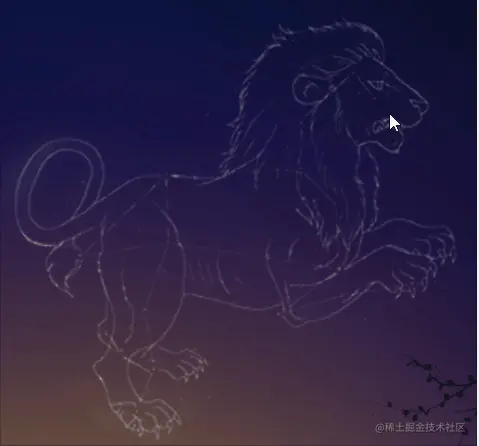

# WebGL 狮子座

---
源码：[github.com/buglas/webg…](https://link.juejin.cn/?target=https%3A%2F%2Fgithub.com%2Fbuglas%2Fwebgl-lesson "https://github.com/buglas/webgl-lesson")



### 1-产品需求

#### 1-1-基本绘图需求

1.  鼠标第1次点击画布时：
    
    -   创建多边形
    -   绘制2个点
2.  鼠标移动时：
    
    -   当前多边形最后一个顶点随鼠标移动
3.  鼠标接下来点击画布时：
    
    -   新建一个点
4.  鼠标右击时：
    
    -   删除最后一个随鼠标移动的点

#### 1-2-优化需求

1.  顶点要有闪烁动画
2.  建立顶点的时候，如果鼠标点击了其它顶点，就不要再显示新的顶点

对于上面的基本需求，我们在用鼠标画多线的时候，已经实现了，接下来我们直接实现优化需求。

### 2-代码实现

1.建立顶点着色器

```
<script id="vertexShader" type="x-shader/x-vertex">
      attribute vec4 a_Attr;
      varying float v_Alpha;
      void main(){
          gl_Position=vec4(a_Attr.x,a_Attr.y,0.0,1.0);
          gl_PointSize=a_Attr.z;
          v_Alpha=a_Attr.w;
      }
</script>
```

-   a\_Attr() 是一个4维向量，其参数结构为(x,y,z,w)
    
    -   x,y代表位置
    -   z代表顶点尺寸
    -   w代表顶点透明度，w会通过 varying 变量v\_Alpha 传递给片元

2.建立片元着色器

```
<script id="fragmentShader" type="x-shader/x-fragment">
      precision mediump float;
      varying float v_Alpha;
      void main(){
          float dist=distance(gl_PointCoord,vec2(0.5,0.5));
          if(dist<0.5){
            gl_FragColor=vec4(0.87,0.91,1.0,v_Alpha);
          }else{
            discard;
          }
      }
</script>
```

通过v\_Alpha接收透明度，然后设置片元的颜色。

3.建立夜空对象，用于承载多边形

```
const sky=new Sky(gl)
```

4.建立合成对象，用于对顶点数据做补间运算

```
const compose = new Compose();
```

5.声明两个变量，用于表示当前正在绘制的多边形和鼠标划上的点

```
//当前正在绘制的多边形
let poly=null
//鼠标划上的点
let point=null
```

6.取消右击提示

```
//取消右击提示
canvas.oncontextmenu = function(){
　　return false;
}
```

7.鼠标按下事件

```
// 鼠标按下事件
canvas.addEventListener("mousedown", (event) => {
  if(event.button===2){
    //右击删除顶点
    poly&&popVertice()
  }else{
    const {x,y}=getMousePosInWebgl(event,canvas)
    if(poly){
      //连续添加顶点
      addVertice(x,y)
    }else{
      //建立多边形
      crtPoly(x,y)
    }
  }
});
```

-   getMousePosInWebgl() 方法是用于获取鼠标在webgl 画布中的位置，我们之前说过。
-   crtPoly() 创建多边形

```
function crtPoly(x,y){
  let o1=point?point:{x,y,pointSize:random(),alpha:1}
  const o2={x,y,pointSize:random(),alpha:1}
  poly=new Poly({
    size:4,
    attrName:'a_Attr',
    geoData:[o1,o2],
    types:['POINTS','LINE_STRIP']
  })
  sky.add(poly)
  crtTrack(o1)
  crtTrack(o2)
}
```

建立两个顶点数据o1,o2，如果鼠标点击了其它顶点，o1的数据就是此顶点的数据。

顶点的尺寸是一个随机数random()

```
function random(){
  return Math.random()*8.0+3.0
}
```

基于两个顶点数据，建立多边形对象和两个时间轨对象。

-   crtTrack() 建立时间轨

```
function crtTrack(obj){
  const {pointSize}=obj
  const track = new Track(obj)
  track.start = new Date()
  track.timeLen = 2000
  track.loop = true
  track.keyMap = new Map([
    [
      "pointSize",
      [
        [500, pointSize],
        [1000, 0],
        [1500, pointSize],
      ],
    ],
    [
      "alpha",
      [
        [500, 1],
        [1000, 0],
        [1500, 1],
      ],
    ],
  ]);
  compose.add(track)
}
```

-   addVertice() 添加顶点

```
function addVertice(x,y){
  const {geoData}=poly
  if(point){
    geoData[geoData.length-1]=point
  }
  let obj={x,y,pointSize:random(),alpha:1}
  geoData.push(obj)
  crtTrack(obj)
}
```

如果鼠标点击了其它顶点，就让多边形的最后一个顶点数据为此顶点。

建立下一个顶点的顶点数据，添加新的顶点，建立新的时间轨。

-   popVertice() 删除最后一个顶点

```
function popVertice(){
  poly.geoData.pop()
  compose.children.pop()
  poly=null
}
```

8.鼠标移动事件

```
canvas.addEventListener("mousemove", (event) => {
  const {x,y}=getMousePosInWebgl(event,canvas)
  point=hoverPoint(x,y)
  if(point){
    canvas.style.cursor='pointer'
  }else{
    canvas.style.cursor='default'
  }
  if(poly){
    const obj=poly.geoData[poly.geoData.length-1]
    obj.x=x
    obj.y=y
  }
});
```

基于鼠标是否划上顶点，设置鼠标的视觉状态。

设置正在绘制的多边形的最后一个顶点点位。

-   hoverPoint() 检测所有顶点的鼠标划入，返回顶点数据

```
function hoverPoint(mx,my){
  for(let {geoData} of sky.children){
    for(let obj of geoData){
      if(poly&&obj===poly.geoData[poly.geoData.length-1]){
        continue
      }
      const delta={
        x:mx-obj.x,
        y:my-obj.y
      }
      const {x,y}=glToCssPos(delta,canvas)
      const dist=x*x+y*y;
      if(dist<100){
        return obj
      }
    }
  }
  return null
}
```

遍历sky 中的所有顶点数据

忽略绘图时随鼠标移动的点

获取鼠标和顶点的像素距离

若此距离小于10像素，返回此点；否则，返回null。

-   glToCssPos() webgl坐标系转css坐标系，将之前说过的getMousePosInWebgl() 方法逆向思维即可

```
function glToCssPos({x,y},{width,height}){
  const [halfWidth, halfHeight] = [width / 2, height / 2]
  return {
    x:x*halfWidth,
    y:-y*halfHeight
  }
}
```

9.连续渲染方法

```
!(function ani() {
  compose.update(new Date())
  sky.updateVertices(['x','y','pointSize','alpha'])
  render()
  requestAnimationFrame(ani)
})();
```

-   更新动画数据
-   更新Vertices 数据
-   render() 渲染

```
function render(){
  gl.clear(gl.COLOR_BUFFER_BIT)
  sky.draw()
}
```
