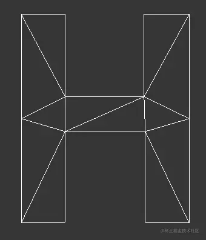
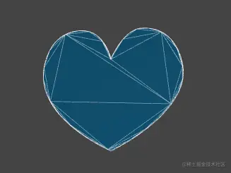

# WebGL 图形转面

---
### 1-webgl三种面的适应场景

之前咱们说过，webgl 可以绘制三种面：

-   TRIANGLES 单独三角形
-   TRIANGLE\_STRIP 三角带
-   TRIANGLE\_FAN 三角扇

在实际的引擎开发中，TRIANGLES 是用得最多的。

TRIANGLES 的优势是可以绘制任意模型，缺点是比较费点。

适合TRIANGLES 单独三角形的的模型：



TRIANGLE\_STRIP 和TRIANGLE\_FAN 的优点是相邻的三角形可以共用一条边，比较省点，然而其缺点也太明显，因为它们只适合绘制具备相应特点的模型。

适合TRIANGLE\_STRIP三角带的模型：


适合TRIANGLE\_FAN三角扇的模型：


three.js 使用的绘制面的方式就是TRIANGLES，我们可以在其WebGLRenderer 对象的源码的renderBufferImmediate 方法中找到：

```
_gl.drawArrays( _gl.TRIANGLES, 0, object.count );
```

### 2-图形转面的基本步骤

在three.js 里有一个图形几何体[ShapeGeometry](https://link.juejin.cn/?target=https%3A%2F%2Fthreejs.org%2Fdocs%2Findex.html%23api%2Fen%2Fgeometries%2FShapeGeometry "https://threejs.org/docs/index.html#api/en/geometries/ShapeGeometry")，可以把图形变成面。



我们学到这里，只要有数学支撑，也可以实现这种效果。

接下来我要使用TRIANGLES 独立三角形的方式，将图形转成面。

我使用的方法叫做“砍角”，其原理就是从起点将多边形中符合特定条件的角逐个砍掉，然后保存到一个集合里，直到把多边形砍得只剩下一个三角形为止。这时候集合里的所有三角形就是我们想要的独立三角形。

举个例子：


已知：逆时针绘图的路径G

求：将其变成下方网格的方法


解：

1.寻找满足以下条件的▲ABC：

-   ▲ABC的顶点索引位置连续，如012,123、234
-   点C在向量AB的正开半平面里，可以理解为你站在A点，面朝B点，点C要在你的左手边
-   ▲ABC中没有包含路径G 中的其它顶点

2.当找到▲ABC 后，就将点B从路径的顶点集合中删掉，然后继续往后找。

3.当路径的定点集合只剩下3个点时，就结束。

4.由所有满足条件的▲ABC构成的集合就是我们要求的独立三角形集合。

### 3-绘制路径G

1.路径G的顶点数据

```
const pathData = [0, 0,
      0, 600,
      600, 600,
      600, 200,
      200, 200,
      200, 400,
      300, 400,
      300, 300,
      500, 300,
      500, 500,
      100, 500,
      100, 100,
      600, 100,
      600, 0
 ];
```

在pathData里两个数字为一组，分别代表顶点的ｘ位和ｙ位。

pathData里的数据是我以像素为单位画出来的，在实际项目协作中，UI给我们的svg文件可能也是以像素为单位画出来的，这个我们要做好心理准备。

因为，webgl画布的宽和高永远都是两个单位。

所以，我们要将上面的点画到webgl 画布中，就需要做一个数据映射。

2.在webgl 中绘制正方形。

从pathData 数据中我们可以看出，路径G的宽高都是600，是一个正方形。

所以，我可以将路径G映射到webgl 画布的一个正方形中。

这个正方形的高度我可以暂且定为1，那么其宽度就应该是高度除以canvas画布的宽高比。

```
//宽高比
const ratio = canvas.width / canvas.height;
//正方形高度
const rectH = 1.0;
//正方形宽度
const rectW = rectH / ratio;
```

3.正方形的定位，把正方形放在webgl画布的中心。

获取正方形尺寸的一半，然后求出其x、y方向的两个极值即可。

```
//正方形宽高的一半
const [halfRectW, halfRectH] = [rectW / 2, rectH / 2];
//两个极点
const minX = -halfRectW;
const minY = -halfRectH;
const maxX = halfRectW;
const maxY = halfRectH;
```

我想把

4.利用之前的Poly对象绘制正方形，测试一下效果。

```
const rect = new Poly({
    gl,
    vertices: [
        minX, maxY,
        minX, minY,
        maxX, minY, 
        maxX, maxY,
    ],
});
rect.draw();
```


先画了4个点，效果没问题。

5.建立x轴和y轴比例尺。

```
const scaleX = ScaleLinear(0, minX, 600, maxX);
const scaleY = ScaleLinear(0, minY, 600, maxY);
function ScaleLinear(ax, ay, bx, by) {
  const delta = {
    x: bx - ax,
    y: by - ay,
  };
  const k = delta.y / delta.x;
  const b = ay - ax * k;
  return function (x) {
    return k * x + b;
  };
}
```

ScaleLinear(ax, ay, bx, by) 方法使用的就是点斜式，用于将x轴和y轴上的数据像素数据映射成 webgl数据

-   ax 像素数据的极小值
-   ay webgl数据的极小值
-   bx 像素数据的极大值
-   by webgl数据的极大值

6.将路径G中的像素数据解析为webgl 数据

```
const glData = [];
for (let i = 0; i < pathData.length; i += 2) {
    glData.push(scaleX(pathData[i]), scaleY(pathData[i + 1]));
}
```

画一下看看：

```
const path = new Poly({
    gl,
    vertices: glData,
    types: ["POINTS", "LINE_LOOP"],
});
path.draw();
```


效果没有问题。

### 4.将图形网格化

1.我自己建立了一个ShapeGeo 对象，用于将图形网格化。

```
const shapeGeo = new ShapeGeo(glData)
```

属性：

-   pathData 平展开的路径数据
-   geoData 由路径数据pathData 转成的对象型数组
-   triangles 三角形集合，对象型数组
-   vertices 平展开的对立三角形顶点集合

方法：

-   update() 更新方法，基于pathData 生成vertices
    
-   parsePath() 基于路径数据pathData 转成对象型数组
    
-   findTriangle(i) 寻找符合条件的三角形
    
    -   i 顶点在geoData 中的索引位置，表示从哪里开始寻找三角形
-   includePoint(triangle) 判断三角形中是否有其它顶点
    
-   inTriangle(p0, triangle) 判断一个顶点是否在三角形中
    
-   cross(\[p0, p1, p2\]) 以p0为基点，对二维向量p0p1、p0p2做叉乘运算
    
-   upadateVertices() 基于对象数组geoData 生成平展开的vertices 数据
    

2.绘制G形面

```
const face = new Poly({
    gl,
    vertices: shapeGeo.vertices,
    types: ["TRIANGLES"],
});
face.draw();
```

效果如下：


## 填坑

我之前在用鼠标绘制线条的时候，还留了一个系统兼容性的坑。

线条在mac电脑中是断的：


这种效果是由片元着色器导致的：

```
precision mediump float;    
void main(){ 
    float dist=distance(gl_PointCoord,vec2(0.5,0.5));
    if(dist<0.5){
        gl_FragColor=vec4(1,1,0,1);
    }else{
        discard;
    }
}
```

我们在用上面的片元着色器绘图的时候，把线给过滤掉了。

因此，我需要告诉着色器当前绘图的方式，如果是POINTS 方式绘图的话，就过滤一下圆圈以外的片元，否则就正常绘图。

接下来咱们就看一下代码实现。

1.给片元着色器添加一个uniform 变量。

```
precision mediump float;
uniform bool u_IsPOINTS;
void main(){
    if(u_IsPOINTS){
        float dist=distance(gl_PointCoord,vec2(0.5,0.5));
        if(dist<0.5){
            gl_FragColor=vec4(1,1,0,1);
        }else{
            discard;
        }
    }else{
        gl_FragColor=vec4(1,1,0,1);
    }
}
```

2.给Poly 对象添加两个属性。

```
const defAttr=()=>({
  circleDot:false,
  u_IsPOINTS:null,
  ……
})
```

-   circleDot 是否是圆点
-   u\_IsPOINTS uniform变量

3.在初始化方法中，如果是圆点，就获取一下uniform 变量

```
init(){
    ……
    if (circleDot) {
      this.u_IsPOINTS = gl.getUniformLocation(gl.program, "u_IsPOINTS");
    }
}
```

4.在渲染的时候，如果是圆点，就基于绘图方式修改uniform 变量

```
draw(types=this.types){
    const {gl,count,u_IsPOINTS,circleDot}=this
    for (let type of types) {
        circleDot&&gl.uniform1f(u_IsPOINTS,type==='POINTS');
        gl.drawArrays(gl[type],0,count);
    }
}
```
