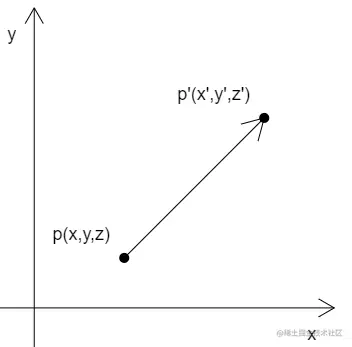
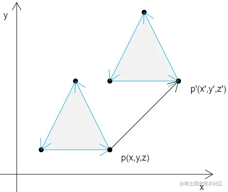
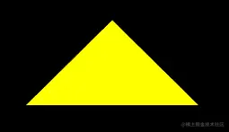
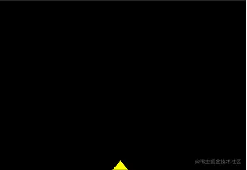

# WebGL 平移图形

---
源码：[github.com/buglas/webg…](https://link.juejin.cn/?target=https%3A%2F%2Fgithub.com%2Fbuglas%2Fwebgl-lesson "https://github.com/buglas/webgl-lesson")

对图形的平移就是对图形所有顶点的平移。

### 1-举个例子



已知：

-   顶点p(x,y,z)
-   在x、y、z 三个方向上，分别将点p 移动tx、ty、tz

求：点p 移动后的位置p'(x',y',z')

解：

```
x'=x+tx
y'=y+ty
z'=z+tz
```

如果这个图形中并非只有一个顶点，而是有三个，或者更多，那么所有的顶点也是按照同样原理进行位移。



### 2-向量加法

在实际代码中，我们要有一个向量的概念。

比如 (x,y,z) ，我们既可以说它是一个顶点位置，也可以说它是一个向量。

至于 (x,y,z) 到底是什么，要看我们拿它做什么。

比如，把点p(x,y,z) 作为点位时，那它就是点p(x,y,z)

我们把p 的移动距离tx、ty、tz 封装成一个对象pt(tx,ty,tz)，那么pt 就是一个向量，一个为点p 指明移动方向和距离的向量。

因此：点p 的移动结果 p' 就可以这么写：

```
p'=p+pt
```

由上可知，顶点的位移就是向量的加法。

### 3-代码实现

#### 3-1-GLSL ES 语言里的向量运算

在GLSL ES 语言里，是可以直接进行向量运算。

下面的顶点着色器里的代码：

```
attribute vec4 a_Position;
vec4 translation=vec4(0,0.2,0,0);
void main(){
    gl_Position = a_Position+translation;
}
```

-   a\_Position 是原始点位，属于attribute 变量
-   translation 是顶点着色器里的私有变量，没有向外部暴露，属于4维向量
-   a\_Position+translation 便是着色器内的向量加法，这里是对原始点位进行位移

之后，我们也可以把translation 变量暴露出去，让js可以修改图形位置：

```
<script id="vertexShader" type="x-shader/x-vertex">
    attribute vec4 a_Position;
    uniform vec4 u_Translation;
    void main(){
        gl_Position = a_Position+u_Translation;
    }
</script>
```

在js 中修改uniform 变量的方法，我们之前已经说过：

```
const u_Translation=gl.getUniformLocation(gl.program,'u_Translation');
gl.uniform4f(u_Translation,0,0.5,0,0);
```

整体代码：

```
<canvas id="canvas"></canvas>
<script id="vertexShader" type="x-shader/x-vertex">
    attribute vec4 a_Position;
    uniform vec4 u_Translation;
    void main(){
        gl_Position = a_Position+u_Translation;
    }
</script>
<script id="fragmentShader" type="x-shader/x-fragment">
    void main(){
        gl_FragColor=vec4(1,1,0,1);
    }
</script>
<script type="module">
    import {initShaders} from '../jsm/Utils.js';

    const canvas = document.getElementById('canvas');
    canvas.width=window.innerWidth;
    canvas.height=window.innerHeight;
    const gl = canvas.getContext('webgl');

    const vsSource = document.getElementById('vertexShader').innerText;
    const fsSource = document.getElementById('fragmentShader').innerText;
    initShaders(gl, vsSource, fsSource);

    const vertices=new Float32Array([
        0,  0.1,
        -0.1,-0.1,
        0.1, -0.1
    ])

    const vertexBuffer=gl.createBuffer();
    gl.bindBuffer(gl.ARRAY_BUFFER,vertexBuffer);
    gl.bufferData(gl.ARRAY_BUFFER,vertices,gl.STATIC_DRAW);
    const a_Position=gl.getAttribLocation(gl.program,'a_Position');
    gl.vertexAttribPointer(a_Position,2,gl.FLOAT,false,0,0);
    gl.enableVertexAttribArray(a_Position);

    const u_Translation=gl.getUniformLocation(gl.program,'u_Translation');
    gl.uniform4f(u_Translation,0,0.5,0,0);

    gl.clearColor(0, 0, 0, 1);
    gl.clear(gl.COLOR_BUFFER_BIT);

    // gl.drawArrays(gl.POINTS, 0, 3);
    gl.drawArrays(gl.TRIANGLES, 0, 3);
    
</script>
```



在最后面我们还可以加一段逐帧动画：

```
let y=0;
!(function ani(){
    y+=0.02
    if(y>1){
        y=-1
    }
    gl.uniform4f(u_Translation,0,y,0,0);
    gl.clear(gl.COLOR_BUFFER_BIT);
    gl.drawArrays(gl.TRIANGLES, 0, 3);
    requestAnimationFrame(ani)
})()
```

效果如下：


