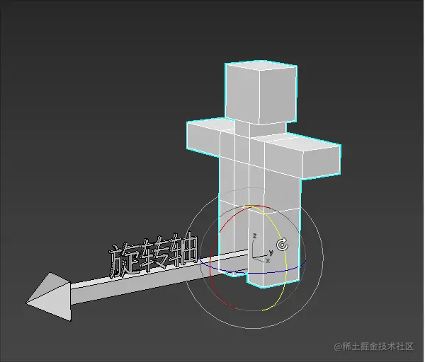
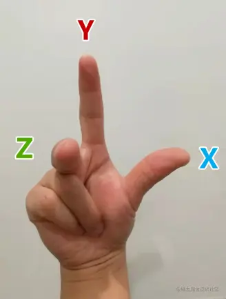
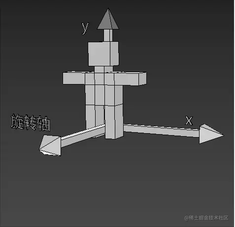
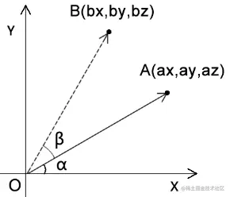

# WebGL 旋转图形

---
源码：[github.com/buglas/webg…](https://link.juejin.cn/?target=https%3A%2F%2Fgithub.com%2Fbuglas%2Fwebgl-lesson "https://github.com/buglas/webgl-lesson")

### 1-旋转的概念

三维物体的旋转要比位移复杂一点，因为三维物体的旋转需要知道以下条件：

-   旋转轴
-   旋转方向
-   旋转角度

我们可以想象一个场景：

一个小人站在旋转轴的起点进行旋转。

小人要往左转还是往右转，就是旋转的方向。

小人旋转的大小就是旋转角度。



### 2-旋转方向的正负

物体的旋转方向是有正负之分的。

那何时为正，何时为负呢？

在webgl 中，除裁剪空间之外的大部分功能都使用了右手坐标系。

所以，在我们初学webgl 的时候，可以暂且将其当成右手坐标系，等讲到裁剪空间的时候，我再跟大家说左手坐标系。

下图就是右手坐标系：



以上图为例：

-   当物体绕z 轴，从x轴正半轴向y轴正半轴逆时针旋转时，是正向旋转，反之为负。
-   当物体绕x 轴，从y轴正半轴向z轴正半轴逆时针旋转时，是正向旋转，反之为负。
-   当物体绕y 轴，从z轴正半轴向x轴正半轴逆时针旋转时，是正向旋转，反之为负。

如下图就是正向旋转：



### 3-旋转公式

先举一个让顶点围绕z 轴旋转的例子。



已知：

-   点A的位置是(ax,ay,az)
-   点A要围绕z轴旋转β度，转到点B的位置

求：点A旋转后的bx、by位置

解：

我们由结果逆推一下解题思路。

因为∠β是已知的，∠α 可以通过点A 得出。

所以我们可以得出：

```
∠xOB=α+β
```

那我们通过三角函数就可以推出bx、by

设∠xOB=θ，则：

```
bx=cosθ*|OA|
by=sinθ*|OA|
```

上面的|OA|是点O到点A的距离，可以直接用点A求出：

```
|OA|=Math.sqrt(ax*ax+ay*ay)
```

那我们接下来只需要知道cosθ和sinθ的值即可

因为：θ=α+β

所以，我们可以利用和角公式求cosθ和sinθ的值：

```
cosθ=cos(α+β)
cosθ=cosα*cosβ-sinα*sinβ
```

```
sinθ=sin(α+β)
sinθ=cosβ*sinα+sinβ*cosα
```

所以：

```
bx=cosθ*|OA|
bx=(cosα*cosβ-sinα*sinβ)*|OA|
bx=cosα*cosβ*|OA|-sinα*sinβ*|OA|
```

```
by=sinθ*|OA|
by=(cosβ*sinα+sinβ*cosα)*|OA|
by=cosβ*sinα*|OA|+sinβ*cosα*|OA|
```

因为：

```
cosα*|OA|=ax
sinα*|OA|=ay
```

所以我们可以简化bx、by的公式

```
bx=ax*cosβ-ay*sinβ
by=ay*cosβ+ax*sinβ
```

上面的bx、by就是我们要求的答案。

那接下来咱们可以测试一下，如何让一个三角形绕z轴转起来

### 4-在着色器中旋转

我们可以直接在着色器里写旋转公式：

```
<script id="vertexShader" type="x-shader/x-vertex">
    attribute vec4 a_Position;
    float angle=radians(80.0);
    float sinB=sin(angle);
    float cosB=cos(angle);
    void main(){
        gl_Position.x=a_Position.x*cosB-a_Position.y*sinB;
        gl_Position.y=a_Position.y*cosB+a_Position.x*sinB;
        gl_Position.z=a_Position.z;
        gl_Position.w=1.0;
    }
</script>
```

-   radians(float degree) 将角度转弧度
-   sin(float angle) 正弦
-   cos(float angle) 余弦

我们也可以用js控制图形的旋转。

### 5-用js旋转图形

我们将顶点着色器里的正弦值和余弦值暴露给js，便可以用js旋转图形了。

```
<script id="vertexShader" type="x-shader/x-vertex">
    attribute vec4 a_Position;
    uniform float u_SinB;
    uniform float u_CosB;
    void main(){
        gl_Position.x=a_Position.x*u_CosB-a_Position.y*u_SinB;
        gl_Position.y=a_Position.y*u_CosB+a_Position.x*u_SinB;
        gl_Position.z=a_Position.z;
        gl_Position.w=1.0;
    }
</script>
```

在js 中修改uniform 变量

```
const u_SinB = gl.getUniformLocation(gl.program, 'u_SinB')
const u_CosB = gl.getUniformLocation(gl.program, 'u_CosB')
let angle = 0.3
gl.uniform1f(u_SinB, Math.sin(angle))
gl.uniform1f(u_CosB, Math.cos(angle))
```

之后也可以让图形转起来：

```
!(function ani() {
    angle += 0.01
    gl.uniform1f(u_SinB, Math.sin(angle))
    gl.uniform1f(u_CosB, Math.cos(angle))
    gl.clear(gl.COLOR_BUFFER_BIT);
    gl.drawArrays(gl.TRIANGLES, 0, 3);
    requestAnimationFrame(ani)
})()
```

效果如下：


