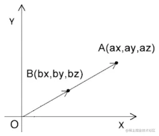
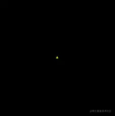

# WebGL 缩放图形

---
源码：[github.com/buglas/webg…](https://link.juejin.cn/?target=https%3A%2F%2Fgithub.com%2Fbuglas%2Fwebgl-lesson "https://github.com/buglas/webgl-lesson")

### 1-缩放的基本概念

缩放可以理解为对向量长度的改变，或者对向量坐标分量的同步缩放



已知：

-   点A的位置是(ax,ay,az)
-   点A基于原点內缩了一半

求：点A內缩了一半后的bx、by、bz位置

解：

```
bx=ax*0.5
by=ay*0.5
bz=az*0.5
```

### 2-在着色器中缩放

我可以对gl\_Position 的x、y、z依次缩放。

```
<script id="vertexShader" type="x-shader/x-vertex">
attribute vec4 a_Position;
float scale=1.2;
void main(){
    gl_Position.x= a_Position.x*scale;
    gl_Position.y= a_Position.y*scale;
    gl_Position.z= a_Position.z*scale;
    gl_Position.w=1.0;
}
</script>
```

也可以从a\_Position中抽离出由x、y、z组成的三维向量，对其进行一次性缩放。

```
<script id="vertexShader" type="x-shader/x-vertex">
attribute vec4 a_Position;
float scale=1.2;
void main(){
    gl_Position=vec4(vec3(a_Position)*scale,1.0);
}
</script>
```

### 3-用js缩放图形

同样的我们也可以把缩放系数暴露给js，通过js 缩放图形。

1.建立uniform变量

```
<script id="vertexShader" type="x-shader/x-vertex">
    attribute vec4 a_Position;
    uniform float u_Scale;
    void main(){
        gl_Position=vec4(vec3(a_Position)*u_Scale,1.0);
    }
</script>
```

2.使用js获取并修改uniform 变量

```
const u_Scale = gl.getUniformLocation(gl.program, 'u_Scale')
gl.uniform1f(u_Scale, 1.0)
```

3.继续来点动画

```
let angle = 0
!(function ani() {
    angle += 0.05
    const scale = Math.sin(n) + 1
    gl.uniform1f(u_Scale, scale)
    gl.clear(gl.COLOR_BUFFER_BIT);
    gl.drawArrays(gl.TRIANGLES, 0, 3);
    requestAnimationFrame(ani)
})()
```

效果如下：


