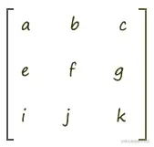
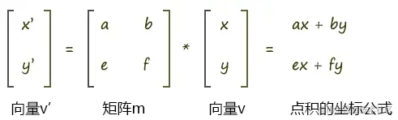
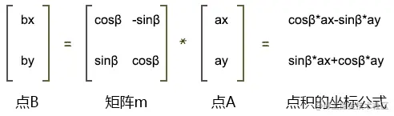

# WebGL 矩阵

---
源码：[github.com/buglas/webg…](https://link.juejin.cn/?target=https%3A%2F%2Fgithub.com%2Fbuglas%2Fwebgl-lesson "https://github.com/buglas/webgl-lesson")

矩阵（Matrix）是一个按照矩形纵横排列的复数集合。



矩阵就像一个罗盘，通过其中纵横排列的元素，我们可以摆出不同功能的阵法，比如位移矩阵、旋转矩阵、缩放矩阵……


在矩阵中的每一行，或者每一列数字构成的集合，可以视之为向量。

所以咱们接下来要先从向量说起。

### 1-向量

向量，又叫矢量，它是一个用于表示方向和量的对象。

我另写了几篇可以从零基础认识向量的文章，大家可看一下，以便对向量有一个透彻的认知：

-   [漫谈直线之向量](https://link.juejin.cn/?target=http%3A%2F%2Fyxyy.name%2Fblog%2Fmd.html%3FossName%3D162765212208603091157478511164.md%26title%3D%25E6%25BC%25AB%25E8%25B0%2588%25E7%259B%25B4%25E7%25BA%25BF%25E4%25B9%258B%25E5%2590%2591%25E9%2587%258F "http://yxyy.name/blog/md.html?ossName=162765212208603091157478511164.md&title=%E6%BC%AB%E8%B0%88%E7%9B%B4%E7%BA%BF%E4%B9%8B%E5%90%91%E9%87%8F")
-   [漫谈向量之坐标运算](https://link.juejin.cn/?target=http%3A%2F%2Fyxyy.name%2Fblog%2Fmd.html%3FossName%3D16276521220867145984147186049.md%26title%3D%25E6%25BC%25AB%25E8%25B0%2588%25E5%2590%2591%25E9%2587%258F%25E4%25B9%258B%25E5%259D%2590%25E6%25A0%2587%25E8%25BF%2590%25E7%25AE%2597 "http://yxyy.name/blog/md.html?ossName=16276521220867145984147186049.md&title=%E6%BC%AB%E8%B0%88%E5%90%91%E9%87%8F%E4%B9%8B%E5%9D%90%E6%A0%87%E8%BF%90%E7%AE%97")
-   [向量之点积](https://link.juejin.cn/?target=http%3A%2F%2Fyxyy.name%2Fblog%2Fmd.html%3FossName%3D162765212208612595362273008215.md%26title%3D%25E5%2590%2591%25E9%2587%258F%25E4%25B9%258B%25E7%2582%25B9%25E7%25A7%25AF "http://yxyy.name/blog/md.html?ossName=162765212208612595362273008215.md&title=%E5%90%91%E9%87%8F%E4%B9%8B%E7%82%B9%E7%A7%AF")
-   [向量之叉乘](https://link.juejin.cn/?target=http%3A%2F%2Fyxyy.name%2Fblog%2Fmd.html%3FossName%3D1627652122086606877333276427.md%26title%3D%25E5%2590%2591%25E9%2587%258F%25E4%25B9%258B%25E5%258F%2589%25E4%25B9%2598 "http://yxyy.name/blog/md.html?ossName=1627652122086606877333276427.md&title=%E5%90%91%E9%87%8F%E4%B9%8B%E5%8F%89%E4%B9%98")

在webgl 里的向量有1维向量、2维向量、3维向量和4维向量。

-   1维向量中有1个数字，对应的是单轴坐标系里的点位。
    
-   2维向量中有2个数字，对应的是2维坐标系里的点位。
    
-   3维向量中有3个数字，对应的是3维坐标系里的点位。
    
-   4维向量中有4个数字，对应的是3维坐标系里的点位，外加一个附加数据，至于这个数据是什么，要看我们的项目需求。
    

向量咱们就说到这，接下来咱们再说一下矩阵和向量的乘法。

### 2-矩阵和向量的乘法

首先，咱先看一个矩阵和向量的乘法图：



矩阵乘以向量时，向量是几维的，那矩阵中就应该有几个向量。

如上图向量v 是2维的，那么矩阵中就有2组向量，这两组向量可以是横着的两组向量，也可以是竖着的两组向量。

-   横着的两组向量是：向量(a,b)、向量(e,f)
-   竖着的两组向量是：向量(a,e)、向量(b,f)

用专业术语来说：

-   横着的两组遵循的规则是行主序，即将矩阵中的一行数据视之为一个向量。
-   竖着的两组遵循的规则是列主序，即将矩阵中的一列数据视之为一个向量。

至于我们是使用行主序，还是列主序，这就得看规则的定制者了。

在webgl 里，矩阵元素的排列规则是列主序。

数学中常用的写法是行主序，所以我们接下来就用行主序举例子了。

矩阵和向量相乘的规则就是让矩阵中的每个向量和向量v相乘。

向量和向量相乘，就是在求向量的点积，其结果是一个实数，而不再是向量。

比如上图中，向量(a,b)乘以向量v(x,y)的结果是：

```
a*x+b*y
```

因为a、b、x、y都是实数，所以其结果也是实数。

上图中，矩阵m乘以向量v 会得到两个结果，即ax+by和ex+fy。

这两个结果会构成一个新的向量v'(x',y')

```
x'=a*x+b*y
y'=e*x+f*y
```

这时我们可以将其和数学里的旋转公式做一下比较。

点A(ax,ay)围绕z轴旋β度,其旋转后的位置是点B(bx,by)，则：

```
bx=cosβ*ax-sinβ*ay
by=sinβ*ax+cosβ*ay
```

对比上面的两组公式，试想一下：

向量v是不是可以当成一个点位呢？

答案是可以的。

那我现在就让向量v代表的位置，就是点A的位置。

那么矩阵m乘以向量v，是不是可以让向量v代表的这个点位旋转β度呢？

如果可以，那么矩阵里的元素应该满足什么条件呢？

满足以下条件即可：

```
a=cosβ
b=-sinβ
e=sinβ
f=cosβ
```

这样，用矩阵乘以向量的方法得到的旋转结果和用数学公式得到的结果就是一样的，即;

```
a*x+b*y=cosβ*ax-sinβ*ay
e*x+f*y=sinβ*ax+cosβ*ay
```

最终我们就可以用矩阵乘以向量的方式让点p旋转β度



那我们知道了上面的这种关系之后，要干什么，能干什么呢？接下来就是重点啦！

### 3-在着色器中写矩阵

我们是可以直接在着色器中建立矩阵对象的。

```
<script id="vertexShader" type="x-shader/x-vertex">
    attribute vec4 a_Position;
    float angle=radians(40.0);
    float sinB=sin(angle);
    float cosB=cos(angle);
    mat2 m2=mat2(
      cosB, sinB,
      -sinB,cosB
    );
    void main(){
      gl_Position = vec4(
        m2*vec2(a_Position),
        a_Position.z,a_Position.w
      );
    }
</script>
```

-   mat2 是二维矩阵对象

### 4-用js建立矩阵对象并传递给着色器

1.在顶点着色器中建立uniform变量

```
<script id="vertexShader" type="x-shader/x-vertex">
    attribute vec4 a_Position;
    uniform mat2 u_Matrix;
    void main(){
      gl_Position = vec4(
        u_Matrix*vec2(a_Position),
        a_Position.z,a_Position.w
      );
    }
</script>
```

2.获取并修改uniform 变量

```
const u_Matrix = gl.getUniformLocation(gl.program, 'u_Matrix')
let angle = 0.2
const [sinB, cosB] = [Math.sin(angle), Math.cos(angle)]
const matrix = [
    cosB, sinB,
    -sinB, cosB
]
gl.uniformMatrix2fv(u_Matrix, false, matrix)
```

3.后面我们也可以在其中添加动画

```
const u_Matrix = gl.getUniformLocation(gl.program, 'u_Matrix')
let angle = 0.2

!(function ani() {
    angle += 0.02
    const [sinB, cosB] = [Math.sin(angle), Math.cos(angle)]
    const matrix = [
        cosB, sinB,
        -sinB, cosB
    ]
    gl.uniformMatrix2fv(u_Matrix, false, matrix)

    gl.clear(gl.COLOR_BUFFER_BIT);
    gl.drawArrays(gl.TRIANGLES, 0, 3);
    requestAnimationFrame(ani)
})()
```

目前我们说的只是最简单的二维矩阵，我们可以直接给顶点着色器一个四维矩阵。

### 5-四维矩阵

四维矩阵在着色器里的应用原理和二维矩阵是一样的，只要理解了其运算原理就好。

```
<script id="vertexShader" type="x-shader/x-vertex">
    attribute vec4 a_Position;
    float angle=radians(10.0);
    float cosB=cos(angle);
    float sinB=sin(angle);
    mat4 m4=mat4(
      cosB, sinB,0.0,0.0,
      -sinB,cosB,0.0,0.0,
      0.0,  0.0, 1.0,0.0,
      0.0,  0.0, 0.0,1.0
    );
    void main(){
      gl_Position = m4*a_Position;
    }
</script>
```

我们也可以用js向顶点着色器传递四维矩阵。

```
const u_Matrix = gl.getUniformLocation(gl.program, 'u_Matrix')
let angle = 0.1
const [sinB, cosB] = [Math.sin(angle), Math.cos(angle)]
const matrix = [
    cosB, sinB, 0.0, 0.0,
    -sinB, cosB, 0.0, 0.0,
    0.0, 0.0, 1.0, 0.0,
    0.0, 0.0, 0.0, 1.0
]
gl.uniformMatrix4fv(u_Matrix, false, matrix)
```

矩阵不仅可以用于旋转，还可以平移和缩放。

### 6-矩阵平移

比如我要让顶点的x移动0.1，y移动0.2，z移动0.3

顶点着色可以这样写：

```
<script id="vertexShader" type="x-shader/x-vertex">
    attribute vec4 a_Position;
    //列主序
    mat4 m4=mat4(
      1.0, 0.0, 0.0,0.0,
      0.0, 1.0, 0.0,0.0,
      0.0, 0.0, 1.0,0.0,
      0.1, 0.2, 0.3,1.0
    );
    void main(){
      gl_Position = m4*a_Position;
    }
</script>
```

对于js 建立矩阵对象，并传递给着色器的方法，我之前已经说过，就不再赘述了。

### 7-矩阵缩放

以同样的原理，我们也可以写缩放矩阵。

比如我要让顶点在x轴向缩放2，y轴向缩放3，轴向缩放4

顶点着色可以这样写：

```
<script id="vertexShader" type="x-shader/x-vertex">
    attribute vec4 a_Position;
    //列主序
    mat4 m4=mat4(
      2.0, 0.0, 0.0,0.0,
      0.0, 3.0, 0.0,0.0,
      0.0, 0.0, 4.0,0.0,
      0.0, 0.0, 0.0,1.0
    );
    void main(){
      gl_Position = m4*a_Position;
    }
</script>
```

### 8-矩阵库

像我们之前那样手写矩阵，其实是很麻烦的，我们可以将其模块化。

现在市面上已经有许多开源的矩阵库了，比如《WebGL 编程指南》里的cuon-matrix.js，three.js 的Matrix3和Matrix4对象。

接下我们就简单说一下three.js的Matrix4对象的用法。

1.引入Matrix4对象

```
import {Matrix4} from 'https://unpkg.com/three/build/three.module.js';
```

2.实例化矩阵对象，在其中写入旋转信息

```
const matrix=new Matrix4()
matrix.makeRotationZ(Math.PI/6)
```

3.基于matrix 对象的elements 属性，修改uniform 变量

```
const u_Matrix=gl.getUniformLocation(gl.program,'u_Matrix')
gl.uniformMatrix4fv(u_Matrix,false,matrix.elements)
```
