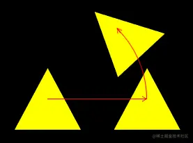
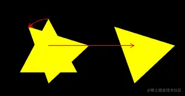

# WebGL 在实践中寻找复合变换的规律

---
通过实践，我们可以很容易的找到复合变换的规律。

接下咱们先写一个简单复合变换：位移加位移。

### 1-位移加位移

接下来我想让一个物体沿x 轴位移ax，沿y 轴位移ay后，再沿x 轴位移bx，沿y 轴位移by。

已知：

-   初始点位A(ax,ay,az,1.0)
-   初次位移：沿x 轴位移bx，沿y 轴位移by
-   第二次位移：沿x 轴位移cx，沿y 轴位移cy

求：变换后的位置F(fx,fy,fz,fw)

解：

1.设初次变换矩阵为bm(行主序)：

```
[
    1.0,0.0,0.0,bx,
    0.0,1.0,0.0,by,
    0.0,0.0,1.0,0.0,
    0.0,0.0,0.0,1.0,
]
```

则初次变换后的点F为：

```
F=bm*A
fx=(1.0,0.0,0.0,bx)*(ax,ay,az,1.0)=ax+bx
fy=(0.0,1.0,0.0,by)*(ax,ay,az,1.0)=ay+by
fz=(0.0,0.0,1.0,0.0)*(ax,ay,az,1.0)=az
fw=(0.0,0.0,0.0,1.0)*(ax,ay,az,1.0)=1.0
```

2.设第二次变换矩阵为cm(行主序)：

```
[    1.0,0.0,0.0,cx,    0.0,1.0,0.0,cy,    0.0,0.0,1.0,0.0,    0.0,0.0,0.0,1.0,]
```

则第二次变换后的点F为第二次变换矩阵乘以上一次变换后的点F：

```
F=cm*F
fx=(1.0,0.0,0.0,cx)*(fx,fy,fz,1.0)=fx+cx
fy=(0.0,1.0,0.0,cy)*(fx,fy,fz,1.0)=fy+cy
fz=(0.0,0.0,1.0,0.0)*(fx,fy,fz,1.0)=fz
fw=(0.0,0.0,0.0,1.0)*(fx,fy,fz,1.0)=1.0
```

通过第一次的变换，我们也可以这么理解最终的点F：

```
fx=ax+bx+cx
fy=ay+by+cy
fz=az
fw=1.0
```

到目前为止，我们已经通过两次矩阵乘以向量的方法得到了F 点，那我们说好的矩阵乘以矩阵呢？

上面的点F还可以这么理解：

```
F=cm*bm*A
```

设cm\*bm的结果为矩阵dm(行主序)，

参照dm中元素的索引位置：

```
[    0, 1, 2,  3,     4, 5, 6,  7,     8, 9, 10, 11,     12,13,14, 15]
```

则dm中的第一行元素为：

```
dm[0]=(1.0,0.0,0.0,bx)*(1.0,0.0,0.0,0.0)=1.0
dm[1]=(1.0,0.0,0.0,bx)*(0.0,1.0,0.0,0.0)=0.0
dm[2]=(1.0,0.0,0.0,bx)*(0.0,0.0,1.0,0.0)=0.0
dm[3]=(1.0,0.0,0.0,bx)*(cx, cy, 0.0,1.0)=cx+bx
```

通过dm矩阵的第一行元素我们就可以得到点F的fx值了，我们验证一下：

```
fx=(1.0,0.0,0.0,cx+bx)*(ax,ay,az,1.0)=ax+cx+bx
```

这和我们之前两次矩阵乘以向量得到的结果是一样的。

接下来咱们在把矩阵dm 的第二行元素写一下：

```
dm[4]=(0.0,1.0,0.0,by)*(1.0,0.0,0.0,0.0)=0.0
dm[5]=(0.0,1.0,0.0,by)*(0.0,1.0,0.0,0.0)=1.0
dm[6]=(0.0,1.0,0.0,by)*(0.0,0.0,1.0,0.0)=0.0
dm[7]=(0.0,1.0,0.0,by)*(cx, cy, 0.0,1.0)=cy+by
```

验证一下：

```
fy=(0.0,1.0,0.0,cy+by)*(ax,ay,az,1.0)=ay+cy+by
```

接下来咱们在把矩阵dm 的第三行元素写一下：

```
dm[8] =(0.0,0.0,1.0,bz)*(1.0,0.0,0.0,0.0)=0.0
dm[9] =(0.0,0.0,1.0,bz)*(0.0,1.0,0.0,0.0)=0.0
dm[10]=(0.0,0.0,1.0,bz)*(0.0,0.0,1.0,0.0)=1.0
dm[11]=(0.0,0.0,1.0,bz)*(cx, cy, 0.0,1.0)=bz
```

### 2-先移动后旋转

代码如下：

```
const mr=new Matrix4()
mr.makeRotationZ(Math.PI/4)

const mt=new Matrix4()
mt.makeTranslation(0.3,0,0)

const matrix=mr.multiply(mt)
const u_Matrix=gl.getUniformLocation(gl.program,'u_Matrix')
gl.uniformMatrix4fv(u_Matrix,false,matrix.elements)
```

mr 是旋转矩阵

mt 是位移矩阵

mr.multiply(mt) 便是先位移再旋转

效果如下：



### 2-先旋转后移动

基于之前的先移动后旋转的代码改一下即可

```
const mr=new Matrix4()
mr.makeRotationZ(Math.PI/4)

const mt=new Matrix4()
mt.makeTranslation(0.3,0,0)

const matrix=mt.multiply(mr)
const u_Matrix=gl.getUniformLocation(gl.program,'u_Matrix')
gl.uniformMatrix4fv(u_Matrix,false,matrix.elements)
```

效果如下：



### 3-其它变换方式

矩阵相乘的性质决定了只要变换顺序不一样，那么变换结果就可能不一样。

我们再看一个旋转和缩放的例子。

#### 3-1-旋转和缩放

-   先旋转后缩放

```
const mr=new Matrix4()
mr.makeRotationZ(Math.PI/4)

const ms=new Matrix4()
ms.makeScale(2,0.5,1)

const matrix=ms.multiply(mr)
const u_Matrix=gl.getUniformLocation(gl.program,'u_Matrix')
gl.uniformMatrix4fv(u_Matrix,false,matrix.elements)
```

makeScale() 是矩阵的缩放方法

-   先缩放后旋转

```
const matrix=mr.multiply(ms)
```

下图是两种效果的对比：


在此要注意一个性质：当缩放因子一致时，旋转和缩放没有先后之分。

如下代码：

```
const ms=new Matrix4()
ms.makeScale(2,2,2)
```

此时下面的两种变换结果都是一样的:

```
const matrix=ms.multiply(mr)
const matrix=mr.multiply(ms)
```

#### 3-2-综合变换

Matrix4还有一个compose综合变换方法，它可以将所有变换信息都写进去，其变换顺序就是先缩放，再旋转，最后位移。

示例代码：

```
const matrix=new Matrix4()
const pos=new Vector3(0.3,0,0)
const rot=new Quaternion()
rot.setFromAxisAngle( new Vector3( 0, 0, 1 ), Math.PI / 4 )
const scale=new Vector3(2,0.5,1)
matrix.compose(pos,rot,scale)
const u_Matrix=gl.getUniformLocation(gl.program,'u_Matrix')
gl.uniformMatrix4fv(u_Matrix,false,matrix.elements)
```

compose ( position : Vector3, quaternion : Quaternion, scale : Vector3 )

-   position 位置
-   quaternion 用四元数存储的旋转数据
-   scale 缩放

compose() 方法分解开来，就是这样的：

```
const mt=new Matrix4()
mt.makeTranslation(0.3,0,0)

const mr=new Matrix4()
mr.makeRotationZ(Math.PI/4)

const ms=new Matrix4()
ms.makeScale(2,0.5,1)

const matrix=mt.multiply(mr).multiply(ms)
const u_Matrix=gl.getUniformLocation(gl.program,'u_Matrix')
gl.uniformMatrix4fv(u_Matrix,false,matrix.elements)
```

到目前为止，我们对矩阵所做的，还只是最基础的练手，接下来再给大家说一个视图矩阵。
