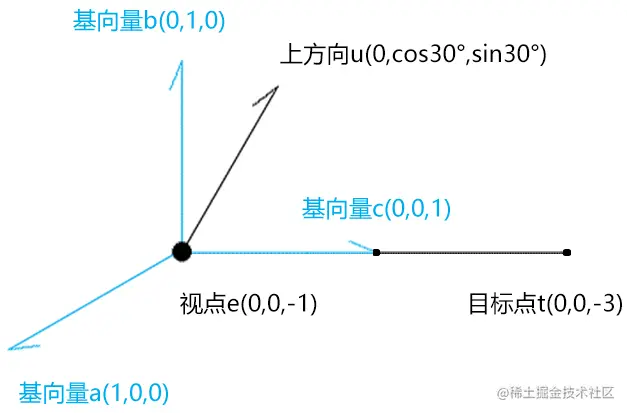

# WebGL 视图矩阵

---
源码：[github.com/buglas/webg…](https://link.juejin.cn/?target=https%3A%2F%2Fgithub.com%2Fbuglas%2Fwebgl-lesson "https://github.com/buglas/webgl-lesson")

视图矩阵是用于确定相机角度和位置的矩阵。

### 1-相机的定义


-   视点：相机的位置
-   视线方向：相机所看的方向
-   上方向：相机绕视线转动的方向

### 2-相对运动

当相机与它所拍摄的物体同时运动的时候，相机所拍摄的画面不会有任何改变。


因此，我们可以默认相机的视点就在零点，相机看向-z方向，其上方向就是y轴。

当我我们改变的相机的视点、视线和上方向的时候，只要相对的去改变场景中的物体即可。

而这个相对的去改变场景中的物体的矩阵，就是视图矩阵。


通过上面原理，我们可以知道，想要计算视图矩阵，只要让其满足以下条件即可：

1.  把视点e(ex,ey,ez)对齐到 O点上
2.  把视线c(cx,cy,cz) 旋转到-z 轴上
3.  把上方向b(bx,by,bz) 旋转到y 轴上
4.  把c与b的垂线a(ax,ay,az) 旋转到x 轴上

接下来我们便可以考虑如何通过算法实现上面的操作了。

### 3-正交矩阵的旋转

为了让大家更好的理解视图矩阵的运算，我们从基础说起。

#### 题1


已知：点A(1,0,0)

求：把点A绕z 轴逆时针旋转30°，旋转到B点的行主序矩阵m1

解：

```
m1=[
    cos30°,-sin30°,0,0,
    sin30°,cos30°, 0,0,
    0,     0,      1,0,
    0,     0,      0,1,
]
B=m1*A
B.x=(cos30°,-sin30°,0,0)·(1,0,0,1)=cos30°
B.y=(sin30°,cos30°, 0,0)·(1,0,0,1)=sin30°
```

#### 题2

继题1的已知条件

求：把点B绕z 轴逆时针旋转-30°，旋转到A点的列行序矩阵m2

解：

```
m2=[
    cos-30°,-sin-30°,0,0,
    sin-30°,cos-30°, 0,0,
    0,      0,       1,0,
    0,      0,       0,1,
]
m2=[
    cos30°, sin30°,  0,0,
    -sin30°,cos30°,  0,0,
    0,      0,       1,0,
    0,      0,       0,1,
]
```

观察题1、题2，我们可以发现两个规律：

-   m2 是m1 的逆矩阵
-   m2 也是m1 的转置矩阵

由此我们可以得到一个结论：**正交旋转矩阵的逆矩阵就是其转置矩阵**。

#### 题3

已知：


-   三维直角坐标系m1，其基向量是：
    
    -   x(1,0,0)
    -   y(0,1,0)
    -   z(0,0,1)
-   三维直角坐标系m2，其基向量是：
    
    -   x(cos30°, sin30°,0)
    -   y(-sin30°,cos30°,0)
    -   z(0, 0, 1)

求：将m1中的基向量对齐到m2的行主序矩阵m3

解：

将m2的基向量x,y,z 中的x 分量写入m3第1行;

将m2的基向量x,y,z 中的y 分量写入m3第2行;

将m2的基向量x,y,z 中的z 分量写入m3第3行。

```
m3=[
    cos30°,-sin30°,0,0,
    sin30°,cos30°, 0,0,
    0,     0,      1,0,
    0,     0,      0,1,
]
```

#### 题4


继题3的已知条件

求：将m2中的基向量对齐到m1的行主序矩阵m4

解：

由题3已知：将m1中的基向量对齐到m2的行主序矩阵是m3

由题4的问题可知：m4就是m3的逆矩阵

因为：正交旋转矩阵的逆矩阵就是其转置矩阵

所以：m4就是m3的转置矩阵

```
m3=[
    cos30°,-sin30°,0,0,
    sin30°,cos30°, 0,0,
    0,     0,      1,0,
    0,     0,      0,1,
]
m4=[
    cos30°,sin30°,0,0,
    -sin30°,cos30°,0,0,
    0,0,1,0,
    0,0,0,1
]
```

### 4-计算视图矩阵


1.  先位移：写出把视点e(ex,ey,ez) 对齐到 O点上的行主序位移矩阵mt

```
mt=[
  1,0,0,-ex,
  0,1,0,-ey,
  0,0,1,-ez,
  0,0,0,1,
]
```

2.  写出把{o;x,y,-z} 对齐到{e;a,b,c} 的行主序旋转矩阵mr1

 把a,b,-c的x 分量写入mr1的第1行；

 把a,b,-c的y 分量写入mr1的第2行；

 把a,b,-c的z 分量写入mr1的第3行；

```
mr1=[
     ax, bx, -cx, 0,
     ay, by, -cy, 0,
     az, bz, -cz, 0,
     0,  0,   0,  1
]
```

3.  计算mr1的逆矩阵mr2。
    
    因为正交旋转矩阵的逆矩阵就是其转置矩阵，所以mr2就是mr1的转置矩阵。
    

```
mr2=[
     ax, ay, az, 0,
     bx, by, bz, 0,
    -cx,-cy,-cz, 0,
     0,  0,   0, 1
]
```

4.  视图矩阵=mr2\*mt

### 5-视图矩阵的代码实现


基于视点、目标点、上方向生成视图矩阵。

```
function getViewMatrix(e, t, u) {
  //基向量c，视线
  const c = new Vector3().subVectors(e, t).normalize()
  //基向量a，视线和上方向的垂线
  const a = new Vector3().crossVectors(u, c).normalize()
  //基向量b，修正上方向
  const b = new Vector3().crossVectors(c, a).normalize()
  //正交旋转矩阵
  const mr = new Matrix4().set(
    ...a, 0,
    ...b, 0,
    -c.x, -c.y, -c.z, 0,
    0, 0, 0, 1
  )
  //位移矩阵
  const mt = new Matrix4().set(
    1, 0, 0, -e.x,
    0, 1, 0, -e.y,
    0, 0, 1, -e.z,
    0, 0, 0, 1
  )
  return mr.multiply(mt).elements
}
```

lookAt 方法就是从一个新的角度去看某一个东西的意思

-   e 视点
-   t 目标点
-   u 上方向

在其中我借助了Three.js 的Vector3 对象

-   subVectors(e, t) 向量e减向量t
-   normalize() 向量的归一化
-   crossVectors(u, d) 向量u 和向量d的叉乘

```
crossVectors( a, b ) {
  const ax = a.x, ay = a.y, az = a.z;
  const bx = b.x, by = b.y, bz = b.z;
  this.x = ay * bz - az * by;
  this.y = az * bx - ax * bz;
  this.z = ax * by - ay * bx;
  return this;
}
```

解释一下上面基向量a,b,c 的运算原理，以下图为例：



视线c 之所以是视点e减目标点t，是为了取一个正向的基向量。

```
c=(e-t)/|e-t|
c=(0,0,2)/2
c=(0,0,1)
```

基向量a是上方向u和向量c的叉乘

```
a=u^c/|u^c|
a=(cos30°,0,0)/cos30°
a=(1,0,0)
```

基向量b是向量c和向量a的叉乘，可以理解为把上方向摆正。

```
b=c^a/|c^a|
b=(0,1,0)/1
b=(0,1,0)
```

### 6-测试

1.顶点着色器

```
<script id="vertexShader" type="x-shader/x-vertex">
    attribute vec4 a_Position;
    //视图矩阵
    uniform mat4 u_ViewMatrix;
    void main(){
      gl_Position = u_ViewMatrix*a_Position;
    }
</script>
```

2.建立视图矩阵，并传递给顶点着色器

```
const u_ViewMatrix = gl.getUniformLocation(gl.program, 'u_ViewMatrix')
const viewMatrix = getViewMatrix(
  new Vector3(0.3, 0.2, 0.5),
  new Vector3(0.0, 0.1, 0),
  new Vector3(0, 1, 0)
)
gl.uniformMatrix4fv(u_ViewMatrix, false, viewMatrix)
```

4.绘图方法

```
gl.clearColor(0.0, 0.0, 0.0, 1.0);
gl.clear(gl.COLOR_BUFFER_BIT);
gl.drawArrays(gl.LINES, 0, indices.length);
```

效果如下：


注：

three.js 里的lookAt() 方法便可以实现矩阵的正交旋转，其参数也是视点、目标点、上方向，它的实现原理和我们视图矩阵里说的正交旋转都是一样的。

```
const u_ViewMatrix = gl.getUniformLocation(gl.program, 'u_ViewMatrix')
const viewMatrix = new Matrix4().lookAt(
    new Vector3(0.5, 0.5, 1),
    new Vector3(0, 0, 0),
    new Vector3(0, 1, 0),
)
gl.uniformMatrix4fv(u_ViewMatrix, false, viewMatrix.elements)
```
