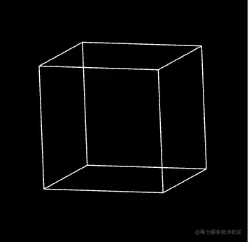
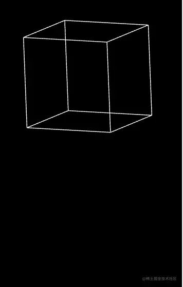

# WebGL 模型矩阵

---
源码：[github.com/buglas/webg…](https://link.juejin.cn/?target=https%3A%2F%2Fgithub.com%2Fbuglas%2Fwebgl-lesson "https://github.com/buglas/webgl-lesson")

模型矩阵可以对物体进行位移、旋转、缩放变换。

比如我们想让物体沿y 旋转。



1.在顶点着色器中添加一个模型矩阵

```
<script id="vertexShader" type="x-shader/x-vertex">
    attribute vec4 a_Position;
    //模型矩阵
    uniform mat4 u_ModelMatrix;
    //视图矩阵
    uniform mat4 u_ViewMatrix;
    void main(){
      gl_Position = u_ViewMatrix*u_ModelMatrix*a_Position;
    }
</script>
```

2.在js中建立模型矩阵，并传递给顶点着色器

```
const u_ModelMatrix = gl.getUniformLocation(gl.program, 'u_ModelMatrix')
const u_ViewMatrix = gl.getUniformLocation(gl.program, 'u_ViewMatrix')

const modelMatrix = new Matrix4()
const viewMatrix = new Matrix4().lookAt(
    new Vector3(0, 0.25, 1),
    new Vector3(0, 0, 0),
    new Vector3(0, 1, 0),
)

gl.uniformMatrix4fv(u_ModelMatrix, false, modelMatrix.elements)
gl.uniformMatrix4fv(u_ViewMatrix, false, viewMatrix.elements)
```

3.我们还可以添加一个旋转动画

```
let angle = 0;
!(function ani() {
    angle += 0.02
    modelMatrix.makeRotationY(angle)
    gl.uniformMatrix4fv(u_ModelMatrix, false, modelMatrix.elements)

    gl.clear(gl.COLOR_BUFFER_BIT);
    gl.drawArrays(gl.LINES, 0, indices.length);
    requestAnimationFrame(ani)
})()
```

4.我们还可以来个弹性动画

```
let angle = 0;

const minY = -0.70
const maxY = 0.7
let y = maxY
let vy = 0;
const ay = -0.001
const bounce = 1;

!(function ani() {
    angle += 0.01
    vy += ay;
    y += vy
    modelMatrix.makeRotationY(angle)
    modelMatrix.setPosition(0, y, 0)
    if (modelMatrix.elements[13] < minY) {
        y = minY
        vy *= -bounce
    }

    gl.uniformMatrix4fv(u_ModelMatrix, false, modelMatrix.elements)
    gl.clear(gl.COLOR_BUFFER_BIT);
    gl.drawArrays(gl.LINES, 0, indices.length);
    requestAnimationFrame(ani)
})()
```

效果如下：


