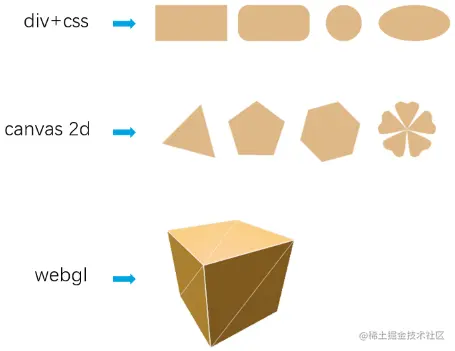
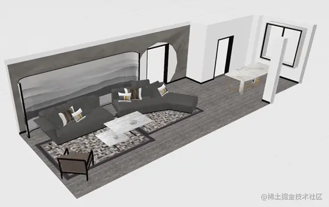
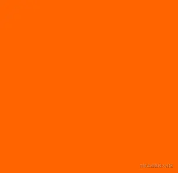
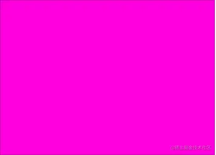
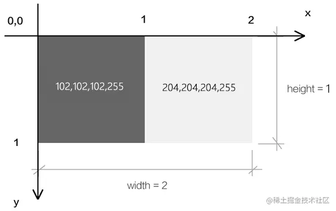
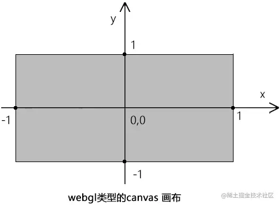
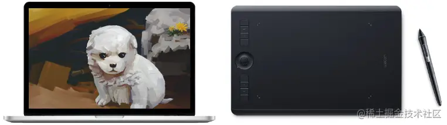
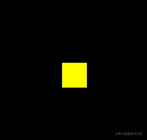

# WebGL 入门

---
### 课件地址

[github.com/buglas/webg…](https://link.juejin.cn/?target=https%3A%2F%2Fgithub.com%2Fbuglas%2Fwebgl-lesson "https://github.com/buglas/webgl-lesson")

### 课前准备

1.  安装webstorm 或vscode 开发工具。
2.  安装live-server，用于启服务，安装方法 npm i -g live-server
3.  需掌握es6、html、css 的基础知识。
4.  数学基础，三角函数和向量（非必须）。

### 课堂目标

1.  对webgl 的概念有一个整体认知
2.  掌握webgl 基本绘图原理和流程

### 知识点

1.  webgl 概述
2.  webgl 最短教程 - 在画布上刷底色
3.  webgl 最简单图形 - 画一个点

## 第一章 webgl概述

### 1-webgl是什么？

webgl 是在网页上绘制和渲染三维图形的技术，可以让用户与其进行交互。

我们之前学过的div+css、canvas 2d 都是专注于二维图形的，它们虽然也能模拟一部分三维效果，但它们和webgl 比起来，那就是玩具枪和AK47的差别。



### 2-webgl行业背景

随着 5G 时代的到来，3D可视化需求大量涌现。3D 游戏，酷炫的活动宣传页，三维数字城市，VR全景展示、3D 产品展示等领域中，很多项目都是用 WebGL 实现的，也只能用WebGL来做，也就是说，WebGL 的时代就在眼前了。



通过一些实际案例，我们可以知道WebGL 能做什么：

-   3D数据可视化：[cybermap.kaspersky.com/](https://link.juejin.cn/?target=https%3A%2F%2Fcybermap.kaspersky.com%2F "https://cybermap.kaspersky.com/")
-   家居卖场：[showroom.littleworkshop.fr/](https://link.juejin.cn/?target=https%3A%2F%2Fshowroom.littleworkshop.fr%2F "https://showroom.littleworkshop.fr/")
-   天猫宣传页：[shrek.imdevsh.com/show/tmall/](https://link.juejin.cn/?target=https%3A%2F%2Fshrek.imdevsh.com%2Fshow%2Ftmall%2F "https://shrek.imdevsh.com/show/tmall/")
-   汽车模型：[ezshine.gitee.io/www/showcas…](https://link.juejin.cn/?target=https%3A%2F%2Fezshine.gitee.io%2Fwww%2Fshowcase%2Fsmart3dh5%2Floader.html "https://ezshine.gitee.io/www/showcase/smart3dh5/loader.html")
-   趣空间：[www.3dnest.cn/case/](https://link.juejin.cn/?target=https%3A%2F%2Fwww.3dnest.cn%2Fcase%2F "https://www.3dnest.cn/case/")

### 3-为什么要学习webgl ?

webgl 的行业背景决定了其在市场中具有广大的需求量。

webgl 发展潜力大，不像曾经的flash，学完了，还会面临被淘汰的风险。

webgl 的职场竞争力要比vue、react等主流框架小。

webgl薪资可观，一般只要你理解webgl原理，可以熟练使用three.js，会用react，月薪可达25k+

综上所述，对公司而言，webgl 可以解决他们在三维模型的显示和交互上的问题；对开发者而言，webgl 可以让我们是实现更多、更炫酷的效果，让我们即使工作，也可以乐在其中，并且还会有一份不错的薪资。

## 第二章 webgl 最短教程

接下来咱们说一个在webgl 画布上刷底色的简单栗子。

### 1-刷底色的基本步骤


1.在html中建立canvas 画布

```
<canvas id="canvas"></canvas>
```

2.在js中获取canvas画布

```
const canvas=document.getElementById('canvas’);
```

3.使用canvas 获取webgl 绘图上下文

```
const gl=canvas.getContext('webgl’);
```

4.指定将要用来清空绘图区的颜色

```
gl.clearColor(0,0,0,1);
```

5.使用之前指定的颜色，清空绘图区

```
gl.clear(gl.COLOR_BUFFER_BIT);
```

整体代码

```
<canvas id="canvas"></canvas>
<script>
    const canvas=document.getElementById('canvas');
    canvas.width=window.innerWidth;
    canvas.height=window.innerHeight;
    const gl=canvas.getContext('webgl');
    gl.clearColor(0,0,0,1);
    gl.clear(gl.COLOR_BUFFER_BIT);
</script>
```

clearColor(r,g,b,a) 中的参数是红、绿、蓝、透明度，其定义域是\[0,1\]

### 2-灵活操作webgl中的颜色

css 中有一个“rgba(255,255,255,1)” 颜色，其中r、g、b的定义域是\[0,255\]，这里要和webgl里的颜色区分一下。

我们可以简单了解一下将css颜色解析为webgl 颜色的原理：

```
const rgbaCSS = "rgba(255,100,0,1)";
const reg = RegExp(/\((.*)\)/);
const rgbaStr = reg.exec(rgbaCSS)[1];
const rgb = rgbaStr.split(",").map((ele) => parseInt(ele));
const r = rgb[0] / 255;
const g = rgb[1] / 255;
const b = rgb[2] / 255;
const a = rgb[3];

gl.clearColor(r, g, b, a);
gl.clear(gl.COLOR_BUFFER_BIT);
```

效果如下：



在three.js 里有一个非常完美的颜色对象-Color，我们通过这个对象可以轻松的控制颜色。

### 案例-多姿多彩的画布



1.引入Color 对象

```
import { Color } from "https://unpkg.com/three/build/three.module.js";
```

我这是通过CDN 引入的，这种方法不适用于nodejs，因为nodejs 无法直接通过网络路径请求资源。

2.实例化Color 对象

```
const color = new Color(1, 0, 0);
```

3.建立色相偏移动画

```
!(function ani() {
    color.offsetHSL(0.005, 0, 0);
    gl.clearColor(color.r, color.g, color.b, 1);
    gl.clear(gl.COLOR_BUFFER_BIT);
    requestAnimationFrame(ani);
})();
```

关于颜色的操作我们就说到这，Color 对象还有很多其它方法，可以在threejs官网查看。

### 3-webgl 坐标系

webgl画布的建立和获取，和canvas 2d是一样的。

一旦我们使用canvas.getContext()方法获取了webgl 类型的上下文对象，那这张画布就不再是以前的canvas 2d 画布。

当然，它也不会变成三维的，因为我们的电脑屏幕始终是平的。

那这张画布有什么不一样了呢？

它的坐标系变了。

canvas 2d 画布和webgl 画布使用的坐标系都是二维直角坐标系，只不过它们坐标原点、y 轴的坐标方向，坐标基底都不一样了。

#### 3-1-canvas 2d画布的坐标系

canvas 2d 坐标系的原点在左上角。

canvas 2d 坐标系的y 轴方向是朝下的。

canvas 2d 坐标系的坐标基底有两个分量，分别是一个像素的宽和一个像素的高，即1个单位的宽便是1个像素的宽，1个单位的高便是一个像素的高。

如下图，下图两个方块表示两个像素：



#### 3-2-webgl的坐标系

webgl坐标系的坐标原点在画布中心。

webgl坐标系的y 轴方向是朝上的。

webgl坐标基底中的两个分量分别是半个canvas的宽和canvas的高，即1个单位的宽便是半个个canvas的宽，1个单位的高便是半个canvas的高。

如下图：



## 第三章 webgl 最简单的图形-画一个点

点是最简单的形状，是几何图形最基本的组成部分。接下来咱们就说一下在webgl 画布上如何画一个点。

首先咱们先说一下绘图的基本步骤。

### 1-绘图的基本步骤

1.  找一张画布。
    
2.  找一支画笔。
    
3.  开始画画。
    
    
    

这三步是从现实生活中抽离出来的普遍规律，这在哪里都是适用的。

canvas 2d 的绘图逻辑就是这样的。首先要有canvas 画布，然后通过canvas 画布的getContext('2d') 方法获取一支二维画笔，然后直接在画布上画画。就像这样：

```
//canvas画布
const canvas=document.getElementById('canvas');
//二维画笔
const ctx=canvas.getContext('2d');
//设置画笔的颜色
ctx.fillStyle='red';
//用画笔画一个矩形
ctx.fillRect(20,20,300,200);
```

webgl 的绘图逻辑亦是如此，只不过它更像电脑绘画，其绘画的步骤里还多了一层介质。

这层介质就是手绘板，就像这样：

1.  找一台电脑。
2.  找一块手绘板。
3.  找一支触控笔。
4.  开始画画。



接下来，咱们就详细说一下canvas 2d 画图和webgl 画图的差异。

### 2-canvas 2d和webgl绘图的差异

在webgl里绘图，或许你会觉得也可以像canvas 2d那样，就像下面这样写：

```
//canvas画布
const canvas=document.getElementById('canvas');
//三维画笔
const ctx=canvas.getContext('webgl');
//设置画笔的颜色
ctx.fillStyle='red';
//用画笔画一个立方体
ctx.fillBox(20,20,300,200);
```

然而，实际上，webgl 的绘图逻辑和canvas 2d 的绘图逻辑还有一个本质的差别。

大家在学习html 的时候应该知道，浏览器有三大线程： js 引擎线程、GUI 渲染线程、浏览器事件触发线程。

其中GUI 渲染线程就是用于渲图的，在这个渲染线程里，有负责不同渲染工作的工人。比如有负责渲染HTML+css的工人，有负责渲染二维图形的工人，有负责渲染三维图形的工人。

渲染二维图形的工人和渲染三维图形的工人不是一个国家的，他们说的语言不一样。

渲染二维图形的工人说的是js语言。

渲染三维图形的工人说的是GLSL ES 语言。

而我们在做web项目时，业务逻辑、交互操作都是用js 写的。

我们在用js 绘制canvas 2d 图形的时候，渲染二维图形的工人认识js 语言，所以它可以正常渲图。

但我们在用js 绘制webgl图形时，渲染三维图形的工人就不认识这个js 语言了，因为它只认识GLSL ES 语言。

因此，这个时候我们就需要找人翻译翻译。

这个做翻译的人是谁呢，它就是我们之前提到过的手绘板，它在webgl 里叫“程序对象”。

接下来咱们从手绘板的绘图步骤中捋一下webgl 的绘图思路。

### 3-webgl 的绘图思路

1.  找一台电脑 - 浏览器里内置的webgl 渲染引擎，负责渲染webgl 图形，只认GLSL ES语言。
2.  找一块手绘板 - 程序对象，承载GLSL ES语言，翻译GLSL ES语言和js语言，使两者可以相互通信。
3.  找一支触控笔 - 通过canvas 获取的webgl 类型的上下文对象，可以向手绘板传递绘图命令，并接收手绘板的状态信息。
4.  开始画画 - 通过webgl 类型的上下文对象，用js 画画。

在上面的思路中，大家对其中的一些名词可能还没有太深的概念，比如程序对象。接下来咱们就详细说一下webgl 实际的绘图步骤。

### 4-webgl 的绘图步骤

1.在html中建立canvas 画布

```
<canvas id="canvas"></canvas>
```

2.在js中获取canvas画布

```
const canvas=document.getElementById('canvas');
```

3.使用canvas 获取webgl 绘图上下文

```
const gl=canvas.getContext('webgl');
```

4.在script中建立顶点着色器和片元着色器，glsl es

```
//顶点着色器
<script id="vertexShader" type="x-shader/x-vertex">
    void main() {
        gl_Position = vec4(0.0, 0.0, 0.0, 1.0);
        gl_PointSize = 100.0;
    }
</script>
//片元着色器
<script id="fragmentShader" type="x-shader/x-fragment">
    void main() {
        gl_FragColor = vec4(1.0, 1.0, 0.0, 1.0);
    }
</script>
```

5.在js中获取顶点着色器和片元着色器的文本

```
const vsSource = document.getElementById('vertexShader').innerText;
const fsSource = document.getElementById('fragmentShader').innerText;
```

6.初始化着色器

```
initShaders(gl, vsSource, fsSource);
```

7.指定将要用来清空绘图区的颜色

```
gl.clearColor(0,0,0,1);
```

8.使用之前指定的颜色，清空绘图区

```
gl.clear(gl.COLOR_BUFFER_BIT);
```

9.绘制顶点

```
gl.drawArrays(gl.POINTS, 0, 1);
```

效果如下：



整体代码

```
<canvas id="canvas"></canvas>
<!-- 顶点着色器 -->
<script id="vertexShader" type="x-shader/x-vertex">
    void main() {
        gl_Position = vec4(0.0, 0.0, 0.0, 1.0);
        gl_PointSize = 100.0;
    }
</script>
<!-- 片元着色器 -->
<script id="fragmentShader" type="x-shader/x-fragment">
    void main() {
        gl_FragColor = vec4(1.0, 1.0, 0.0, 1.0);
    }
</script>
<script>
    // canvas 画布
    const canvas = document.getElementById('canvas');
    canvas.width=window.innerWidth;
    canvas.height=window.innerHeight;
    // webgl画笔
    const gl = canvas.getContext('webgl');
    // 顶点着色器
    const vsSource = document.getElementById('vertexShader').innerText;
    // 片元着色器
    const fsSource = document.getElementById('fragmentShader').innerText;
    // 初始化着色器
    initShaders(gl, vsSource, fsSource);
    // 指定将要用来清理绘图区的颜色
    gl.clearColor(0., 0.0, 0.0, 1.0);
    // 清理绘图区
    gl.clear(gl.COLOR_BUFFER_BIT);
    // 绘制顶点
    gl.drawArrays(gl.POINTS, 0, 1);

    function initShaders(gl,vsSource,fsSource){
        //创建程序对象
        const program = gl.createProgram();
        //建立着色对象
        const vertexShader = loadShader(gl, gl.VERTEX_SHADER, vsSource);
        const fragmentShader = loadShader(gl, gl.FRAGMENT_SHADER, fsSource);
        //把顶点着色对象装进程序对象中
        gl.attachShader(program, vertexShader);
        //把片元着色对象装进程序对象中
        gl.attachShader(program, fragmentShader);
        //连接webgl上下文对象和程序对象
        gl.linkProgram(program);
        //启动程序对象
        gl.useProgram(program);
        //将程序对象挂到上下文对象上
        gl.program = program;
        return true;
    }

    function loadShader(gl, type, source) {
        //根据着色类型，建立着色器对象
        const shader = gl.createShader(type);
        //将着色器源文件传入着色器对象中
        gl.shaderSource(shader, source);
        //编译着色器对象
        gl.compileShader(shader);
        //返回着色器对象
        return shader;
    }
</script>
```

对于上面的步骤1、2、3，大家应该都比较好理解，接下来咱们详细说一下第4 步，在script 里用GLSL ES语言写着色器。

### 5-着色器

#### 5-1-着色器的概念

webgl 绘图需要两种着色器：

-   顶点着色器（Vertex shader）：描述顶点的特征，如位置、颜色等。
-   片元着色器（Fragment shader）：进行逐片元处理，如光照。

看了这两个名词的解释，我想很多初学者会是懵的。

我给大家翻译翻译：

补间动画大家知道不？顶点着色器里的顶点就是补间动画里的关键帧，片元着色器里的片元就是关键帧之间以某种算法算出的插值。当然，咱们webgl里的片元是像素的意思。

再给大家举一个更简单、更贴切的例子：

两点决定一条直线大家知道不？顶点着色器里的顶点就是决定这一条直线的两个点，片元着色器里的片元就是把直线画到画布上后，这两个点之间构成直线的每个像素。

关于概念咱们就说到这，接下来咱们说着色器语言。

#### 5-2-着色器语言

webgl 的着色器语言是GLSL ES语言

-   顶点着色程序，要写在type=“x-shader/x-vertex” 的script中。

```
<script id="vertexShader" type="x-shader/x-vertex">
    void main() {
        gl_Position = vec4(0.0, 0.0, 0.0, 1.0);
        gl_PointSize = 100.0;
    }
</script>
```

-   片元着色程序，要写在type=“x-shader/x-fragment” 的script中。

```
<script id="fragmentShader" type="x-shader/x-fragment">
    void main() {
        gl_FragColor = vec4(1.0, 1.0, 0.0, 1.0);
    }
</script>
```

void main() {…… } 是主体函数。

在顶点着色器中，gl\_Position 是顶点的位置，gl\_PointSize 是顶点的尺寸，这种名称都是固定的，不能写成别的。

在片元着色器中，gl\_FragColor 是片元的颜色。

vec4() 是一个4维矢量对象。

将vec4() 赋值给顶点点位gl\_Position 的时候，其中的前三个参数是x、y、z，第4个参数默认1.0，其含义我们后面会详解；

将vec4() 赋值给片元颜色gl\_FragColor 的时候，其中的参数是r,g,b,a。

至于GLSL ES语言的其它知识，咱们会在后面另开一篇详解，这里先以入门为主。

在第6步中，我们使用了一个自定义的方法initShaders() ，这是用于初始化着色器的，接下来咱们详细说一下。

### 6-着色器初始化

初始化着色器的步骤：

1.  建立程序对象，目前这只是一个手绘板的外壳。
    
    ```
    const shaderProgram = gl.createProgram();
    ```
    
2.  建立顶点着色器对象和片元着色器对象，这是手绘板里用于接收触控笔信号的零部件，二者可以分工合作，把触控笔的压感（js信号）解析为计算机语言(GLSL ES)，然后让计算机(浏览器的webgl 渲染引擎)识别显示。
    
    ```
    const vertexShader = loadShader(gl, gl.VERTEX_SHADER, vsSource);
    const fragmentShader = loadShader(gl, gl.FRAGMENT_SHADER, fsSource);
    ```
    
3.  将顶点着色器对象和片元着色器对象装进程序对象中，这就完成的手绘板的拼装。
    
    ```
    gl.attachShader(shaderProgram, vertexShader);
    gl.attachShader(shaderProgram, fragmentShader);
    ```
    
4.  连接webgl 上下文对象和程序对象，就像连接触控笔和手绘板一样（触控笔里有传感器，可以向手绘板发送信号）。
    
    ```
    gl.linkProgram(shaderProgram);
    ```
    
5.  启动程序对象，就像按下了手绘板的启动按钮，使其开始工作。
    
    ```
    gl.useProgram(program);
    ```
    

上面第二步中的建立着色对象方法loadShader()，是一个自定义的方法，其参数是(webgl上下文对象，着色器类型，着色器源文件)，gl.VERTEX\_SHADER 是顶点着色器类型，gl.FRAGMENT\_SHADER是片元着色器类型。

```
function loadShader(gl, type, source) {
    const shader = gl.createShader(type);
    gl.shaderSource(shader, source);
    gl.compileShader(shader);
    return shader;
}
```

-   gl.createShader(type) ：根据着色器类型建立着色器对象的方法。
-   gl.shaderSource(shader, source)：将着色器源文件传入着色器对象中，这里的着色器源文件就是我们之前在script 里用GLSL ES写的着色程序。
-   gl.compileShader(shader)：编译着色器对象。

在以后的学习里，initShaders 会经常用到，所以我们可以将其模块化。

```
function initShaders(gl,vsSource,fsSource){
    //创建程序对象
    const program = gl.createProgram();
    //建立着色对象
    const vertexShader = loadShader(gl, gl.VERTEX_SHADER, vsSource);
    const fragmentShader = loadShader(gl, gl.FRAGMENT_SHADER, fsSource);
    //把顶点着色对象装进程序对象中
    gl.attachShader(program, vertexShader);
    //把片元着色对象装进程序对象中
    gl.attachShader(program, fragmentShader);
    //连接webgl上下文对象和程序对象
    gl.linkProgram(program);
    //启动程序对象
    gl.useProgram(program);
    //将程序对象挂到上下文对象上
    gl.program = program;
    return true;
}
function loadShader(gl, type, source) {
    //根据着色类型，建立着色器对象
    const shader = gl.createShader(type);
    //将着色器源文件传入着色器对象中
    gl.shaderSource(shader, source);
    //编译着色器对象
    gl.compileShader(shader);
    //返回着色器对象
    return shader;
}
export {initShaders}
```

后面在需要的时候，import 引入即可。

```
import {initShaders} from '../jsm/Utils.js';
```

## 总结

综上所述，webgl 绘图好麻烦啊！

麻烦不是不学的理由，因为后面还有three.js 为你排忧解难。

那我们为啥不直接学习three.js 呢？

那是因为three.js 若是只想画个旋转的立方体还好，若是要深入学习，实现复杂的模型交互逻辑，就必须要有webgl 基础了。

这一篇，我们讲了webgl 的基本概念，走了一遍webgl 绘图的基本过程，让大家对webgl 的绘图原理有了一个基本认知。

下一篇，我们将说一下js 如何向着色器发号施令，实现一个鼠标控制顶点位置的案例。
