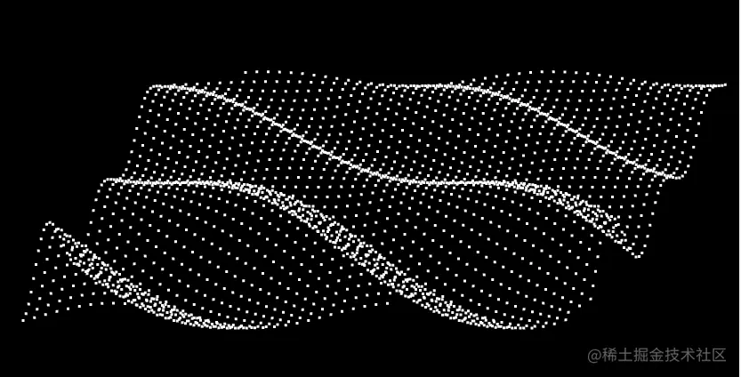
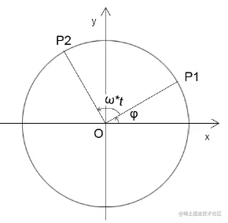
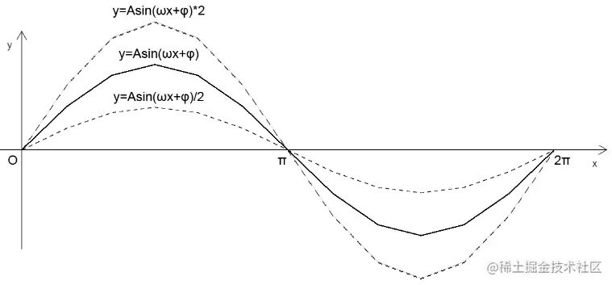
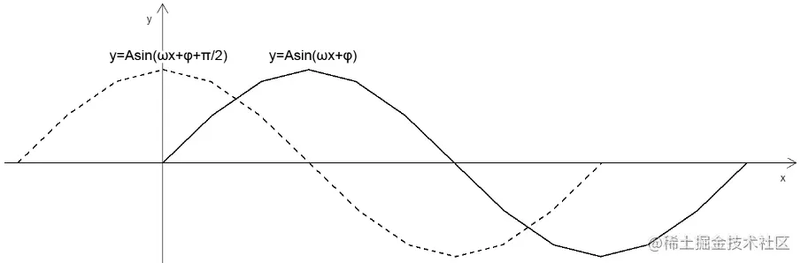
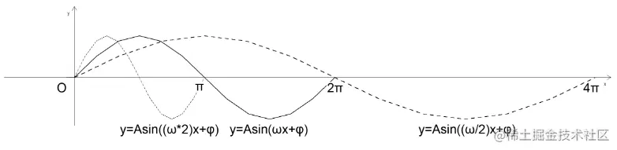
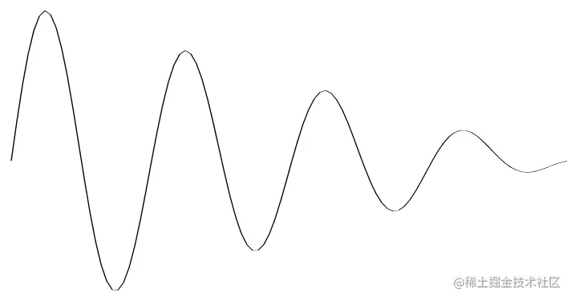
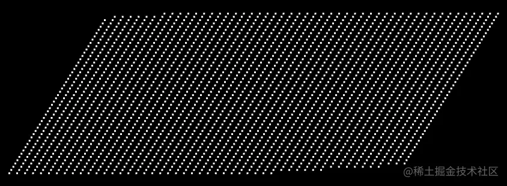
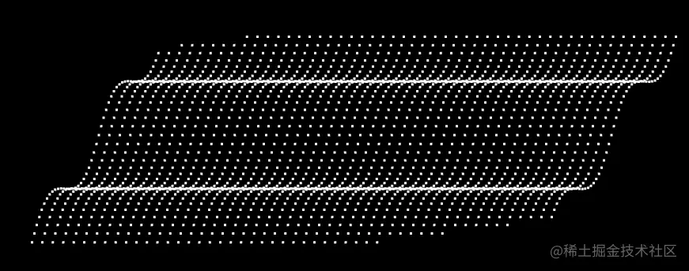
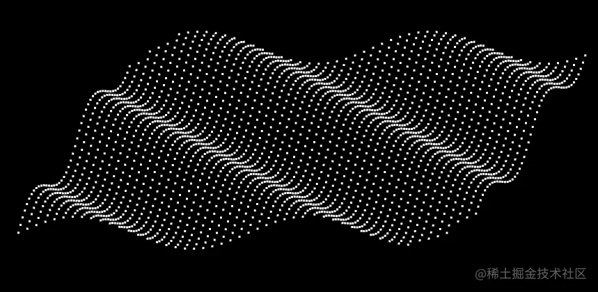
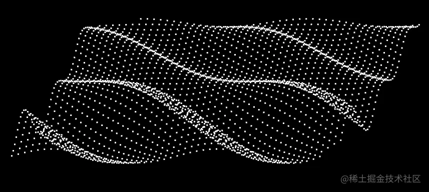

# WebGL 水波纹

---
源码：[github.com/buglas/webg…](https://link.juejin.cn/?target=https%3A%2F%2Fgithub.com%2Fbuglas%2Fwebgl-lesson "https://github.com/buglas/webgl-lesson")

在视图矩阵中，我们可以将算法和艺术相融合，让它充满乐趣。

就像下面的顶点，就是我通过三角函数来实现的。

风乍起，吹皱一池春水。



接下来，咱们就说一下正弦型函数 。

### 1-正弦型函数

1.正弦型函数公式

y=Asin(ωx+φ)

2.正弦型函数概念分析



已知：

-   圆O半径为A
-   点P1 在圆O上
-   ∠xOP1=φ
-   点P1 围绕z轴旋转t 秒后，旋转到点P2的位置
-   点P1的旋转速度为ω/秒

可得：

-   点P1旋转的量就是ω\*t
-   点P2基于x 正半轴的弧度就是∠xOP2=ω\*t+φ
-   点P1 的转动周期T=周长/速度=2π/ω
-   点P1转动的频率f=1/T=ω/2π

3.正弦型函数的图像性质 y=Asin(ωx+φ)

-   A 影响的是正弦曲线的波动幅度



-   φ 影响的是正弦曲线的平移



-   ω 影响的是正弦曲线的周期，ω 越大，周期越小



通过A、ω、φ我们可以实现正弦曲线的波浪衰减。



### 2-代码实现

#### 2-1-布点

1.准备好顶点着色器

```
<script id="vertexShader" type="x-shader/x-vertex">
    attribute vec4 a_Position;
    uniform mat4 u_ViewMatrix;
    void main(){
      gl_Position = u_ViewMatrix*a_Position;
      gl_PointSize=3.0;
    }
</script>
```

2.着色器初始化，定义清理画布的底色。

```
const canvas = document.getElementById('canvas');
canvas.width = window.innerWidth;
canvas.height = window.innerHeight;
const gl = canvas.getContext('webgl');

const vsSource = document.getElementById('vertexShader').innerText;
const fsSource = document.getElementById('fragmentShader').innerText;
initShaders(gl, vsSource, fsSource);
gl.clearColor(0.0, 0.0, 0.0, 1.0);
```

3.建立视图矩阵

```
/* 视图矩阵 */
const viewMatrix = new Matrix4().lookAt(
    new Vector3(0.2, 0.3, 1),
    new Vector3(),
    new Vector3(0, 1, 0)
)
```

4.建立波浪对象

```
const wave = new Poly({
  gl,
  vertices: crtVertices(),
  uniforms: {
    u_ViewMatrix: {
      type: 'uniformMatrix4fv',
      value: viewMatrix.elements
    },
  }
})
```

Poly 对象，我在之前"绘制三角形" 里说过，我这里又对其做了下调整，为其添加了uniforms 属性，用于获取和修改uniform 变量。

```
updateUniform() {
    const {gl,uniforms}=this
    for (let [key, val] of Object.entries(uniforms)) {
        const { type, value } = val
        const u = gl.getUniformLocation(gl.program, key)
        if (type.includes('Matrix')) {
            gl[type](u,false,value)
        } else {
            gl[type](u,value)
        }
    }
}
```

crtVertices() 建立顶点集合

```
/* 建立顶点集合 */
function crtVertices(offset = 0) {
    const vertices = []
    for (let z = minPosZ; z < maxPosZ; z += 0.04) {
        for (let x = minPosX; x < maxPosX; x += 0.03) {
            vertices.push(x, 0, z)
        }
    }
    return vertices
}
```

5.渲染

```
gl.clear(gl.COLOR_BUFFER_BIT)
wave.draw()
```

效果如下：



#### 2-2-塑形

1.建立比例尺，将空间坐标和弧度相映射

```
/* x,z 方向的空间坐标极值 */
const [minPosX, maxPosX, minPosZ, maxPosZ] = [    -0.7, 0.8, -1, 1]
/* x,z 方向的弧度极值 */
const [minAngX, maxAngX, minAngZ, maxAngZ] = [    0, Math.PI * 4, 0, Math.PI * 2]

/* 比例尺：将空间坐标和弧度相映射 */
const scalerX = ScaleLinear(
    minPosX, minAngX, 
    maxPosX, maxAngX
)
const scalerZ = ScaleLinear(minPosZ, minAngZ, maxPosZ, maxAngZ)
```

2.建立正弦型函数

```
function SinFn(a, Omega, phi) {
    return function (x) {
        return a * Math.sin(Omega * x + phi);
    }
}
```

SinFn中的参数与正弦型函数公式相对应：

y=Asin(ωx+φ)

-   y-顶点高度y
-   A-a
-   ω-Omega
-   φ-phi

3.更新顶点高度

基于顶点的x,z 获取两个方向的弧度

将z方向的弧度作为正弦函数的参数

a, Omega, phi 先写死

```
function updateVertices(offset = 0) {
  const { vertices } = wave
  for (let i = 0; i < vertices.length; i += 3) {
    const [posX, posZ] = [vertices[i], vertices[i + 2]]
    const angZ = scalerZ(posZ)
    const Omega = 2
    const a = 0.05
    const phi = 0
    vertices[i + 1] = SinFn(a, Omega, phi)(angZ)
  }
}
```

效果如下：



4.修改updateVertices()方法中的 phi 值，使其随顶点的x位置变化

```
const phi = scalerX(posX)
```

-   scalerX() 通过x轴上的空间坐标取弧度

效果如下：



5.修改修改updateVertices()方法中的 a值，使其随顶点的z向弧度变化

```
const a = Math.sin(angZ) * 0.1 + 0.03
```

效果如下：



#### 2-3-风起

接下来我们可以基于正弦型函数的φ值，来一场动画，让它吹皱一池春水。

1.给updateVertices() 方法一个偏移值，让phi加上此值

```
function updateVertices(offset = 0) {
    const { vertices } = wave
    for (let i = 0; i < vertices.length; i += 3) {
        const [posX, posZ] = [vertices[i], vertices[i + 2]]
        const angZ = scalerZ(posZ)
        const Omega = 2
        const a = Math.sin(angZ) * 0.1 + 0.03
        const phi = scalerX(posX) + offset
        vertices[i + 1] = SinFn(a, Omega, phi)(angZ)
    }
}
```

2.动画

```
let offset = 0
!(function ani() {
    offset += 0.08
    updateVertices(offset)
    wave.updateBuffer()
    gl.clear(gl.COLOR_BUFFER_BIT)
    wave.draw()
    requestAnimationFrame(ani)
})()
```

效果如下：


