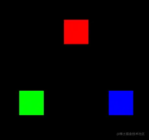

# WebGL 多attribute变量

---
源码：[github.com/buglas/webg…](https://link.juejin.cn/?target=https%3A%2F%2Fgithub.com%2Fbuglas%2Fwebgl-lesson "https://github.com/buglas/webgl-lesson")

### 1-多attribute变量的概念

接下来我们先通过一个问题来引出多attribute变量的概念和作用。

问题：如何一次性绘制三个不同颜色的点。

我们之前说“js与着色器间的数据传输”的时候，说过js修改顶点颜色：

-   片元着色器

```
<script id="fragmentShader" type="x-shader/x-fragment">
      precision mediump float;
      uniform vec4 u_FragColor;
      void main(){
          gl_FragColor=u_FragColor;
      }
</script>
```

-   js

```
const u_FragColor = gl.getUniformLocation(gl.program, "u_FragColor");
gl.uniform4f(u_FragColor, 1, 0, 1, 1);
```

这种方式只会绘制三个同样颜色的点。

那我们若想给这三个点不同的颜色，就需要再建立一个接收颜色数据的attribute 变量。

### 2-代码实现

1.在顶点着色器中，建立一个名为a\_Color 的attribute 变量，并通过varying 变量将其全局化，之后可以在片着色器中拿到。

```
<script id="vertexShader" type="x-shader/x-vertex">
    attribute vec4 a_Position;
    attribute vec4 a_Color;
    varying vec4 v_Color;
    void main(){
        gl_Position=a_Position;
        gl_PointSize=50.0;
        v_Color=a_Color;
    }
</script>
```

2.在片元着色器中获取顶点着色器中全局化的varying 变量，然后将其作为片元颜色。

```
<script id="fragmentShader" type="x-shader/x-fragment">
    precision mediump float;
    varying vec4 v_Color;
    void main(){
        gl_FragColor=v_Color;
    }
</script>
```

3.在js中，将顶点数据批量传递给顶点着色器。

```
//顶点数据
const vertices = new Float32Array([
    0, 0.2, 0,
    -0.2, -0.1, 0,
    0.2, -0.1, 0,
]);
//缓冲对象
const vertexBuffer = gl.createBuffer();
//绑定缓冲对象
gl.bindBuffer(gl.ARRAY_BUFFER, vertexBuffer);
//写入数据
gl.bufferData(gl.ARRAY_BUFFER, vertices, gl.STATIC_DRAW)
//获取attribute 变量
const a_Position = gl.getAttribLocation(gl.program, 'a_Position')
//修改attribute 变量
gl.vertexAttribPointer(a_Position, 3, gl.FLOAT, false, 0, 0)
//赋能-批处理
gl.enableVertexAttribArray(a_Position)
```

我们之前多点绘制里说过相关知识，我就不再多说了。

4.用同样原理将颜色数据批量传递给顶点着色器。

```
//颜色数据
const colors = new Float32Array([
    1, 0, 0,
    0, 1, 0,
    0, 0, 1,
]);
//缓冲对象
const colorBuffer = gl.createBuffer();
//绑定缓冲对象
gl.bindBuffer(gl.ARRAY_BUFFER, colorBuffer);
//写入数据
gl.bufferData(gl.ARRAY_BUFFER, colors, gl.STATIC_DRAW)
//获取attribute 变量
const a_Color = gl.getAttribLocation(gl.program, 'a_Color')
//修改attribute 变量
gl.vertexAttribPointer(a_Color, 3, gl.FLOAT, false, 0, 0)
//赋能-批处理
gl.enableVertexAttribArray(a_Color)
```

5.绘制顶点

```
//刷底色
gl.clear(gl.COLOR_BUFFER_BIT);
//绘制顶点
gl.drawArrays(gl.POINTS, 0, 3);
```

效果如下：



在上面的案例里，我们用js建立了两份attribute 数据，一份是顶点位置数据，一份是顶点颜色数据。

然后我们将两份attribute数据放进了了两个缓冲区对象里，后面绘图的时候，顶点着色器就会从这里面找数据。

其实，我们也可以把数据合一下，把点位数据和颜色数据放进一个集合里，然后让attribute 变量按照某种规律从其中寻找数据。

### 3-多attribute数据合一

这是我之前的两种数据：

```
//顶点数据
const vertices = new Float32Array([
    0, 0.2, 0,
    -0.2, -0.1, 0,
    0.2, -0.1, 0,
]);

//颜色数据
const colors = new Float32Array([
    1, 0, 0, 1,
    0, 1, 0, 1,
    0, 0, 1, 1,
]);
```

将其合而为一：

```
const source = new Float32Array([
    0, 0.2, 0,       1, 0, 0, 1,
    -0.2, -0.1, 0,   0, 1, 0, 1,
    0.2, -0.1, 0,    0, 0, 1, 1,
]);
```

对应上面的数据，我们要先有以下概念：

-   数据源：整个合而为一的数据source
-   元素字节数：32位浮点集合中每个元素的字节数
-   类目：一个顶点对应一个类目，也就是上面source中的每一行
-   系列：一个类目中所包含的每一种数据，比如顶点位置数据、顶点颜色数据
-   系列尺寸：一个系列所对应的向量的分量数目
-   类目尺寸：一个类目中所有系列尺寸的总和
-   类目字节数：一个类目的所有字节数量
-   系列元素索引位置：一个系列在一个类目中，以集合元素为单位的索引位置
-   系列字节索引位置：一个系列在一个类目中，以字节为单位的索引位置
-   顶点总数：数据源中的顶点总数

代码如下：

```
//数据源
const source = new Float32Array([
    0, 0.2, 0, 1, 0, 0, 1,
    -0.2, -0.1, 0, 0, 1, 0, 1,
    0.2, -0.1, 0, 0, 0, 1, 1
]);
//元素字节数
const elementBytes = source.BYTES_PER_ELEMENT
//系列尺寸
const verticeSize = 3
const colorSize = 4
//类目尺寸
const categorySize = verticeSize + colorSize
//类目字节数
const categoryBytes = categorySize * elementBytes
//系列字节索引位置
const verticeByteIndex = 0
const colorByteIndex = verticeSize * elementBytes
//顶点总数
const sourseSize = source.length / categorySize
```

### 3-用vertexAttribPointer() 方法玩转数据源

我们以前在说vertexAttribPointer() 的时候，说过它的功能就是让gl修改attribute上下文对象的。

其实具体而言，它是在告诉顶点着色器中的attribute变量以怎样的方式从顶点着色器中寻找它所需要的数据。

比如，我想让顶点着色器中，名叫a\_Position 的attribute 的变量从数据源中，寻找它所需要的数据。

1.把数据源装进绑定在webgl上下文对象上的缓冲区中

```
//缓冲对象
const sourceBuffer = gl.createBuffer();
//绑定缓冲对象
gl.bindBuffer(gl.ARRAY_BUFFER, sourceBuffer);
//写入数据
gl.bufferData(gl.ARRAY_BUFFER, source, gl.STATIC_DRAW)
```

2.告诉顶点着色器中，名叫a\_Position 的attribute 的变量，如何从数据源中，寻找它所需要的数据

```
//获取attribute 变量
const a_Position = gl.getAttribLocation(gl.program, 'a_Position')
//修改attribute 变量
gl.vertexAttribPointer(
    a_Position,
    verticeSize,
    gl.FLOAT,
    false,
    categoryBytes,
    verticeByteIndex
)
```

对于vertexAttribPointer() 方法中，每个参数的意思，建议大家直接去MDN 里看文档：

void gl.vertexAttribPointer(index, size, type, normalized, stride, offset)

-   index：attribute 变量，具体而言是指向存储attribute 变量的空间的指针
-   size：系列尺寸
-   type：元素的数据类型
-   normalized：是否归一化
-   stride：类目字节数
-   offset：系列索引位置

3.同理，可以再修改名叫a\_Color 的attribute 的变量

```
//获取attribute 变量
const a_Color = gl.getAttribLocation(gl.program, 'a_Color')
//修改attribute 变量
gl.vertexAttribPointer(
    a_Color,
    colorSize,
    gl.FLOAT,
    false,
    categoryBytes,
    colorByteIndex
)
//赋能-批处理
gl.enableVertexAttribArray(a_Color)
```

绘图方法不变，效果和之前是一样的：


接下来，我们改变一下绘图方法，还可以画出彩色三角形。
