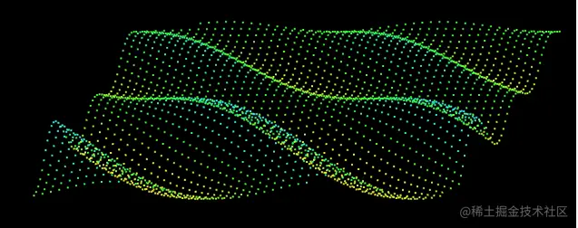
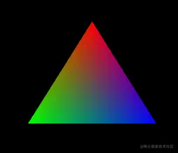
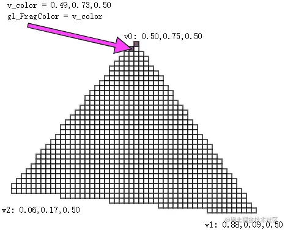
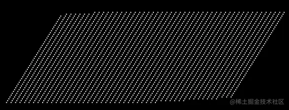
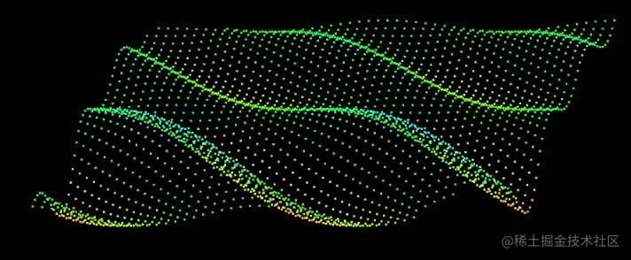
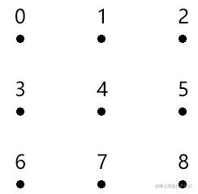
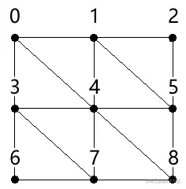
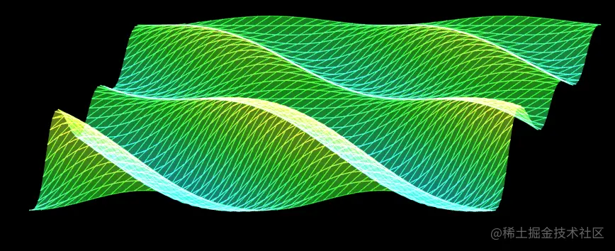

# WebGL 绘制彩色水波纹

---
源码：[github.com/buglas/webg…](https://link.juejin.cn/?target=https%3A%2F%2Fgithub.com%2Fbuglas%2Fwebgl-lesson "https://github.com/buglas/webgl-lesson")



### 1-绘制彩色三角形

我们可以用独立三角形绘图。

```
gl.drawArrays(gl.TRIANGLES, 0, sourseSize);
```

效果如下：



为什么会画出一个具有三种颜色的三角形呢？

这是因为我给三角形的三个顶点绑定了三种颜色。

那为什么这三种颜色可以平滑过渡呢？这其中的规律是什么？

我们通过下面这个图便可以很好的去理解，它就是在三个点之间做线性补间，将补间得出的颜色填充到三角形所围成的每个片元之中。



我们在知道了多点异色，以及片元着色的原理后，就可以尝试做一点好玩的东西，比如水波纹。

在画之前，我们需要先做一下代码架构。

### 2-多点异色的对象架构

现在我们知识量还不足，所以大家可以先知道多少架构多少，但这种架构的意识一定要有。

接下我在之前的Poly对象的基础上做一下修改。

1.定义Poly对象的默认属性

```
const defAttr = () => ({
  gl:null,
  type:'POINTS',
  source:[],
  sourceSize:0,
  elementBytes:4,
  categorySize: 0,
  attributes: {},
  uniforms: {},
})
```

-   source 数据源
    
-   sourceSize 顶点数量，数据源尺寸
    
-   elementBytes 元素字节数
    
-   categorySize 类目尺寸
    
-   attributes attribute属性集合，其数据结构如下：
    
    ```
    {
      a_Position: {
        size: 3,
        index:0
      }
    }
    ```
    
    -   a\_Position 对应attribute变量名
    -   size 系列尺寸
    -   index 系列的元素索引位置
-   uniforms uniform变量集合，其数据结构如下：
    
    ```
    {
      u_Color: {
        type: 'uniform1f',
        value:1
      }
    }
    ```
    
    -   u\_Color 对应uniform变量名
    -   type uniform变量的修改方法
    -   value uniform变量的值

2.Poly对象的构造函数和之前一样

```
constructor(attr){
    Object.assign(this,defAttr(),attr)
    this.init()
}
```

3.初始化方法

```
init(){
    if (!this.gl) { return }
    this.calculateSourceSize()
    this.updateAttribute();
    this.updateUniform();
}
```

-   calculateSize() 基于数据源计算类目尺寸、类目字节数、顶点总数
    
    ```
    calculateSourceSize() {
        const {attributes, elementBytes,source } = this
        let categorySize = 0
        Object.values(attributes).forEach(ele => {
            const { size, index } = ele
            categorySize += size
            ele.byteIndex=index*elementBytes
        })
        this.categorySize = categorySize
        this.categoryBytes=categorySize*elementBytes
        this.sourceSize = source.length / categorySize
    }
    ```
    
-   updateAttribute() 更新attribute 变量
    
    ```
    updateAttribute() {
        const { gl, attributes, categoryBytes, source } = this
        const sourceBuffer = gl.createBuffer();
        gl.bindBuffer(gl.ARRAY_BUFFER, sourceBuffer);
        gl.bufferData(gl.ARRAY_BUFFER, new Float32Array(source), gl.STATIC_DRAW)
        for (let [key, { size, byteIndex }] of Object.entries(attributes)) {
            const attr = gl.getAttribLocation(gl.program, key)
            gl.vertexAttribPointer(
                attr,
                size,
                gl.FLOAT,
                false,
                categoryBytes,
                byteIndex
            )
            gl.enableVertexAttribArray(attr)
        }
    }
    ```
    
-   updateUniform() 更新uniform变量
    

```
updateUniform() {
    const {gl,uniforms}=this
    for (let [key, val] of Object.entries(uniforms)) {
        const { type, value } = val
        const u = gl.getUniformLocation(gl.program, key)
        if (type.includes('Matrix')) {
            gl[type](u,false,value)
        } else {
            gl[type](u,value)
        }
    }
}
```

4.draw() 绘图方法

```
draw(type = this.type) {
    const { gl, sourceSize } = this
    gl.drawArrays(gl[type],0,sourceSize);
}
```

接下来，咱们先来一抹绿意练练手。

### 3-一抹绿意

1.顶点着色器

```
<script id="vertexShader" type="x-shader/x-vertex">
    attribute vec4 a_Position;
    attribute vec4 a_Color;
    uniform mat4 u_ViewMatrix;
    varying vec4 v_Color;
    void main(){
      gl_Position = u_ViewMatrix*a_Position;
      gl_PointSize=3.0;
      v_Color=a_Color;
    }
</script>
```

2.片元着色器

```
<script id="fragmentShader" type="x-shader/x-fragment">
    precision mediump float;
    varying vec4 v_Color;
    void main(){
        gl_FragColor=v_Color;
    }
</script>
```

3.初始化着色器

```
const canvas = document.getElementById('canvas');
canvas.width = window.innerWidth;
canvas.height = window.innerHeight;
const gl = canvas.getContext('webgl');

const vsSource = document.getElementById('vertexShader').innerText;
const fsSource = document.getElementById('fragmentShader').innerText;
initShaders(gl, vsSource, fsSource);
gl.clearColor(0.0, 0.0, 0.0, 1.0);
```

4.建立视图矩阵

```
/* 视图矩阵 */
const viewMatrix = new Matrix4().lookAt(
    new Vector3(0.2, 0.3, 1),
    new Vector3(),
    new Vector3(0, 1, 0)
)
```

5.建立在x,z方向上的比例尺，将空间坐标和弧度相映射

```
/* x,z 方向的空间坐标极值 */
const [minPosX, maxPosX, minPosZ, maxPosZ] = [    -0.7, 0.8, -1, 1]
/* x,z 方向的弧度极值 */
const [minAngX, maxAngX, minAngZ, maxAngZ] = [    0, Math.PI * 4, 0, Math.PI * 2]

/* 比例尺：将空间坐标和弧度相映射 */
const scalerX = ScaleLinear(minPosX, minAngX, maxPosX, maxAngX)
const scalerZ = ScaleLinear(minPosZ, minAngZ, maxPosZ, maxAngZ)
```

6.建立将y坐标和色相相映射的比例尺

```
/* y 方向的坐标极值 */
const [a1, a2] = [0.1, 0.03]
const a12 = a1 + a2
const [minY, maxY] = [-a12, a12]
/* 色相极值 */
const [minH, maxH] = [0.15, 0.5]
/* 比例尺：将y坐标和色相相映射 */
const scalerC = ScaleLinear(minY, minH, maxY, maxH)
```

7.建立颜色对象，可通过HSL获取颜色

```
const color = new Color()
```

8.建立波浪对象

```
/* 波浪对象的行数和列数 */
const [rows, cols] = [50, 50]

/* 波浪对象的两个attribute变量，分别是位置和颜色 */
const a_Position = { size: 3, index: 0 }
const a_Color = { size: 4, index: 3 }

/* 类目尺寸 */
const categorySize = a_Position.size + a_Color.size

/* 波浪对象 */
const wave = new Poly({
    gl,
    source: getSource(
        cols, rows,
        minPosX, maxPosX, minPosZ, maxPosZ
    ),
    uniforms: {
        u_ViewMatrix: {
            type: 'uniformMatrix4fv',
            value: viewMatrix.elements
        },
    },
    attributes: {
        a_Position,
        a_Color,
    }
})
```

-   getSource() 方法是基于行列数和坐标极值获取数据源的方法
    
    ```
    /* 建立顶点集合 */
    function getSource(cols, rows, minPosX, maxPosX, minPosZ, maxPosZ) {
        const source = []
        const spaceZ = (maxPosZ - minPosZ) / rows
        const spaceX = (maxPosX - minPosX) / cols
        for (let z = 0; z < rows; z++) {
            for (let x = 0; x < cols; x++) {
                const px = x * spaceX + minPosX
                const pz = z * spaceZ + minPosZ
                source.push(px, 0, pz, 1, 1, 1, 1)
            }
        }
        return source
    }
    ```
    

9.渲染

```
render()
/* 渲染 */
function render() {
    gl.clear(gl.COLOR_BUFFER_BIT);
    wave.draw()
}
```

效果如下：



10.制作定点起伏动画，并添加颜色

```
/* 动画:偏移phi */
let offset = 0
!(function ani() {
    offset += 0.08
    updateVertices(offset)
    wave.updateAttribute()
    render()
    requestAnimationFrame(ani)
})()

/* 更新顶点高度和颜色 */
function updateVertices(offset = 0) {
    const { source, categorySize } = wave
    for (let i = 0; i < source.length; i += categorySize) {
        const [posX, posZ] = [source[i], source[i + 2]]
        const angZ = scalerZ(posZ)
        const Omega = 2
        const a = Math.sin(angZ) * a1 + a2
        const phi = scalerX(posX) + offset
        const y = SinFn(a, Omega, phi)(angZ)
        source[i + 1] = y
        const h = scalerC(y)
        const { r, g, b } = color.setHSL(h, 1, 0.6)
        source[i + 3] = r
        source[i + 4] = g
        source[i + 5] = b
    }
}
```

效果如下：



现在一抹绿意已有，我们接下来可以连点成面，画出一片春色。

### 4-一片春色

在连点成面的时候，我们首先要有一个思路。

#### 4-1-思路

1.准备一份顶点，如下图：



顶点的存储形式如下：

```
[    x,y,z, x,y,z, x,y,z,    x,y,z, x,y,z, x,y,z,    x,y,z, x,y,z, x,y,z,]
```

2.基于顶点的索引位置，建立独立三角形集合

上面顶点的索引位置如下：

```
[    0,1,2,    4,5,6,    7,8,9]
```

按照独立三角形的绘制规则，建立三角形顶点集合。

四个点构成两个三角形：



其数据结构如下：

```
[    0,3,4, 0,4,1, 1,4,5, 1,5,2,    3,6,7, 3,7,4, 4,7,8, 4,8,5]
```

3.绘图

```
gl.drawArrays(gl.TRANGLES,0,3*8);
```

原理就这么简单，接下来咱们走一下代码。

#### 4-2-代码

我们这里的代码是在“一抹绿意” 的基础上改的，所以我就直说重点了。

1.开启透明度合成

```
gl.enable(gl.BLEND);
gl.blendFunc(gl.SRC_ALPHA, gl.ONE);
```

2.建立基于行列获取顶点索引的方法

```
const getInd = GetIndexInGrid(cols, categorySize)
function GetIndexInGrid(w, size) {
  return function (x, y) {
    return (y * w + x) * size
  }
}
```

3.获取顶点阵列和三角形的顶点索引集合

```
const { vertices, indexes } = crtBaseData(
    cols, rows,
    minPosX, maxPosX, minPosZ, maxPosZ
);
```

crtBaseData() 是基于行列数和空间极值获取顶点阵列和三角形的顶点索引集合的方法。

-   vertices 顶点阵列
-   indexes 三角形的顶点索引集合

```
function crtBaseData(cols, rows, minPosX, maxPosX, minPosZ, maxPosZ) {
    const vertices = []
    const indexes = []
    const spaceZ = (maxPosZ - minPosZ) / rows
    const spaceX = (maxPosX - minPosX) / cols
    for (let z = 0; z < rows; z++) {
        for (let x = 0; x < cols; x++) {
            const px = x * spaceX + minPosX
            const pz = z * spaceZ + minPosZ
            vertices.push(px, 0, pz, 1, 1, 1, 0.5)
            if (z && x) {
                const [x0, z0] = [x - 1, z - 1]
                indexes.push(
                    getInd(x0, z0),
                    getInd(x, z0),
                    getInd(x, z),
                    getInd(x0, z0),
                    getInd(x, z),
                    getInd(x0, z),
                )
            }
        }
    }
    return { vertices, indexes }
}
```

4.建立波浪对象

```
const wave = new Poly({
    gl,
    source: getSource(indexes, vertices, categorySize),
    uniforms: {
        u_ViewMatrix: {
            type: 'uniformMatrix4fv',
            value: viewMatrix.elements
        },
    },
    attributes: {
        a_Position,
        a_Color,
    }
})
```

getSource() 是通过顶点阵列和三角形的顶点索引集合获取数据源的方法。

```
function getSource(vertices, indexes, categorySize) {
    const arr = []
    indexes.forEach(i => {
        arr.push(...vertices.slice(i, i + categorySize))
    })
    return arr
}
```

5.渲染

```
function render() {
    gl.clear(gl.COLOR_BUFFER_BIT);
    // wave.draw()
    wave.draw('LINES')
    wave.draw('TRIANGLES')
}
```

效果如下：



关于颜色的知识我们就先说到这，接下来咱们再说一下纹理。
