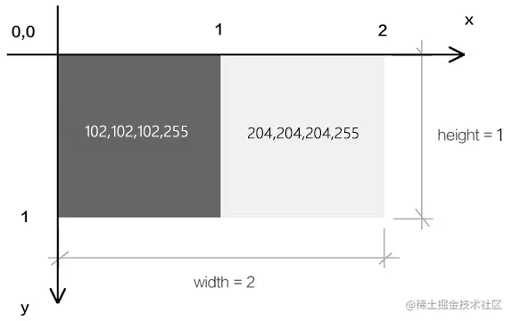

# WebGL 纹理

---
源码：[github.com/buglas/webg…](https://link.juejin.cn/?target=https%3A%2F%2Fgithub.com%2Fbuglas%2Fwebgl-lesson "https://github.com/buglas/webgl-lesson")

纹理，通常指的就是二维的栅格图像，我们可以将其作为webgl图形的贴图。

而在webgl 里，还有一个纹理对象的概念，它是对图像又做了一层封装，这个我们后面会详解。

接下来，我们要先建立几个基础概念，以便于理解webgl的贴图流程。

### 1-基础概念

#### 1-1-栅格系统

我们在说图像的时候，往往都是指点阵图、栅格图、位图。

而与其相对应的是图形，也做矢量图。

我接下来说的纹理，就是属于图像，其图像的建立和显示会遵循栅格系统里的规范。

比如，所有图像都是由像素组成的，在webgl里我们把像素称为片元，像素是按照相互垂直的行列排列的。

如下图：


将其放大后就可以看见其中的栅格：


图像中的每个像素都可以通过行数y和列数x来找到，由(x,y) 构成的点位，就是图像的像素坐标。

因为canvas画布也是一张图像，所以图像的栅格坐标系和我们之前说过的canvas2d的坐标系是一样的，我们可以简单回顾一下：



栅格坐标系的原点在左上角。

栅格坐标系的y 轴方向是朝下的。

栅格坐标系的坐标基底由两个分量组成，分别是一个像素的宽和一个像素的高。

#### 1-2-图钉

图钉是我自己写的概念，源自于photoshop中图像的操控变形功能，这种称呼很形象。


webgl中，图钉的位置是通过uv坐标来控制的，图钉的uv坐标和顶点的webgl坐标是两种不同的坐标系统，之后我们会其相互映射，从而将图像特定的一块区域贴到webgl图形中。

比如我将其映射到下面的蓝色三角形中：


注：我们在webgl里打图钉的时候不会发生边界线的扭曲，上图重在示意。

#### 1-3-uv坐标系

我们在webgl里打图钉的时候，要考虑图钉在图像中的定位。

说到定位，大家不要先想位置，而是要先想坐标系，咱们接下来说一下图钉使用的uv坐标系。


uv坐标系，也叫st坐标系，大家以后见到了知道是一回事即可。

uv坐标系的坐标原点在图像的左下角，u轴在右，v轴在上。

u轴上的1个单位是图像的宽；

v轴上的一个单位是图像的高。

#### 1-4-采样器

采样器是按照图钉位置从图像中获取片元的方式。

我们在图像中所打的图钉位置，并不是图像中某一个片元的位置，因为片元位置走的是栅格坐标系。

所以我们需要一个采样器去对图钉的uv坐标系和像素的栅格坐标系做映射，从而去采集图像中图钉所对应的片元。

着色器基于一张图像可以建立一个，或多个采样器，不同的采样器可以定义不同的规则去获取图像中的片元。

采样器在着色器中是一种变量类型，写做sampler2D，它就像我们之前写过的vec4 类型一样，可以在片元着色器中通过uniform变量暴露给js，让js对其进行修改。

既然js可以对采样器进行修改了，那js必然会以某种方式向着色器传递其建立采样器所需的数据。

接下来咱们就先说一下这种的数据。

#### 1-5-纹理对象

着色器使用一个纹理对象，就可以建立一个采样器。

纹理对象的建立需要一个图像源，比如Image 对象。

同是，我们还需要设置纹理对象和图钉进行数据映射的方式。

纹理对象是通过js 来建立的，js并不能直接将纹理对象传递给着色器。因为纹理对象说的是js 语言，说glsl es语言的着色器是不认识这种语言的。

所以，webgl 在浏览器底层为纹理对象建立了一块缓冲区，缓存区可以理解为用于存放纹理对象的磁盘空间，这块空间可以将纹理对象翻译成着色器可以读懂的数据。

之后我们会把这个空间的索引位置传给着色器，让着色器基于这个空间的索引位置，找到这个空间，然后再从空间中找到纹理对象，最后通过纹理对象建立采样器。

接下来咱们就说一下这个用于存储纹理对象的空间-纹理单元。

#### 1-6-纹理单元

纹理单元是一种专门用来存放纹理对象的缓冲区，就像我们之前用createBuffer()方法建立的用于存储数据源的缓冲区一样。

纹理单元是由webgl提前建立好的，只有固定的几个，如TEXTURE0|1|2|3|4|5|6|7|8，这就像我们实际中住的楼房单元一样，已经被webgl提前在浏览器中建立起来了，数量有限。

纹理单元虽然无需我们自己建立，但需要我们自己激活，让其进入使用状态。

基本概念咱们就说到这，接下来咱们看一下整体的代码实现。

### 2-整体代码

1.顶点着色器

```
<script id="vertexShader" type="x-shader/x-vertex">
    attribute vec4 a_Position;
    attribute vec2 a_Pin;
    varying vec2 v_Pin;
    void main(){
      gl_Position = a_Position;
      v_Pin=a_Pin;
    }
</script>
```

-   a\_Pin 图钉位置

2.片元着色器

```
<script id="fragmentShader" type="x-shader/x-fragment">
    precision mediump float;
    uniform sampler2D u_Sampler;
    varying vec2 v_Pin;
    void main(){
      gl_FragColor=texture2D(u_Sampler,v_Pin);
    }
</script>
```

-   sampler2D 是uniform 变量的类型，叫做二维取样器
-   texture2D() 基于图钉从取样器中获取片元颜色

3.初始化着色器

```
const canvas = document.getElementById('canvas');
canvas.width = window.innerWidth;
canvas.height = window.innerHeight;
const gl = canvas.getContext('webgl');

const vsSource = document.getElementById('vertexShader').innerText;
const fsSource = document.getElementById('fragmentShader').innerText;
initShaders(gl, vsSource, fsSource);
gl.clearColor(0.0, 0.0, 0.0, 1.0);
```

4.建立数据源，并计算相应尺寸

```
//数据源
const source = new Float32Array([
    -0.5, 0.5, 0.0, 1.0,
    -0.5, -0.5, 0.0, 0.0,
    0.5, 0.5, 1.0, 1.0,
    0.5, -0.5, 1.0, 0.0,
]);
const FSIZE = source.BYTES_PER_ELEMENT;
//元素字节数
const elementBytes = source.BYTES_PER_ELEMENT
//系列尺寸
const posSize = 2
const PinSize = 2
//类目尺寸
const categorySize = posSize + PinSize
//类目字节数
const categoryBytes = categorySize * elementBytes
//系列字节索引位置
const posByteIndex = 0
const pinByteIndex = posSize * elementBytes
//顶点总数
const sourceSize = source.length / categorySize
```

数据源中有两个系列，分别是顶点位置系列和图钉位置系列。

5.将数据源写入到缓冲区，让attribute变量从其中寻找数据。

```
const sourceBuffer = gl.createBuffer();
gl.bindBuffer(gl.ARRAY_BUFFER, sourceBuffer);
gl.bufferData(gl.ARRAY_BUFFER, source, gl.STATIC_DRAW);

const a_Position = gl.getAttribLocation(gl.program, 'a_Position');
gl.vertexAttribPointer(
    a_Position, 
    posSize, 
    gl.FLOAT, 
    false, 
    categoryBytes, 
    posByteIndex
);
gl.enableVertexAttribArray(a_Position);

const a_Pin = gl.getAttribLocation(gl.program, 'a_Pin');
gl.vertexAttribPointer(
    a_Pin, 
    pinSize, 
    gl.FLOAT, 
    false, 
    categoryBytes, 
    pinByteIndex
);
gl.enableVertexAttribArray(a_Pin);
```

6.建立Image 图像作为图像源，当图像源加载成功后再贴图。

```
//对纹理图像垂直翻转
gl.pixelStorei(gl.UNPACK_FLIP_Y_WEBGL, 1);

//纹理单元
gl.activeTexture(gl.TEXTURE0);

//纹理对象
const texture = gl.createTexture();
//把纹理对象装进纹理单元里
gl.bindTexture(gl.TEXTURE_2D, texture);

//image 对象
const image = new Image();
image.src = './images/erha2.jpg';
image.onload = function () {
    showMap()
}

//贴图
function showMap() {
    //配置纹理图像
    gl.texImage2D(
        gl.TEXTURE_2D,
        0,
        gl.RGB,
        gl.RGB,
        gl.UNSIGNED_BYTE,
        image
    );

    //配置纹理参数
    gl.texParameteri(
        gl.TEXTURE_2D,
        gl.TEXTURE_MIN_FILTER,
        gl.LINEAR
    );

    //获取u_Sampler 
    const u_Sampler = gl.getUniformLocation(gl.program, 'u_Sampler');
    //将0号纹理分配给着色器，0 是纹理单元编号
    gl.uniform1i(u_Sampler, 0);

    //渲染
    render()
}

function render() {
    gl.clear(gl.COLOR_BUFFER_BIT);
    gl.drawArrays(gl.TRIANGLE_STRIP, 0, sourceSize);
}
```

接下来咱们重点解释上面的这部分代码。

### 3-贴图详解

1.准备三个角色

-   Image 图像
-   纹理对象
-   纹理单元


```
//纹理单元
gl.activeTexture(gl.TEXTURE0);

//纹理对象
const texture = gl.createTexture();

//image 对象
const image = new Image();
image.src = './images/erha.jpg';
```

-   activeTexture(gl.TEXTURE0) 激活0号单元
-   createTexture() 创建纹理对象

2.把纹理对象装进当前已被激活的纹理单元里


```
const texture = gl.createTexture();
gl.bindTexture(gl.TEXTURE_2D, texture);
```

-   TEXTURE\_2D 纹理对象的类型

3.当Image 图像加载成功后，把图像装进当前纹理单元的纹理对象里。


```
gl.texImage2D(
    gl.TEXTURE_2D,
    0,
    gl.RGB,
    gl.RGB,
    gl.UNSIGNED_BYTE,
    image
);
```

texImage2D(type, level, internalformat, format, type, pixels)

-   type 纹理类型
    
-   level 基本图像等级
    
-   internalformat 纹理中的颜色组件
    
-   format 纹理数据格式，必须和internalformat 一样
    
-   type 纹理数据的数据类型
    
    -   UNSIGNED\_BYTE 无符号字节
-   pixels 图像源
    

4.纹理对象还有一些相应参数需要设置一下

```
gl.texParameteri(
    gl.TEXTURE_2D,
    gl.TEXTURE_MIN_FILTER,
    gl.LINEAR
);
```

texParameteri(type, pname, param)

-   type 纹理类型
    
    -   TEXTURE\_2D 二维纹理
-   pname 纹理参数的名称
    
    -   TEXTURE\_MIN\_FILTER 纹理缩小滤波器
-   param 与pname相对应的纹理参数值
    
    -   gl.LINEAR 线性

5.在js 中获取采样器对应的Uniform变量,告诉片元着色器中的采样器，纹理对象在哪个单元里。之后采样器便会根据单元号去单元对象中寻找纹理对象。


```
const u_Sampler = gl.getUniformLocation(gl.program, 'u_Sampler');
gl.uniform1i(u_Sampler, 0);
```

5.渲染

```
render()
function render() {
    gl.clear(gl.COLOR_BUFFER_BIT);
    gl.drawArrays(gl.TRIANGLE_STRIP, 0, sourceSize);
}
```

效果如下：


这时候的图像是倒立的，这是由于Image对象遵守的是栅格坐标系，栅格坐标系的y轴朝下，而uv坐标系的y朝上，两者相反，所以画出的图形反了。

6.对图像进行预处理，将图像垂直翻转

```
gl.pixelStorei(gl.UNPACK_FLIP_Y_WEBGL, 1);
```

pixelStorei(pname, param) 图像预处理

-   pname 参数名
    
    -   gl.UNPACK\_FLIP\_Y\_WEBGL 是否垂直翻，布尔值，1|0
-   param 参数值
    


关于纹理贴图的基本流程和思路就是这样，接下来我们还要对其中的几个知识点进行详细讲解，不然以后遇到问题了会找不到解决方案。

### 4-纹理容器

我们之前在贴图的时候，默认图像源的尺寸只能是2的n次方，比如2、4、8、16、……、256、512等。

如果我们把图像的尺寸改成非2次幂尺寸，如300\*300，那贴图就无法显示。

我们要想解决这种问题，就得设置一下纹理的容器。

我们在图像上打图钉的时候，形成一块uv区域，这块区域可以理解为纹理容器。

纹理容器可以定义图钉区域的纹理如何显示在webgl图形中。

通过对纹理容器的设置，我们可以实现以下功能：

-   非二次幂图像源的显示
-   纹理的复制
-   纹理的镜像

#### 4-1-非二次幂图像源的显示

```
gl.texParameteri(
    gl.TEXTURE_2D,
    gl.TEXTURE_WRAP_S,
    gl.CLAMP_TO_EDGE
)
gl.texParameteri(
    gl.TEXTURE_2D,
    gl.TEXTURE_WRAP_T,
    gl.CLAMP_TO_EDGE
)
```

TEXTURE\_WRAP\_S和TEXTURE\_WRAP\_T 就是纹理容器在s方向和t方向的尺寸，这里的s、t就是st坐标系里的s、t，st坐标系和uv坐标系是一回事。

CLAMP\_TO\_EDGE 翻译过来就是边缘夹紧的意思，可以理解为任意尺寸的图像源都可以被宽高为1的uv尺寸夹紧。

注：只有CLAMP\_TO\_EDGE 才能实现非二次幂图像源的显示，其它的参数都不可以。

#### 4-2-纹理的复制

我们之前说过，uv坐标系的坐标基底分别是1个图片的宽和1个图片的高，可是如果我们将2个图片的宽高映射到了图形上会是什么结果呢？

默认是这样的：


这是由纹理容器的默认值决定的：

```
gl.texParameteri(
    gl.TEXTURE_2D,
    gl.TEXTURE_WRAP_S,
    gl.REPEAT
)
gl.texParameteri(
    gl.TEXTURE_2D,
    gl.TEXTURE_WRAP_T,
    gl.REPEAT
) 
```

REPEAT 就是纹理重复的意思。

#### 4-3-纹理的镜像复制

纹理的镜像复制可以实现纹理的水平、垂直翻转和复制。

效果如下：


代码如下：

```
gl.texParameteri(
    gl.TEXTURE_2D,
    gl.TEXTURE_WRAP_S,
    gl.MIRRORED_REPEAT
)
gl.texParameteri(
    gl.TEXTURE_2D,
    gl.TEXTURE_WRAP_T,
    gl.MIRRORED_REPEAT
)
```

MIRRORED\_REPEAT 就是镜像复制的意思。

我们也可以通过使用CLAMP\_TO\_EDGE 只对某一个方向纹理镜像复制。

```
gl.texParameteri(
    gl.TEXTURE_2D,
    gl.TEXTURE_WRAP_S,
    gl.MIRRORED_REPEAT
)
gl.texParameteri(
    gl.TEXTURE_2D,
    gl.TEXTURE_WRAP_T,
    gl.CLAMP_TO_EDGE
)
```

效果如下：


### 5-分子贴图

分子贴图mipmap 是一种纹理映射技术。

比如：

webgl中有一个正方形，它在canvas画布中显示的时候，占据了2_2个像素，我们要将一个8_8的图像源贴上去。

正方形中肯定不能显示图像源中的所有像素，因为它只有2\*2=4个像素。

在Photoshop 中，会将图像源切割成2行、2列的色块，然后将每个色块的均值交个正方形。

在webgl 中也有类似的方法，并且它还有一层渲染性能的优化（Photoshop底层是否有这层优化我尚且不知）。

接下来咱们就说一下这层优化优化的是什么。

先想象一个场景，我要把1024_1024的图像源映射到canvas画布上2_2的正方形中，若把图像源分割求均值会产生庞大的数据运算，我们需要想办法把和正方形相映射的图像源的尺寸降到最小，比如就是2\*2的。

因此，我们就需要[分子贴图](https://link.juejin.cn/?target=https%3A%2F%2Fbaike.baidu.com%2Fitem%2FMipmap%2F3722136%3Ffr%3Daladdin "https://baike.baidu.com/item/Mipmap/3722136?fr=aladdin")了。

分子贴图是一个基于分辨率等比排列的图像集合，集合中每一项的宽高与其前一项宽高的比值都是1/2。

如下图：


在webgl 中，我们可以使用gl.generateMipmap() 方法为图像源创建分子贴图，

有了分子贴图后，之前2\*2的正方形便会从分子集合中寻找与其分辨率最接近的分子图像。

在找到分子图像后，就需要基于webgl图形的片元尺寸对其分割取色了。

对于取色的方法，咱们之前说一个均值算法，其实还有其它算法。

我们看一下webgl 给提供的方法。

```
//创建分子贴图
gl.generateMipmap(gl.TEXTURE_2D);
//定义从分子图像中取色的方法
gl.texParameteri(
    gl.TEXTURE_2D,
    gl.TEXTURE_MAG_FILTER,
    gl.LINEAR
)
gl.texParameteri(
    gl.TEXTURE_2D,
    gl.TEXTURE_MIN_FILTER,
    gl.LINEAR
)
```

gl.texParameteri()方法中的第2个参数和第3个参数是键值对的关系。

TEXTURE\_MAG\_FILTER和TEXTURE\_MIN\_FILTER，对应的是纹理在webgl图形中的缩放情况。

-   TEXTURE\_MAG\_FILTER 纹理放大滤波器，是纹理在webgl图形中被放大的情况。
-   TEXTURE\_MIN\_FILTER 纹理缩小滤波器，是纹理在webgl图形中被缩小的情况。

TEXTURE\_MAG\_FILTER 具备以下参数：

-   LINEAR (默认值) ，线性滤镜， 获取纹理坐标点附近4个像素的加权平均值，效果平滑
-   NEAREST 最近滤镜， 获得最靠近纹理坐标点的像素 ，效果锐利

TEXTURE\_MIN\_FILTER 具备以下参数：

-   LINEAR 线性滤镜，获取纹理坐标点附近4个像素的加权平均值，效果平滑
-   NEAREST 最近滤镜， 获得最靠近纹理坐标点的像素，效果锐利
-   NEAREST\_MIPMAP\_NEAREST Select the nearest mip level and perform nearest neighbor filtering .
-   NEAREST\_MIPMAP\_LINEAR (默认值) Perform a linear interpolation between mip levels and perform nearest neighbor filtering within each .
-   LINEAR\_MIPMAP\_NEAREST Select the nearest mip level and perform linear filtering within it .
-   LINEAR\_MIPMAP\_LINEAR Perform a linear interpolation between mip levels and perform linear filtering : also called trilinear filtering .

注：后面这4个与分子贴图相关的参数适合比较大的贴图，若是比较小的贴图，使用LINEAR 或NEAREST 就好。

注：缩小滤波器的默认值取色方法是NEAREST\_MIPMAP\_LINEAR ，这个方法会从分子贴图里找分子图像，然后从其中取色，然而当我们没有使用gl.generateMipmap()方法建立分子贴图的时候，就得给它一个不需要从分子贴图中去色的方法，如LINEAR或NEAREST。

### 6-多纹理模型

在我们实际开发中，经常会遇到一个模型，多个纹理的的情况。

比如这个魔方：


有时候我们会很自然的想到一个面给它一个贴图，而实际上，最高效的方式是一个物体给它一个贴图，如下图：


这样我们只需要加载一次图片，建立一个纹理对象，做一次纹理和顶点数据的映射就可以了。

这里面没有涉及任何新的知识点，但这是一种很重要的项目开发经验。

整体代码如下：

```
<script id="vertexShader" type="x-shader/x-vertex">
    attribute vec4 a_Position;
    attribute vec2 a_Pin;
    uniform mat4 u_ModelMatrix;
    varying vec2 v_Pin;
    void main(){
      gl_Position = u_ModelMatrix*a_Position;
      v_Pin=a_Pin;
    }
</script>
<script id="fragmentShader" type="x-shader/x-fragment">
    precision mediump float;
    uniform sampler2D u_Sampler;
    varying vec2 v_Pin;
    void main(){
      gl_FragColor=texture2D(u_Sampler,v_Pin);
    }
</script>
<script type="module">
    import { initShaders } from '../jsm/Utils.js';
    import { Matrix4, Vector3, Quaternion } from 'https://unpkg.com/three/build/three.module.js';

    const canvas = document.getElementById('canvas');
    canvas.width = window.innerWidth;
    canvas.height = window.innerHeight;
    const gl = canvas.getContext('webgl');

    const vsSource = document.getElementById('vertexShader').innerText;
    const fsSource = document.getElementById('fragmentShader').innerText;
    initShaders(gl, vsSource, fsSource);
    gl.clearColor(0.0, 0.0, 0.0, 1.0);
    gl.enable(gl.CULL_FACE);
    gl.enable(gl.DEPTH_TEST);

    //数据源
    const source = new Float32Array([
        -0.5, -0.5, -0.5, 0, 0,
        -0.5, 0.5, -0.5, 0, 0.5,
        0.5, -0.5, -0.5, 0.25, 0,
        -0.5, 0.5, -0.5, 0, 0.5,
        0.5, 0.5, -0.5, 0.25, 0.5,
        0.5, -0.5, -0.5, 0.25, 0,

        -0.5, -0.5, 0.5, 0.25, 0,
        0.5, -0.5, 0.5, 0.5, 0,
        -0.5, 0.5, 0.5, 0.25, 0.5,
        -0.5, 0.5, 0.5, 0.25, 0.5,
        0.5, -0.5, 0.5, 0.5, 0,
        0.5, 0.5, 0.5, 0.5, 0.5,

        -0.5, 0.5, -0.5, 0.5, 0,
        -0.5, 0.5, 0.5, 0.5, 0.5,
        0.5, 0.5, -0.5, 0.75, 0,
        -0.5, 0.5, 0.5, 0.5, 0.5,
        0.5, 0.5, 0.5, 0.75, 0.5,
        0.5, 0.5, -0.5, 0.75, 0,

        -0.5, -0.5, -0.5, 0, 0.5,
        0.5, -0.5, -0.5, 0.25, 0.5,
        -0.5, -0.5, 0.5, 0, 1,
        -0.5, -0.5, 0.5, 0, 1,
        0.5, -0.5, -0.5, 0.25, 0.5,
        0.5, -0.5, 0.5, 0.25, 1,

        -0.5, -0.5, -0.5, 0.25, 0.5,
        -0.5, -0.5, 0.5, 0.25, 1,
        -0.5, 0.5, -0.5, 0.5, 0.5,
        -0.5, -0.5, 0.5, 0.25, 1,
        -0.5, 0.5, 0.5, 0.5, 1,
        -0.5, 0.5, -0.5, 0.5, 0.5,

        0.5, -0.5, -0.5, 0.5, 0.5,
        0.5, 0.5, -0.5, 0.75, 0.5,
        0.5, -0.5, 0.5, 0.5, 1,
        0.5, -0.5, 0.5, 0.5, 1,
        0.5, 0.5, -0.5, 0.75, 0.5,
        0.5, 0.5, 0.5, 0.75, 1,
    ]);
    const FSIZE = source.BYTES_PER_ELEMENT;
    //元素字节数
    const elementBytes = source.BYTES_PER_ELEMENT
    //系列尺寸
    const posSize = 3
    const pinSize = 2
    //类目尺寸
    const categorySize = posSize + pinSize
    //类目字节数
    const categoryBytes = categorySize * elementBytes
    //系列字节索引位置
    const posByteIndex = 0
    const pinByteIndex = posSize * elementBytes
    //顶点总数
    const sourceSize = source.length / categorySize


    const sourceBuffer = gl.createBuffer();
    gl.bindBuffer(gl.ARRAY_BUFFER, sourceBuffer);
    gl.bufferData(gl.ARRAY_BUFFER, source, gl.STATIC_DRAW);

    const a_Position = gl.getAttribLocation(gl.program, 'a_Position');
    gl.vertexAttribPointer(
        a_Position,
        posSize,
        gl.FLOAT,
        false,
        categoryBytes,
        posByteIndex
    );
    gl.enableVertexAttribArray(a_Position);

    const a_Pin = gl.getAttribLocation(gl.program, 'a_Pin');
    gl.vertexAttribPointer(
        a_Pin,
        pinSize,
        gl.FLOAT,
        false,
        categoryBytes,
        pinByteIndex
    );
    gl.enableVertexAttribArray(a_Pin);


    //模型矩阵
    const modelMatrix = new Matrix4()
    const mx = new Matrix4().makeRotationX(0.02)
    const my = new Matrix4().makeRotationY(0.02)
    modelMatrix.multiply(mx)
    const u_ModelMatrix = gl.getUniformLocation(gl.program, 'u_ModelMatrix')
    gl.uniformMatrix4fv(u_ModelMatrix, false, modelMatrix.elements)

    /* 图像预处理 */
    gl.pixelStorei(gl.UNPACK_FLIP_Y_WEBGL, 1)


    /* 准备三个角色 */
    gl.activeTexture(gl.TEXTURE0)
    const texture = gl.createTexture()
    gl.bindTexture(gl.TEXTURE_2D, texture)
    const image = new Image()
    image.src = './images/mf.jpg'
    image.onload = function () {
        gl.texImage2D(
            gl.TEXTURE_2D,
            0,
            gl.RGBA,
            gl.RGBA,
            gl.UNSIGNED_BYTE,
            image
        )

        gl.texParameteri(
            gl.TEXTURE_2D,
            gl.TEXTURE_WRAP_S,
            gl.CLAMP_TO_EDGE
        );
        gl.texParameteri(
            gl.TEXTURE_2D,
            gl.TEXTURE_WRAP_T,
            gl.CLAMP_TO_EDGE
        );
        gl.texParameteri(
            gl.TEXTURE_2D,
            gl.TEXTURE_MIN_FILTER,
            gl.LINEAR
        );

        const u_Sampler = gl.getUniformLocation(gl.program, 'u_Sampler')
        gl.uniform1i(u_Sampler, 0)

        render()
    }

    //渲染
    function render() {
        gl.clear(gl.COLOR_BUFFER_BIT);
        gl.drawArrays(gl.TRIANGLES, 0, sourceSize);
    }

    // 连续渲染
    !(function ani() {
        modelMatrix.multiply(my).multiply(mx)
        gl.uniformMatrix4fv(u_ModelMatrix, false, modelMatrix.elements)
        render()
        requestAnimationFrame(ani)
    })()
</script>
```

### 7-封装纹理

在three.js 里有一个专门的纹理对象Texture，建议大家在其官方文档看一下，将其属性和我之前所学过的纹理知识相互对照一下。

我接下来，就不再单独建立一个纹理对象了。

我直接将其合到我们之前写过的Poly对象里：

1.建立maps 贴图集合

```
const defAttr = () => ({
  ……,
  maps: {}
})
```

maps 中的数据结构如下：

```
{
  u_Sampler:{
    image,
    format= gl.RGB,
    wrapS,
    wrapT,
    magFilter,
    minFilter
  },
  ……
}
```

-   image 图形源
-   format 数据类型，默认gl.RGB
-   wrapS 对应纹理对象的TEXTURE\_WRAP\_S 属性
-   wrapT 对应纹理对象的TEXTURE\_WRAP\_T 属性
-   magFilter 对应纹理对象的TEXTURE\_MAG\_FILTER 属性
-   minFilter对应纹理对象的TEXTURE\_MIN\_FILTER属性

2.建立更新贴图的方法

```
updateMaps() {
    const { gl, maps } = this
    Object.entries(maps).forEach(([key, val], ind) => {
        const {
            format = gl.RGB,
            image,
            wrapS,
            wrapT,
            magFilter,
            minFilter
        } = val

        gl.pixelStorei(gl.UNPACK_FLIP_Y_WEBGL, 1)
        gl.activeTexture(gl[`TEXTURE${ind}`])
        
        const texture = gl.createTexture()
        gl.bindTexture(gl.TEXTURE_2D, texture)

        gl.texImage2D(
            gl.TEXTURE_2D,
            0,
            format,
            format,
            gl.UNSIGNED_BYTE,
            image
        )

        wrapS&&gl.texParameteri(
            gl.TEXTURE_2D,
            gl.TEXTURE_WRAP_S,
            wrapS
        )
        wrapT&&gl.texParameteri(
            gl.TEXTURE_2D,
            gl.TEXTURE_WRAP_T,
            wrapT
        )

        magFilter&&gl.texParameteri(
            gl.TEXTURE_2D,
            gl.TEXTURE_MAG_FILTER,
            magFilter
        )

        if (!minFilter || minFilter > 9729) {
            gl.generateMipmap(gl.TEXTURE_2D)
        }

        minFilter&&gl.texParameteri(
            gl.TEXTURE_2D,
            gl.TEXTURE_MIN_FILTER,
            minFilter
        )

        const u = gl.getUniformLocation(gl.program, key)
        gl.uniform1i(u, ind)
    })
}
```

3.其用法如下

```
const source = new Float32Array([
    -0.5, 0.5, 0, 1,
    -0.5, -0.5, 0, 0.0,
    0.5, 0.5, 1.0, 1,
    0.5, -0.5, 1.0, 0.0,
]);

const rect = new Poly({
    gl,
    source,
    type: 'TRIANGLE_STRIP',
    attributes: {
        a_Position: {
            size: 2,
            index: 0
        },
        a_Pin: {
            size: 2,
            index: 2
        },
    }
})

const image = new Image()
image.src = './images/erha.jpg'
image.onload = function () {
    rect.maps = {
        u_Sampler: { image },
    }
    rect.updateMaps()
    render()
}

function render() {
    gl.clear(gl.COLOR_BUFFER_BIT);
    rect.draw()
}
```
