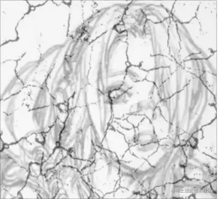
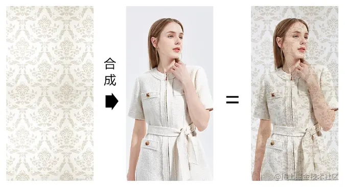
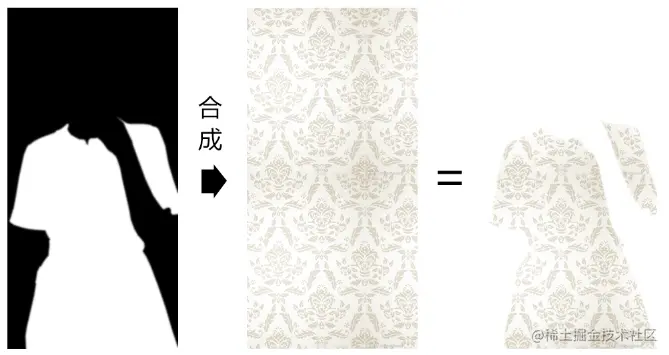
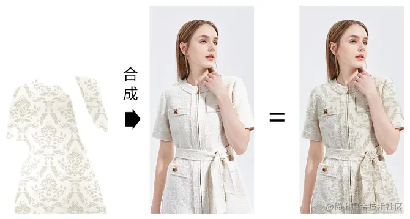
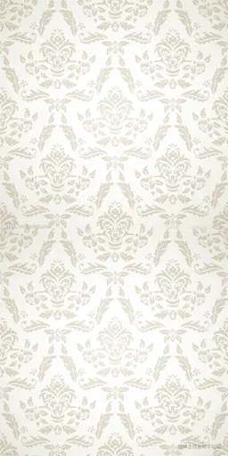
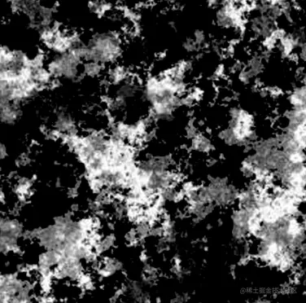

# WebGL 纹理合成

---
源码：[github.com/buglas/webg…](https://link.juejin.cn/?target=https%3A%2F%2Fgithub.com%2Fbuglas%2Fwebgl-lesson "https://github.com/buglas/webgl-lesson")



纹理合成就是按照某种规则将多张图片合在一起。

比如这样：



或者这样：



亦或者，这样：



这就像在photoshop 里批图一样，接下来咱们就在webgl 里批一下。

### 4-1-多图加载

纹理合成是需要多张图像源的，因此我们需要多张图像源都加载成功后，再去合成纹理。

我接下来就要使用Promise.all() 来实现这个逻辑。

1.将图像的加载方法封装进一个Promise 中，等图像加载成功后，再resolve。

```
function imgPromise(img){
  return new Promise((resolve)=>{
    img.onload=function(){
        resolve(img);
    }
  });
}
```

2.建立多个Image 对象

```
const originImg = new Image()
originImg.src = './https://p3-juejin.byteimg.com/tos-cn-i-k3u1fbpfcp/b9460d7219f44f01adc7a21872af1cbb~tplv-k3u1fbpfcp-zoom-1.image'

const pattern = new Image()
pattern.src = './https://p3-juejin.byteimg.com/tos-cn-i-k3u1fbpfcp/0bc02f918adf499592dc55d748e56ab8~tplv-k3u1fbpfcp-zoom-1.image'
```

3.利用Promise.all 监听所有图片的记载成功

```
Promise.all([
    imgPromise(originImg),
    imgPromise(pattern),
]).then(() => {
    rect.maps = {
        u_Sampler: { image: originImg },
        u_Pattern: { image: pattern },
    }
    rect.updateMaps()
    render()
})
```

等所有的图片都加载成功后，我们会往rect的maps 集合里写入贴图，然后对其更新和渲染。

接下来，我看一下纹理合成最核心的地方，片元着色器。

### 4-2-在片元着色器中合成纹理

片元着色器：

```
<script id="fragmentShader" type="x-shader/x-fragment">
    precision mediump float;
    uniform sampler2D u_Sampler;
    uniform sampler2D u_Pattern;
    varying vec2 v_Pin;
    void main(){
      vec4 o=texture2D(u_Sampler,v_Pin);
      vec4 p=texture2D(u_Pattern,v_Pin);
      gl_FragColor=p*o;
    }
</script>
```

-   u\_Sampler 是原始图片采样器，对应下图：


-   u\_Pattern 是纹理图案采样器，对应下图：



之后，我通过采样器找到原始图片和纹理图案的片元后，便可以对其进行运算；

```
vec4 o=texture2D(u_Sampler,v_Pin);
vec4 p=texture2D(u_Pattern,v_Pin);
gl_FragColor=p*o;
```

上面的p\*o便是在对片元做分量相乘的运算，这种算法会让原始图片的亮度变暗，有点类似于ps里的正片叠底。


举个例子说一下片元相乘的逻辑。

已知：

-   原始图像片元 o(ox,oy,oz,ow)
-   纹理图案片元 p(px,py,pz,pw)

求：p\*o

解：

```
p*o=(px*ox,py*oy,pz*oz,pw*ow)
```

通过此例可知：因为片元分量的值域为\[0,1\]，所以p\*o 的亮度小于等于p和o

-   当p=(1,1,1,1) 时，p\*o=o

```
p*o=(1*ox,1*oy,1*oz,1*ow)
p*o=(ox,oy,oz,ow)
```

-   当p=(0,0,0,0) 时，p\*o=(0,0,0,0)

关于片元相乘的方法我就说到这，接下来咱们再看几个常见的纹理合成方法。

### 4-3-纹理混合

纹理混合就是按照一定比例，将第一张图像合到另一张图像上，这类似于ps 里的透明度合成。

我们直接看一下纹理在片元着色里的合成方法。

```
<script id="fragmentShader" type="x-shader/x-fragment">
    precision mediump float;
    uniform sampler2D u_Sampler;
    uniform sampler2D u_Pattern;
    varying vec2 v_Pin;
    void main(){
      vec4 o=texture2D(u_Sampler,v_Pin);
      vec4 p=texture2D(u_Pattern,v_Pin);
      gl_FragColor=mix(o,p,1.0);
    }
</script>
```

上面的mix() 方法便是按照比例对两个纹理的合成方法。

mix() 方法的返回数据类型会因其合成对象的不同而不同。

其规则如下：

```
mix(m,n,a)=m+(n-m)*a
```

举个例子：

已知：

-   m=3
-   n=5
-   a=0.5

求：mix(m,n,a)

解：

```
mix(m,n,a)=3+(5-3)*0.5
mix(m,n,a)=3+2*0.5
mix(m,n,a)=4
```

再举个例子：

已知：

-   m=(1,2,3)
-   n=(3,4,5)
-   a=0.5

求：mix(m,n,a)

解：

```
mix(m,n,a)=(1+(3-1)*0.5,2+(4-2)*0.5,3+(5-3)*0.5)
mix(m,n,a)=(2,3,4)
```

简单总结一下mix(m,n,a) 方法的特性：

-   当a=0时，mix(m,n,a)=m
-   当a=1时，mix(m,n,a)=n

参考地址：[www.khronos.org/registry/Op…](https://link.juejin.cn/?target=https%3A%2F%2Fwww.khronos.org%2Fregistry%2FOpenGL-Refpages%2Fgl4%2F "https://www.khronos.org/registry/OpenGL-Refpages/gl4/")

利用纹理混合，我们可以实现转场动画。

### 4-4-转场动画

转场动画就是场景的淡入、淡出。

我们可以将一个纹理理解为一个场景，利用转场动画实现淡入、淡出效果。

1.在片元着色器中，将mix()方法中的比值设置为uniform 变量。

```
<script id="fragmentShader" type="x-shader/x-fragment">
    precision mediump float;
    uniform sampler2D u_Sampler;
    uniform sampler2D u_Pattern;
    uniform float u_Ratio;
    varying vec2 v_Pin;
    void main(){
      vec4 o=texture2D(u_Sampler,v_Pin);
      vec4 p=texture2D(u_Pattern,v_Pin);
      gl_FragColor=mix(o,p,u_Ratio);
    }
</script>
```

2.声明基础数据

```
let n = 0
let len = 5
const obj = { ratio: 0 }
let track = null
```

-   n 当前显示的图片
-   len 图片数量
-   obj 混合比例的存储对象
-   track 时间轨，我们在讲星空的时候讲过

3.建立矩形面

```
const rect = new Poly({
    gl,
    source,
    type: 'TRIANGLE_STRIP',
    uniforms: {
        u_Ratio: {
            type: 'uniform1f',
            value: obj.ratio
        }
    },
    attributes: {
        a_Position: {
            size: 2,
            index: 0
        },
        a_Pin: {
            size: 2,
            index: 2
        },
    }
})
```

4.加载图片

```
loadImg()

function loadImg() {
    n++;
    const i1 = n % len
    const i2 = (n + 1) % len

    const originImg = new Image()
    originImg.src = `./images/pattern${i1}.jpg`

    const pattern = new Image()
    pattern.src = `./images/pattern${i2}.jpg`

    Promise.all([
        imgPromise(originImg),
        imgPromise(pattern),
    ]).then(() => {
        changeImg(originImg, pattern)
        ani()
    })
}
```

5.当图片加载完成后，会先更新图片，并连续渲染。

```
function changeImg(...imgs) {
    obj.ratio = 0
    rect.maps = {
        u_Sampler: { image: imgs[0] },
        u_Pattern: { image: imgs[1] },
    }
    rect.updateMaps()
    track = new Track(obj);
    track.start = new Date();
    track.timeLen = 1500;
    track.onEnd = loadImg
    track.keyMap = new Map([
        [
            "ratio",
            [
                [0, 0],
                [700, 1]
            ],
        ],
    ]);
}
```

6.changeImg() 方法所做的事情如下：

-   将ratio 归0

```
obj.ratio = 0
```

-   重置矩形面的贴图集合

```
rect.maps = {
    u_Sampler: { image: imgs[0] },
    u_Pattern: { image: imgs[1] },
}
rect.updateMaps()
```

-   建立轨道对象

```
track = new Track(obj);
track.start = new Date();
track.timeLen = 1500;
track.onEnd = loadImg
track.keyMap = new Map([
    [
        "ratio",
        [
            [0, 0],
            [700, 1]
        ],
    ],
]);
```

轨道对象的时长timeLen 是1500，到时间结束后，会再去loadImg 加载新的图像。

轨道对象会在700毫秒内完成淡入效果。

7.ani() 是连续渲染的方法

```
function ani() {
    track.update(new Date())
    rect.uniforms.u_Ratio.value = obj.ratio;
    rect.updateUniform()
    render()
    requestAnimationFrame(ani)
}
```

我们当前的转场还只是通过单一的比值统一转场。

其实，我们还可以使用蒙版进行花样转场。

### 4-5-使用蒙版实现花样转场

蒙版是一种为图像的提供合成数据辅助图像。

蒙版通常是黑白的，若是彩色，还需要将其转灰。

蒙版中的片元数据是一种插值，并不是一种具备特定功能的数据。

比如，我们可以将蒙版中的片元数据做为两张图像的亮度合成插值、饱和度合成插值、透明度合成插值等等。

大家通常会将蒙版和遮罩混为一谈，其实那也无可厚非，蒙版和遮罩的底层原理都是一样的。

只是，遮罩一般会被当成透明度合成的数据，它遵守黑透白不透的规律。


接下来，我就通过蒙版来实现纹理的花样转场。

1.再建立一个蒙版图像，用作图案淡入的辅助数据

```
loadImg()

function loadImg() {
    n++;
    const i1 = n % len
    const i2 = (n + 1) % len
    const i3 = Math.round(Math.random() * 4)

    const originImg = new Image()
    originImg.src = `./images/pattern${i1}.jpg`

    const pattern = new Image()
    pattern.src = `./images/pattern${i2}.jpg`

    const gradient = new Image()
    gradient.src = `./images/mask${i3}.jpg`

    Promise.all([
        imgPromise(originImg),
        imgPromise(pattern),
    ]).then(() => {
        changeImg(originImg, pattern, gradient)
        ani()
    })
}
function changeImg(...imgs) {
    obj.ratio = 0
    rect.maps = {
        u_Sampler: { image: imgs[0] },
        u_Pattern: { image: imgs[1] },
        u_Gradient: { image: imgs[2] },
    }
    rect.updateMaps()
    track = new Track(obj);
    track.start = new Date();
    track.timeLen = 2000;
    track.onEnd = loadImg
    track.keyMap = new Map([
        [
            "ratio",
            [
                [0, 0],
                [1000, 1]
            ],
        ],
    ]);
}
```

gradient 便是蒙版图像，效果如下：



之后图像在显示的时候，白色区域会先显示，黑色区域会根据合成比值渐渐显示。

2.在片元着色器里，使用蒙版合成图像。

```
<script id="fragmentShader" type="x-shader/x-fragment">
    precision mediump float;
    uniform sampler2D u_Sampler;
    uniform sampler2D u_Pattern;
    uniform sampler2D u_Gradient;
    uniform float u_Ratio;
    varying vec2 v_Pin;
    void main(){
      vec4 o=texture2D(u_Sampler,v_Pin);
      vec4 p=texture2D(u_Pattern,v_Pin);
      vec4 g=texture2D(u_Gradient,v_Pin);
      float f=clamp((g.r + u_Ratio), 0.0, 1.0);
      gl_FragColor=mix(o,p,f);
    }
</script>
```

我们重点看上面的浮点数 f。

g.r + u\_Ratio 是让蒙版的亮度加上混合比值。

在灰度图像里，片元的r,g,b 数据都可以表示亮度。

clamp(n,min,max) 方法是用于限定数据极值的：

-   当n 小于min的时候返回min
-   当n 大于max的时候返回max
-   否则，返回n

clamp(-1,0,1) =0

clamp(2,0,1) =1

clamp(0.5,0,1) =0.5

关于蒙版的基本原理我就说到这，我们利用这个原理还可以做一个换装达人。
