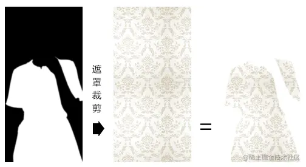
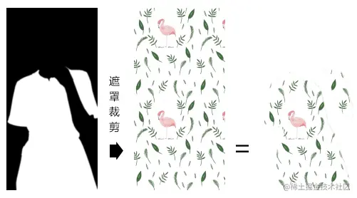
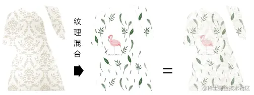
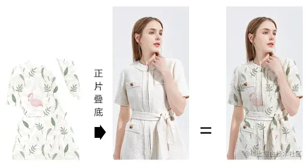
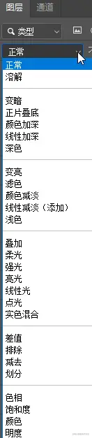
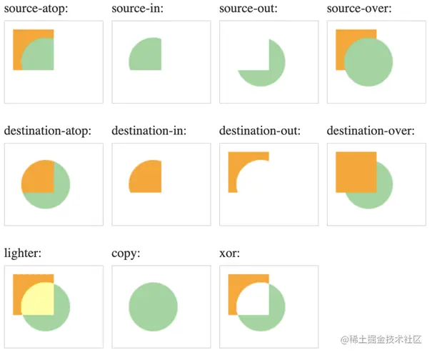

# WebGL 换装达人

---
源码：[github.com/buglas/webg…](https://link.juejin.cn/?target=https%3A%2F%2Fgithub.com%2Fbuglas%2Fwebgl-lesson "https://github.com/buglas/webgl-lesson")


我们先说一下换装达人的实现原理。

1.用一张黑白遮罩图对两个纹理图案进行裁剪，裁出裙子的区域。





2.对裙子区域的图案进行纹理混合



3.将纹理混合后的图案与原始图像进行正片叠底



接下来咱们再看一下代码实现。

1.建立矩形面

```
const rect = new Poly({
    gl,
    source,
    type: 'TRIANGLE_STRIP',
    uniforms: {
        u_Ratio: {
            type: 'uniform1f',
            value: obj.ratio
        }
    },
    attributes: {
        a_Position: {
            size: 2,
            index: 0
        },
        a_Pin: {
            size: 2,
            index: 2
        },
    }
})
```

2.建立原始图像和遮罩图像，在它们载成功后，将其写入到矩形面的贴图集合中，并再加载两个纹理图像。

```
const originImg = new Image()
originImg.src = `./https://blog-st.oss-cn-beijing.aliyuncs.com/16276521220864486294203747374.jpg`

const mask = new Image()
mask.src = './images/mask-dress.jpg'

Promise.all([
    imgPromise(originImg),
    imgPromise(mask),
]).then(() => {
    rect.maps = {
        u_Sampler: { image: originImg },
        u_Mask: { image: mask },
    }
    loadImg()
})
```

3.加载纹理图案

```
function loadImg() {
    n++;
    const i1 = n % len
    const i2 = (n + 1) % len

    const pattern1 = new Image()
    pattern1.src = `./images/pattern${i1}.jpg`

    const pattern2 = new Image()
    pattern2.src = `./images/pattern${i2}.jpg`

    Promise.all([
        imgPromise(pattern1),
        imgPromise(pattern2),
    ]).then(() => {
        changeImg(pattern1, pattern2)
        ani()
    })
}
```

4.将纹理图案写入到矩形面的贴图集合中，并建立轨道对象。

```
function changeImg(...imgs) {
      obj.ratio = 0
      rect.maps.u_Pattern1 = { image: imgs[0] }
      rect.maps.u_Pattern2 = { image: imgs[1] }
      rect.updateMaps()
      track = new Track(obj);
      track.start = new Date();
      track.timeLen = 1500;
      track.onEnd = loadImg
      track.keyMap = new Map([
        [
          "ratio",
          [
            [0, 0],
            [700, 1]
          ],
        ],
      ]);
}
```

5.连续渲染

```
/* 动画 */
function ani() {
    track.update(new Date())
    rect.uniforms.u_Ratio.value = obj.ratio;
    rect.updateUniform()
    render()
    requestAnimationFrame(ani)
}
```

6.在片元着色器里进行纹理合成，

```
<script id="fragmentShader" type="x-shader/x-fragment">
    precision mediump float;
    uniform sampler2D u_Sampler;
    uniform sampler2D u_Pattern1;
    uniform sampler2D u_Pattern2;
    uniform sampler2D u_Mask;
    uniform float u_Ratio;
    varying vec2 v_Pin;
    void main(){
      vec4 o=texture2D(u_Sampler,v_Pin);
      vec4 p1=texture2D(u_Pattern1,v_Pin);
      vec4 p2=texture2D(u_Pattern2,v_Pin);
      vec4 m=texture2D(u_Mask,v_Pin);
      vec4 p3=vec4(1,1,1,1);
      if(m.x>0.5){
        p3=mix(p1,p2,u_Ratio);
      }
      gl_FragColor=p3*o;
    }
</script>
```

-   o 原始图像
-   p1 第1张纹理图案
-   p2 第二张纹理图案
-   m 蒙版图像

我通过m.x 来判断蒙版的黑白区域，m.y、m.z，或者m.r、m.g、m.b也可以。

p3片元默认为白色vec4(1,1,1,1)。

当m.x>0.5 时，p3为p1,p2的混合片元；

最终的gl\_FragColor颜色便是p3和原始片元o的正片叠底。

关于纹理合成的应用，我暂时就说到这。

纹理合成的方式还有很多很多，大家可以参考一下Photoshop里的图像合成：



还有canvas的[`globalCompositeOperation`](https://link.juejin.cn/?target=https%3A%2F%2Fdeveloper.mozilla.org%2Fzh-CN%2Fdocs%2FWeb%2FAPI%2FCanvas_API%2FTutorial%2FCompositing%23globalcompositeoperation "https://developer.mozilla.org/zh-CN/docs/Web/API/Canvas_API/Tutorial/Compositing#globalcompositeoperation")属性：


