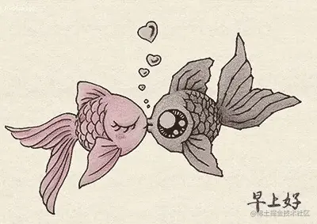

# WebGL 视频贴图

---
源码：[github.com/buglas/webg…](https://link.juejin.cn/?target=https%3A%2F%2Fgithub.com%2Fbuglas%2Fwebgl-lesson "https://github.com/buglas/webgl-lesson")



我们之前使用texImage2D 方法将Image 图像源装进了纹理对象里：

```
gl.texImage2D(
    gl.TEXTURE_2D,
    0,
    gl.RGB,
    gl.RGB,
    gl.UNSIGNED_BYTE,
    image
)
```

我们也可以把上面的image 换成video 对象。

1.正常建立纹理对象，并设置其相关属性。

```
gl.activeTexture(gl.TEXTURE0)
const texture = gl.createTexture()
gl.bindTexture(gl.TEXTURE_2D, texture)
gl.texParameteri(
    gl.TEXTURE_2D,
    gl.TEXTURE_MIN_FILTER,
    gl.LINEAR
)
gl.texParameteri(
    gl.TEXTURE_2D,
    gl.TEXTURE_WRAP_S,
    gl.CLAMP_TO_EDGE
)
gl.texParameteri(
    gl.TEXTURE_2D,
    gl.TEXTURE_WRAP_T,
    gl.CLAMP_TO_EDGE
)
```

2.获取采样器对应的uniform 变量，并将纹理单元号赋给它。

```
const u_Sampler = gl.getUniformLocation(gl.program, 'u_Sampler')
gl.uniform1i(u_Sampler, 0)
```

3.建立video 对象，并播放

```
const video = document.createElement('video');
video.src = 'http://img.yxyy.name/ripples.mp4';
video.autoplay = true;
video.muted = true;
video.loop = true;
video.setAttribute("crossOrigin", 'Anonymous');
video.play()
video.addEventListener('playing', () => {
    ani()
})
```

4.在video 对象播放时，向纹理对象连续写入video

```
function render() {
    gl.texImage2D(
        gl.TEXTURE_2D,
        0,
        gl.RGB,
        gl.RGB,
        gl.UNSIGNED_BYTE,
        video
    )
    gl.clear(gl.COLOR_BUFFER_BIT);
    gl.drawArrays(gl.TRIANGLE_STRIP, 0, sourceSize);
    requestAnimationFrame(render)
}
```
