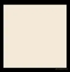
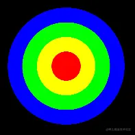
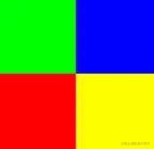

# WebGL 打印着色器数据

---
源码：[github.com/buglas/webg…](https://link.juejin.cn/?target=https%3A%2F%2Fgithub.com%2Fbuglas%2Fwebgl-lesson "https://github.com/buglas/webgl-lesson")

我在说GLSL ES 语法之前，得先给大家说几个测试GLSL ES 语法的方法，不然大家可能会听得心里没底。

### 1-GLSL ES数据的输出

我现在片元着色器里写了一个4维向量的加法运算，我想把它打印出来看看v 的结果是不是如我想的那样。

```
<script id="fragmentShader" type="x-shader/x-fragment">
    precision mediump float;
    vec4 v=vec4(1,2,3,4)+vec4(5,6,7,8);
    void main(){
      ……
    }
</script>
```

很多同学可能本能的想这么写：

```
<script id="fragmentShader" type="x-shader/x-fragment">
    precision mediump float;
    vec4 v=vec4(1,2,3,4)+vec4(5,6,7,8);
    console.log(v);
    void main(){
      ……
    }
</script>
[6, 8, 10, 12]
```

可惜console 只能写在js 中，GLSL ES 语言不认识它。

对于这种问题的解决，我尚没有找到太过官方和权威的资料，所以就自己写了一个，在此只做参考和语法测试，若大家以后有了更牛皮的解决方案，一定要分享一下哦。

我的实现思路是先把GLSL ES 数据画到画布中，然后再从画布的像素数据中解析出GLSL ES 数据。

```
<script id="fragmentShader" type="x-shader/x-fragment">
    precision mediump float;
    vec4 v=vec4(1,2,3,4)+vec4(5,6,7,8);
    void main(){
      gl_FragColor=v/255.0;
    }
</script>
```

因为gl\_FragColor 中1个单位的分量就相当于canvas画布中255的分量值，所以我让上面的向量v直接除以255。

注：此方法只适用于向量因子在0-255的数据。我们在此先不考虑太深，先把语法跑通。

我们可以先在画布中画一个点：

```
<script id="vertexShader" type="x-shader/x-vertex">
    attribute vec4 a_Position;
    void main(){
      gl_Position=a_Position;
      gl_PointSize=512.0;
    }
</script>
<script id="fragmentShader" type="x-shader/x-fragment">
    precision mediump float;
    vec4 v=vec4(1,2,3,4)+vec4(5,6,7,8);
    void main(){
      gl_FragColor=v/255.0;
    }
</script>
```

效果如下：



接下来我们就可以获取canvas 画布中的像素数据了。

### 2-在canvas 画布中获取像素数据

在此先给会canvas 2d 的同学提一下，在我们通过canvas.getContext() 方法获取2d或webgl 上下文对象的同时，也决定了canvas画布的命运。

canvas.getContext(‘2d’) 方法会让canvas画布变成2d画布，2d的canvas画布可以通过ctx.getImageData() 方法获取画布中的像素；

canvas.getContext(‘webgl’) 方法会让canvas画布变成webgl画布，webgl画布需要通过ctx.readPixels() 方法获取画布中的像素。

1.建立一个8位无符号型数组，用于存储一个像素的数据。

```
const pixel = new Uint8Array(4);
```

2.从画布中采集一个像素出来。

```
gl.readPixels(
    canvas.width / 2,
    canvas.height / 2,
    1,
    1,
    gl.RGBA,
    gl.UNSIGNED_BYTE,
    pixel
);
```

gl.readPixels(x, y, width, height, format, type, pixels)

-   x, y：从哪里采集像素
    
-   width, height：采集多大一块区域的像素
    
-   format：数据格式
    
-   type：数据类型
    
    -   gl.UNSIGNED\_BYTE
    -   gl.UNSIGNED\_SHORT\_5\_6\_5
    -   gl.UNSIGNED\_SHORT\_4\_4\_4\_4
    -   gl.UNSIGNED\_SHORT\_5\_5\_5\_1
    -   gl.FLOAT
-   pixels：装像素的容器
    
    -   Uint8Array 对应 gl.UNSIGNED\_BYTE
    -   Uint16Array 对应 gl.UNSIGNED\_SHORT\_5\_6\_5, gl.UNSIGNED\_SHORT\_4\_4\_4\_4, 或者 gl.UNSIGNED\_SHORT\_5\_5\_5\_1
    -   Float32Array 对应 gl.FLOAT

3.打印pixel

```
console.log(pixel); //Uint8Array(4) [6, 8, 10, 12]
```

利用同样的原理，我们还可以打印多个向量。

### 3-打印多个向量

1.用不同的向量数据画圆环。

```
<!-- 顶点着色器 -->
<script id="vertexShader" type="x-shader/x-vertex">
    attribute vec4 a_Position;
    void main(){
        gl_Position=a_Position;
        gl_PointSize=512.0;
    }
</script>
<!-- 片元着色器 -->
<script id="fragmentShader" type="x-shader/x-fragment">
    precision mediump float;
    mat4 m=mat4(
      255,0,0,255,
      255,255,0,255,
      0,255,0,255,
      0,0,255,255
    );
    void main(){
      float dist=distance(gl_PointCoord,vec2(0.5,0.5));
      if(dist>=0.0&&dist<0.125){
        gl_FragColor=m[0]/255.0;
      }else if(dist>=0.125&&dist<0.25){
        gl_FragColor=m[1]/255.0;
      }else if(dist>=0.25&&dist<0.375){
        gl_FragColor=m[2]/255.0;
      }else if(dist>=0.325&&dist<0.5){
        gl_FragColor=m[3]/255.0;
      }else{
        discard;
      }
    }
</script>
```

效果如下：



2.按照比例关系从四个圆环中取色

```
const vw = 512 / 8;
for (let i = 0; i < 4; i++) {
    logPixel(vw * i + vw / 2)
}

function logPixel(offset = 0) {
    //建立像素集合
    let pixel = new Uint8Array(4);
    //从缓冲区读取像素数据，然后将其装到事先建立好的像素集合里
    gl.readPixels(
        canvas.width / 2 + offset,
        canvas.height / 2,
        1,
        1,
        gl.RGBA,
        gl.UNSIGNED_BYTE,
        pixel
    );
    console.log(pixel);
}
```

数据打印如下：

```
Uint8Array(4) [255, 0, 0, 255]
Uint8Array(4) [255, 255, 0, 255]
Uint8Array(4) [0, 255, 0, 255]
Uint8Array(4) [0, 0, 255, 255]
```

注：

我上面这种方式，在特定的一些高分辨率设备上，会出现兼容性问题，画出来的圆会比较小，取样会失败。

所以，若有同学打印出的多个向量和我上面的结果不符，可以使用我下面提供的方式。

当然，打印多个向量的方式并不唯一，大家若感兴趣也可以自己写一个出来。

### 4-打印多个向量-适配不同分辨率的设备

我接下来会基于片元位置和画布的宽高比绘图，然后再基于这样的比例取样。

1.绘制一个充满画布的矩形面

-   js

```
const source = new Float32Array([
    -1, 1,
    -1, -1,
    1, 1,
    1, -1
]);

const rect = new Poly({
    gl,
    source,
    type: 'TRIANGLE_STRIP',
    attributes: {
        a_Position: {
            size: 2,
            index: 0
        }
    },
    uniforms: {
        u_CanvasSize: {
            type: 'uniform2fv',
            value: [canvas.width, canvas.height]
        }
    }
})

gl.clear(gl.COLOR_BUFFER_BIT);
rect.draw()
```

-   着色器，在片元着色器中基于片元在画布中的比例位置绘制棋盘格。

```
<!-- 顶点着色器 -->
<script id="vertexShader" type="x-shader/x-vertex">
    attribute vec4 a_Position;
    void main(){
      gl_Position=a_Position;
    }
</script>
<!-- 片元着色器 -->
<script id="fragmentShader" type="x-shader/x-fragment">
    precision mediump float;
    uniform vec2 u_CanvasSize;
    float halfW=u_CanvasSize.x/2.0;
    float halfH=u_CanvasSize.y/2.0;
    void main(){
      mat4 m=mat4(
        255,0,0,255,
        255,255,0,255,
        0,255,0,255,
        0,0,255,255
      );
      bool xb= gl_FragCoord.x<halfW;
      bool yb= gl_FragCoord.y<halfH;
      if(yb){
        if(xb){
          gl_FragColor=m[0]/255.0;
        }else{
          gl_FragColor=m[1]/255.0;
        }
      }else{
        if(xb){
          gl_FragColor=m[2]/255.0;
        }else{
          gl_FragColor=m[3]/255.0;
        }
      }
    }
</script>
```

效果如下：



2.用js取上面四个格子的中点

```
const [w, h] = [2, 2]
for (let y = 0; y < 2; y++) {
    for (let x = 0; x < 2; x++) {
        const px = canvas.width * (x + 0.5) / w
        const py = canvas.height * (y + 0.5) / h
        logPixel(px, py)
    }
}
function logPixel(x, y) {
    const pixel = new Uint8Array(4)
    gl.readPixels(
        x, y,
        1, 1,
        gl.RGBA,
        gl.UNSIGNED_BYTE,
        pixel
    )
    console.log(pixel)
}
```

数据打印如下：

```
Uint8Array(4) [255, 0, 0, 255]
Uint8Array(4) [255, 255, 0, 255]
Uint8Array(4) [0, 255, 0, 255]
Uint8Array(4) [0, 0, 255, 255]
```
