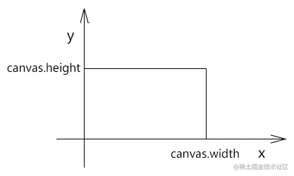
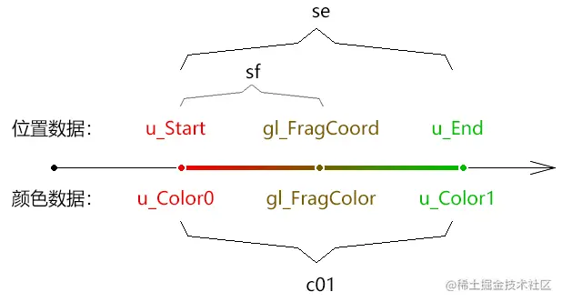
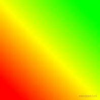

# WebGL 线性渐变

---
源码：[github.com/buglas/webg…](https://link.juejin.cn/?target=https%3A%2F%2Fgithub.com%2Fbuglas%2Fwebgl-lesson "https://github.com/buglas/webgl-lesson")

### 1-渐变的画布

接下来我们画一个渐变的画布，其步骤如下：

1.绘制充满canvas的矩形，并向片元着色传递canvas画布的尺寸。

```
const source = new Float32Array([
    -1, 1,
    -1, -1,
    1, 1,
    1, -1
]);

const rect = new Poly({
    gl,
    source,
    type: 'TRIANGLE_STRIP',
    attributes: {
        a_Position: {
            size: 2,
            index: 0
        }
    },
    uniforms: {
        u_CanvasSize: {
            type: 'uniform2fv',
            value: [canvas.width, canvas.height]
        }
    }
})

gl.clear(gl.COLOR_BUFFER_BIT);
rect.draw()
```

上面的Poly 对象咱们之前在纹理部分已经说过。

a\_Position 是attribute类型的顶点位置。

u\_CanvasSize 是uniform类型的画布尺寸。

2.顶点着色器

```
<script id="vertexShader" type="x-shader/x-vertex">
    attribute vec4 a_Position;
    void main(){
        gl_Position=a_Position;
    }
</script>
```

3.片元着色器

```
<script id="fragmentShader" type="x-shader/x-fragment">
    precision mediump float;
    uniform vec2 u_CanvasSize;
    void main(){
      gl_FragColor=vec4(
        gl_FragCoord.x/u_CanvasSize.x,
        gl_FragCoord.y/u_CanvasSize.y,
        0.8,
        1
      );
    }
</script>
```

上面的gl\_FragCoord是当前片元在canvas 画布中的像素位，其坐标系和canvas画布的坐标系类似，其坐标基底的两个分量都是一个像素的宽和高。

只不过FragCoord 坐标原点在左下角，y轴朝上，效果如下：



### 2-线性渐变对象

玩过canvas 2d 渐变的同学应该知道，我们在绘制线性渐变图形的时候，需要先建立一个线性渐变对象。

线性渐变对象具备一个起点、一个终点，用于限定渐变范围。

线性渐变对象中具备多个渐变节点，每个渐变节点都有以下属性：

-   节点颜色
-   节点位置 ，\[0,1\] 之间

我们这里简化一下，就给起点和终点位置设置两个颜色节点。

1.建立矩形对象

```
const rect = new Poly({
    gl,
    source,
    type: 'TRIANGLE_STRIP',
    attributes: {
        a_Position: {
            size: 2,
            index: 0
        }
    },
    uniforms: {
        u_Start: {
            type: 'uniform2fv',
            value: [canvas.width * 0.25, canvas.height * 0.75]
        },
        u_End: {
            type: 'uniform2fv',
            value: [canvas.width * 0.75, canvas.height * 0.25]
        },
        u_Color0: {
            type: 'uniform4fv',
            value: [1, 0, 0, 1]
        },
        u_Color1: {
            type: 'uniform4fv',
            value: [1, 1, 0, 1]
        },
    }
})
```

uniforms中变量的意思：

-   u\_Start 起始点
-   u\_End 终点
-   u\_Color0 对应起点的颜色
-   u\_Color1 对应终点的颜色

2.片元着色器

```
precision mediump float;

uniform vec4 u_Color0;
uniform vec4 u_Color1;
vec4 c01=u_Color1-u_Color0;

uniform vec2 u_Start;
uniform vec2 u_End;
vec2 se=u_End-u_Start;
float seLen=length(se);
vec2 normal=normalize(se);

void main(){
    vec2 sf=vec2(gl_FragCoord)-u_Start;
    float fsLen=clamp(dot(sf,normal),0.0,seLen);
    float ratio=fsLen/seLen;
    gl_FragColor=u_Color0+c01*ratio;
}
```

效果如下：


上面变量的示意如下：



其原理就是获取当前片元在起点u\_Start和终点u\_End间的距离比ratio，然后将此距离比作为颜色比，获取其在起始颜色u\_Color0和结束颜色u\_Color1间的颜色值。

### 3-多节点线性渐变

我们上面说了，线性渐变对象中具备多个渐变节点，每个渐变节点都有以下属性：

-   节点颜色
-   节点位置 ，\[0,1\] 之间

接下来咱们就来架构一下这个逻辑。

我们先把节点数据在片元着色器里写死，后面再考虑用js 传递数据。

1.声明渐变的基础数据。

```
//起始位
vec2 u_Start=vec2(100,100);
//结束位
vec2 u_End=vec2(700,700);
//节点颜色集合
vec4 colors[3];
//节点位置集合
float ratios[3];
```

2.基于渐变起点和结束点计算向量、向量长度和单位向量。

```
//终点减起点向量
vec2 se=u_End-u_Start;
//长度
float seLen=length(se);
//单位向量
vec2 se1=normalize(se);
```

3.在main函数体中填充颜色集合和节点位置集合，然后获取片元颜色。

```
void main(){
    colors[0]=vec4(1,0,0,1);
    colors[1]=vec4(1,1,0,1);
    colors[2]=vec4(0,1,0,1);
    ratios[0]=0.0;
    ratios[1]=0.5;
    ratios[2]=1.0;
    gl_FragColor=getColor(colors,ratios);
}
```

4.建立基于节点颜色集合和节点位置集合获取颜色的方法。

```
//获取片元颜色
vec4 getColor(vec4 colors[3],float ratios[3]){
    //片元颜色
    vec4 color=vec4(1);
    //当前片元减起始片元的向量
    vec2 sf=vec2(gl_FragCoord)-u_Start;
    //当前片元在se上的投影长度
    float fsLen=clamp(dot(sf,se1),0.0,seLen);
    //长度比
    float ratio=clamp(fsLen/seLen,ratios[0],ratios[3-1]);
    //第一个比值
    float ratio1=ratios[0];
    //第一个颜色
    vec4 color1=colors[0];
    //遍历节点，按比值取色
    for(int i=1;i<3;i++){
        //第二个比值
        float ratio2=ratios[i];
        //第二个颜色
        vec4 color2=colors[i];
        if(ratio>=ratio1&&ratio<=ratio2){
            //一段颜色的差值
            vec4 color2_1=color2-color1;
            //当前比值在一段比值中的比值
            float ratioInRatio=(ratio-ratio1)/(ratio2-ratio1);
            //当前比值在当前颜色段中所对应的颜色
            color=color1+color2_1*ratioInRatio;
            break;
        }
        ratio1=ratio2;
        color1=color2;
    }
    return color;
}
```

效果如下：



接下咱们说一下如何用js向片元着色器传递渐变数据。

### 4-用js向片元着色器传递渐变数据

js只能向着色器传递有限类型的数据，它无法传递任意长度的数组、字符串、json对象等。

比如无法传递任意长度的数组、字符串、json对象等。

所以我就把渐变节点装进了一个四维矩阵中，从而拼8个渐变节点出来，这对于一般的渐变操作是够的。

渐变结构如下：

```
[    123000120, 255000,    255000000, 255077,    255255000, 255128,    255000, 255178,    200, 255255,    -1, -1,    -1, -1,    -1, -1]
[    123000120, 255000, 255000000, 255077,    255255000, 255128, 255000, 255178,    200, 255255,       -1, -1,    -1, -1,            -1, -1]
```

-   每两个数字构成一个渐变节点
    
    如：123000120, 255000
    
-   第一列对应颜色节点的rgb数据
    
    如：123000120 对应的rgb数据分别是123,0,120
    
-   第二列对应颜色节点的a数据和位置数据
    
    如：255000 对应的a值是255，节点位置为0
    

接下来咱们看一下代码实现。

1.在矩形面中写入节点数据 u\_ColorStops

```
const rect = new Poly({
    gl,
    source,
    type: 'TRIANGLE_STRIP',
    attributes: {
        a_Position: {
            size: 2,
            index: 0
        }
    },
    uniforms: {
        u_Start: {
            type: 'uniform2fv',
            value: [0, 0]
        },
        u_End: {
            type: 'uniform2fv',
            value: [canvas.width, canvas.height]
        },
        u_ColorStops: {
            type: 'uniformMatrix4fv',
            value: [
                123000120, 255000,
                255000000, 255077,
                255255000, 255128,
                255000, 255178,
                200, 255255,
                -1, -1,
                -1, -1,
                -1, -1
            ]
        }
    }
})
```

2.在片元着色器中写入相应的uniform变量

```
//起始位
uniform vec2 u_Start;
//结束位
uniform vec2 u_End;
//四阶矩阵
uniform mat4 u_ColorStops;
//终点减起点向量
vec2 se=u_End-u_Start;
//长度
float seLen=length(se);
//单位向量
vec2 se1=normalize(se);
```

3.在main函数内，声明节点的颜色集合和位置集合。

通过setColorStops()方法将u\_ColorStops 中的数据解析入节点颜色集合和位置集合。

通过getColor()方法获取片元颜色。

```
void main(){
    //节点颜色集合
    vec4 colors[8];
    //节点位置集合
    float ratios[8];
    //基于四维矩阵解析节点集合
    setColorStops(colors,ratios);
    //片元颜色
    gl_FragColor=getColor(colors,ratios);
}
```

-   setColorStops() 将u\_ColorStops 中的数据解析入节点颜色集合和位置集合。

```
void setColorStops(out vec4 colors[8],out float ratios[8]){
    //节点颜色数据
    vec4 colorSource=vec4(1);
    //节点位置数据
    float ratioSource=1.0;
    //遍历四维矩阵的
    for (int y=0;y<4;y++){
        for (int x=0;x<2;x++){
            int rgb=int(u_ColorStops[y][x*2]);
            int ar=int(u_ColorStops[y][x*2+1]);
            if(rgb>0){
                setColorStop(rgb,ar,colorSource,ratioSource);
            }
            colors[y*2+x]=colorSource;
            ratios[y*2+x]=ratioSource;
        }
    }
}
```

-   setColorStop() 解析节点数据

```
void setColorStop(int rgb,int ar,out vec4 color,out float ratio){
    int rc=rgb/1000000;
    int gc=(rgb-rc*1000000)/1000;
    int bc=rgb-int(rgb/1000)*1000;
    int ac=ar/1000;
    int ratioI=ar-ac*1000;
    color=vec4(float(rc),float(gc),float(bc),float(ac))/255.0;
    ratio=float(ratioI)/255.0;
}
```

3.getColor() 方法和之前一样。

### 5-优化js 中的节点数据

若我们觉得之前节点数据的书写方式不方便，也可以换成键值对的书写方式，然后对其进行解析。

1.渐变节点

```
const colorStops = [    {        color: [123, 0, 123, 255],
        stop: 0
    },
    {
        color: [255, 0, 0, 255],
        stop: 0.3
    },
    {
        color: [255, 255, 0, 255],
        stop: 0.5
    },
    {
        color: [0, 255, 0, 255],
        stop: 0.7
    },
    {
        color: [0, 0, 200, 255],
        stop: 1
    },
]
```

2.解析方法

```
function parseColorStops(source) {
    const stops = new Array(16).fill(-1);
    source.forEach(({ color, stop }, stopInd) => {
        let rgb = '';
        let ar = '';
        color.forEach((ele, ind) => {
            const str = (ele + 1000).toString().slice(1);
            if (ind < 3) {
                rgb += str;
            } else {
                ar += str;
            }
        })
        ar += (Math.round(stop * 255) + 1000).toString().slice(1);
        stops[stopInd * 2] = rgb;
        stops[stopInd * 2 + 1] = ar;
    })
    return stops;
}
```

3.解析键值对类型的节点数据

```
u_ColorStops: {
    type: 'uniformMatrix4fv',
    value: parseColorStops(colorStops)
}
```
