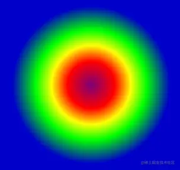

# WebGL 径向渐变

---
源码：[github.com/buglas/webg…](https://link.juejin.cn/?target=https%3A%2F%2Fgithub.com%2Fbuglas%2Fwebgl-lesson "https://github.com/buglas/webgl-lesson")

我们将之前线性的代码改改，便可以实现径向渐变。



1.在矩形面中，注释终点，添加半径

```
// u_End: {
//   type: 'uniform2fv',
//   value: [canvas.width, canvas.height]
// },
u_Radius: {
    type: 'uniform1f',
    value: 400
},
```

2.在片元着色器中也做相应调整。

```
//起始位
uniform vec2 u_Start;
//结束位
//uniform vec2 u_End;
//半径
uniform float u_Radius;
//四阶矩阵
uniform mat4 u_ColorStops;
//终点减起点向量
//vec2 se=u_End-u_Start;
//长度
//float seLen=length(se);
//单位向量
//vec2 se1=normalize(se);
```

3.修改获取片元颜色的方法，基于极径取ratio比值。

```
//获取片元颜色
vec4 getColor(vec4 colors[8],float ratios[8]){
    //片元颜色
    vec4 color=vec4(1);
    //当前片元减起始片元的向量
    //vec2 sf=vec2(gl_FragCoord)-u_Start;
    //当前片元到起始点的距离
    float fsLen=distance(gl_FragCoord.xy,u_Start);
    //当前片元在se上的投影长度
    //float fsLen=clamp(dot(sf,se1),0.0,seLen);
    //极径比
    float ratio=clamp(fsLen/u_Radius,ratios[0],ratios[8-1]);
    ……
}
```
