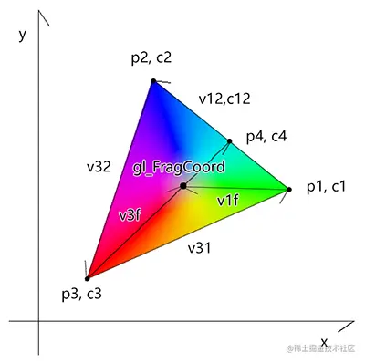
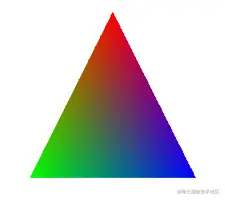

# WebGL 三点渐变

---
源码：[github.com/buglas/webg…](https://link.juejin.cn/?target=https%3A%2F%2Fgithub.com%2Fbuglas%2Fwebgl-lesson "https://github.com/buglas/webgl-lesson")

三角形重心坐标是最经典的实现三点渐变的算法。

除此之外，我们通过径向渐变和极坐标渐变的原理，也可以推导出三点渐变的实现原理。

接下来咱们就去推一下。



1.建立三个点

```
//点1
vec2 p1=vec2(200,200);
vec4 c1=vec4(1,0,0,1);
//点2
vec2 p2=vec2(800,400);
vec4 c2=vec4(0,1,0,1);
//点3
vec2 p3=vec2(400,800);
vec4 c3=vec4(0,0,1,1);
```

p1是点位，c1是颜色。

2.基于三个位置点计算相应向量

```
vec2 v31=p1-p3;
vec2 v32=p2-p3;
vec2 v12=p2-p1;
```

3.提前算出p2和p1点位的色差

```
vec4 c12=c2-c1;
```

4.提前算出一圈的弧度，以备后用

```
float pi2=radians(360.0);
```

radians() 是将角度转弧度的方法，360°=π\*2

5.建立基于向量获取弧度的方法

```
float getAngle(vec2 v){
    float ang=atan(v.y,v.x);
    if(ang<0.0){
        ang+=pi2;
    }
    return ang;
}
```

atan() 方法可以计算一个点基于x轴正方向的弧度，此弧度的取值范围是\[-π,π\]，为了方便计算，我将其范围设置为\[0,2π\]

6.获取点p1、p2和当前片元位相对于p3点的弧度。

```
float ang31=getAngle(v31);
float ang32=getAngle(v32);
vec2 v3f=gl_FragCoord.xy-p3;
float ang3f=getAngle(v3f);
```

7.用叉乘计算当前片元在向量v12的哪一侧

```
vec2 v1f=gl_FragCoord.xy-p1;
float z=v1f.x*v12.y-v1f.y*v12.x;
```

其原理我们之前在说三角形的时候说过，其实我们还可以这么写：

```
vec2 v1f=gl_FragCoord.xy-p1;
float z =cross(vec3(v1f,0),vec3(v12,0)).z;
```

我之前的运算实际上就是计算了两个z值为0的三维向量的叉乘结果的z值。

8.当片元在向量v31和v32之间，并且当前片元在向量v12的左侧时，当前片元在△p1p2p3中，我们便可以计算片元颜色。

```
vec4 color=vec4(0);
if(ang3f>=ang31&&ang3f<=ang32&&z<0.0){
    //计算∠<v3f,p3p1>在∠<p3p2,p3p1>中的比值
    ang3f=clamp(ang3f,ang31,ang32);
    float angRatio=(ang3f-ang31)/(ang32-ang31);

    //向量v12和向量v3f的交点位置和颜色
    vec2 p4=p1+v12*angRatio;
    vec4 c4=c1+c12*angRatio;

    //向量p3-gl_FragCoord在向量p3p4中的长度比
    float lenE=distance(p4,p3);
    float lenF=length(v3f);
    float lenRatio=lenF/lenE;

    //基于长度比获取当前片元在c3、c4间的颜色
    color=c3+(c4-c3)*lenRatio;
}
//片元颜色
gl_FragColor=color;
```

解释一下if语法中的取色逻辑。

9.计算∠<v32,v3f>在∠<v32,v31>中的比值angRatio

```
ang3f=clamp(ang3f,ang31,ang32);
float angRatio=(ang3f-ang31)/(ang32-ang31);
```

10.基于angRatio计算向量v12和向量v1f的交点位置p4和颜色c4

```
vec2 p4=p1+v12*angRatio;
vec4 c4=c1+c12*angRatio;
```

11.计算向量p3-gl\_FragCoord在向量p3p4中的长度比，然后基于此比值获取当前片元在c3、c4间的颜色

```
float lenE=distance(p4,p3);
float lenF=length(v3f);
float lenRatio=lenF/lenE;
color=c3+(c4-c3)*lenRatio;
```

关于手动推导三点渐变的方法就是这样。

最后给大家分享一个用三角形重心坐标在canvas 2d 里实现的三点渐变。

```
<!DOCTYPE html>
<html lang="en">

<head>
  <meta charset="UTF-8" />
  <title>三点渐变</title>
  <style>
    body {
      margin: 0;
      overflow: hidden;
    }
  </style>
</head>

<body>
  <canvas id="canvas"></canvas>
  <script>
    const canvas = document.querySelector("#canvas")
    const [w, h] = [500, 500]
    const [hw, hh] = [w / 2, h / 2]
    canvas.width = w;
    canvas.height = h;
    const ctx = canvas.getContext('2d');

    const [p0, p1, p2] = [
      { x: 0, y: 0.5 },
      { x: -0.5, y: -0.5 },
      { x: 0.5, y: -0.5 }
    ]
    const [c0, c1, c2] = [
      { r: 255, g: 0, b: 0 },
      { r: 0, g: 255, b: 0 },
      { r: 0, g: 0, b: 255 },
    ]
    const s012 = getArea(p0, p1, p2)
    const imgDt = new ImageData(w, h)
    const { data } = imgDt
    for (let y = 0; y < h; y++) {
      const y2 = y * w
      for (let x = 0; x < w; x++) {
        const p = pixelToWebgl(x, y)
        const [a, b, c] = [
          getArea(p, p1, p2) / s012,
          getArea(p, p2, p0) / s012,
          getArea(p, p0, p1) / s012,
        ]
        if (a > 0 && b > 0 && c > 0) {
          const cr = c0.r * a + c1.r * b + c2.r * c
          const cg = c0.g * a + c1.g * b + c2.g * c
          const cb = c0.b * a + c1.b * b + c2.b * c
          const i = (y2 + x) * 4
          data[i] = cr
          data[i + 1] = cg
          data[i + 2] = cb
          data[i + 3] = 255
        }
      }
    }
    ctx.putImageData(imgDt, 0, 0)


    function bary() {
      c0 * a + c1 * b + c2 * c
    }

    function pixelToWebgl(x, y) {
      return { x: 2 * (x - hw) / w, y: -2 * (y - hh) / h }
    }

    function getArea(p0, p1, p2) {
      return (p2.x - p1.x) * (p0.y - p1.y) - (p2.y - p1.y) * (p0.x - p1.x)
    }

  </script>
</body>

</html>

```

效果如下：


