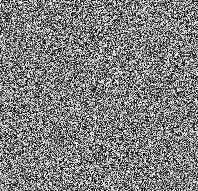
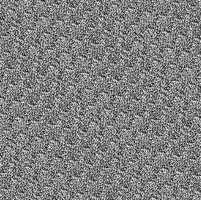
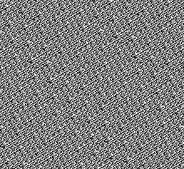
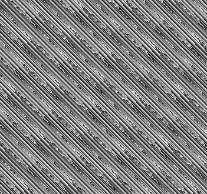
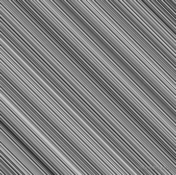
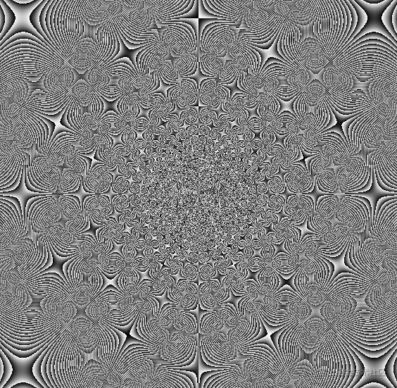

# WebGL 杂色与肌理

---
源码：[github.com/buglas/webg…](https://link.juejin.cn/?target=https%3A%2F%2Fgithub.com%2Fbuglas%2Fwebgl-lesson "https://github.com/buglas/webgl-lesson")



### 1-杂色原理

杂色的真谛就是通过有规律数据得到无规律的结果。

有规律的条件，是片元在canvas画布中的像素位。

无规律的结果，是片元的随机色值。

杂色的实现思路很简单，方法也非常多。

接下来我们就写一个杂色的实现方法。

1.在片元着色器里建立一个基于gl\_FragCoord 获取随机颜色的方法。

```
float rand(vec2 fragCoord){
    vec2 a= vec2(0.1234,0.5678);
    float n= dot(fragCoord,a);
    return fract(sin(n)*10000.0);
}
//sin(n)∈[-1,1]
//sin(n)=-0.12345678
//sin(n)*10000.0=1234.5678
//fract(sin(n)*10000.0)=0.5678 ∈(0,1)
```

向量a 是随便写的一个向量，小数点后的位数要多一点。

n是片元位置与向量a的点积，这么做是为了将两个已知条件，即fragCoord 的两个分量，合成一个已知条件。

tan(n) 是基于n值获取\[-∞,∞\] 之间一个随机数，是为了把片元位的行列规律破一下。

sin(n)\*10000.0 是为了把小数点左移，之后通过fract() 只获取小数点后面数字，这样的结果便会更为随机。

2.在主函数体中调用rand()方法

```
void main(){
    float f = rand(gl_FragCoord.xy);
    gl_FragColor = vec4(f, f, f, 1);
}
```

3.我们接下来对上面的向量a 进行旋转，可以实现噪波动画。

-   在片元着色器中添加u\_Ang 变量：

```
<script id="fragmentShader" type="x-shader/x-fragment">
    precision mediump float;
    uniform float u_Ang;
    float s=sin(u_Ang);
    float c=cos(u_Ang);
    mat2 m=mat2(
      c,s,
      -s,c
    );
    float rand(vec2 fragCoord){
      vec2 a= m*vec2(0.1234,0.5678);
      float n= dot(fragCoord,a);
      return fract(tan(n)*10000.0);
    }
    void main(){
      float f = rand(gl_FragCoord.xy);
      gl_FragColor = vec4(f, f, f, 1);
    }
</script>
```

-   js代码

```
const rect = new Poly({
    gl,
    source,
    type: 'TRIANGLE_STRIP',
    attributes: {
        a_Position: {
            size: 2,
            index: 0
        }
    },
    uniforms: {
        u_Ang: {
            type: 'uniform1f',
            value: 0
        }
    }
})

let ang = 1;
!(function ani() {
    ang++;
    rect.uniforms.u_Ang.value = ang;
    rect.updateUniform()
    gl.clear(gl.COLOR_BUFFER_BIT);
    rect.draw()
    requestAnimationFrame(ani)
})()
```

后面我们也可以自己借此玩一下肌理。

### 2-肌理

肌理是美学中必不可少的一部分，不同的肌理有着不同的视觉体验。

我们可以把之前的代码做一下修改。

-   把10000.0变成10.0，调出一个有韵律的杂色。

```
vec2 a= vec2(0.1234,0.5678);
float n= dot(fragCoord,a);
return fract(tan(n)*10.0);
```

效果如下：



-   或者直接把10.0 也去掉

```
vec2 a= vec2(0.1234,0.5678);
float n= dot(fragCoord,a);
return fract(tan(n));
```

效果如下：



-   把a改一下

```
vec2 a= vec2(0.111,0.11);
float n= dot(fragCoord,a);
return fract(tan(n));
```

效果如下：



-   再把a改一下

```
vec2 a= vec2(0.111,0.111);
float n= dot(fragCoord,a);
return fract(tan(n));
```

这便是拉丝的效果：



-   或者还可以这样

```
float rand(vec2 fragCoord){
    vec2 v=fragCoord-u_CanvasSize/2.0;
    return fract(
        atan(v.x,v.y)*500.0
    );
}
```


