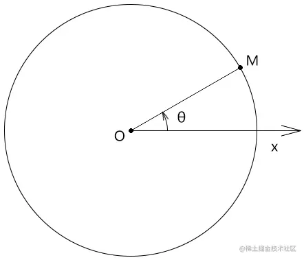
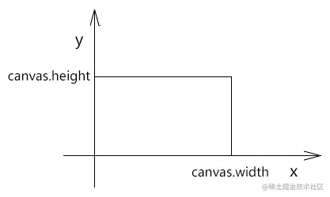
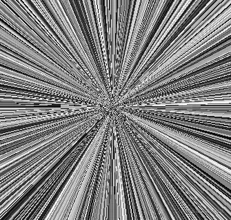

# WebGL 放射之数字山谷

---
源码：[github.com/buglas/webg…](https://link.juejin.cn/?target=https%3A%2F%2Fgithub.com%2Fbuglas%2Fwebgl-lesson "https://github.com/buglas/webgl-lesson")


说放射前，我们需要先知道极坐标。

极坐标的创始人是牛顿，主要应用于数学领域。

### 1-极坐标的基本概念



-   极点：极坐标的坐标原点，即点O
-   极轴：极坐标的起始轴，其对应的弧度为0，即Ox
-   正方向：极坐标中，点位按此方向的旋转量越大，其相对于极轴的弧度越大，此方向通常为逆时针方向
-   极径：极坐标系中一点到极点的距离，如|OM|
-   极角：极坐标系中一点相对于极轴的角度，如 θ
-   极坐标：由极坐标系中一点的极径和极角构成的有序数对，如(|OM|,θ)
-   极坐标系：按照以上原理确定某点的坐标位的坐标系

### 2-直角坐标系

gl\_FragCoord所对应的二维直角坐标系中，y轴是朝上的，以像素为单位。



一个点的位置既可以用直角坐标来表示，也可以用极坐标来表示。

接下来我们说一下二维直角坐标系与极坐标系的转换方法。

### 3-极角与x轴的映射

我们可以通过极角与x轴的映射实现放射效果。

#### 3-1-放射



1.在片元着色器里基于画布尺寸计算画布中心位，声明360°所对应的弧度，以备后用。

```
uniform vec2 u_CanvasSize;
vec2 center=u_CanvasSize/2.0;
float pi2=radians(360.0);
```

2.以画布中心点为极点，计算当前片元的极角ang。

```
void main(){
    vec2 p=gl_FragCoord.xy-center;
    float ang=atan(p.y,p.x);
    ……
}
```

3.以极角为变量，计算与计算一个x值

```
float x=ang*16.0;
```

4.将x值拼上一个随意的y值，构成向量v

```
vec2 v=vec2(int(x),0);
```

5.基于向量v，通过rand() 方法生成一个颜色

```
vec2 v=vec2(int(x),0);
float f = rand(v); 
gl_FragColor = vec4(f, f, f, 1);
```

有了渐变的效果后，我们还可以让其旋转起来。

#### 3-2-渐变旋转

1.通过requestAnimationFrame() 方法向着色器传递一个时间戳 u\_Stamp

```
const rect = new Poly({
    gl,
    source,
    type: 'TRIANGLE_STRIP',
    attributes: {
        a_Position: {
            size: 2,
            index: 0
        }
    },
    uniforms: {
        u_CanvasSize: {
            type: 'uniform2fv',
            value: [canvas.width, canvas.height]
        },
        u_Stamp: {
            type: 'uniform1f',
            value: 0
        }
    }
})

!(function ani(stamp) {
    rect.uniforms.u_Stamp.value = stamp;
    rect.updateUniform();
    gl.clear(gl.COLOR_BUFFER_BIT);
    rect.draw()
    requestAnimationFrame(ani)
})()
```

2.在着色器中建立名为u\_Stamp 的uniform 变量，并基于此变量建立只负责旋转的模型矩阵modelMatrix。

```
uniform vec2 u_CanvasSize;
uniform float u_Stamp;

vec2 center=u_CanvasSize/2.0;
float pi2=radians(360.0);

float angOffset=u_Stamp*0.001;
float cosAng=cos(angOffset);
float sinAng=sin(angOffset);
mat2 modelMatrix=mat2(
    cosAng,sinAng,
    -sinAng,cosAng
);
```

3.在main() 方法中使用modelMatrix 旋转点p

```
void main(){
    vec2 p=gl_FragCoord.xy-center;
    p=modelMatrix*p;
    float ang=atan(p.y,p.x);
    float x=ang*16.0;

    vec2 v=vec2(int(x),0);
    float f = rand(v); 
    gl_FragColor = vec4(f, f, f, 1);
}
```

以此原理，我还可以通过时间戳改变上面向量v 的y值，从而实现渐变闪烁。

#### 3-3-渐变闪烁

1.修改一下main 方法

```
void main(){
    vec2 p=gl_FragCoord.xy-center;
    //p=modelMatrix*p;
    float ang=atan(p.y,p.x);
    float x=ang*16.0;

    vec2 v=vec2(int(x),int(u_Stamp));
    float f = rand(v); 
    gl_FragColor = vec4(f, f, f, 1);
}
```

2.控制一下闪烁速度

```
let lastTime = 0
const timeLen = 100
!(function ani(stamp) {
    if (stamp % timeLen < lastTime % timeLen) {
        rect.uniforms.u_Stamp.value = stamp
        rect.updateUniform()
        gl.clear(gl.COLOR_BUFFER_BIT)
        rect.draw()
    }
    lastTime = stamp
    requestAnimationFrame(ani)
})()
```

知道了基本的动画原理后，我们还可以建立多极点放射效果，从而玩点艺术效果。

#### 3-4-来自深渊的凝视

下图两个极点之间的图形像一只眼睛，所以我就叫它“来自深渊的凝视”啦。


这个动画我是在放射旋转的基础上实现的，接下来我对其做一下修改。

1.建立两个模型矩阵

```
float angOffset1=u_Stamp*0.0002;
float cosAng1=cos(angOffset1);
float sinAng1=sin(angOffset1);
mat2 modelMatrix1=mat2(
    cosAng1,sinAng1,
    -sinAng1,cosAng1
);

float angOffset2=u_Stamp*0.0008;
float cosAng2=cos(angOffset2);
float sinAng2=sin(angOffset2);
mat2 modelMatrix2=mat2(
    cosAng2,sinAng1,
    -sinAng2,cosAng2
);
```

-   modelMatrix1 是用于旋转片元位的
-   modelMatrix2 是用于旋转极点的。

注：modelMatrix2 中的第二个元素是sinAng1，不是sinAng2，我这么做是为打破一下其中规中矩的旋转方式。

2.将通过极坐标获取亮度的方法封装一下。

```
float getBright(vec2 pole){
    pole=center+modelMatrix2*(pole-center);
    vec2 p=gl_FragCoord.xy-pole;
    p=modelMatrix1*p;
    float ang=atan(p.y,p.x);
    float x=ang*16.0;
    vec2 v=vec2(int(x),0);
    return rand(v);
}
```

3.在mian 中基于两个极点，获取两个亮度值。

```
void main(){
    vec2 min=u_CanvasSize*0.35;
    vec2 max=u_CanvasSize*0.65;
    float bright1 = getBright(min);
    float bright2 = getBright(max);
    ……
}
```

4.对两个亮度值进行合成。

其合成思路是若两个亮度值都比较暗，那我就让当前片元变亮；若都比较亮，那我就让其变暗。

```
void main(){
    vec2 min=u_CanvasSize*0.35;
    vec2 max=u_CanvasSize*0.65;
    float bright1 = getBright(min);
    float bright2 = getBright(max);
    
    float f=0.0;
    float sum=bright1+bright2;
    if(sum>1.0){
        f=bright1*bright2;
    }else{
        f=sum;
    }
    gl_FragColor = vec4(f, f, f, 1);
}
```

以此原理，我们还可以再玩点别的，比如来上四个极点。

#### 3-5-数字山谷

下面这张图我就叫它“数字山谷”了。

我要用它来体现数字山谷的现代、科技、格子玻璃、明快、琐碎、进取，以及看似杂乱莫测的变化中又蕴含着的规律。


在“来自深渊的凝视”的基础上做一下修改。

1.修改一下矩阵变换的参数

```
float angOffset1=u_Stamp*0.00015;
float cosAng1=cos(angOffset1);
float sinAng1=sin(angOffset1);
mat2 modelMatrix1=mat2(
    cosAng1,sinAng1,
    -sinAng1,cosAng1
);

float angOffset2=u_Stamp*0.0004;
float cosAng2=cos(angOffset2);
float sinAng2=sin(angOffset2);
mat2 modelMatrix2=mat2(
    cosAng2,sinAng1,
    -sinAng2,cosAng2
);
```

2.通过4个极点获取亮度值，然后对其合成

```
void main(){
    vec2 min=u_CanvasSize*0.25;
    vec2 max=u_CanvasSize*0.75;
    float bright1 = getBright(min);
    float bright2 = getBright(max);
    float bright3 = getBright(vec2(min.x,max.y));
    float bright4 = getBright(vec2(max.x,min.y));
    float f=0.0;
    float sum=bright1+bright2+bright3+bright4;
    if(sum>2.0){
        f=bright1*bright2*bright3*bright4*4.0;
    }else{
        f=sum/2.0;
    }
    gl_FragColor = vec4(f, f, f, 1);
}
```
