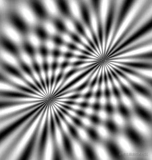
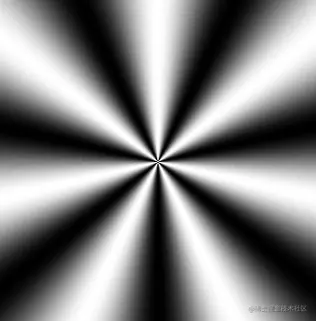

# WebGL 正弦型放射之光影沉浮

---
源码：[github.com/buglas/webg…](https://link.juejin.cn/?target=https%3A%2F%2Fgithub.com%2Fbuglas%2Fwebgl-lesson "https://github.com/buglas/webgl-lesson")



以前我们在说水波纹的时候，提到过正弦型函数，我们在这里也可以用正弦型函数做正弦型放射。

先回顾一下正弦型函数：

y=Asin(ωx+φ)

-   A 影响的是正弦曲线的波动幅度
-   φ 影响的是正弦曲线的平移
-   ω 影响的是正弦曲线的周期，ω 越大，周期越小

接下来咱们说一下代码实现。

1.声明omega和a变量

```
float omega=7.0;
float a=0.5;
```

-   omega 对应的是正弦函数式里的ω，在放射效果中此值会影响射线的数量
-   a 对应的是正弦函数式里的A，在放射效果中此值会影响亮度

2.在main方法中，以画布中心为极点，计算当前片元的极角

```
void main(){
    vec2 p=gl_FragCoord.xy-center;
    float ang=atan(p.y,p.x);
    ……
}
```

3.以极角为变量计算正弦函数值

```
float f = a*sin(omega*ang)+0.5; 
gl_FragColor = vec4(f, f, f, 1);
```

上面求f时加的0.5 是为了在\[0,1\]之间去亮度值：

-   a_sin(omega_x)∈\[-0.5,0.5\]
-   a_sin(omega_x)+0.5∈\[0,1\]

效果如下：



以此原理，我们还可以写点动画。

#### 3-7-光影沉浮

片元着色器如下：

```
<script id="fragmentShader" type="x-shader/x-fragment">
    precision mediump float;
    uniform vec2 u_CanvasSize;
    uniform float u_Stamp;

    vec2 center=u_CanvasSize/2.0;
    float pi2=radians(360.0);

    float omega=24.0;
    float a=0.5;

    float angOffset1=u_Stamp*0.001;
    float cosAng1=cos(angOffset1);
    float sinAng1=sin(angOffset1);
    mat2 modelMatrix1=mat2(
      cosAng1,sinAng1,
      -sinAng1,cosAng1
    );

    float angOffset2=u_Stamp*0.001;
    float cosAng2=cos(angOffset2);
    float sinAng2=sin(angOffset2);
    mat2 modelMatrix2=mat2(
      cosAng2,sinAng2,
      -sinAng2,cosAng2
    );

    float getBright(vec2 pole){
      pole=center+modelMatrix2*(pole-center);
      vec2 p=gl_FragCoord.xy-pole;
      p=modelMatrix1*p;
      float ang=atan(p.y,p.x);
      return a*sin(omega*ang)+0.5;
    }

    void main(){
      vec2 min=u_CanvasSize*0.35;
      vec2 max=u_CanvasSize*0.65;
      float bright1 = getBright(min);
      float bright2 = getBright(max);
      float f=(bright1+bright2)*0.55;
      gl_FragColor = vec4(f, f, f, 1);
    }
</script>
```

或者，我们还可以再玩点别样的效果。

下图具有流体效果，我就叫它“湍流”啦。


片元着色器如下：

```
<script id="fragmentShader" type="x-shader/x-fragment">
    precision mediump float;
    uniform vec2 u_CanvasSize;
    uniform float u_Stamp;

    vec2 center=u_CanvasSize/2.0;
    float pi2=radians(360.0);

    float omega=64.0;
    float a=0.5;

    float angOffset1=u_Stamp*0.0004;
    float sinAng1=sin(angOffset1);

    float angOffset2=u_Stamp*0.0002;
    float cosAng2=cos(angOffset2);
    float sinAng2=sin(angOffset2);
    mat2 modelMatrix2=mat2(
      cosAng2,sinAng1,
      -sinAng2,cosAng2
    );

    float getBright(vec2 pole){
      pole=center+modelMatrix2*(pole-center);
      vec2 p=gl_FragCoord.xy-pole;
      float ang=atan(p.y,p.x);
      return a*sin(omega*ang)+0.5;
    }

    void main(){
      vec2 min=u_CanvasSize*0.25;
      vec2 max=u_CanvasSize*0.75;
      float bright1 = getBright(min);
      float bright2 = getBright(max);
      float bright3 = getBright(vec2(min.x,max.y));
      float bright4 = getBright(vec2(max.x,min.y));
      float f=0.0;
      float sum=bright1+bright2+bright3+bright4;
      if(sum<2.0){
        f=1.0;
      }
      gl_FragColor = vec4(f, f, f, 1);
    }
</script>
```
