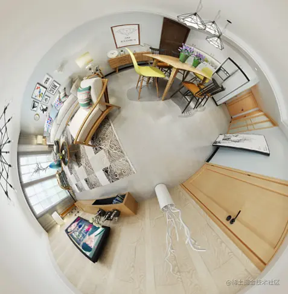

# WebGL 极坐标扭曲全景图

---
源码：[github.com/buglas/webg…](https://link.juejin.cn/?target=https%3A%2F%2Fgithub.com%2Fbuglas%2Fwebgl-lesson "https://github.com/buglas/webgl-lesson")

下图是我提前准备好的全景图：


极坐标扭曲效果如下：



这就像广角镜头一样，接下来咱们说一下代码实现。

1.建立带贴图的rect对象

```
const source = new Float32Array([
    -1, 1, 0, 1,
    -1, -1, 0, 0,
    1, 1, 1, 1,
    1, -1, 1, 0
]);

const rect = new Poly({
    gl,
    source,
    type: 'TRIANGLE_STRIP',
    attributes: {
        a_Position: {
            size: 2,
            index: 0
        },
        a_Pin: {
            size: 2,
            index: 2
        },
    },
    uniforms: {
        u_CanvasSize: {
            type: 'uniform2fv',
            value: [canvas.width, canvas.height]
        }
    }
})

const image = new Image()
image.src = './images/room.jpg'
image.onload = function () {
    rect.maps = {
        u_Sampler: { image },
    }
    rect.updateMaps()
    render()
}

//渲染
function render() {
    gl.clear(gl.COLOR_BUFFER_BIT);
    rect.draw()
}
```

2.顶点着色器

```
<script id="vertexShader" type="x-shader/x-vertex">
    attribute vec4 a_Position;
    attribute vec2 a_Pin;
    varying vec2 v_Pin;
    void main(){
        gl_Position=a_Position;
        v_Pin=a_Pin;
    }
</script>
```

3.片元着色器

```
<script id="fragmentShader" type="x-shader/x-fragment">
    precision mediump float;
    uniform vec2 u_CanvasSize;
    uniform sampler2D u_Sampler;
    varying vec2 v_Pin;
    vec2 center=u_CanvasSize/2.0;
    float diagLen=length(center);
    float pi2=radians(360.0);

    float getAngle(vec2 v){
      float ang=atan(v.y,v.x);
      if(ang<0.0){
          ang+=pi2;
      }
      return ang;
    }

    void main(){
      vec2 p=gl_FragCoord.xy-center;
      float ang=getAngle(p);
      float x=ang/pi2;
      float len=length(p);
      float y=len/diagLen;
      vec4 color=texture2D(u_Sampler,vec2(x,y));
      if(p.x>0.0&&abs(p.y)<1.0){
        color=texture2D(u_Sampler,vec2(0,y));
      }
      gl_FragColor=color;
    }
</script>
```
