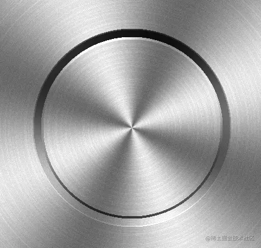
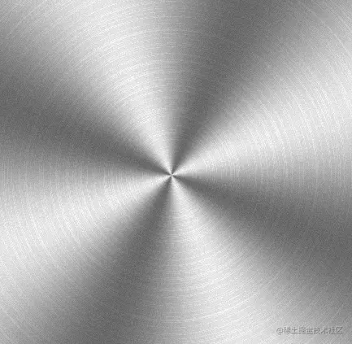
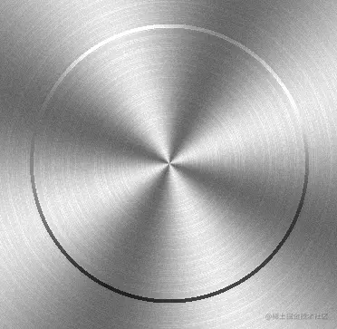
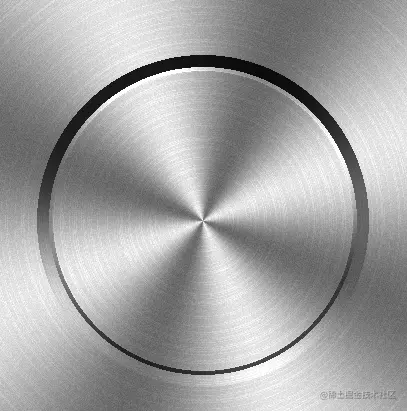
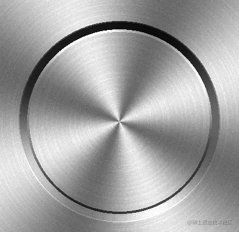

# WebGL 磨砂金属按钮

---
源码：[github.com/buglas/webg…](https://link.juejin.cn/?target=https%3A%2F%2Fgithub.com%2Fbuglas%2Fwebgl-lesson "https://github.com/buglas/webgl-lesson")

接下来我们将之前说过的渐变、杂色、极坐标扭曲、拉丝融为一体，做一个磨砂金属按钮。



1.先制作一个磨砂材质

```
<script id="fragmentShader" type="x-shader/x-fragment">
    precision mediump float;
    uniform vec2 u_CanvasSize;
    vec2 center=u_CanvasSize/2.0;
    float diagLen=length(center);
    float pi2=radians(360.0);
    float omega=4.0;
    float a=0.5;

    //渐变
    float gradient(float ang){
      return a*sin(omega*ang)+0.5; ;
    }

    //水平拉丝
    float wire(vec2 v){
      vec2 a= vec2(0.0,1.0);
      float n= dot(v,a);
      return fract(tan(n)*10000.0);
    }

    //杂色
    float noise(vec2 v){
      vec2 a= vec2(0.1234,0.5678);
      float n= dot(v,a);
      return fract(tan(n)*10000.0);
    }

    //获取弧度
    float getAngle(vec2 v){
      float ang=atan(v.y,v.x);
      if(ang<0.0){
          ang+=pi2;
      }
      return ang;
    }

    void main(){
      vec2 p=gl_FragCoord.xy-center;
      //极径
      float len=length(p);
      //极角
      float ang=getAngle(p);
      
      float x=u_CanvasSize.x*ang/pi2;
      float y=(len/diagLen)*u_CanvasSize.y;

      //渐变
      float f1 = gradient(ang);
      f1=0.65*f1+0.5;

      //拉丝
      float f2 = wire(vec2(int(x),int(y)));
      f2=clamp(f2,0.75,0.8);

      //杂色
      float f3 = noise(gl_FragCoord.xy);
      f3*=0.07;

      //复合亮度
      float f=f1*f2+f3;

      gl_FragColor = vec4(vec3(f), 1);

    }
</script>
```

效果如下：



2.绘制凸出效果，对复合亮度做一下加工。



```
float ratio1=smoothstep(-1.0,1.0,sin(ang));
float r=150.0;
float expand1=r+4.0;
if(len>r&&len<expand1){
    f*=ratio1+0.3;
}
```

smoothstep(edge0,edge1,x) 求x在edge0和edge1间的插值\[0,1\]

-   若x<edge0 返回0
-   若x>edge1 返回1
-   否则返回x 在edge0和edge1间的插值

例子：

smoothstep(3,7,1)=0

smoothstep(3,7,8)=1

smoothstep(3,7,5)=(5-3)/(7-3)=2/4=0.5

sin(ang)的单调性：

-   ang∈\[-π/2,π/2\] 时，ang越大，sin(ang)越大
-   ang∈\[π/2,π/2+π\] 时，ang越大，sin(ang)越小

3.以此原理，我们还可以再做一圈凹陷效果。

```
float ratio1=smoothstep(-1.0,1.0,sin(ang));
float ratio2=1.0-ratio1;
float r=150.0;
float expand1=r+4.0;
float expand2=expand1+12.0;
if(len>r&&len<expand1){
    f*=ratio1+0.3;
}else if(len>expand1&&len<expand2){
    f*=ratio2+0.1;
}
```

效果如下：



上面的ratio2 是实现了一个自上到下，由暗到亮的效果。

4.我们还可以再来一圈渐变，使凹凸效果更具层次。

```
float ratio1=smoothstep(-1.0,1.0,sin(ang));
float ratio2=1.0-ratio1;
float r=150.0;
float expand1=r+4.0;
float expand2=expand1+12.0;
float expand3=expand2+2.0;
if(len>r&&len<expand1){
    f*=ratio1+0.3;
}else if(len>expand1&&len<expand2){
    f*=ratio2+0.1;
}else if(len>expand2&&len<expand3){
    f*=ratio2+0.3;
}
```

效果如下：



5.我也可以对代码做一点优化，把亮度和半径各自装进一个集合里。

```
//片元亮度集合
float ratio1=(sin(ang)+1.0)/2.0;
float ratio2=1.0-ratio1;
float ls[3];
ls[0]=f*(ratio1+0.3);
ls[1]=f*(ratio2+0.1);
ls[2]=f*(ratio2+0.3);

//初始半径
float r=150.0;
//半径集合
float rs[3];
rs[0]=r+4.0;
rs[1]=rs[0]+12.0;
rs[2]=rs[1]+2.0;

//基于len值，计算片元亮度
for(int i=0;i<3;i++){
    if(len>=r&&len<rs[i]){
        f=ls[i];
        break;
    }
    r=rs[i];
}
```
