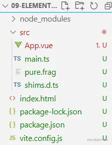
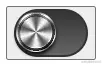

# WebGL+Element3

---
源码：[github.com/buglas/webg…](https://link.juejin.cn/?target=https%3A%2F%2Fgithub.com%2Fbuglas%2Fwebgl-lesson "https://github.com/buglas/webgl-lesson")

Element3是基于vue3.0 造的轮子，它是由许多大神主导开发的，比如Winter、大圣、春去春又来等。

其中有一个“rollup-plugin-element3-webgl” 依赖，可以在自定义的着色器组件上绑定动态数据，从而驱动片元着色器的渲染。

接下来我们就先小试一下。

### 1-环境配置

1.安装nodejs

2.全局安装vite

```
npm install -g vite
```

3.建立一个目录，初始化项目，建立 package.json

```
npm init
```

4.在 package.json 中写入依赖

```
{
  "name": "09-element3-webgl",
  "version": "1.0.0",
  "description": "",
  "main": "index.js",
  "dependencies": {
    "element3-core": "0.0.7",
    "vue": "^3.0.5"
  },
  "devDependencies": {
    "@vitejs/plugin-vue": "^1.2.2",
    "@vue/compiler-sfc": "^3.0.5",
    "rollup-plugin-element3-webgl": "0.0.5",
    "typescript": "^4.1.3",
    "vite": "^2.3.0",
    "vue-tsc": "^0.0.24"
  },
  "scripts": {
    "test": "echo "Error: no test specified" && exit 1"
  }
}
```

5.  创建文件和基本目录结构。



index.html

```
<!DOCTYPE html>
<html lang="en">

<head>
  <meta charset="UTF-8" />
  <link rel="icon" href="/favicon.ico" />
  <meta name="viewport" content="width=device-width, initial-scale=1.0" />
  <title>Vite App</title>
</head>

<body>
  <div id="app"></div>
  <script type="module" src="/src/main.ts"></script>
</body>

</html>
```

vite.config.js

```
import { defineConfig } from "vite";
import vue from "@vitejs/plugin-vue";
import element3Webgl from "rollup-plugin-element3-webgl";

// https://vitejs.dev/config/
export default defineConfig({
  base: "/", 
  plugins: [vue(), element3Webgl()],
});
```

建立src目录

main.ts

```
import { createApp } from "vue";
import App from "./App.vue";

createApp(App).mount("#app");
```

App.vue

```
<template>
<div>
    <DrawBlock 
    :u_Width="600" 
    :u_Height="600"
    :u_Radius="200"
    width=600
    height=600
    ></DrawBlock>
</div>
</template>
<script lang="ts">

import { defineComponent } from "vue";
import DrawBlock from "./pure.frag";

export default defineComponent({
  name: "App",
  components: {
    DrawBlock
  },
  setup(){
    return {
      
    }
  }
});

</script>
```

pure.frag

```
precision mediump float;

uniform float u_Width;
uniform float u_Height;
uniform float u_Radius;

void main() {
  vec2 center=vec2(u_Width,u_Height)/2.0;
  vec2 p=gl_FragCoord.xy-center;
  float l = length(p);
  if(l<u_Radius){
    gl_FragColor=vec4(1,1,0,1);
  }else{
    gl_FragColor = vec4(0, 0, 0, 1);
  }
}
```

最终效果就是一个红色的圆圈。

接下来我们把之前写过的磨砂金属作为Element3 组件的皮肤。

### 2-金属Switch

金属Switch的效果如下：



1.建立switch 组件

```
<template>
  <E3Switch
    v-model="enabled"
    class="
      relative 
      focus:outline-none
    "
  >
    <draw
      width="100" 
      height="100"
      :iTime="0"
      :iWidth="buttonWidth"
      :iHeight="buttonHeight"
      :style="enabled?buttonEnterStyle:buttonStyle"
    ></draw>
    <div :style="backgroundStyle"></div>
  </E3Switch>
</template>

<script>
import { ref } from "vue";
import { E3Switch } from "element3-core";
import draw from "./metal.frag";
export default {
  components: {
    E3Switch,
    draw,
  },
  setup() {
    const enabled = ref(false);

    const buttonStyle = {
      width:"40px",
      height:"40px",
      transform:"translate(0px,0px)",
      borderRadius:"50%",
      position:"absolute",
      left:"17px",
      top:"14px",
      boxShadow:"0px 3px 4px #000",
      transition:"all .2s ease-in"
    }

    const buttonEnterStyle = {
      width:"40px",
      height:"40px",
      transform:"translate(32px,0px)",
      borderRadius:"50%",
      position:"absolute",
      left:"17px",
      top:"14px",
      boxShadow:"0px 3px 4px #000",
      transition:"all .2s ease-in"
    }

    const buttonWidth = ref(100);
    const buttonHeight = ref(100);

    const backgroundStyle = {
      background: "linear-gradient(#333, #666)",
      width: "70px",
      height:"44px",
      borderRadius:"25px",
      border:"2px solid #333",
    }

    return { buttonWidth,buttonHeight,backgroundStyle,enabled,buttonStyle,buttonEnterStyle};
  },
};
</script>

<style></style>
```

2.金属材质

```
precision mediump float;

uniform float iWidth;
uniform float iHeight;

vec2 u_CanvasSize = vec2(iWidth, iHeight);
vec2 center = u_CanvasSize / 2.0;
float diagLen = length(center);
float pi2 = radians(360.0);
float omega=4.0;
float a=0.5;

//渐变
float gradient(float ang){
    return a*sin(omega*ang)+0.5; ;
}

//水平拉丝
float wire(vec2 v){
    vec2 a= vec2(0.0,1.0);
    float n= dot(v,a);
    return fract(tan(n)*10000.0);
}

//杂色
float noise(vec2 v){
    vec2 a= vec2(0.1234,0.5678);
    float n= dot(v,a);
    return fract(tan(n)*10000.0);
}

//获取弧度
float getAngle(vec2 v){
    float ang=atan(v.y,v.x);
    if(ang<0.0){
        ang+=pi2;
    }
    return ang;
}

void main(){
    vec2 p=gl_FragCoord.xy-center;
    float len=length(p);
    float ang=getAngle(p);
    float x=u_CanvasSize.x*ang/pi2;
    float y=(len/diagLen)*u_CanvasSize.y;

    float f1 = gradient(ang);
    f1=0.65*f1+0.5;

    float f2 = wire(vec2(int(x),int(y)));
    f2=clamp(f2,0.75,0.8);

    float f3 = noise(gl_FragCoord.xy);
    f3*=0.07;

    //复合亮度
    float f=f1*f2+f3;

    //片元亮度集合
    float ratio1=smoothstep(-1.0,1.0,sin(ang));
    float ratio2=1.0-ratio1;
    float ls[3];
    ls[0]=f*(ratio1+0.3);
    ls[1]=f*(ratio2+0.1);
    ls[2]=f*(ratio2+0.3);

    //初始半径
    float r=150.0;
    //半径集合
    float rs[3];
    rs[0]=r+4.0;
    rs[1]=rs[0]+12.0;
    rs[2]=rs[1]+2.0;

    //基于len值，计算片元亮度
    for(int i=0;i<3;i++){
        if(len>=r&&len<rs[i]){
            f=ls[i];
            break;
        }
        r=rs[i];
    }

    gl_FragColor = vec4(vec3(f), 1);
}
```
