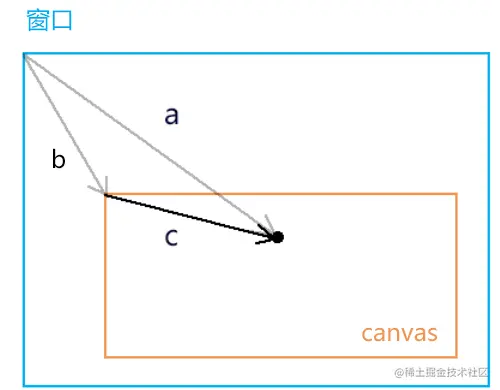
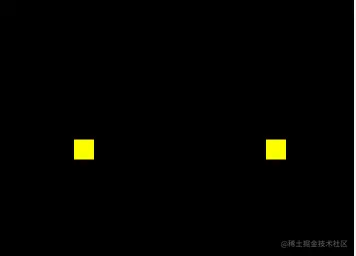
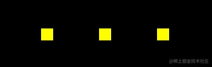
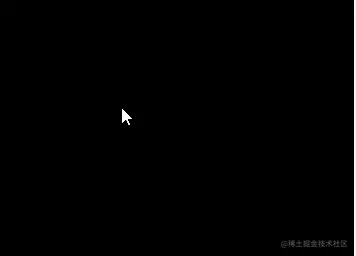
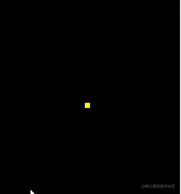

# WebGL 用鼠标画点

---
源码：[github.com/buglas/webg…](https://link.juejin.cn/?target=https%3A%2F%2Fgithub.com%2Fbuglas%2Fwebgl-lesson "https://github.com/buglas/webgl-lesson")

我们要用鼠标控制一个点的位置，首先要知道鼠标点在webgl 坐标系中的位置，这样才能让一个点出现在我们鼠标点击的位置。

接下来咱们就说一下如何获取鼠标点在webgl 坐标系中的位置。

### 1-获取鼠标点在webgl 坐标系中的位置

对于鼠标点在webgl 坐标系中的位置，我们是无法直接获取的。所以我们得先获取鼠标在canvas 这个DOM元素中的位置。

#### 1-1-获取鼠标在canvas 画布中的css 位置

```
canvas.addEventListener('click',function(event){
    const {clientX,clientY}=event;
    const {left,top}=canvas.getBoundingClientRect();
    const [cssX,cssY]=[
        clientX-left,
        clientY-top
    ];
})
```

对于cssX,cssY 的获取，大家应该都不陌生，这在canvas 2d 也会用到。

我们可以用向量减法来求解。



已知：向量a(clientX,clientY)，向量b(left,top)

求：向量c

解：

由向量的减法得：向量a减向量c，等于以向量c 的终点为起点，以向量a的终点为终点的向量c

所以：向量c=a-b=(clientX-left,clientY-top)

将向量c 视之为坐标点c，那点c 就是鼠标在canvas 画布中的css 位。

因为html 坐标系中的坐标原点和轴向与canvas 2d是一致的，所以在我们没有用css 改变画布大小，也没有对其坐标系做变换的情况下，鼠标点在canvas 画布中的css 位就是鼠标点在canvas 2d坐标系中的位置。

#### 2-2-canvas 坐标系转webgl 坐标系

咱们这里的变换思路就是解决差异，接着上面的代码来写。

1.解决坐标原点位置的差异。

```
const [halfWidth,halfHeight]=[width/2,height/2];
const [xBaseCenter,yBaseCenter]=[cssX-halfWidth,cssY-halfHeight];
```

上面的\[halfWidth,halfHeight\]是canvas 画布中心的位置。

\[xBaseCenter,yBaseCenter\] 是用鼠标位减去canvas 画布的中心位，得到的就是鼠标基于画布中心的位置。

2.解决y 方向的差异。

```
const yBaseCenterTop=-yBaseCenter;
```

因为webgl 里的y 轴和canvas 2d 里的y轴相反，所以咱们对yBaseCenter 值取一下反即可。

3.解决坐标基底的差异。

```
const [x,y]=[xBaseCenter/halfWidth,yBaseCenterTop/halfHeight]
```

由于canvas 2d 的坐标基底中的两个分量分别是一个像素的宽高，而webgl的坐标基底的两个分量是画布的宽高，所以咱们得求个比值。

整体代码：

```
canvas.addEventListener('click',function(event){
  const {clientX,clientY}=event;
  const {left,top,width,height}=canvas.getBoundingClientRect();
  const [cssX,cssY]=[
    clientX-left,
    clientY-top
  ];
  const [halfWidth,halfHeight]=[width/2,height/2];
  const [xBaseCenter,yBaseCenter]=[cssX-halfWidth,cssY-halfHeight];
  const yBaseCenterTop=-yBaseCenter;
  const [x,y]=[xBaseCenter/halfWidth,yBaseCenterTop/halfHeight];
})
```

关于获取鼠标点在webgl 坐标系中的位置的方法，我们就说到这，接下来咱们基于这个位置，修改着色器暴露出来的位置变量即可。

### 2-修改attribute 变量

这个步骤和第一章的内容是差不多的：

1.  获取attribute 变量
2.  在获取鼠标在webgl 画布中的位置的时候，修改attribute 变量
3.  清理画布
4.  绘图

```
import {initShaders} from '../jsm/Utils.js';

const canvas = document.getElementById('canvas');
canvas.width=window.innerWidth;
canvas.height=window.innerHeight;
const gl = canvas.getContext('webgl');
const vsSource = document.getElementById('vertexShader').innerText;
const fsSource = document.getElementById('fragmentShader').innerText;
initShaders(gl, vsSource, fsSource);
const a_Position=gl.getAttribLocation(gl.program,'a_Position');
gl.clearColor(0.0, 0.0, 0.0, 1.0);
gl.clear(gl.COLOR_BUFFER_BIT);

canvas.addEventListener('click',function(event){
  const {clientX,clientY}=event;
  const {left,top,width,height}=canvas.getBoundingClientRect();
  const [cssX,cssY]=[
    clientX-left,
    clientY-top
  ];
  const [halfWidth,halfHeight]=[width/2,height/2];
  const [xBaseCenter,yBaseCenter]=[cssX-halfWidth,cssY-halfHeight];
  const yBaseCenterTop=-yBaseCenter;
  const [x,y]=[xBaseCenter/halfWidth,yBaseCenterTop/halfHeight];
  gl.vertexAttrib2f(a_Position,x,y);
  gl.clear(gl.COLOR_BUFFER_BIT);
  gl.drawArrays(gl.POINTS, 0, 1);
})
```

在上面的例子中，大家每点击一次canvas 画布，都会画出一个点，而上一次画的点就会消失，我们无法连续画出多个点。


为何会如此呢？我们分析一下。

### 3-webgl 的同步绘图原理

具备canvas 2d可能会认为无法画出多点是gl.clear(gl.COLOR\_BUFFER\_BIT) 清理画布导致，因为我们在用canvas 2d 做动画时，其中就有一个ctx.clearRect() 清理画布的方法。

那咱们将gl.clear() 方法注释掉试试。

#### 3-1-用实践得真知

```
gl.vertexAttrib2f(a_Position,x,y);
//gl.clear(gl.COLOR_BUFFER_BIT);
gl.drawArrays(gl.POINTS, 0, 1);
```


当我们鼠标点击画布时，画布中原本的黑色已经没有了，而且我们每次也只能画一个点。

我们分析一下。

gl.drawArrays(gl.POINTS, 0, 1) 方法和canvas 2d 里的ctx.draw() 方法是不一样的，ctx.draw() 真的像画画一样，一层一层的覆盖图像。

gl.drawArrays() 方法只会同步绘图，走完了js 主线程后，再次绘图时，就会从头再来。也就说，异步执行的drawArrays() 方法会把画布上的图像都刷掉。

举个栗子：

1.我先画两个点

```
const a_Position=gl.getAttribLocation(gl.program,'a_Position');
gl.clearColor(0.0, 0.0, 0.0, 1.0);
gl.clear(gl.COLOR_BUFFER_BIT);
gl.vertexAttrib2f(a_Position,0.1,0);
gl.drawArrays(gl.POINTS, 0, 1);
gl.vertexAttrib2f(a_Position,-0.1,0);
gl.drawArrays(gl.POINTS, 0, 1);
```


好的，没问题。

2.我想一秒后，再画一个点。

```
const a_Position=gl.getAttribLocation(gl.program,'a_Position');
gl.clearColor(0.0, 0.0, 0.0, 1.0);
gl.clear(gl.COLOR_BUFFER_BIT);
gl.vertexAttrib2f(a_Position,0.1,0);
gl.drawArrays(gl.POINTS, 0, 1);
gl.vertexAttrib2f(a_Position,-0.1,0);
gl.drawArrays(gl.POINTS, 0, 1);
setTimeout(()=>{
  gl.vertexAttrib2f(a_Position,0,0);
  gl.drawArrays(gl.POINTS, 0, 1);
},1000)
```



以前画好的两个点没了，黑色背景也没了。这就是咱们之前说过的webgl 同步绘图原理。

那这个问题如何解决呢？这就是一个简单的逻辑问题了。

3.我们可以用数组把一开始的那两个顶点存起来，在异步绘制第3个顶点的时候，把那两个顶点也一起画上。

```
const a_Position=gl.getAttribLocation(gl.program,'a_Position');
gl.clearColor(0.0, 0.0, 0.0, 1.0);
gl.clear(gl.COLOR_BUFFER_BIT);
const g_points=[  {x:0.1,y:0},  {x:-0.1,y:0},];
render();
setTimeout(()=>{
  g_points.push({x:0,y:0});
  render();
},1000)
function render(){
  gl.clear(gl.COLOR_BUFFER_BIT);
  g_points.forEach(({x,y})=>{
    gl.vertexAttrib2f(a_Position,x,y);
    gl.drawArrays(gl.POINTS, 0, 1);
  })
}    
```



这样就可以以叠加覆盖的方式画出第三个点了。

4.理解上面的原理后，那我们接下来就可以用鼠标绘制多个点了。

```
const a_Position=gl.getAttribLocation(gl.program,'a_Position');
gl.clearColor(0.0, 0.0, 0.0, 1.0);
gl.clear(gl.COLOR_BUFFER_BIT);

const g_points=[];
canvas.addEventListener('click',function(event){
  const {clientX,clientY}=event;
  const {left,top,width,height}=canvas.getBoundingClientRect();
  const [cssX,cssY]=[
    clientX-left,
    clientY-top
  ];
  const [halfWidth,halfHeight]=[width/2,height/2];
  const [xBaseCenter,yBaseCenter]=[cssX-halfWidth,cssY-halfHeight];
  const yBaseCenterTop=-yBaseCenter;
  const [x,y]=[xBaseCenter/halfWidth,yBaseCenterTop/halfHeight];
  g_points.push({x,y});
  gl.clear(gl.COLOR_BUFFER_BIT);
  g_points.forEach(({x,y})=>{
    gl.vertexAttrib2f(a_Position,x,y);
    gl.drawArrays(gl.POINTS, 0, 1);
  })

})
```



关于用鼠标控制点位，并绘制多点的方法我们就说到这。咱们最后简单总结一下这个原理。

#### 3-2-webgl 同步绘图原理总结

webgl 的同步绘图的现象，其实是由webgl 底层内置的颜色缓冲区导致的。

“胸有成竹”大家知道吧？这个颜色缓冲区就是“胸有成竹”的胸，它在电脑里会占用一块内存。在我们使用webgl 绘图的时候，是先在颜色缓冲区中画出来，这样的图像还在胸中，所以外人看不见，只有webgl系统自己知道。

在我们想要将图像显示出来的时候，那就照着颜色缓冲区中的图像去画，这个步骤是webgl 内部自动完成的，我们只要执行绘图命令即可。

颜色缓冲区中存储的图像，只在当前线程有效。比如我们先在js 主线程中绘图，主线程结束后，会再去执行信息队列里的异步线程。在执行异步线程时，颜色缓冲区就会被webgl 系统重置，我们曾经在主线程里的“胸有成竹”也就没了，既然没了，也就画不出那时的图像了。

webgl 绘图原理我就说到这。接下来咱们用js控制顶点尺寸。

### 4-用js控制顶点尺寸

用js 控制顶点尺寸的方法和控制顶点位置的方法是一样的，所以咱们这里就不再另起一章了。



1.首先咱们还是要在着色器里暴露出一个可以控制顶点尺寸的attribute 变量。

```
<script id="vertexShader" type="x-shader/x-vertex">
    attribute vec4 a_Position;
    attribute float a_PointSize;
    void main(){
        gl_Position = a_Position;
        gl_PointSize = a_PointSize;
    }
</script>
```

上面的a\_PointSize 是一个浮点类型的变量。

2.在js 里获取attribute 变量

```
const a_PointSize=gl.getAttribLocation(gl.program,'a_PointSize');
```

3.修改attribute 变量

```
gl.vertexAttrib1f(a_PointSize,100.0);
```

整体代码：

```
<canvas id="canvas"></canvas>
<script id="vertexShader" type="x-shader/x-vertex">
    attribute vec4 a_Position;
    attribute float a_PointSize;
    void main(){
        gl_Position = a_Position;
        gl_PointSize = a_PointSize;
    }
</script>
<script id="fragmentShader" type="x-shader/x-fragment">
    void main() {
        gl_FragColor = vec4(1.0, 1.0, 0.0, 1.0);
    }
</script>
<script type="module">
    import {initShaders} from '../jsm/Utils.js';

    const canvas = document.getElementById('canvas');
    canvas.width=window.innerWidth;
    canvas.height=window.innerHeight;
    const gl = canvas.getContext('webgl');
    const vsSource = document.getElementById('vertexShader').innerText;
    const fsSource = document.getElementById('fragmentShader').innerText;
    initShaders(gl, vsSource, fsSource);
    const a_Position=gl.getAttribLocation(gl.program,'a_Position');
    const a_PointSize=gl.getAttribLocation(gl.program,'a_PointSize');
    gl.vertexAttrib3f(a_Position,0.0,0.0,0.0);
    gl.vertexAttrib1f(a_PointSize,100.0);
    gl.clearColor(0.0, 0.0, 0.0, 1.0);
    gl.clear(gl.COLOR_BUFFER_BIT);
    gl.drawArrays(gl.POINTS, 0, 1);
</script>
```

后面我们也可以用鼠标随机改变顶点大小：

```
const a_Position=gl.getAttribLocation(gl.program,'a_Position');
const a_PointSize=gl.getAttribLocation(gl.program,'a_PointSize');
gl.clearColor(0.0, 0.0, 0.0, 1.0);
gl.clear(gl.COLOR_BUFFER_BIT);
const g_points=[];
canvas.addEventListener('click',function(event){
  const {clientX,clientY}=event;
  const {left,top,width,height}=canvas.getBoundingClientRect();
  const [cssX,cssY]=[
    clientX-left,
    clientY-top
  ];
  const [halfWidth,halfHeight]=[width/2,height/2];
  const [xBaseCenter,yBaseCenter]=[cssX-halfWidth,cssY-halfHeight];
  const yBaseCenterTop=-yBaseCenter;
  const [x,y]=[xBaseCenter/halfWidth,yBaseCenterTop/halfHeight];
  g_points.push({x,y,z:Math.random()*50});
  gl.clear(gl.COLOR_BUFFER_BIT);
  g_points.forEach(({x,y,z})=>{
    gl.vertexAttrib2f(a_Position,x,y);
    gl.vertexAttrib1f(a_PointSize,z);
    gl.drawArrays(gl.POINTS, 0, 1);
  })
})
```

在我们上面的案例中，无论是控制点位的尺寸，还是控制点位的位置，实际上都是对attribute 变量的操控。

那我们如果想要再改变顶点的颜色呢？那就不能再用attribute 限定符了，因为attribute 限定符限定的就是顶点相关的数据。

接下来咱们就说一下如何用js 控制顶点的颜色。
