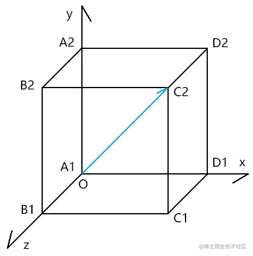
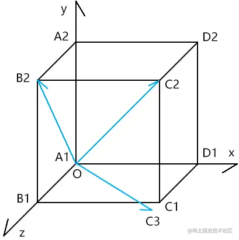

# WebGL 欧拉与四元数

---
源码：[github.com/buglas/webg…](https://link.juejin.cn/?target=https%3A%2F%2Fgithub.com%2Fbuglas%2Fwebgl-lesson "https://github.com/buglas/webgl-lesson")

首先我们要知道，物体旋转的复杂程度是位移和缩放的n多倍。

我们以前在旋转物体时，只是让其绕坐标轴x|y|z 旋转。

然而，在实际项目开发中，我们会有其它的旋转需求。

比如：

-   欧拉Euler：让物体基于世界坐标系绕x轴旋转a°，然后绕本地坐标系y轴旋转b°，最后绕本地坐标系z轴旋转c°。
-   四元数Quaternion：让物体绕任意一轴旋转a°。

在说复杂旋转之前，我们需要对旋转的方向有一个透彻的认知，所以我先简单说一下单轴逆时针旋转。

### 1-顶点绕单轴逆时针旋转

在右手坐标系的逆时针旋转里，绕y轴的逆时针旋转有点特别。

绕y轴旋转时，x轴正半轴是起始轴，即x轴正半轴的弧度为0。

一顶点绕y轴逆时针旋转时，旋转量越大，弧度值越小。

而绕其它两个轴旋转时，则与其相反：

一顶点绕x轴或z轴逆时针旋转时，旋转量越大，弧度值越大。

这就是为什么我让银河系的本地坐标系\[O2;i2,j2,k2\]绕j2轴逆时针旋转20°时，是通过-20°取的sin值和cos值。

这个推理，我们可以通过three.js的Matrix4对象的makeRotationX()、makeRotationY()、makeRotationZ() 来核对一下。

```
//30°
const ang = 30 * Math.PI / 180
//three.js四维矩阵对象
const m = new Matrix4()

//绕x轴逆时针旋转30°
{
    //three.js 旋转
    m.makeRotationX(ang)
    console.log(...m.elements);

    //手动旋转
    const c = Math.cos(ang)
    const s = Math.sin(ang)
    console.log(
        1, 0, 0, 0,
        0, c, s, 0,
        0, -s, c, 0,
        0, 0, 0, 1,
    );
}

//绕y轴逆时针旋转30°
{
    //three.js 旋转
    m.makeRotationY(ang)
    console.log(...m.elements);

    //手动旋转
    const c = Math.cos(-ang)
    const s = Math.sin(-ang)
    console.log(
        c, 0, s, 0,
        0, 1, 0, 0,
        -s, 0, c, 0,
        0, 0, 0, 1,
    );
}

//绕z轴逆时针旋转30°
{
    //three.js 旋转
    m.makeRotationZ(ang)
    console.log(...m.elements);

    //手动旋转
    const c = Math.cos(ang)
    const s = Math.sin(ang)
    console.log(
        c, s, 0, 0,
        -s, c, 0, 0,
        0, 0, 1, 0,
        0, 0, 0, 1,
    );
}
```

扩展

大家要可以刻意锻炼一下自己的空间想象能力，在自己的识海里植入一个三维坐标系。

一般大家喜欢通过画图来推演三维算法，但那终究是二维的。

我们的眼睛决定了我们无法720° 无死角的观察三维场景，就像修真小说那样，放开神识，可以看见你身周方圆百里之内的一切事物。

不过，我们可以在自己的识海中搭建三维场景，你的识海越稳固，场景就可以越清晰、越复杂，这样比我们自己在纸上画图方便得多。

### 2-欧拉旋转

欧拉旋转就是绕单轴多次逆时针旋转，第一次是绕世界坐标系的单轴逆时针旋转，之后则是绕本地坐标系的单轴逆时针旋转。

#### 2-1-示例

已知：

世界坐标系m1

点P 在世界坐标系内

点P 的世界坐标位P1(x,y,z)

求：

点P绕世界坐标系的x轴逆时针旋转angX度，

绕本地坐标系的y轴逆时针旋转angY度，

绕本地坐标系的z轴逆时针旋转angZ度后的世界位P2。

解：

分别基于angX,angY,angZ 建立三个矩阵mx,my,mz

点P的世界位是：

```
P2=mx*my*mz*P1
```

#### 2-3-验证

我可以在three.js 里验证一下。

```
import { Group, Matrix4, Object3D, Scene, Vector3, Euler } from 'https://unpkg.com/three/build/three.module.js';

const [angX, angY, angZ] = [1, 2, 3]
const P1 = new Vector3(1, 1, 1)

//用矩阵乘法实现顶点绕单轴多次逆时针旋转
{
    const mx = new Matrix4().makeRotationX(angX)
    const my = new Matrix4().makeRotationY(angY)
    const mz = new Matrix4().makeRotationZ(angZ)
    //P2=mx*my*mz*P1
    const P2 = P1.clone()
    P2.applyMatrix4(mx.multiply(my).multiply(mz))
    console.log(P2);
}

//用欧拉实现顶点绕单轴多次逆时针旋转
{
    const euler = new Euler(angX, angY, angZ)
    const m = new Matrix4()
    m.makeRotationFromEuler(euler)
    const P2 = P1.clone().applyMatrix4(m)
    console.log(P2);
}
```

上面P2 的两个输出结果都是一样的。

#### 2-4-讲个故事理解欧拉

通过之前的代码，大家可以发现欧拉旋转和咱们之前说过的世界坐标系、本地坐标系的呼应规律。

我们可以即此编一个关于王者荣耀故事：

-   宇宙，宇宙的本地坐标系是万物的世界坐标系，此坐标系为单位矩阵
-   mx：银河系的本地坐标系
-   my：太阳系的本地坐标系
-   mz：凡间界的本地坐标系
-   P1：瑶在欧拉旋转前的世界位 （瑶是王者荣耀里的角色）
-   宇宙∋银河系∋太阳系∋凡间界∋瑶

求：瑶欧拉旋转(angX,angY,angZ) 后的世界位P2，旋转顺序为xyz

解：

1.  让瑶坠落凡间界。
    
    当前宇宙万界的本地坐标系都是单位矩阵，所以瑶的世界坐标位P1，也是瑶在万界中的本地坐标位。
    
    下面的P1也就可以理解为瑶在凡间界的本地坐标位。
    
    ```
    const P1 = new Vector3(1, 1, 1)
    ```
    
2.  将银河系、太阳系、凡间界分别沿x轴、y轴、z轴旋转angX、angY、angZ度。
    
    ```
    const mx = new Matrix4().makeRotationX(angX)
    const my = new Matrix4().makeRotationY(angY)
    const mz = new Matrix4().makeRotationZ(angZ)
    ```
    
3.  让瑶跳出三界之外，求其世界位
    
    ```
    //P2=mx*my*mz*P1
    const P2 = P1.clone()
    P2.applyMatrix4(mx.multiply(my).multiply(mz))
    ```
    

关于欧拉的旋转概念，我就先说到这，接下咱们再说一下四元数。

### 3-四元数

四元数Quaternion：让物体绕任意轴旋转a°。

我们对四元数的深度理解，也可以让我们脑海中的三维空间意识更加牢固。

我们通过一个例子来说明四元数旋转的实现过程。



已知：

-   轴OC2
-   弧度ang
-   点P1(x,y,z)

```
const OC2 = new Vector3(3, 2, 1).normalize()
const ang = 2
const P1 = new Vector3(1, 2, 3)
```

求：点P1绕OC2逆时针旋转ang度后的位置P2

解：

我接下来要把OC2转得与z轴同向。

1.  计算绕x轴把OC2旋转到平面Ozx上的旋转矩阵mx1。

旋转的度数是OC2在平面Oyz上的正射影OB2与z轴的夹角，即∠B2OB1。



```
const B2OB1 = Math.atan2(OC2.y, OC2.z)
const mx1 = new Matrix4().makeRotationX(B2OB1)
```

2.  顺便再求出绕x轴反向旋转∠B2OB1的矩阵mx2，以备后用。

```
const mx2 = new Matrix4().makeRotationX(-B2OB1)
```

3.  基于矩阵mx1旋转OC2，旋转到OC3的位置。

```
//OC3 = m1*OC2
const OC3 = OC2.clone()
OC3.applyMatrix4(mx1)
```

4.  计算绕y轴把OC3旋转到z轴上的旋转矩阵my1。

旋转的度数是OC3与z轴的夹角，即∠C3OB1。

```
const C3OB1 = Math.atan2(OC3.x, OC3.z)
const my1 = new Matrix4().makeRotationY(-C3OB1)
```

 至于旋转后OC3在哪里，就不重要了，我们只要知道了其旋转了多少度，以及其最后会和z轴同向就够了。

5.  顺便再求出绕y轴反向旋转∠C3OB1的矩阵my2，以备后用。

```
const my2 = new Matrix4().makeRotationY(C3OB1)
```

6.  在OC2转到z轴上的时候，也让点P1做等量的旋转，得P2点

```
//P2 =my1*mx1*P1
const P2 = P1.clone()
P2.applyMatrix4(mx1)
P2.applyMatrix4(my1)
```

7.  计算绕z轴旋转ang度的矩阵mz

```
const mz = new Matrix4().makeRotationZ(ang)
```

8.  让点P2绕z轴旋转ang 度

```
P2.applyMatrix4(mz)
```

9.  让点P2按照之前OC2的旋转量再逆向转回去。

```
P2.applyMatrix4(my2)
P2.applyMatrix4(mx2)
```

我们也可以把所有的矩阵合一下，再乘以P2

```
const P2 = P1.clone()
const m = mx2.multiply(my2)
.multiply(mz)
.multiply(my1)
.multiply(mx1)
P2.applyMatrix4(m)
```

10.  验证

```
const quaternion = new Quaternion();
quaternion.setFromAxisAngle(OC2, ang);
const m = new Matrix4()
m.makeRotationFromQuaternion(quaternion)
console.log(
    P1.clone().applyMatrix4(m)
);
```

总结一下四元数旋转的实现原理：

1.  将旋转轴带着顶点一起旋转，让旋转轴与xyz中的某一个轴同向，比如z轴。
2.  让顶点绕z轴旋转相应的度数。
3.  让顶点按照之前旋转轴的旋转量逆向转回去。

注：

其实，四元数旋转的解法有很多种，比如我们还可以用复数来解四元数。

我上面所说的这种是我当前所知的最笨的，也是最通俗易懂的解四元数的方法。

我这里的主要目的就是先让大家把原理搞懂。

至于更加快捷、炫酷的解四元数的方法，等我讲完整个课程，再给大家补充。
