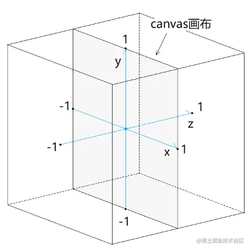
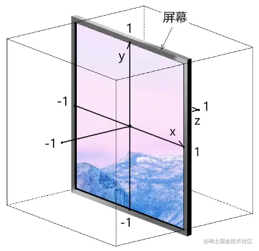
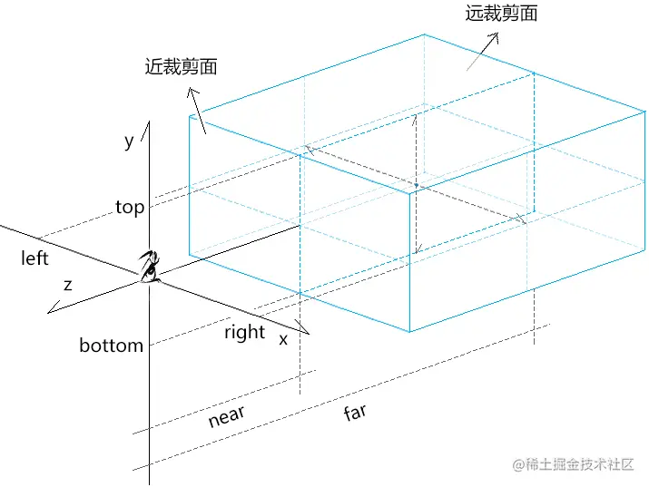
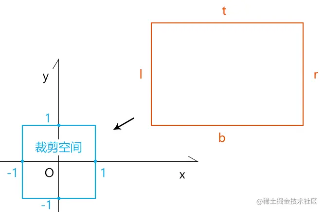
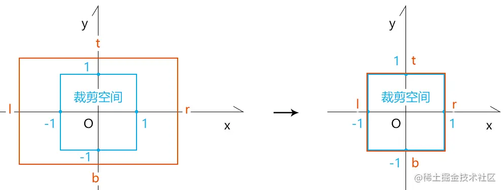
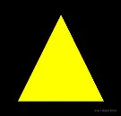

# WebGL 正交投影矩阵

---
源码：[github.com/buglas/webg…](https://link.juejin.cn/?target=https%3A%2F%2Fgithub.com%2Fbuglas%2Fwebgl-lesson "https://github.com/buglas/webgl-lesson")

WebGL 是一个光栅引擎，其本身并不会实现三维效果，那我们要在其中实现三维效果的关键就在于算法：

```
顶点在裁剪空间中的位置=投影矩阵*视图矩阵*模型矩阵*顶点的初始点位

```

正交投影矩阵是投影矩阵的一种，我们先从它说起。

在说正交投影矩阵之前，我们还需要对裁剪空间有一个清晰的认知。

### 1-裁剪空间

裁剪空间是用于显示webgl图形的空间，此空间是一个宽、高、深皆为2 的盒子。其坐标系的原点在canvas画布的中心，如下图：



裁剪空间中：

-   x轴上-1的位置对应canvas画布的左边界，1的位置对应canvas 画布的右边界
-   y轴上-1的位置对应canvas画布的下边界，1的位置对应canvas 画布的上边界
-   z轴上-1的位置朝向屏幕外部，1的位置朝向屏幕内部，如下图：



### 2-正交投影矩阵的实现原理



正交投影矩阵 orthographic projection：将世界坐标系中的一块矩形区域(正交相机的可视区域)投射到裁剪空间中，不同深度的物体不具备近大远小的透视规则。



请问：要将一个任意尺寸的长方体塞进裁剪空间里，分几步？

答：先位移，再缩放



设：正交相机可视区域的上、下、左、右、前、后的边界分别是t、b、l、r、n、f

1.位移矩阵

```
[    1,0,0,-(r+l)/2,    0,1,0,-(t+b)/2,    0,0,1,-(f+n)/2,    0,0,0,1,]
```

2.缩放矩阵

```
[    2/(r-l), 0,       0,        0,    0,       2/(t-b), 0,        0,    0,       0,       2/(f-n), 0,    0,       0,       0,        1,]
```

正交投影矩阵=缩放矩阵\*位移矩阵

```
[    2/(r-l), 0,       0,        -(r+l)/(r-l),    0,       2/(t-b), 0,        -(t+b)/(t-b),    0,       0,       2/(f-n),  -(f+n)/(f-n),    0,       0,       0,        1,]
```

若n、f是一个距离量，而不是在z轴上的刻度值，正交投影矩阵在z轴上的缩放因子需要取反：

```
[    2/(r-l), 0,       0,         -(r+l)/(r-l),    0,       2/(t-b), 0,         -(t+b)/(t-b),    0,       0,       -2/(f-n),  -(f+n)/(f-n),    0,       0,       0,         1,]
```

### 3-正交投影矩阵的代码实现

正交投影矩阵的代码实现很简单，我们可以直接从three.js 的Matrix4对象的makeOrthographic() 方法中找到：

```
makeOrthographic( left, right, top, bottom, near, far ) {

    const te = this.elements;
    const w = 1.0 / ( right - left );
    const h = 1.0 / ( top - bottom );
    const p = 1.0 / ( far - near );

    const x = ( right + left ) * w;
    const y = ( top + bottom ) * h;
    const z = ( far + near ) * p;

    te[ 0 ] = 2 * w;    te[ 4 ] = 0;    te[ 8 ] = 0;    te[ 12 ] = - x;
    te[ 1 ] = 0;    te[ 5 ] = 2 * h;    te[ 9 ] = 0;    te[ 13 ] = - y;
    te[ 2 ] = 0;    te[ 6 ] = 0;    te[ 10 ] = - 2 * p;    te[ 14 ] = - z;
    te[ 3 ] = 0;    te[ 7 ] = 0;    te[ 11 ] = 0;    te[ 15 ] = 1;

    return this;
}
```

以前我们在绘制webgl 图形的时候，它们会随canvas 画布的大小发生拉伸，对于这个问题，我们便可以用投影矩阵来解决。

### 4-使用正交投影矩阵解决webgl图形拉伸问题

我们先准备一个三角形。

1.顶点着色器

```
<script id="vertexShader" type="x-shader/x-vertex">
    attribute vec4 a_Position;
    uniform mat4 u_ProjectionMatrix;
    void main(){
      gl_Position = u_ProjectionMatrix*a_Position;
    }
</script>
```

-   u\_ProjectionMatrix 正交投影矩阵

2.片元着色器。

```
<script id="fragmentShader" type="x-shader/x-fragment">
    precision mediump float;
    uniform vec4 u_Color;
    void main(){
      gl_FragColor=u_Color;
    }
</script>
```

3.绘制1个三角形

```
<script type="module">
    import { initShaders } from '../jsm/Utils.js';
    import { Matrix4, Vector3, Quaternion, Object3D, OrthographicCamera } from 'https://unpkg.com/three/build/three.module.js';
    import Poly from './jsm/Poly.js'

    const canvas = document.getElementById('canvas');
    const [viewW, viewH] = [window.innerWidth, window.innerHeight]
    canvas.width = viewW;
    canvas.height = viewH;
    const gl = canvas.getContext('webgl');

    const vsSource = document.getElementById('vertexShader').innerText;
    const fsSource = document.getElementById('fragmentShader').innerText;
    initShaders(gl, vsSource, fsSource);
    gl.clearColor(0.0, 0.0, 0.0, 1.0);

    const projectionMatrix = new Matrix4()

    const triangle = new Poly({
      gl,
      source: [
        0, 0.3, -0.2,
        - 0.3, -0.3, -0.2,
        0.3, -0.3, -0.2
      ],
      type: 'TRIANGLES',
      attributes: {
        a_Position: {
          size: 3,
          index: 0
        },
      },
      uniforms: {
        u_Color: {
          type: 'uniform4fv',
          value: [1, 1, 0, 1]
        },
        u_ProjectionMatrix: {
          type: 'uniformMatrix4fv',
          value: projectionMatrix.elements
        },
      }
    })

    render()

    function render() {
      gl.clear(gl.COLOR_BUFFER_BIT);
      triangle.draw()
    }

</script>
```

效果如下：



默认情况下，webgl 图形会被canvas 画布所拉伸。

我们可以通过对相机上下左右边界的设置，使其不被canvas 画布所拉伸。

4.定义相机世界高度尺寸的一半

```
const halfH = 2
```

5.计算画布的宽高比

```
const ratio = canvas.width / canvas.height
```

6.基于halfH和画布宽高比计算相机世界宽度尺寸的一半

```
const halfW = halfH * ratio
```

7.定义相机世界的6个边界

```
const [left, right, top, bottom, near, far] = [    -halfW, halfW, halfH, -halfH, 0, 4]
```

8.获取正交投影矩阵

```
projectionMatrix.makeOrthographic(
    left, right, top, bottom, near, far
)
```

我们利用投影矩阵将现实世界投射到裁剪空间中后，往往还会对裁剪空间中视图进行位移或旋转，这时候就需要视图矩阵了。
