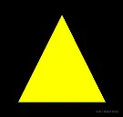
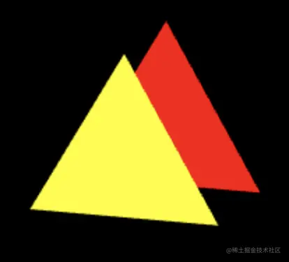

# 通过three.js 认识视图矩阵

---
源码：[github.com/buglas/webg…](https://link.juejin.cn/?target=https%3A%2F%2Fgithub.com%2Fbuglas%2Fwebgl-lesson "https://github.com/buglas/webgl-lesson")

### 1-视图位移

1.基于之前的代码，再绘制一个三角形

```
const triangle1 = crtTriangle(
    [1, 0, 0, 1],
    [
        0, 0.3, -0.2,
        - 0.3, -0.3, -0.2,
        0.3, -0.3, -0.2
    ]
)

const triangle2 = crtTriangle(
    [1, 1, 0, 1],
    [
        0, 0.3, 0.2,
        -0.3, -0.3, 0.2,
        0.3, -0.3, 0.2,
    ]
)

render()

function render() {
    gl.clear(gl.COLOR_BUFFER_BIT);

    triangle1.init()
    triangle1.draw()

    triangle2.init()
    triangle2.draw()
}

function crtTriangle(color, source) {
    return new Poly({
        gl,
        source: new Float32Array(source),
        type: 'TRIANGLES',
        attributes: {
            a_Position: {
                size: 3,
                index: 0
            },
        },
        uniforms: {
            u_Color: {
                type: 'uniform4fv',
                value: color
            },
            u_ProjectionMatrix: {
              type: 'uniformMatrix4fv',
              value: projectionMatrix.elements
            },
        }
    })
}
```

这是一前一后两个三角形。

前面的是黄色三角形，深度为0.2；

后面的是红色三角形，深度为-0.2，被前面的三角形挡住了，所以看不见。

效果如下：



2.从three.js里引入正交相机对象OrthographicCamera

```
import { Matrix4, Vector3,OrthographicCamera } from 'https://unpkg.com/three/build/three.module.js';
```

3.建立正交相机对象

```
const camera = new OrthographicCamera(left, right, top, bottom, near, far)
```

4.设置相机位置position

```
camera.position.set(1, 1, 3)
camera.updateWorldMatrix(true)
```

设置完相机位置后，要使用updateWorldMatrix() 方法更新相机的世界坐标系。

updateWorldMatrix() 方法主要是考虑到了相机存在父级的情况。

updateWorldMatrix() 方法会把更新后的世界坐标系写进写进相机的matrixWorld 属性里。

我们可以打印一下看看：

```
console.log(camera.matrixWorld.elements);

1, 0, 0, 0, 
0, 1, 0, 0,
0, 0, 1, 0, 
1, 1, 3, 1
```

5.将相机的投影矩阵和相机的世界坐标系的逆矩阵合一下，合一个投影视图矩阵。

```
const pvMatrix = new Matrix4()
pvMatrix.multiplyMatrices(
    camera.projectionMatrix,
    camera.matrixWorldInverse
)
```

-   a.multiplyMatrices(b,c) 相当于：

```
a=b*c
```

-   camera.projectionMatrix 可以直接获取相机的投影矩阵
-   matrixWorldInverse 是matrixWorld的逆矩阵，这是因为相机的移动方向和现实中的物体相反。

打印一下：

```
console.log(camera.matrixWorldInverse);

 1   0  0  0 
 0   1  0  0 
 0   0  1  0 
-1  -1 -3  1
```

7.把之前的projectionMatrix改成pvMatrix

-   顶点着色器

```
<script id="vertexShader" type="x-shader/x-vertex">
    attribute vec4 a_Position;
    uniform mat4 u_PvMatrix;
    void main(){
      gl_Position = u_PvMatrix*a_Position;
    }
</script>
```

-   js 代码

```
function crtTriangle(color, source) {
    return new Poly({
        gl,
        source: new Float32Array(source),
        type: 'TRIANGLES',
        attributes: {
            a_Position: {
                size: 3,
                index: 0
            },
        },
        uniforms: {
            u_Color: {
                type: 'uniform4fv',
                value: color
            },
            u_PvMatrix: {
                type: 'uniformMatrix4fv',
                value: pvMatrix.elements
            },
        }
    })
}
```

### 扩展-matrixWorld详解

拿个例子说事。

已知：

-   宇宙universe
    
    -   本地坐标系是m1
    -   m1也是宇宙万界的世界坐标系
-   银河系 galaxy
    
    -   本地坐标系是m2
-   太阳系 solar
    
    -   本地坐标系是m3
-   太阳系∈银河系∈宇宙
    

求：太阳系的世界坐标系matrixWorld

解：

```
matrixWorld=m1*m2*m3
```

答案就这么简单，我们拿代码测一下：

```
//宇宙(世界坐标系是宇宙的本地坐标系)
const universe = new Scene()
universe.applyMatrix4(m1)

//银河系
const galaxy = new Group()
galaxy.applyMatrix4(m2)

//太阳系
const solar = new Group()
solar.applyMatrix4(m3)

//地球
const earth = new Object3D()
earth.position.copy(P3)

//包含关系
solar.add(earth)
galaxy.add(solar)
universe.add(galaxy)

// 更新太阳系的世界坐标系
solar.updateWorldMatrix(true)

//太阳系的世界坐标系
console.log(...solar.matrixWorld.elements);

//手动计算太阳系的世界坐标系
console.log(
...m1.multiply(m2).multiply(m3).elements
);
```

我现在是在把three.js里的核心知识分解到webgl里给大家详细讲解。

这样既可以为大家以后搭建自己的三维渲染引擎打下基础，也可以让大家真正的把three.js 当成工具来用。

之前有的小伙伴总想着直接去学习three.js，然后快速开发项目。

然而，这种这种想法对于开发简单的小项目还好，一遇到复杂些的图形项目，那就会举步维艰。

所以，既然决定要走图形可视化这条路，就一定要夯实基础。

### 2-视图旋转

我们之前实现了视图的移动效果，然而有时候当我们遇到一个好玩的物体时，需要在不移动相机的前提下看向它。

这个时候，我们就需要旋转视图了。

#### 2-1-用lookAt()实现视图旋转

接下来，我还是站在three.js 这个巨人的肩膀上，用它的lookAt()方法实现视图旋转。

已知：

-   正交相机的边界 left, right, top, bottom, near, far
-   正交相机的视点位置 eye
-   正交相机的目标点 target
-   正交相机从eye看向target时的上方向up

求：从视点看向目标点时的投影视图矩阵 pvMatrix

解：

1.声明已知条件

```
const halfH = 2
const ratio = canvas.width / canvas.height
const halfW = halfH * ratio
const [left, right, top, bottom, near, far] = [
    -halfW, halfW, halfH, -halfH, 0, 4
]
const eye = new Vector3(1, 1, 3)
const target = new Vector3(0, 0, 0)
const up = new Vector3(0, 1, 0)
```

2.建立正交相机

```
const camera = new OrthographicCamera(
    left, right, top, bottom, near, far
)
```

3.设置相机的位置

```
camera.position.copy(eye)
```

4.使用lookAt()方法，让相机看向目标点，并更新一下相机的世界坐标系。

```
camera.lookAt(target)
camera.updateWorldMatrix(true)
```

上面的lookAt() 方法实际上就是在让相机世界进行旋转。

之后，现实世界在裁剪空间中显示的时候，便会基于此旋转量逆向旋转。

5.通过相机计算投影视图矩阵 pvMatrix

```
const pvMatrix = new Matrix4()
pvMatrix.multiplyMatrices(
    camera.projectionMatrix,
    camera.matrixWorldInverse,
)
```

效果如下：



接下来，我们对lookAt 功能进行一下深度剖析。

#### 2-2-深度剖析lookAt功能

我们先不考虑相机存在父级情况。

我们可以从之前的正交相机里分解出以下矩阵：

-   视图矩阵viewMatrix：相机位移矩阵乘以旋转矩阵后的逆矩阵，即相机的世界矩阵的逆矩阵
    
    -   位移矩阵positionMatrix：由视点位置得出
    -   旋转矩阵rotationMatrix：由视点、目标点、上方向得出
-   投影矩阵projectionMatrix：由正交相机的6个边界得出
    
-   投影视图矩阵：投影矩阵乘以视图矩阵
    

接下来咱们就基于之前的代码做一下分解：

1.由视点位置得出位移矩阵positionMatrix

```
const positionMatrix = new Matrix4().setPosition(eye)
```

2.由视点、目标点、上方向得出旋转矩阵rotationMatrix

```
const rotationMatrix = new Matrix4().lookAt(eye,target,up)
```

3.基于位移矩阵和旋转矩阵计算视图矩阵 viewMatrix

```
const viewMatrix = new Matrix4().multiplyMatrices(
    positionMatrix,
    rotationMatrix
).invert()
```

4.由正交相机对象提取投影矩阵 projectionMatrix

```
const camera = new OrthographicCamera(
    left, right, top, bottom, near, far
)
const projectionMatrix = camera.projectionMatrix
```

5.由投影矩阵和视图矩阵的相乘得到投影视图矩阵 pvMatrix

```
const pvMatrix = new Matrix4().multiplyMatrices(
    projectionMatrix,
    viewMatrix
)
```

6.最后在顶点着色器里让pvMatrix乘以顶点点位即可

```
attribute vec4 a_Position;
uniform mat4 u_PvMatrix;
void main(){
    gl_Position = u_PvMatrix*a_Position;
}
```

注：若相机对象存在父级，就需要基于相机的世界坐标系做相应运算了。
