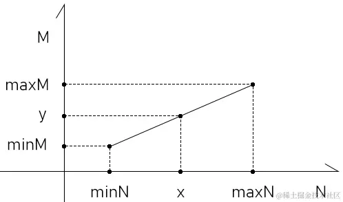
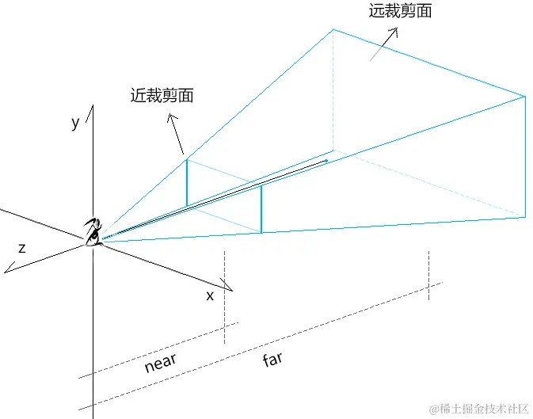
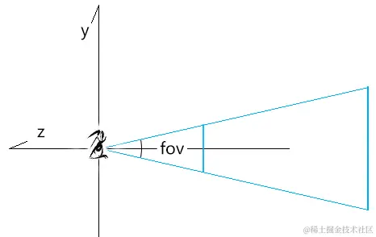
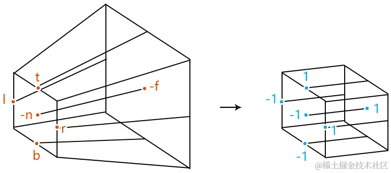
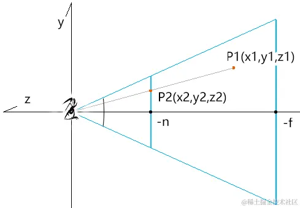
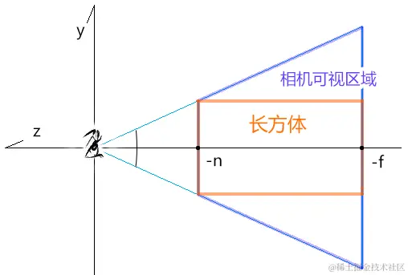
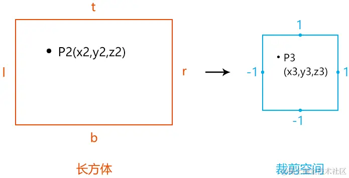
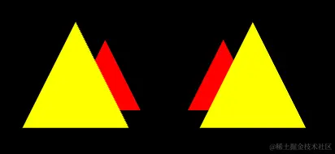

# WebGL 透视投影矩阵

---
源码：[github.com/buglas/webg…](https://link.juejin.cn/?target=https%3A%2F%2Fgithub.com%2Fbuglas%2Fwebgl-lesson "https://github.com/buglas/webgl-lesson")

透视投影矩阵可以将现实世界更真实的投射到裁剪空间中。

我们的肉眼看现实世界时，用的就是透视投影矩阵。


透视投影矩阵包含了许多的基础图形知识，这些知识在其它地方都是能单独用得上的。

透视投影矩阵是一个专业图形程序员所必备的，只有对其有了透彻的理解，我们才能有底气将薪资要到30K、或者40K之上。

接下来，为了让大家学起来更加流畅，咱们先强调点基础知识。

### 1-基础知识

为了让大家学起来更加丝滑，我再跟大家强调两个知识点。

#### 1-1-齐次坐标系

在齐次坐标系中以下等式是成立的：

```
(x,y,z,1)=(x,y,z,1)*k=(kx,ky,kz,k) k≠0
(x,y,z,1)=(x,y,z,1)*z=(zx,zy,z²,z) z≠0
```

比如：

(1,0,0,1)和(2,0,0,2) 都代表同一个三维点位(1,0,0)

#### 1-2-线性补间运算

之前我们说过斜截式y=kx+b，它就是线性补间运算的公式。

除了斜截式，两种数据间的线性映射关系还可以用其它方法来表示。



已知：

-   N类型的数据极值是\[minN,maxN\]
-   M类型的数据极值是\[minM,maxM\]
-   x属于N
-   将x映射到M的中的值为y

则x,y 的关系可以用两个等式表示：

1.  比例式：

```
(x-minN)/(maxN-minN)=(y-minM)/(maxM-minM)
```

2.  斜截式

```
k=(maxM-minM)/(maxN-minN)
b=minM-minN*k
y=kx+b
```

通过线性插值的特性，我们可以知道：

\[minN,maxN\]中的每个点都与\[minM,maxM\]中的唯一点相对应，由一个x便可以求出唯一一个y。

基础知识咱们就先说到这，接下来咱们认识一下透视投影矩阵。

### 2-认识透视投影矩阵

透视投影矩阵 perspective projection：将世界坐标系中的一块四棱台形的区域投射到裁剪空间中，不同深度的物体具备近大远小的透视规则。





透视相机的建立需要以下已知条件：

-   fov：摄像机视锥体垂直视野角度
-   aspect：摄像机视锥体宽高比
-   near：摄像机近裁剪面到视点的距离
-   far：摄像机远裁剪面到视点的距离



请问：要将一个任意尺寸的正四棱台塞进裁剪空间里，分几步？

答：从透视到正交。

1.收缩远裁剪面，将原来的正四棱台变成长方体。

2.像之前的正交投影矩阵一样，将长方体先位移，再缩放。

接下来咱们就去计算一下透视投影矩阵。

### 3-计算透视投影矩阵

1.基于fov、aspect、n(near)、f(far)计算近裁剪面边界。


```
t=n*tan(fov/2)
b=-t
r=t*aspect
l=-r
```

2.设：可视区域中一顶点为P1(x1,y1,z1)

 求：求P1在近裁剪面上的投影P2(x2,y2,z2)



由相似三角形性质得：

```
x1/x2=y1/y2=z1/z2
```

因为：

```
z2=-n
```

所以：

```
x2=nx1/-z1
y2=ny1/-z1
```

若我们把P1点的x1,y1替换成x2,y2，就可以理解为把相机可视区域塞进了一个长方体里。



3.把长方体里的顶点塞进裁剪空间中。



设：P2映射到裁剪空间中的点为P3(x3,y3,z3) 点

则：P2点和P3点满足以下关系式：

-   x方向

```
(x3-(-1))/(1-(-1))=(x2-l)/(r-l)
(x3+1)/2=(x2-l)/(r-l)
(x3+1)=2(x2-l)/(r-l)
x3=2(x2-l)/(r-l)-1
x3=2(x2-l)/(r-l)-(r-l)/(r-l)
x3=(2(x2-l)-(r-l))/(r-l)
x3=(2x2-(r+l))/(r-l)
x3=2x2/(r-l)-(r+l)/(r-l)
```

因为：

```
x2=nx1/-z1
```

所以：

```
x3=2(nx1/-z1)/(r-l)-(r+l)/(r-l)
x3=(2n/(r-l))x1/-z1-(r+l)/(r-l)
```

-   y方向

```
(y3-(-1))/(1-(-1))=(y2-b)/(t-b)
y3=(2n/(t-b))y1/-z1-(t+b)/(t-b)
```

观察一下当前求出的x3,y3：

```
x3=(2n/(r-l))x1/-z1-(r+l)/(r-l)
y3=(2n/(t-b))y1/-z1-(t+b)/(t-b)
```

只要让x3,y3 乘以-z1，便可以得到一个齐次坐标P4(x4,y4,z4,w4)：

```
x4=(2n/(r-l))x1+((r+l)/(r-l))z1
y4=(2n/(t-b))y1+((t+b)/(t-b))z1
z4=?
w4=-z1
```

当前把顶点的z分量投射到裁剪空间中的方法，我们还不知道，所以z4=?

我们可以先从已知条件中提取投影矩阵(行主序)的矩阵因子：

```
[  2n/(r-l)       0         (r+l)/(r-l)   0,  0              2n/(t-b)  (t+b)/(t-b)   0,  ?              ?          ?            ?,  0              0          -1           0]
```

接下来，就剩下z轴相关的矩阵因子了。

因为整个投影矩阵始终是在做线性变换的，投影点的z值与投影矩阵的z轴向的x,y分量无关。

所以投影矩阵的z轴向的x,y分量可以写做0，z和w分量可以设为k,b，如下：

```
[  2n/(r-l)       0         (r+l)/(r-l)   0,  0              2n/(t-b)  (t+b)/(t-b)   0,  0              0          k            b  0              0          -1           0]
```

之前说了，整个投影矩阵始终是在做线性变换，所以我们可以用k,b组合一个点斜式：

```
z4=k*z1+b
```

当然，你也可以认为是点积的结果：

```
z4=(0,0,k,b)·(x1,y1,z1,1)
z4=k*z1+b
```

接下来，我们只要求出上面的k,b,就可以得到透视投影矩阵。

我们可以用当前的已知条件，构建一个二元一次方程组，求出k,b：


-   当z1=-n 时，z3=-1
    
    由z3 逆推z4得：z4=z3\*-z1=-1\*n
    
    所以：
    

```
z4=k*z1+b
-1*n=k*-n+b
-n=-kn+b
b=kn-n
```

-   当z1=-f 时，z3=1，z4=1\*-z1
    
    由z3 逆推z4得：z4=z3\*-z1=1\*f
    
    所以：
    

```
z4=k*z1+b
1*f=k*-f+b
f=-kf+b
kf=b-f
k=(b-f)/f
```

用消元法求b：

```
b=kn-n
b=((b-f)/f)n-n
b=(b-f)n/f-n
fb=(b-f)n-fn
fb=bn-fn-fn
fb-bn=-2fn
b(f-n)=-2fn
b=-2fn/(f-n)
```

再求k：

```
k=(b-f)/f
k=(-2fn/(f-n)-f)/f
k=-2n/(f-n)-1
k=(-2n-f+n)/(f-n)
k=(-f-n)/(f-n)
k=-(f+n)/(f-n)
```

最终的透视投影矩阵如下：

```
[  2n/(r-l)       0         (r+l)/(r-l)   0,  0              2n/(t-b)  (t+b)/(t-b)   0,  0              0         -(f+n)/(f-n)  -2fn/(f-n),  0              0         -1            0]
```

透视投影的建立方法，我们可以在three.js 的源码里找到。

### 4-three.js 里的透视投影矩阵

three.js 的PerspectiveCamera对象的updateProjectionMatrix() 方法，便是透视相机建立透视投影矩阵的方法。

```
updateProjectionMatrix() {
    const near = this.near;
      //近裁剪面上边界
    let top = near * Math.tan( MathUtils.DEG2RAD * 0.5 * this.fov ) / this.zoom;
    //近裁剪面高度
    let height = 2 * top;
    //近裁剪面宽度
    let width = this.aspect * height;
    //近裁剪面左边界
    let left = - 0.5 * width;
    //默认为null
    const view = this.view;

    //多视图
    if ( this.view !== null && this.view.enabled ) {
        const fullWidth = view.fullWidth,
              fullHeight = view.fullHeight;
        left += view.offsetX * width / fullWidth;
        top -= view.offsetY * height / fullHeight;
        width *= view.width / fullWidth;
        height *= view.height / fullHeight;

    }
    //偏离值，默认0
    const skew = this.filmOffset;
    if ( skew !== 0 ) left += near * skew / this.getFilmWidth();
    
    //基于近裁剪面边界、近裁剪面和远裁剪面到相机视点的距离设置投影矩阵
    this.projectionMatrix.makePerspective( left, left + width, top, top - height, near, this.far );

    //投影矩阵的逆矩阵
    this.projectionMatrixInverse.copy( this.projectionMatrix ).invert();

}
```

-   makePerspective() 是Matrix4对象里的方法，会基于投影空间建立透视投影矩阵

```
makePerspective( left, right, top, bottom, near, far ) {
    const te = this.elements;
    
    const x = 2 * near / ( right - left );
    const y = 2 * near / ( top - bottom );
    const a = ( right + left ) / ( right - left );
    const b = ( top + bottom ) / ( top - bottom );
    const c = - ( far + near ) / ( far - near );
    const d = - 2 * far * near / ( far - near );

    te[ 0 ] = x;    te[ 4 ] = 0;    te[ 8 ] = a;    te[ 12 ] = 0;
    te[ 1 ] = 0;    te[ 5 ] = y;    te[ 9 ] = b;    te[ 13 ] = 0;
    te[ 2 ] = 0;    te[ 6 ] = 0;    te[ 10 ] = c;    te[ 14 ] = d;
    te[ 3 ] = 0;    te[ 7 ] = 0;    te[ 11 ] = - 1;    te[ 15 ] = 0;

    return this;
}
```

### 5-透视投影矩阵牛刀小试

我们用透视投影矩阵展示几个可以近大远小的三角形。



1.着色器

```
<script id="vertexShader" type="x-shader/x-vertex">
  attribute vec4 a_Position;
  uniform mat4 u_ProjectionMatrix;
  void main(){
      gl_Position = u_ProjectionMatrix*a_Position;
  }
</script>
<script id="fragmentShader" type="x-shader/x-fragment">
  precision mediump float;
  uniform vec4 u_Color;
  void main(){
      gl_FragColor=u_Color;
  }
</script>
```

2.初始化着色器

```
import { initShaders } from '../jsm/Utils.js';
import { Matrix4,PerspectiveCamera, Vector3, Quaternion, Object3D, OrthographicCamera } from 'https://unpkg.com/three/build/three.module.js';
import Poly from './jsm/Poly.js'

const canvas = document.getElementById('canvas');
const [viewW, viewH] = [window.innerWidth, window.innerHeight]
canvas.width = viewW;
canvas.height = viewH;
const gl = canvas.getContext('webgl');

const vsSource = document.getElementById('vertexShader').innerText;
const fsSource = document.getElementById('fragmentShader').innerText;
initShaders(gl, vsSource, fsSource);
gl.clearColor(0.0, 0.0, 0.0, 1.0);
```

3.建立透视相机

```
const [fov,aspect,near,far]=[
    45,
    canvas.width / canvas.height,
    1,
    20
]
const camera = new PerspectiveCamera(fov,aspect,near,far)
```

4.基于相机的透视投影矩阵，绘制4个三角形。

前面是两个黄色三角形，后面是两个红色三角形。

```
const triangle1 = crtTriangle(
    [1, 0, 0, 1],
    [-0.5,0,-3]
)

const triangle2 = crtTriangle(
    [1, 0, 0, 1],
    [0.5,0,-3]
)

const triangle3 = crtTriangle(
    [1, 1, 0, 1],
    [-0.5,0,-2]
)

const triangle4 = crtTriangle(
    [1, 1, 0, 1],
    [0.5,0,-2]
)

function crtTriangle(color, [x,y,z]) {
    return new Poly({
        gl,
        source: [
            x, 0.3+y, z,
            -0.3+x, -0.3+y, z,
            0.3+x, -0.3+y, z,
        ],
        type: 'TRIANGLES',
        attributes: {
            a_Position: {
                size: 3,
                index: 0
            },
        },
        uniforms: {
            u_Color: {
                type: 'uniform4fv',
                value: color
            },
            u_ProjectionMatrix: {
                type: 'uniformMatrix4fv',
                value: camera.projectionMatrix.elements
            },
        }
    })
}

gl.clear(gl.COLOR_BUFFER_BIT);
render()

function render() {
    gl.clear(gl.COLOR_BUFFER_BIT);

    triangle1.init()
    triangle1.draw()
    
    triangle2.init()
    triangle2.draw()

    triangle3.init()
    triangle3.draw()

    triangle4.init()
    triangle4.draw()
}
```
