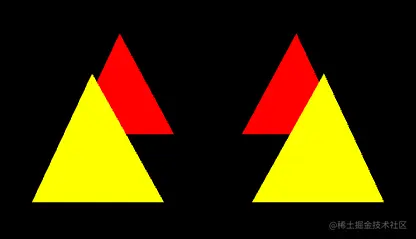

# WebGL 投影矩阵、视图矩阵、模型矩阵共冶一炉

---
源码：[github.com/buglas/webg…](https://link.juejin.cn/?target=https%3A%2F%2Fgithub.com%2Fbuglas%2Fwebgl-lesson "https://github.com/buglas/webgl-lesson")

投影矩阵、视图矩阵、模型矩阵的结合方式：

```
顶点在裁剪空间中的位置=投影矩阵*视图矩阵*模型矩阵*初始顶点坐标

```

### 1-投影视图矩阵

1.在顶点着色器里把投影矩阵变成投影视图矩阵。

```
<script id="vertexShader" type="x-shader/x-vertex">
    attribute vec4 a_Position;
    uniform mat4 u_PvMatrix;
    void main(){
      gl_Position = u_PvMatrix*a_Position;
    }
</script>
```

2.设置相机位置，并让其看向一点

```
const eye = new Vector3(0, 1, 1)
const target = new Vector3(0, 0, -2.5)
const up = new Vector3(0, 1, 0)

const [fov,aspect,near,far]=[
    45,
    canvas.width / canvas.height,
    1,
    20
]

const camera = new PerspectiveCamera(fov,aspect,near,far)
camera.position.copy(eye)
camera.lookAt(target)
camera.updateWorldMatrix(true)
```

3.计算投影视图矩阵，即让相机的投影矩阵乘以视图矩阵

```
const pvMatrix = new Matrix4()
pvMatrix.multiplyMatrices(
    camera.projectionMatrix,
    camera.matrixWorldInverse,
)
```

4.修改一下建立三角形方法里的uniform 变量

```
u_PvMatrix: {
    type: 'uniformMatrix4fv',
    value: pvMatrix.elements
},
```

效果如下：



接下来，我们再把模型矩阵加进去。

### 2-投影视图矩阵乘以模型矩阵

之前我们设置三角形位置的时候，是直接对顶点的原始数据进行的修改。

```
source: [
    x, 0.3 + y, z,
    -0.3 + x, -0.3 + y, z,
    0.3 + x, -0.3 + y, z,
],
```

其实，我是可以将位移数据写进模型矩阵里的，当然旋转和缩放数据也可以写进去，然后用模型矩阵乘以原始顶点，从而实现对模型的变换。

1.顶点着色器

```
attribute vec4 a_Position;
uniform mat4 u_PvMatrix;
uniform mat4 u_ModelMatrix;
void main(){
    gl_Position = u_PvMatrix*u_ModelMatrix*a_Position;
}
```

2.在crtTriangle()方法里，把三角形的数据源写死，在uniforms 里添加一个模型矩阵。

```
function crtTriangle(color, modelMatrix) {
    return new Poly({
        gl,
        modelMatrix,
        source: [
            0, 0.3, 0,
            -0.3, -0.3, 0,
            0.3, -0.3, 0,
        ],
        type: 'TRIANGLES',
        attributes: {
            a_Position: {
                size: 3,
                index: 0
            },
        },
        uniforms: {
            u_Color: {
                type: 'uniform4fv',
                value: color
            },
            u_PvMatrix: {
                type: 'uniformMatrix4fv',
                value: pvMatrix.elements
            },
            u_ModelMatrix: {
                type: 'uniformMatrix4fv',
                value: modelMatrix
            },
        }
    })
}
```

2.建立四个三角形

```
const triangle1 = crtTriangle(
    [1, 0, 0, 1],
    [
        1, 0, 0, 0,
        0, 1, 0, 0,
        0, 0, 1, 0,
        -0.5, 0, -3, 1,
    ]
)

const triangle2 = crtTriangle(
    [1, 0, 0, 1],
    [
        1, 0, 0, 0,
        0, 1, 0, 0,
        0, 0, 1, 0,
        0.5, 0, -3, 1,
    ]
)

const triangle3 = crtTriangle(
    [1, 1, 0, 1],
    [
        1, 0, 0, 0,
        0, 1, 0, 0,
        0, 0, 1, 0,
        -0.5, 0, -2, 1,
    ]
)

const triangle4 = crtTriangle(
    [1, 1, 0, 1],
    [
        1, 0, 0, 0,
        0, 1, 0, 0,
        0, 0, 1, 0,
        0.5, 0, -2, 1,
    ]
)
```

效果如下：


