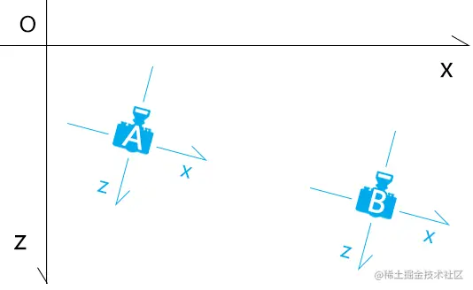
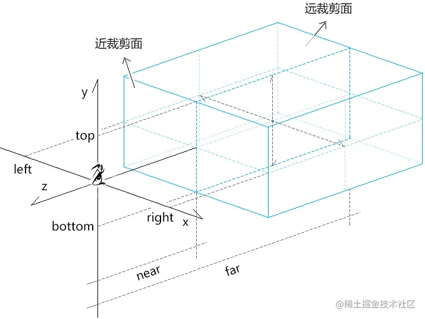
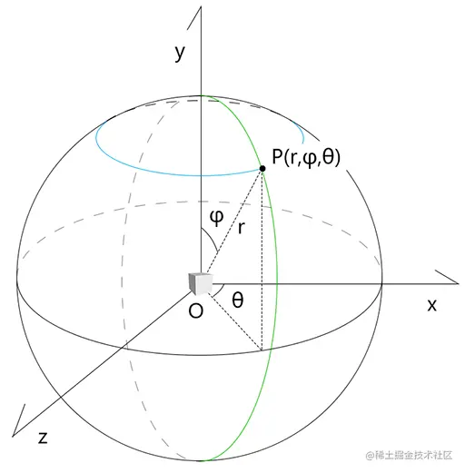
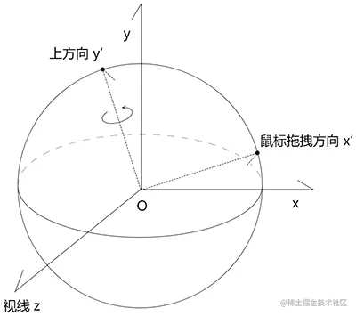

# WebGL 正交相机轨道控制器

---
源码：[github.com/buglas/webg…](https://link.juejin.cn/?target=https%3A%2F%2Fgithub.com%2Fbuglas%2Fwebgl-lesson "https://github.com/buglas/webgl-lesson")

相机轨道控制器可以让我们更好的变换相机，从而灵活观察物体。

three.js 中的相机轨道控制器是通过以下事件变换相机的：

-   旋转
    
    -   鼠标左键拖拽
    -   单手指移动
-   缩放
    
    -   鼠标滚轮滚动
    -   两个手指展开或挤压
-   平移
    
    -   鼠标右键拖拽
    -   鼠标左键+ctrl/meta/shiftKey 拖拽
    -   箭头键
    -   两个手指移动

在实际项目开发中，我们不能对three.js 里的相机轨道控制器太过依赖。

因为其不能满足我们图形项目里的所有需求，这是经验之谈，好多同学都遇到过这种情况。

面对这样的情况，我们若不能充分理解相机轨道控制器的实现原理，整个项目都会被卡住。

所以，我们接下来要从最底层实现相机轨道控制器。

我们先使用相机轨道控制器变换正交相机。

### 1-正交相机的位移轨道

#### 1-1-搭建场景

准备4个三角形+1个相机

-   着色器

```
<script id="vertexShader" type="x-shader/x-vertex">
    attribute vec4 a_Position;
    uniform mat4 u_PvMatrix;
    uniform mat4 u_ModelMatrix;
    void main(){
      gl_Position = u_PvMatrix*u_ModelMatrix*a_Position;
    }
</script>
<script id="fragmentShader" type="x-shader/x-fragment">
    precision mediump float;
    uniform vec4 u_Color;
    void main(){
      gl_FragColor=u_Color;
    }
</script>
```

-   初始化着色器

```
import { initShaders } from '../jsm/Utils.js';
import {
    Matrix4, PerspectiveCamera, Vector2, Vector3, Quaternion, Object3D,
    OrthographicCamera
} from 'https://unpkg.com/three/build/three.module.js';
import Poly from './jsm/Poly.js'

const canvas = document.getElementById('canvas');
const [viewW, viewH] = [window.innerWidth, window.innerHeight]
canvas.width = viewW;
canvas.height = viewH;
const gl = canvas.getContext('webgl');

const vsSource = document.getElementById('vertexShader').innerText;
const fsSource = document.getElementById('fragmentShader').innerText;
initShaders(gl, vsSource, fsSource);
gl.clearColor(0.0, 0.0, 0.0, 1.0);
```

-   正交相机

```
const halfH = 2
const ratio = canvas.width / canvas.height
const halfW = halfH * ratio
const [left, right, top, bottom, near, far] = [
    -halfW, halfW, halfH, -halfH, 1, 8
]
const eye = new Vector3(1, 1, 2)
const target = new Vector3(0, 0, -3)
const up = new Vector3(0, 1, 0)

const camera = new OrthographicCamera(
    left, right, top, bottom, near, far
)
camera.position.copy(eye)
camera.lookAt(target)
camera.updateMatrixWorld()
const pvMatrix = new Matrix4()
pvMatrix.multiplyMatrices(
    camera.projectionMatrix,
    camera.matrixWorldInverse,
)
```

-   4个三角形

```
const triangle1 = crtTriangle(
    [1, 0, 0, 1],
    new Matrix4().setPosition(-0.5, 0, -4).elements
)
const triangle2 = crtTriangle(
    [1, 0, 0, 1],
    new Matrix4().setPosition(0.5, 0, -4).elements
)
const triangle3 = crtTriangle(
    [1, 1, 0, 1],
    new Matrix4().setPosition(-0.8, 0, -2).elements
)
const triangle4 = crtTriangle(
    [1, 1, 0, 1],
    new Matrix4().setPosition(0.5, 0, -2).elements
)

render()
function render() {
    gl.clear(gl.COLOR_BUFFER_BIT);

    triangle1.init()
    triangle1.draw()

    triangle2.init()
    triangle2.draw()

    triangle3.init()
    triangle3.draw()

    triangle4.init()
    triangle4.draw()

}
```

#### 1-2-声明基础数据

-   鼠标事件集合

```
const mouseButtons = new Map([
    [2, 'pan']
])
```

 2：鼠标右键按下时的event.button值

 pan：平移

-   轨道控制器状态，表示控制器正在对相机进行哪种变换。比如state等于pan 时，代表位移

```
let state = 'none'
```

-   鼠标在屏幕上拖拽时的起始位和结束位，以像素为单位

```
const dragStart = new Vector2()
const dragEnd = new Vector2()
```

-   鼠标每次移动时的位移量，webgl坐标量

```
const panOffset = new Vector3()
```

-   鼠标在屏幕上垂直拖拽时，是基于相机本地坐标系的y方向还是z方向移动相机
    
    -   true：y向移动
    -   false：z向移动

```
const screenSpacePanning = true
```

#### 1-3-在canvas上绑定鼠标事件

-   取消右击菜单的显示

```
canvas.addEventListener('contextmenu', event => {
    event.preventDefault()
})
```

-   指针按下时，设置拖拽起始位，获取轨道控制器状态。

```
canvas.addEventListener('pointerdown', ({ clientX, clientY, button }) => {
    dragStart.set(clientX, clientY)
    state = mouseButtons.get(button)
})
```

注：指针事件支持多种方式的指针顶点输入，如鼠标、触控笔、触摸屏等。

-   指针移动时，若控制器处于平移状态，平移相机。

```
canvas.addEventListener('pointermove', (event) => {
    switch (state) {
        case 'pan':
            handleMouseMovePan(event)
    }
})
```

-   指针抬起时，清除控制器状态。

```
canvas.addEventListener('pointerup', (event) => {
    state = 'none'
})
```

接下来我们重点看一下相机平移方法handleMouseMovePan()。

#### 1-4-相机平移方法

相机平移方法

```
function handleMouseMovePan({ clientX, clientY, button }) {
    //指针拖拽的结束位(像素单位)
    dragEnd.set(clientX, clientY)
    //基于拖拽距离(像素单位)移动相机
    pan(dragEnd.clone().sub(dragStart))
    //重置拖拽起始位
    dragStart.copy(dragEnd)
}
```

-   基于拖拽距离(像素单位)移动相机



```
function pan(delta) {
    //相机近裁剪面尺寸
    const cameraW = camera.right - camera.left
    const cameraH = camera.top - camera.bottom
    //指针拖拽量在画布中的比值
    const ratioX = delta.x / canvas.clientWidth
    const ratioY = delta.y / canvas.clientHeight
    //将像素单位的位移量转换为相机近裁剪面上的位移量
    const distanceLeft = ratioX * cameraW
    const distanceUp = ratioY * cameraH
    //相机本地坐标系里的x轴
    const mx = new Vector3().setFromMatrixColumn(camera.matrix, 0)
    //相机x轴平移量
    const vx = mx.clone().multiplyScalar(-distanceLeft)
    //相机z|y轴平移量
    const vy = new Vector3()
    if (screenSpacePanning) {
        //y向
        vy.setFromMatrixColumn(camera.matrix, 1)
    } else {
        //-z向
        vy.crossVectors(camera.up, mx)
    }
    //相机y向或-z向的平移量
    vy.multiplyScalar(distanceUp)
    //整合平移量
    panOffset.copy(vx.add(vy))
    //更新
    update()
}
```

-   基于平移量，位移相机，更新投影视图矩阵

```
function update() {
    target.add(panOffset)
    camera.position.add(panOffset)
    camera.lookAt(target)
    camera.updateWorldMatrix(true)
    pvMatrix.multiplyMatrices(
        camera.projectionMatrix,
        camera.matrixWorldInverse,
    )
    render()
}
```

### 2-正交相机的缩放轨道

#### 2-1-正交相机的缩放原理

相机的缩放就是让我们在裁剪空间中看到的同一深度上的东西更多或者更少。

通常大家很容易结合实际生活来考虑，比如我们正对着一面墙壁，墙壁上铺满瓷砖。

当我们把镜头拉近时，看到的瓷砖数量就变少了，每块瓷砖的尺寸也变大了；

反之，当我们把镜头拉远时，看到的瓷砖数量就变多了，每块瓷砖的尺寸也变小了。

然而这种方式只适用于透视相机，并不适用于正交相机，因为正交相机不具备近大远小规则。

正交相机的缩放，是直接缩放的投影面，这个投影面在three.js里就是近裁剪面。

当投影面变大了，那么能投影的顶点数量也就变多了；

反之，当投影面变小了，那么能投影的顶点数量也就变少了。



接下来，我们去分析一下相机的具体缩放方法。

#### 2-2-正交相机缩放方法

在three.js里的正交相机对象OrthographicCamera的updateProjectionMatrix() 方法里可以找到正交相机的缩放方法。

```
updateProjectionMatrix: function () {
    const dx = ( this.right - this.left ) / ( 2 * this.zoom );
    const dy = ( this.top - this.bottom ) / ( 2 * this.zoom );
    const cx = ( this.right + this.left ) / 2;
    const cy = ( this.top + this.bottom ) / 2;
    
    let left = cx - dx;
    let right = cx + dx;
    let top = cy + dy;
    let bottom = cy - dy;
    ……
}
```

我们可以将上面的dx、dy分解一下：

-   近裁剪面宽度的一半width：( this.right - this.left ) / 2
-   近裁剪面高度的一半height：( this.top - this.bottom ) / 2
-   dx=width/zoom
-   dy=height/zoom

在three.js 里，zoom 的默认值是1，即不做缩放。

由上我们可以得到正交相机缩放的性质：

-   zoom值和近裁剪面的尺寸成反比
-   近裁剪面的尺寸和我们在同一深度所看物体的数量成正比
-   近裁剪面的尺寸和我们所看的同一物体的尺寸成反比

#### 2-4-正交相机缩放轨道的实现

基于之前的相机位移轨道继续写代码。

1.定义滚轮在每次滚动时的缩放系数

```
const zoomScale = 0.95
```

2.为canvas添加滚轮事件

```
canvas.addEventListener('wheel', handleMouseWheel)

function handleMouseWheel({ deltaY }) {
    if (deltaY < 0) {
        dolly(1 / zoomScale);
    } else if (deltaY > 0) {
        dolly(zoomScale);
    }
    update();
}
```

当 deltaY<0 时，是向上滑动滚轮，会缩小裁剪面；

当 deltaY>0 时，是向下滑动滚轮，会放大裁剪面。

3.通过dolly()方法缩放相机

```
function dolly(dollyScale) {
    camera.zoom *= dollyScale
    camera.updateProjectionMatrix();
}
```

### 3-正交相机的旋转轨道

#### 3-1-正交相机的旋转轨道的概念

相机的旋转轨道的实现原理就是让相机绕物体旋转。

相机旋转轨迹的集合是一个球体。

相机旋转轨道的实现方式是有许多种的，至于具体用哪种，还要看我们具体的项目需求。

我们这里就先说一种基于球坐标系旋转的相机旋转轨道，至于其它的旋转方式，我们后面再说。


已知：

-   三维坐标系\[O;x,y,z\]
    
-   正交相机
    
    -   视点位：点P
    -   目标位：点O
-   正交相机旋转轨的旋转轴是y轴
    

则：

正交相机在球坐标系中的旋转轨道有两种：

-   点P绕旋转轴y轴的旋转轨道，即上图的蓝色轨道。
-   点P在平面OPy中的旋转轨道，即上图的绿色轨迹。

接下来，结合正交相机的实际情况，说一下如何计算正交相机旋转后的视点位。

#### 3-2-正交相机旋转后的视点位



已知：

-   三维坐标系\[O;x,y,z\]
    
-   正交相机
    
    -   视点位：三维坐标点P(x,y,z)
    -   目标位：点O
-   正交相机旋转轨的旋转轴是y轴
    

求：相机在平面OPy中旋转a度，绕y轴旋转b度后，相机视点的三维空间位P'(x',y',z')

解：

1.将点P(x,y,z)的三维坐标位换算为球坐标位，即P(r,φ,θ)

2.计算点P在平面OPy中旋转a度，绕y轴旋转b度后的球坐标位，即P(r,φ+a,θ+b)

3.将点P的球坐标位转换为三维坐标位

求解的思路就这么简单，那具体怎么实现呢？咱们先把上面的球坐标解释一下。

#### 3-3-球坐标系

Ⅰ 球坐标系的概念

球坐标系（spherical coordinate system）是用球坐标表示空间点位的坐标系。

球坐标由以下分量构成：

-   半径(radial distance) r：OP长度( 0 ≤ r ) 。
-   极角(polar angle) φ：OP与y轴的夹角(0 ≤ φ ≤ π)
-   方位角(azimuth angle) θ：OP在平面Oxz上的投影与正x轴的夹角( 0 ≤ θ < 2π )。

注：

-   球坐标系可视极坐标系的三维推广。
-   当r=0时，φ和θ无意义。
-   当φ =0或φ =π时，θ无意义。

接下来咱们说一下球坐标与三维坐标的转换。

Ⅱ 三维坐标转球坐标


已知：点P的三维坐标位(x,y,z)

求：点P的球坐标位(r,φ,θ)

解：

求半径r：

```
r=sqrt(x²+y²+z²)
```

求极角φ的方法有三种：

```
φ=acos(y/r)
φ=asin(sqrt(x²+z²)/r)
φ=atan(sqrt(x²+z²)/y)
```

求方位角θ的方法有三种：

```
θ=acos(x/(r*sinφ))
θ=asin(z/(r*sinφ))
θ=atan(z/x)
```

注：

在用反正切求角度时，需要注意点问题。

atan()返回的值域是\[-PI/2,PI/2\]，这是个半圆，这会导致其返回的弧度失真。

如：

```
atan(z/x)==atan(-z/-x)
atan(-z/x)==atan(z/-x)
```

所以，我们在js里用反正切计算弧度时，要使用atan2() 方法，即：

```
φ=Math.atan2(sqrt(x²+z²),y)
θ=Math.atan2(z,x)
```

atan2()返回的值域是\[-PI,PI\]，这是一个整圆。

atan2()方法是将z,x分开写入的，其保留了其最原始的正负符号，所以其返回的弧度不会失真。

Ⅲ 球坐标转三维坐标

已知：点P的球坐标位(r,φ,θ)

求：点P的三维坐标位(x,y,z)

解：

```
x=r*sinφ*cosθ
y=r*cosφ
z=r*sinφ*sinθ
```

关于球坐标系我们就说到这，接下来我们就可以说一下正交相机旋转轨道的具体代码实现啦。

#### 3-4-正交相机旋转轨道的代码实现

在这里，我会把之前的位移轨道和缩放轨道合着现在的旋转轨道一起来说，即此把之前的知识也一起捋一遍。

场景还是之前的场景，我就不再多说了，咱们直接说轨道。

1.声明基础数据

```
//鼠标事件集合
const mouseButtons = new Map([
    [0, 'rotate'],
    [2, 'pan'],
])
//轨道状态
let state = 'none'
//2PI
const pi2 = Math.PI * 2
//鼠标拖拽的起始位和结束位，无论是左键按下还是右键按下
const [dragStart, dragEnd] = [
    new Vector2(),
    new Vector2(),
]
```

2.声明轨道相关的基础数据

-   平移轨道

```
//平移量
const panOffset = new Vector3()
//是否沿相机y轴平移相机
const screenSpacePanning = true
```

-   缩放轨道

```
//缩放系数
const zoomScale = 0.95
```

-   旋转轨道

```
//相机视点相对于目标的球坐标
const spherical = new Spherical()
.setFromVector3(
    camera.position.clone().sub(target)
)
```

3.取消右击菜单的显示

```
canvas.addEventListener('contextmenu', event => {
    event.preventDefault()
})
```

4.指针按下时，设置拖拽起始位，获取轨道控制器状态。

```
canvas.addEventListener('pointerdown', ({ clientX, clientY, button }) => {
    dragStart.set(clientX, clientY)
    state = mouseButtons.get(button)
})
```

5.指针移动时，若控制器处于平移状态，平移相机；若控制器处于旋转状态，旋转相机。

```
canvas.addEventListener('pointermove', ({ clientX, clientY }) => {
    dragEnd.set(clientX, clientY)
    switch (state) {
        case 'pan':
            pan(dragEnd.clone().sub(dragStart))
            break
        case 'rotate':
            rotate(dragEnd.clone().sub(dragStart))
            break
    }
    dragStart.copy(dragEnd)
})
```

-   平移方法

```
function pan({ x, y }) {
    const cameraW = camera.right - camera.left
    const cameraH = camera.top - camera.bottom
    const ratioX = x / canvas.clientWidth
    const ratioY = y / canvas.clientHeight
    const distanceLeft = ratioX * cameraW
    const distanceUp = ratioY * cameraH
    const mx = new Vector3().setFromMatrixColumn(camera.matrix, 0)
    const vx = mx.clone().multiplyScalar(-distanceLeft)
    const vy = new Vector3()
    if (screenSpacePanning) {
        vy.setFromMatrixColumn(camera.matrix, 1)
    } else {
        vy.crossVectors(camera.up, mx)
    }
    vy.multiplyScalar(distanceUp)
    panOffset.copy(vx.add(vy))
    update()
}
```

-   旋转方法

```
function rotate({ x, y }) {
    const { clientHeight } = canvas
    spherical.theta -= pi2 * x / clientHeight // yes, height
    spherical.phi -= pi2 * y / clientHeight
    update()
}
```

6.滚轮滚动时，缩放相机

```
canvas.addEventListener('wheel', handleMouseWheel)
function handleMouseWheel({ deltaY }) {
    if (deltaY < 0) {
        dolly(1 / zoomScale)
    } else {
        dolly(zoomScale)
    }
    update()
}

function dolly(dollyScale) {
    camera.zoom *= dollyScale
    camera.updateProjectionMatrix()
}
```

7.更新相机，并渲染

```
function update() {
    //基于平移量平移相机
    target.add(panOffset)
    camera.position.add(panOffset)

    //基于旋转量旋转相机
    const rotateOffset = new Vector3()
    .setFromSpherical(spherical)
    camera.position.copy(
        target.clone().add(rotateOffset)
    )

    //更新投影视图矩阵
    camera.lookAt(target)
    camera.updateMatrixWorld(true)
    pvMatrix.multiplyMatrices(
        camera.projectionMatrix,
        camera.matrixWorldInverse,
    )

    //重置旋转量和平移量
    spherical.setFromVector3(
        camera.position.clone().sub(target)
    )
    panOffset.set(0, 0, 0);

    // 渲染
    render()
}
```

正交相机旋转轨道的基本实现原理就是这样，接下来我们再对其做一下补充与扩展。

#### 3-5-限制旋转轴

在three.js 的轨道控制器里，无法限制旋转轴，比如我只想横向旋转相机，或者竖向旋转相机。

这样的需求，是我们在实战项目中，遇到的比较卡人的需求之一。

一旦我们不理解其底层原理，那就很难实现这个看似简单的需求。

不过，现在既然我们已经说了其底层原理，那实现起来也就真的简单了。

1.声明一个控制旋转方向的属性

```
const rotateDir = 'xy'
```

-   x：可以在x方向旋转相机
-   y：可以在y方向旋转相机
-   xy：可以在x,y方向旋转相机

2.旋转方法，基于rotateDir属性约束旋转方向

```
function rotate({ x, y }) {
    const { clientHeight } = canvas
    const deltaT = pi2 * x / clientHeight // yes, height
    const deltaP = pi2 * y / clientHeight
    if (rotateDir.includes('x')) {
        spherical.theta -= deltaT
    }
    if (rotateDir.includes('y')) {
        spherical.phi -= deltaP
    }
    update()
}
```

#### 3-6-限制极角

之前我们说球坐标系的时候说过，其极角的定义域是\[0,180°\]，所以我们在代码里也要对其做一下限制。

在rotate() 方法里做下调整即可。

```
//旋转
function rotate({ x, y }) {
    ……
    if (rotateDir.includes('y')) {
        const phi = spherical.phi - deltaP
        spherical.phi = Math.min(
            Math.PI,
            Math.max(0, phi)
        )
    }
    ……
}
```

然而，因为当球坐标里的极角等于0或180度的时候，方位角会失去意义，所以我们还不能在代码真的给极角0或180度，不然方位角会默认归零。

所以，我们需要分别给极角里的0和180度一个近似值。

```
spherical.phi = Math.min(
    Math.PI * 0.99999999,
    Math.max(0.00000001, phi)
)
```

基于球坐标系的相机旋转轨道我们就说到这，其具体代码我们可以参考three.js里的OrbitControls 对象的源码。

接下来，我们再说一个另一种形式的正交相机旋转轨道。

### 4-轨迹球旋转

轨迹球这个名字，来自three.js 的TrackballControls 对象，其具体的代码实现便可以在这里找到。

轨迹球不像基于球坐标系的旋转轨道那样具有恒定的上方向。

轨迹球的上方向是一个垂直于鼠标拖拽方向和视线的轴，相机视点会基于此轴旋转。

轨迹球的上方向会随鼠标拖拽方向的改变而改变。

如下图：



接下来，咱们说一下具体的代码实现。

在three.js中，TrackballControls 和OrbitControls对象里的代码，不太像一个人写的。

因为我们完全可以沿用OrbitControls 里的一部分代码去写TrackballControls，比如鼠标在相机世界里的偏移量，而TrackballControls完全用一套风格迥异的代码从头写了一遍。

当然，我这里并不是说TrackballControls 不好，其原理和功能的实现方法依旧是很值得学习。

只是，我们在写轨迹球的时候，完全可以基于TrackballControls的实现原理，把OrbitControls给改一下，这样我们可以少写许多代码。

1.定义用于沿某个轴旋转相机视点的四元数

```
const quaternion = new Quaternion()
```

2.把之前的rotate()旋转方法改一下

```
function rotate({ x, y }) {
    const {right,left,top,bottom,matrix,position}=camera
    const {clientWidth,clientHeight}=canvas
    
    // 相机宽高
    const cameraW = right - left
    const cameraH = top - bottom

    // 鼠标位移距离在画布中的占比
    const ratioX = x / clientWidth
    const ratioY = -y / clientHeight

    //基于高度的x位置比-用于旋转量的计算
    const ratioXBaseHeight = x / clientHeight
    //位移量
    const ratioLen=new Vector2(ratioXBaseHeight, ratioY).length() 
    //旋转量
    const angle = ratioLen* pi2

    // 在相机世界中的位移距离
    const distanceLeft = ratioX * cameraW
    const distanceUp = ratioY * cameraH

    // 相机本地坐标系的x,y轴
    const mx = new Vector3().setFromMatrixColumn(camera.matrix, 0)
    const my = new Vector3().setFromMatrixColumn(camera.matrix, 1)

    // 将鼠标在相机世界的x,y轴向的位移量转换为世界坐标位
    const vx = mx.clone().multiplyScalar(distanceLeft)
    const vy = my.clone().multiplyScalar(distanceUp)

    //鼠标在s'j'z中的位移方向-x轴
    const moveDir=vx.clone().add(vy).normalize()
    
    //目标点到视点的单位向量-z轴
    const eyeDir = camera.position.clone().sub(target).normalize()

    //基于位移方向和视线获取旋转轴-上方向y轴
    const axis = moveDir.clone().cross(eyeDir)

    //基于旋转轴和旋转量建立四元数
    quaternion.setFromAxisAngle(axis, angle)

    update()
}
```

3.在update()更新方法中，基于四元数设置相机视点位置，并更新相机上方向

```
/* 更新相机，并渲染 */
function update() {
    ……

    //旋转视线
    const rotateOffset = camera.position
    .clone()
    .sub(target)
    .applyQuaternion(quaternion)

    //基于最新视线设置相机位置
    camera.position.copy(
        target.clone().add(rotateOffset)
    )
    //旋转相机上方向 
    camera.up.applyQuaternion(quaternion)

    ……

    //重置旋转量和平移量
    panOffset.set(0, 0, 0)
    quaternion.setFromRotationMatrix(new Matrix4())

    ……
}
```

修改完相机的视点位和上方后，要记得重置四元数，以避免在拖拽和缩放时，造成相机旋转。

注：

轨迹球的操控难度是要比球坐标系轨道大的，它常常让不熟练其特性的操作者找不到北，所以在实际项目中还是球坐标系轨道用得比较多。

这里大家先知道有这么回事即可，以后在工作中遇到了，不要不知道是什么东西就好。
