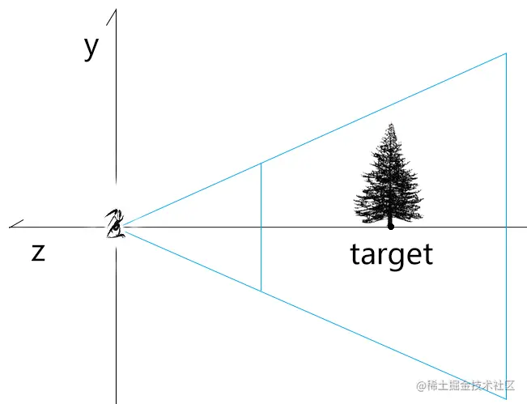

# WebGL 透视相机轨道控制器

---
源码：[github.com/buglas/webg…](https://link.juejin.cn/?target=https%3A%2F%2Fgithub.com%2Fbuglas%2Fwebgl-lesson "https://github.com/buglas/webgl-lesson")

之前咱们说过了正交相机的轨道控制器，接下来再看透视相机的轨道控制器，就会方便很多。

### 1-透视相机的位移轨道

透视相机的位移轨道和正交相机的位移轨道是相同原理的，都是对相机视点和目标点的平移。

接下来咱们直接说一下代码实现。

1.建透视交相机

```
const eye = new Vector3(0, 0.5, 1)
const target = new Vector3(0, 0, -2.5)
const up = new Vector3(0, 1, 0)

const [fov, aspect, near, far] = [
    45,
    canvas.width / canvas.height,
    1,
    20
]
const camera = new PerspectiveCamera(fov, aspect, near, far)
camera.position.copy(eye)
camera.lookAt(target)
camera.updateWorldMatrix(true)
```

2.在正交相机的位移轨道的基础上改一下pan方法


-   将鼠标在画布中的位移量转目标平面位移量

```
const {matrix,position,up}=camera
const {clientWidth,clientHeight}=canvas

//视线长度：相机视点到目标点的距离
const sightLen = position.clone().sub(target).length()
//视椎体垂直夹角的一半(弧度)
const halfFov = fov * Math.PI / 360
//目标平面的高度
const targetHeight = sightLen * Math.tan(halfFov) * 2
//目标平面与画布的高度比
const ratio = targetHeight / clientHeight
//画布位移量转目标平面位移量
const distanceLeft = x * ratio
const distanceUp = y * ratio
```

注：目标平面是过视点，平行于裁剪面的平面

-   将鼠标在目标平面中的位移量转世界坐标

```
//相机平移方向
//鼠标水平运动时，按照相机本地坐标的x轴平移相机
const mx = new Vector3().setFromMatrixColumn(matrix, 0)
//鼠标水平运动时，按照相机本地坐标的y轴，或者-z轴平移相机
const myOrz = new Vector3()
if (screenSpacePanning) {
    //y轴，正交相机中默认
    myOrz.setFromMatrixColumn(matrix, 1)
} else {
    //-z轴，透视相机中默认
    myOrz.crossVectors(up, mx)
}

//目标平面位移量转世界坐标
const vx = mx.clone().multiplyScalar(-distanceLeft)
const vy = myOrz.clone().multiplyScalar(distanceUp)
panOffset.copy(vx.add(vy))
```

透视相机的位移轨道就这么简单，接下来咱们说一下透视相机的缩放轨道。

### 2-透视相机的缩放轨道

透视相机缩放是通过视点按照视线的方向，接近或者远离目标点来实现的。



#### 2-1-举个例子

已知：

-   视点e=5
-   目标点t=15
-   （视点即将位移的距离）/（位移前，视点与与目标点的距离）= 0.4

求：视点移动2次后的位置

解：

视点第1次移动后的位置：5+(15-5)\*0.4=9

视点第2次移动后的位置：9+(15-9)\*0.4= 11.4

基本原理就是这样，视点移动n此后的位置都可以按照上面的逻辑来计算。

接下来，咱们看一下代码实现。

#### 2-2-代码实现

我们可以直接在正交相机缩放轨道的基础上做一下修改。

```
function dolly(dollyScale) {
    camera.position.lerp(target, 1 - dollyScale)
}
```

-   lerp ( v : Vector3, alpha : Float ) 按比例去两点之间的插值
    
    其源码如下：
    

```
lerp( v, alpha ) {
    this.x += ( v.x - this.x ) * alpha;
    this.y += ( v.y - this.y ) * alpha;
    this.z += ( v.z - this.z ) * alpha;
    return this;
}
```

-   dollyScale：（位移之后视点与目标点的距离）/（位移前，视点与与目标点的距离）
-   1-dollyScale：（视点即将位移的距离）/（位移前，视点于与目标点的距离）

正交相机缩放轨道的基本实现原理就是这么简单。

然而，后面我们还得用球坐标对相机进行旋转，球坐标是已经涵盖了相机视点位的。

因此，我们还可以直接把相机视点位写进球坐标里。

#### 2-3-球坐标缩放

1.像正交相机的旋转轨道那样，定义球坐标对象。

```
const spherical = new Spherical()
    .setFromVector3(
        camera.position.clone().sub(target)
    )
```

2.修改旋转方法

```
function dolly(dollyScale) {
    spherical.radius*=dollyScale
}
```

3.更新方法也和正交相机的旋转轨道一样

```
function update() {
    //基于平移量平移相机
    target.add(panOffset)
    camera.position.add(panOffset)

    //基于球坐标缩放和旋转相机
    const rotateOffset = new Vector3()
    .setFromSpherical(spherical)
    camera.position.copy(
        target.clone().add(rotateOffset)
    )

    //更新投影视图矩阵
    camera.lookAt(target)
    camera.updateMatrixWorld(true)
    pvMatrix.multiplyMatrices(
        camera.projectionMatrix,
        camera.matrixWorldInverse,
    )

    //重置球坐标和平移量
    spherical.setFromVector3(
        camera.position.clone().sub(target)
    )
    panOffset.set(0, 0, 0)

    // 渲染
    render()
}
```

### 3-透视相机的旋转轨道

透视相机的旋转轨道和正交相机的实现原理都是一样的，可以用球坐标系实现，也可以用轨迹球实现。

-   基于球坐标系的旋转轨道，可直接参考正交相机基于球坐标系的旋转轨道来写。

```
/* 旋转轨道 */
const spherical = new Spherical()
.setFromVector3(
    camera.position.clone().sub(target)
)
//'xy','x','y'
const rotateDir = 'xy'

……

/* 指针移动时，若控制器处于平移状态，平移相机；若控制器处于旋转状态，旋转相机。 */
canvas.addEventListener('pointermove', ({ clientX, clientY }) => {
    dragEnd.set(clientX, clientY)
    switch (state) {
        case 'pan':
            pan(dragEnd.clone().sub(dragStart))
            break
        case 'rotate':
            rotate(dragEnd.clone().sub(dragStart))
            break
    }
    dragStart.copy(dragEnd)
})
……

// 旋转方法
function rotate({ x, y }) {
    const { clientHeight } = canvas
    const deltaT = pi2 * x / clientHeight
    const deltaP = pi2 * y / clientHeight
    if (rotateDir.includes('x')) {
        spherical.theta -= deltaT
    }
    if (rotateDir.includes('y')) {
        const phi = spherical.phi - deltaP
        spherical.phi = Math.min(
            Math.PI * 0.99999999,
            Math.max(0.00000001, phi)
        )
    }
    update()
}

function update() {
    //基于平移量平移相机
    target.add(panOffset)
    camera.position.add(panOffset)

    //基于球坐标缩放相机
    const rotateOffset = new Vector3()
    .setFromSpherical(spherical)
    camera.position.copy(
        target.clone().add(rotateOffset)
    )

    //更新投影视图矩阵
    camera.lookAt(target)
    camera.updateMatrixWorld(true)
    pvMatrix.multiplyMatrices(
        camera.projectionMatrix,
        camera.matrixWorldInverse,
    )

    //重置旋转量和平移量
    spherical.setFromVector3(
        camera.position.clone().sub(target)
    )
    panOffset.set(0, 0, 0)

    // 渲染
    render()
}
```

-   对于轨迹球的旋转轨道，基于正交相机轨迹球旋转的代码略作调整即可。

```
/* 旋转轨道 */
const quaternion = new Quaternion()

function rotate({ x, y }) {
    const { matrix, position, fov } = camera
    const {  clientHeight } = canvas

    /* 1.基于鼠标拖拽距离计算旋转量 */
    // 鼠标位移距离在画布中的占比
    const ratioY = -y / clientHeight
    //基于高度的x位置比-用于旋转量的计算
    const ratioBaseHeight = x / clientHeight
    //位移量  
    const ratioLen = new Vector2(ratioBaseHeight, ratioY).length()
    //旋转量
    const angle = ratioLen * pi2

    /* 2.将鼠标在画布中的位移量转目标平面位移量 */
    //视线长度：相机视点到目标点的距离
    const sightLen = position.clone().sub(target).length()
    //视椎体垂直夹角的一半(弧度)
    const halfFov = fov * Math.PI / 360
    //目标平面的高度
    const targetHeight = sightLen * Math.tan(halfFov) * 2
    //目标平面与画布的高度比
    const ratio = targetHeight / clientHeight
    //画布位移量转目标平面位移量
    const distanceLeft = x * ratio
    const distanceUp = -y * ratio

     /* 3.将鼠标在目标平面中的位移量转世界坐标，并从中提取鼠标在世界坐标系中的位移方向 */
    // 相机本地坐标系的x,y轴
    const mx = new Vector3().setFromMatrixColumn(matrix, 0)
    const my = new Vector3().setFromMatrixColumn(matrix, 1)
    // 将鼠标在相机世界的x,y轴向的位移量转换为世界坐标位
    const vx = mx.clone().multiplyScalar(distanceLeft)
    const vy = my.clone().multiplyScalar(distanceUp)
    //鼠标在世界坐标系中的位移方向-x轴
    const moveDir = vx.clone().add(vy).normalize()

    /* 4.基于位移方向和视线获取旋转轴 */
    //目标点到视点的单位向量-z轴
    const eyeDir = position.clone().sub(target).normalize()
    //基于位移方向和视线获取旋转轴-上方向y轴
    const axis = moveDir.clone().cross(eyeDir)

    /* 5.基于旋转轴和旋转量更新四元数 */
    quaternion.setFromAxisAngle(axis, angle)

    update()
}


function update() {
    //基于平移量平移相机
    target.add(panOffset)
    camera.position.add(panOffset)

    //基于旋转量旋转相机
    const rotateOffset = camera.position.clone()
    .sub(target)
    .applyQuaternion(quaternion)

    camera.position.copy(
        target.clone().add(rotateOffset)
    )
    camera.up.applyQuaternion(quaternion)

    //更新投影视图矩阵
    camera.lookAt(target)
    camera.updateMatrixWorld(true)
    pvMatrix.multiplyMatrices(
        camera.projectionMatrix,
        camera.matrixWorldInverse,
    )

    //重置旋转量和平移量
    quaternion.setFromRotationMatrix(new Matrix4())
    panOffset.set(0, 0, 0)

    // 渲染
    render()
}
```
