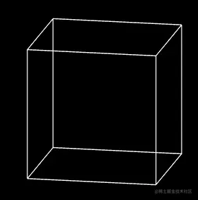
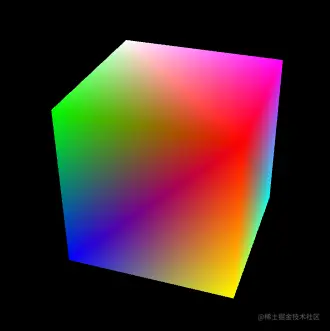

# WebGl 顶点索引

---
源码：[github.com/buglas/webg…](https://link.juejin.cn/?target=https%3A%2F%2Fgithub.com%2Fbuglas%2Fwebgl-lesson "https://github.com/buglas/webgl-lesson")

### 1-顶点索引概念

对于顶点索引的概念，其实我们之在再说复合变换里的模型矩阵的时候，就已经讲过了。

```
const verticeLib = [
    1.0, 1.0, 1.0,
    -1.0, 1.0, 1.0,
    -1.0, -1.0, 1.0,
    1.0, -1.0, 1.0,
    1.0, -1.0, -1.0,
    1.0, 1.0, -1.0,
    -1.0, 1.0, -1.0,
    -1.0, -1.0, -1.0,
];

const indices = [
    0, 1,
    1, 2,
    2, 3,
    3, 0,

    0, 5,
    1, 6,
    2, 7,
    3, 4,

    4, 5,
    5, 6,
    6, 7,
    7, 4
];

const arr = [];
indices.forEach(n => {
    const i = n * 3
    arr.push(
        verticeLib[i] / 5,
        verticeLib[i + 1] / 5,
        verticeLib[i + 2] / 5,
    )
})
const vertices = new Float32Array(arr)
……
```

下过如下：



我上面是用js 实现的顶点索引功能，其实这种功能我们可以直接通过webgl api来实现，不需要我们自己去算。

我们要做的就是建立一个顶点库，然后使用顶点在顶点库中的索引拼图形。

1.顶点数据verticeLib 和顶点索引数据indices 和之前一样

```
const verticeLib = new Float32Array([
    1.0, 1.0, 1.0,
    -1.0, 1.0, 1.0,
    -1.0, -1.0, 1.0,
    1.0, -1.0, 1.0,
    1.0, -1.0, -1.0,
    1.0, 1.0, -1.0,
    -1.0, 1.0, -1.0,
    -1.0, -1.0, -1.0,
])

const indices = new Uint8Array([
    0, 1,
    1, 2,
    2, 3,
    3, 0,

    0, 5,
    1, 6,
    2, 7,
    3, 4,

    4, 5,
    5, 6,
    6, 7,
    7, 4
])
```

2.顶点数据在webgl缓冲区写入和之前都是一样的。

```
const vertexBuffer = gl.createBuffer();
gl.bindBuffer(gl.ARRAY_BUFFER, vertexBuffer);
gl.bufferData(gl.ARRAY_BUFFER, verticeLib, gl.STATIC_DRAW);
const a_Position = gl.getAttribLocation(gl.program, 'a_Position');
gl.vertexAttribPointer(a_Position, 3, gl.FLOAT, false, 0, 0);
gl.enableVertexAttribArray(a_Position);
```

3.视图矩阵和模型矩阵和设置和之前也是一样的

```
const u_ViewMatrix = gl.getUniformLocation(gl.program, 'u_ViewMatrix')
const u_ModelMatrix = gl.getUniformLocation(gl.program, 'u_ModelMatrix')
const viewMatrix = new Matrix4().lookAt(
    new Vector3(0.2, 0.2, 1),
    new Vector3(0, 0, 0),
    new Vector3(0, 1, 0)
)
const modelMatrix = new Matrix4()
modelMatrix.makeScale(0.5, 0.5, 0.5)
gl.uniformMatrix4fv(u_ViewMatrix, false, viewMatrix.elements)
gl.uniformMatrix4fv(u_ModelMatrix, false, modelMatrix.elements)
```

接下来咱们说不一样的地方。

4.把顶点索引写入webgl缓冲区

```
//建立缓冲对象
const indicesBuffer = gl.createBuffer();
//在ELEMENT_ARRAY_BUFFER上绑定缓冲对象
gl.bindBuffer(gl.ELEMENT_ARRAY_BUFFER, indicesBuffer);
//将顶点索引数据写入缓冲对象
gl.bufferData(gl.ELEMENT_ARRAY_BUFFER, indices, gl.STATIC_DRAW)
```

5.绘图

```
gl.clear(gl.COLOR_BUFFER_BIT);
// gl.drawArrays(gl.LINES, 0, indices.length);
gl.drawElements(
    gl.LINES,
    indices.length,
    gl.UNSIGNED_BYTE,
    0
)
```

drawElements(mode, count, type, offset) 是使用顶点索引绘图的方法。

-   mode 绘图方式
-   count 元素数量
-   type 缓冲区数据的类型
-   offset 当前系列的字节索引位

我们上面用顶点索引画了一个线框，重点就是说一个原理，接下来咱们再画一个好看些的彩色立方体。

### 2-彩色立方体

彩色立方体的效果如下：



咱们现在先不考虑灯光，只给顶点赋个颜色。

1.着色器

```
<script id="vertexShader" type="x-shader/x-vertex">
    attribute vec4 a_Position;
    attribute vec4 a_Color;
    uniform mat4 u_PvMatrix;
    uniform mat4 u_ModelMatrix;
    varying vec4 v_Color;
    void main(){
      gl_Position = u_PvMatrix*u_ModelMatrix*a_Position;
      v_Color=a_Color;
    }
</script>
<script id="fragmentShader" type="x-shader/x-fragment">
    precision mediump float;
    varying vec4 v_Color;
    void main(){
      gl_FragColor=v_Color;
    }
</script>
```

上面的a\_Color 是和a\_Position 一一对应的，一个顶点，一个颜色，所以我是用attribute 声明的a\_Color。

如果整个立方体都是一个颜色，那我直接在片元着色器里用uniform 声明就好了。

2.正常初始化着色器，打开深度测试。

```
import { initShaders } from '../jsm/Utils.js';
import { Matrix4, PerspectiveCamera, Vector3, Quaternion } from 'https://unpkg.com/three/build/three.module.js';
import OrbitControls from './jsm/OrbitControls.js'

const canvas = document.getElementById('canvas');
canvas.width = window.innerWidth;
canvas.height = window.innerHeight;
const gl = canvas.getContext('webgl');

const vsSource = document.getElementById('vertexShader').innerText;
const fsSource = document.getElementById('fragmentShader').innerText;
initShaders(gl, vsSource, fsSource);
gl.clearColor(0, 0, 0, 1);
gl.enable(gl.DEPTH_TEST);
```

深度测试可以解决物体的遮挡问题，不然后面的物体可能挡住前面的物体。

3.建立透视相机和轨道控制器。

```
/* 透视相机 */
const eye = new Vector3(1, 2, 3)
const target = new Vector3(0, 0, 0)
const up = new Vector3(0, 1, 0)
const [fov, aspect, near, far] = [
    45,
    canvas.width / canvas.height,
    1,
    20
]
const camera = new PerspectiveCamera(fov, aspect, near, far)
camera.position.copy(eye)

/* 实例化轨道控制器 */
const orbit = new OrbitControls({
    camera, target,
    dom: canvas,
})
/* 取消右击菜单的显示 */
canvas.addEventListener('contextmenu', event => {
    event.preventDefault()
})
/* 指针按下时，设置拖拽起始位，获取轨道控制器状态。 */
canvas.addEventListener('pointerdown', event => {
    orbit.pointerdown(event)
})
/* 指针移动时，若控制器处于平移状态，平移相机；若控制器处于旋转状态，旋转相机。 */
canvas.addEventListener('pointermove', event => {
    orbit.pointermove(event)
})
/* 指针抬起 */
canvas.addEventListener('pointerup', event => {
    orbit.pointerup(event)
})
/* 滚轮事件 */
canvas.addEventListener('wheel', event => {
    orbit.wheel(event)
})
```

4.声明顶点数据vertices 和顶点索引indexes。

```
//    v6----- v5
//   /|      /|
//  v1------v0|
//  | |     | |
//  | |v7---|-|v4
//  |/      |/
//  v2------v3
const vertices = new Float32Array([
    1, 1, 1, 1, 0, 0,  // v0 
    -1, 1, 1, 0, 1, 0,  // v1 
    -1, -1, 1, 0, 0, 1,  // v2 
    1, -1, 1, 1, 1, 0,  // v3 
    1, -1, -1, 0, 1, 1,  // v4 
    1, 1, -1, 1, 0, 1,  // v5 
    -1, 1, -1, 1, 1, 1,  // v6 
    -1, -1, -1, 0, 0, 0   // v7
])

const indexes = new Uint8Array([
    0, 1, 2, 0, 2, 3,    // front
    0, 3, 4, 0, 4, 5,    // right
    0, 5, 6, 0, 6, 1,    // up
    1, 6, 7, 1, 7, 2,    // left
    7, 4, 3, 7, 3, 2,    // down
    4, 7, 6, 4, 6, 5     // back
])
```

顶点数据vertices 是多attribute数据的合一，这个咱们之前讲过。

顶点数据中有两个系列，分别是顶点位置数据和顶点颜色数据。

5.将顶点数据写入缓冲区，并将其中的点位和颜色数据分别分配给a\_Position 和a\_Color

```
//元素字节数
const elementBytes = vertices.BYTES_PER_ELEMENT
const FSIZE = vertices.BYTES_PER_ELEMENT
//系列尺寸
const verticeSize = 3
const colorSize = 3
//类目尺寸
const categorySize = verticeSize + colorSize
//类目字节数
const categoryBytes = categorySize * elementBytes
//系列字节索引位置
const verticeByteIndex = 0
const colorByteIndex = verticeSize * elementBytes

/* 顶点缓冲区 */
const vertexBuffer = gl.createBuffer();
gl.bindBuffer(gl.ARRAY_BUFFER, vertexBuffer);
gl.bufferData(gl.ARRAY_BUFFER, vertices, gl.STATIC_DRAW);

// 将顶点缓冲区里的点位数据分配给a_Position
const a_Position = gl.getAttribLocation(gl.program, 'a_Position');
gl.vertexAttribPointer(
    a_Position,
    verticeSize,
    gl.FLOAT,
    false,
    categoryBytes,
    verticeByteIndex
);
gl.enableVertexAttribArray(a_Position);

// 将顶点缓冲区里的颜色数据分配给a_Color
const a_Color = gl.getAttribLocation(gl.program, 'a_Color');
gl.vertexAttribPointer(
    a_Color,
    colorSize,
    gl.FLOAT,
    false,
    categoryBytes,
    colorByteIndex
);
gl.enableVertexAttribArray(a_Color);
```

6.将顶点索引写入缓冲区。

```
// 建立缓冲区对象
const indexesBuffer = gl.createBuffer()
//把缓冲区绑定到webgl 上下文对象上
gl.bindBuffer(gl.ELEMENT_ARRAY_BUFFER, indexesBuffer)
// 往缓冲区写数据
gl.bufferData(gl.ELEMENT_ARRAY_BUFFER, indexes, gl.STATIC_DRAW)
```

7.建立模型矩阵，并传递给片元着色器

```
const u_ModelMatrix = gl.getUniformLocation(gl.program, 'u_ModelMatrix')
const modelMatrix = new Matrix4()
modelMatrix.makeScale(0.5, 0.5, 0.5)
gl.uniformMatrix4fv(u_ModelMatrix, false, modelMatrix.elements)
```

8.建立投影视图矩阵，并传递给片元着色器

```
const u_PvMatrix = gl.getUniformLocation(gl.program, 'u_PvMatrix')
gl.uniformMatrix4fv(u_PvMatrix, false, orbit.getPvMatrix().elements)
```

9.用连续渲染的方法绘图。

```
!(function ani() {
    modelMatrix.multiply(new Matrix4().makeRotationY(0.05))
    gl.uniformMatrix4fv(u_ModelMatrix, false, modelMatrix.elements)
    gl.clear(gl.COLOR_BUFFER_BIT);
    gl.drawElements(gl.TRIANGLES, indexes.length, gl.UNSIGNED_BYTE, 0)
    requestAnimationFrame(ani)
})()
```

关于顶点索引加多attribute数据的合一的应用咱们就说到这。
