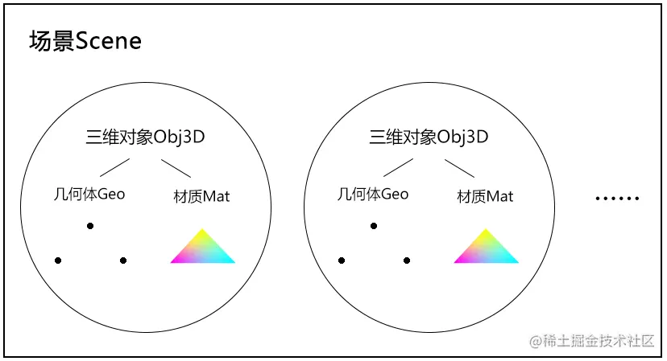

# 基于webgl 的轻量级架构

---
源码：[github.com/buglas/webg…](https://link.juejin.cn/?target=https%3A%2F%2Fgithub.com%2Fbuglas%2Fwebgl-lesson "https://github.com/buglas/webgl-lesson")

之前咱们简单架构过一个Poly.js，然而随着我们知识量和需求的增加，Poly已经无法满足我们的基本需求，所以我们需要在其基础上再做一下升级。

下图便是我想要搭建的框架，参考了three.js，但要简单很多。

意欲先用它整几个案例练练手再说，等以后遇到满足不了的需求了，再做深度扩展。



-   场景Scene：包含所有的三维对象，并负责绘图
-   三维对象Obj3D：包含几何体Geo和材质Mat，对两者进行统一管理
-   几何体Geo：对应attribute 顶点数据
-   材质Mat：包含程序对象，对应uniform 变量

### 1-几何体Geo

#### 1-1-默认属性

```
const defAttr = () => ({
  data: {},
  count:0,
  index: null,
  drawType:'drawArrays',//drawElements
})
export default class Geo {
  constructor(attr) {
    Object.assign(this, defAttr(), attr)
  }
  ……   
}    
```

-   data 顶点数据
    
-   count 顶点总数
    
-   index 顶点索引数据
    
    -   默认为null，用drawArrays 的方式绘图
    -   若不为null，用drawElements 的方式绘图
-   drawType 绘图方式
    
    -   drawArrays 使用顶点集合绘图，默认
    -   drawElements，使用顶点索引绘图

data 的数据结构如下：

```
{
  a_Position: {
    array:类型数组,
    size:矢量长度, 
    buffer:缓冲对象,
    location:attribute变量,
    needUpdate：true
  },
  a_Color: {
    array:类型数组,
    size:矢量长度, 
    buffer:缓冲对象,
    location:attribute变量,
    needUpdate：true
  },
  ……    
}
```

-   array 存储所有的attribute 数据
-   size 构成一个顶点的所有分量的数目
-   buffer 用createBuffer() 方法建立的缓冲对象
-   location 用getAttribLocation() 方法获取的attribute变量
-   needUpdate 在连续渲染时，是否更新缓冲对象

index数据结构

```
{
    array:类型数组,
    buffer:缓冲对象,
    needUpdate：true    
}
```

#### 1-2-初始化方法

```
init(gl,program) {
    gl.useProgram(program)
    this.initData(gl,program)
    this.initIndex(gl)
}
```

-   init(gl,program) 方法会在场景Scene 初始化时被调用
    
    -   gl：webgl上下文对象，会通过场景Scene 的初始化方法传入
    -   program：程序对象，会通过Obj3D 的初始化方法传入
-   initData() 初始化顶点索引
    
    -   初始化顶点数量count 和绘图方式drawType
    -   若顶点索引不为null，就建立缓冲区对象，向其中写入顶点索引数据

```
initData(gl,program) {
    for (let [key, attr] of Object.entries(this.data)) {
        attr.buffer = gl.createBuffer()
        gl.bindBuffer(gl.ARRAY_BUFFER, attr.buffer)
        gl.bufferData(gl.ARRAY_BUFFER, attr.array, gl.STATIC_DRAW)
        const location = gl.getAttribLocation(program, key)
        gl.vertexAttribPointer(
            location,
            attr.size,
            gl.FLOAT,
            false,
            0,
            0
        )
        gl.enableVertexAttribArray(location)
        attr.location=location
    }
}
```

-   initIndex() 初始化attribute变量

```
initIndex(gl) {
    const { index } = this
    if (index) {
        this.count=index.array.length
        this.drawType = 'drawElements'
        index.buffer = gl.createBuffer()
        gl.bindBuffer(gl.ELEMENT_ARRAY_BUFFER, index.buffer)
        gl.bufferData(gl.ELEMENT_ARRAY_BUFFER, index.array, gl.STATIC_DRAW)
    }else{
        const { array, size } = this.data['a_Position']
        this.count = array.length / size
        this.drawType='drawArrays'
    }
}
```

#### 1-3-更新方法，用于连续渲染

```
update(gl) {
    this.updateData(gl)
    this.updateIndex(gl)
}
```

-   updateData(gl) 更新attribute变量

```
updateData(gl) {
    for (let attr of Object.values(this.data)){
        const { buffer, location, size, needUpdate,array } = attr
        gl.bindBuffer(gl.ARRAY_BUFFER, buffer)
        if (needUpdate) {
            attr.needUpdate = false
            gl.bufferData(gl.ARRAY_BUFFER, array, gl.STATIC_DRAW)
        }
        gl.vertexAttribPointer(
            location,
            size,
            gl.FLOAT,
            false,
            0,
            0
        )
    }
}
```

-   updateIndex(gl) 更新顶点索引

```
updateIndex(gl) {
    const {index} = this
    if (index) {
        gl.bindBuffer(gl.ELEMENT_ARRAY_BUFFER, index.buffer)
        if (index.needUpdate) {
            index.needUpdate = false
            gl.bufferData(gl.ELEMENT_ARRAY_BUFFER, index.array, gl.STATIC_DRAW)
        }
    }
}
```

#### 1-4-设置attribute数据和顶点索引数据的方法

-   setData(key,val) 设置attribute数据

```
setData(key,val){
    const { data } = this
    const obj = data[key]
    if (!obj) { return }
    obj.needUpdate=true
    Object.assign(obj,val)
}
```

-   setIndex(val)设置顶点索引数据

```
setIndex(val) {
    const {index}=this
    if (val) {
        index.needUpdate = true
        index.array=val
        this.count=index.array.length
        this.drawType = 'drawElements'
    }else{
        const { array, size } = this.data['a_Position']
        this.count = array.length / size
        this.drawType='drawArrays'
    }
}
```

### 2-材质Mat

#### 1-1-默认属性

```
const defAttr = () => ({
  program: null,
  data: {},
  mode: 'TRIANGLES',
  maps: {}
})
export default class Mat {
  constructor(attr) {
    Object.assign(this, defAttr(), attr)
  }
  ……   
}    
```

-   program 程序对象
    
-   data uniform数据
    
-   mode 图形的绘制方式，默认独立三角形。
    
    注：mode 也可以是数组，表示多种绘图方式，如\['TRIANGLE\_STRIP', 'POINTS'\]
    
-   maps 集合
    

1.data 数据结构：

```
{
  u_Color: {
    value:1,
    type: 'uniform1f',    
    location:null,
    needUpdate:true,
  },
  ……    
}
```

-   value uniform数据值
-   type uniform数据的写入方式
-   location 用getUniformLocation() 方法获取的uniform变量
-   needUpdate 在连续渲染时，是否更新uniform变量

2.maps 数据结构:

```
u_Sampler:{
    image,
    format,
    wrapS,
    wrapT,
    magFilter,
    minFilter
},
```

-   image 图形源
-   format 数据类型，默认gl.RGB
-   wrapS 对应纹理对象的TEXTURE\_WRAP\_S 属性
-   wrapT 对应纹理对象的TEXTURE\_WRAP\_T 属性
-   magFilter 对应纹理对象的TEXTURE\_MAG\_FILTER 属性
-   minFilter对应纹理对象的TEXTURE\_MIN\_FILTER属性

#### 1-2-初始化方法

获取uniform变量，绑定到其所在的对象上。

```
init(gl) {
    const {program,data,maps}=this
    for (let [key, obj] of [...Object.entries(data),...Object.entries(maps)]) {
        obj.location = gl.getUniformLocation(program, key)
        obj.needUpdate=true
    }
}
```

#### 1-3-更新方法，用于连续渲染

```
update(gl) {
    this.updateData(gl)
    this.updateMaps(gl)
}
```

-   updateData(gl) 更新uniform变量

```
updateData(gl) {
    for (let obj of Object.values(this.data)) {
        if (!obj.needUpdate) { continue }
        obj.needUpdate=false
        const { type, value, location } = obj
        if (type.includes('Matrix')) {
            gl[type](location,false,value)
        } else {
            gl[type](location,value)
        }
    }
}
```

-   updateMaps(gl) 更新纹理

```
updateMaps(gl) {
    const { maps } = this
    Object.values(maps).forEach((map, ind) => {
        if (!map.needUpdate) { return }
        map.needUpdate = false
        const {
            format = gl.RGB,
            image,
            wrapS,
            wrapT,
            magFilter,
            minFilter,
            location,
        } = map

        gl.pixelStorei(gl.UNPACK_FLIP_Y_WEBGL, 1)
        gl.activeTexture(gl[`TEXTURE${ind}`])
        const texture = gl.createTexture()
        gl.bindTexture(gl.TEXTURE_2D, texture)
        gl.texImage2D(
            gl.TEXTURE_2D,
            0,
            format,
            format,
            gl.UNSIGNED_BYTE,
            image
        )
        wrapS&&gl.texParameteri(
            gl.TEXTURE_2D,
            gl.TEXTURE_WRAP_S,
            wrapS
        )
        wrapT&&gl.texParameteri(
            gl.TEXTURE_2D,
            gl.TEXTURE_WRAP_T,
            wrapT
        )
        magFilter&&gl.texParameteri(
            gl.TEXTURE_2D,
            gl.TEXTURE_MAG_FILTER,
            magFilter
        )
        if (!minFilter || minFilter > 9729) {
            gl.generateMipmap(gl.TEXTURE_2D)
        }
        minFilter&&gl.texParameteri(
            gl.TEXTURE_2D,
            gl.TEXTURE_MIN_FILTER,
            minFilter
        )
        gl.uniform1i(location, ind)
    })
}
```

#### 1-4-设置uniform数据和纹理的方法

-   setData(key,val) 设置uniform数据

```
setData(key,val){
    const { data } = this
    const obj = data[key]
    if (!obj) { return }
    obj.needUpdate=true
    Object.assign(obj,val)
}
```

-   setMap(val)设置纹理

```
setMap(key,val) {
    const { maps } = this
    const obj = maps[key]
    if (!obj) { return }
    obj.needUpdate=true
    Object.assign(obj,val)
}
```

### 3-三维对象Obj3D

obj3D对象比较简单，主要负责对Geo对象和Mat对象的统一初始化和更新。

```
const defAttr = () => ({
  geo: null,
  mat: null,
})
export default class Obj3D {
  constructor(attr) {
    Object.assign(this, defAttr(), attr)
  }
  init(gl) {
    const {mat,geo}=this
    mat.init(gl)
    geo.init(gl,mat.program)
  }
  update(gl) {
    const { mat, geo } = this
    mat.update(gl)
    geo.update(gl)
  }
}
```

### 4-场景对象Scene

Scene对象的主要功能就是收集所有的三维对象，然后画出来。

```
/*默认属性*/
const defAttr = () => ({
    gl:null,
    children: [],
});

export default class Scene{
    constructor(attr={}){
        Object.assign(this,defAttr(),attr);
    }
    init() {
        const { children, gl} = this
        children.forEach(obj => {
            obj.init(gl)
        })
    }
    add(...objs){
        const {children,gl}=this
        objs.forEach(obj=>{
            children.push(obj)
            obj.parent = this
            obj.init(gl)
        })
    }
    remove(obj){
        const {children}=this
        const i = children.indexOf(obj)
        if (i!==-1) {
            children.splice(i, 1)
        }
    }
    setUniform(key, val) {
        this.children.forEach(({ mat }) => {
          mat.setData(key,val)
        })
    }
    draw() {
        const { gl,children } = this
        gl.clear(gl.COLOR_BUFFER_BIT)
        children.forEach(obj => {
            const { geo: {drawType,count }, mat:{mode,program}}=obj
            gl.useProgram(program)
            obj.update(gl)
            if (typeof mode==='string') {
                this[drawType](gl,count, mode)
            } else {
                mode.forEach(m => {
                    this[drawType](gl,count, m)
                })
            }
        })
    }
    drawArrays(gl, count, mode) {
        gl.drawArrays(gl[mode], 0, count)
    }
    drawElements(gl,count, mode) {
        gl.drawElements(gl[mode], count, gl.UNSIGNED_BYTE, 0)
    }
}
```

我们依次解释一下上面的方法。

-   Scene 对象的属性只有两个：
    
    -   gl：webgl上下文对象
    -   children：三维对象集合
-   init() 初始化方法
    
-   add() 添加三维对象
    
-   remove() 删除三维对象
    
-   setUniform() 统一设置所有对象共有的属性，比如视图投影矩阵
    
-   draw() 绘图方法
    

关于webgl的轻量级架构咱们就先写到这，以后学到新的知识了，或者遇到新的需求了，咱们再做升级。

接下来，咱们拿两个例子测试一下。

### 测试1

我们可以基于之前多着色器的例子，测试一下刚才的webgl框架在多着色器中的应用。

1.两套着色器

```
<!-- 着纯色 -->
<script id="solidVertexShader" type="x-shader/x-vertex">
    attribute vec4 a_Position;
    uniform mat4 u_PvMatrix;
    uniform mat4 u_ModelMatrix;
    void main(){
      gl_Position = u_PvMatrix*u_ModelMatrix*a_Position;
    }
</script>
<script id="solidFragmentShader" type="x-shader/x-fragment">
    precision mediump float;
    uniform float u_Time;
    void main(){
      float r=(sin(u_Time/200.0)+1.0)/2.0;
      gl_FragColor=vec4(r,0.7,0.4,1);
    }
</script>
<!-- 着纹理 -->
<script id="textureVertexShader" type="x-shader/x-vertex">
    attribute vec4 a_Position;
    attribute vec2 a_Pin;
    uniform mat4 u_PvMatrix;
    uniform mat4 u_ModelMatrix;
    varying vec2 v_Pin;
    void main(){
      gl_Position = u_PvMatrix*u_ModelMatrix*a_Position;
      v_Pin=a_Pin;
    }
</script>
<script id="textureFragmentShader" type="x-shader/x-fragment">
    precision mediump float;
    uniform sampler2D u_Sampler;
    varying vec2 v_Pin;
    void main(){
      gl_FragColor=texture2D(u_Sampler,v_Pin);
    }
</script>
```

2.引入js 模块

```
import { createProgram } from '../jsm/Utils.js';
import { Matrix4, OrthographicCamera, Vector3 } from 'https://unpkg.com/three/build/three.module.js';
import OrbitControls from './jsm/OrbitControls.js'
import Mat from './jsm/Mat.js'
import Geo from './jsm/Geo.js'
import Obj3D from './jsm/Obj3D.js'
import Scene from './jsm/Scene.js'
```

3.备好webgl上下文对象

```
const canvas = document.getElementById('canvas');
canvas.width = window.innerWidth;
canvas.height = window.innerHeight;
const gl = canvas.getContext('webgl');
gl.clearColor(0.0, 0.0, 0.0, 1.0);
```

4.备好相机，稍后从中提取投影视图矩阵

```
const halfH = 1
const ratio = canvas.width / canvas.height
const halfW = halfH * ratio
const [left, right, top, bottom, near, far] = [
    -halfW, halfW, halfH, -halfH, 1, 8
]
const eye = new Vector3(0, 0, 2)
const target = new Vector3(0, 0, 0)
const camera = new OrthographicCamera(
    left, right, top, bottom, near, far
)
camera.position.copy(eye)
camera.lookAt(target)
camera.updateMatrixWorld()
```

5.实例化场景对象

```
const scene = new Scene({ gl })
```

6.建立纯色三角形

```
{
    const vs = document.getElementById('solidVertexShader').innerText
    const fs = document.getElementById('solidFragmentShader').innerText
    const program = createProgram(gl, vs, fs)
    const mat = new Mat({
        program,
        data: {
            u_Time: {
                value: 0,
                type: 'uniform1f',
            },
            u_PvMatrix: {
                value: new Matrix4().elements,
                type: 'uniformMatrix4fv',
            },
            u_ModelMatrix: {
                value: new Matrix4().elements,
                type: 'uniformMatrix4fv',
            },
        }
    })
    const geo = new Geo({
        data: {
            a_Position: {
                array: new Float32Array([
                    -0.5, 0.5,
                    -0.5, -0.5,
                    0.5, -0.5,
                ]),
                size: 2
            }
        }
    })
    const obj = new Obj3D({ geo, mat })
    scene.add(obj)
}
```

7.建立纹理三角形

```
const image = new Image()
image.src = './images/erha.jpg'
image.onload = function () {
    const vs = document.getElementById('textureVertexShader').innerText
    const fs = document.getElementById('textureFragmentShader').innerText
    const program = createProgram(gl, vs, fs)
    const mat = new Mat({
        program,
        data: {
            u_PvMatrix: {
                value: new Matrix4().elements,
                type: 'uniformMatrix4fv',
            },
            u_ModelMatrix: {
                value: new Matrix4().elements,
                type: 'uniformMatrix4fv',
            },
        },
        maps: {
            u_Sampler: {
                image,
            }
        }
    })
    const geo = new Geo({
        data: {
            a_Position: {
                array: new Float32Array([
                    0.5, 0.5,
                    -0.5, 0.5,
                    0.5, -0.5,
                ]),
                size: 2
            },
            a_Pin: {
                array: new Float32Array([
                    1, 1,
                    0, 1,
                    1, 0,
                ]),
                size: 2
            }
        }
    })
    const obj = new Obj3D({ geo, mat })
    scene.add(obj)

    /* 统一设置uniform变量 */
    scene.setUniform(
        'u_PvMatrix',
        {
            value: camera.projectionMatrix.clone().multiply(
                camera.matrixWorldInverse
            ).elements
        }
    )
}
```

8.渲染方法

```
render()
function render(time=0) {
    scene.children[0].mat.setData('u_Time', { value: time })
    scene.draw()
    requestAnimationFrame(render)
}
```

### 测试2

我们再拿之前的彩色立方体来测试一下webgl框架的顶点索引功能。

```
<canvas id="canvas"></canvas>
<script id="vertexShader" type="x-shader/x-vertex">
    attribute vec4 a_Position;
    attribute vec4 a_Color;
    uniform mat4 u_PvMatrix;
    uniform mat4 u_ModelMatrix;
    varying vec4 v_Color;
    void main(){
      gl_Position = u_PvMatrix*u_ModelMatrix*a_Position;
      v_Color=a_Color;
    }
</script>
<script id="fragmentShader" type="x-shader/x-fragment">
    precision mediump float;
    varying vec4 v_Color;
    void main(){
      gl_FragColor=v_Color;
    }
</script>
<script type="module">
    import { initShaders, createProgram } from '../jsm/Utils.js';
    import { Matrix4, PerspectiveCamera, Vector3, Quaternion } from 'https://unpkg.com/three/build/three.module.js';
    import OrbitControls from './jsm/OrbitControls.js'
    import Mat from './jsm/Mat.js'
    import Geo from './jsm/Geo.js'
    import Obj3D from './jsm/Obj3D.js'
    import Scene from './jsm/Scene.js'

    const canvas = document.getElementById('canvas');
    canvas.width = window.innerWidth;
    canvas.height = window.innerHeight;
    const gl = canvas.getContext('webgl');

    const vsSource = document.getElementById('vertexShader').innerText;
    const fsSource = document.getElementById('fragmentShader').innerText;
    const program = createProgram(gl, vsSource, fsSource);
    gl.clearColor(0, 0, 0, 1);
    gl.enable(gl.DEPTH_TEST);


    /* 透视相机 */
    const eye = new Vector3(2, 3, 5)
    const target = new Vector3(0, 0, 0)
    const up = new Vector3(0, 1, 0)
    const [fov, aspect, near, far] = [
        45,
        canvas.width / canvas.height,
        1,
        20
    ]
    const camera = new PerspectiveCamera(fov, aspect, near, far)
    camera.position.copy(eye)

    /* 实例化轨道控制器 */
    const orbit = new OrbitControls({
        camera, target,
        dom: canvas,
    })
    orbit.update()

    /* 取消右击菜单的显示 */
    canvas.addEventListener('contextmenu', event => {
        event.preventDefault()
    })
    /* 指针按下时，设置拖拽起始位，获取轨道控制器状态。 */
    canvas.addEventListener('pointerdown', event => {
        orbit.pointerdown(event)
    })
    /* 指针移动时，若控制器处于平移状态，平移相机；若控制器处于旋转状态，旋转相机。 */
    canvas.addEventListener('pointermove', event => {
        orbit.pointermove(event)
    })
    /* 指针抬起 */
    canvas.addEventListener('pointerup', event => {
        orbit.pointerup(event)
    })
    /* 滚轮事件 */
    canvas.addEventListener('wheel', event => {
        orbit.wheel(event)
    })


    const scene = new Scene({ gl })
    const mat = new Mat({
        program,
        data: {
            u_Time: {
                value: 0,
                type: 'uniform1f',
            },
            u_PvMatrix: {
                value: orbit.getPvMatrix().elements,
                type: 'uniformMatrix4fv',
            },
            u_ModelMatrix: {
                value: new Matrix4().elements,
                type: 'uniformMatrix4fv',
            },
        }
    })
    const geo = new Geo({
        data: {
            a_Position: {
                array: new Float32Array([
                    1, 1, 1,
                    -1, 1, 1,
                    -1, -1, 1,
                    1, -1, 1,
                    1, -1, -1,
                    1, 1, -1,
                    -1, 1, -1,
                    -1, -1, -1,
                ]),
                size: 3
            },
            a_Color: {
                array: new Float32Array([
                    1, 0, 0,
                    0, 1, 0,
                    0, 0, 1,
                    1, 1, 0,
                    0, 1, 1,
                    1, 0, 1,
                    1, 1, 1,
                    0, 0, 0
                ]),
                size: 3
            },
        },
        index: {
            array: new Uint8Array([
                0, 1, 2, 0, 2, 3,    // front
                0, 3, 4, 0, 4, 5,    // right
                0, 5, 6, 0, 6, 1,    // up
                1, 6, 7, 1, 7, 2,    // left
                7, 4, 3, 7, 3, 2,    // down
                4, 7, 6, 4, 6, 5     // back
            ])
        }
    })
    const obj = new Obj3D({ geo, mat })
    scene.add(obj)

    !(function ani() {
        scene.setUniform(
            'u_PvMatrix',
            orbit.getPvMatrix().elements
        )
        scene.draw()
        requestAnimationFrame(ani)
    })()

</script>
```
