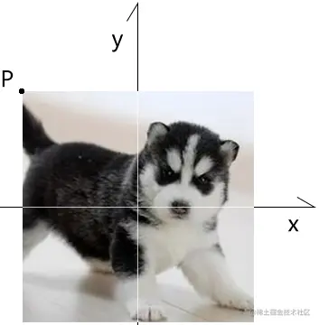
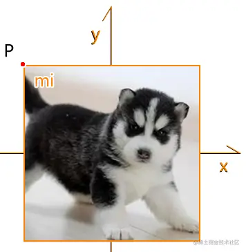
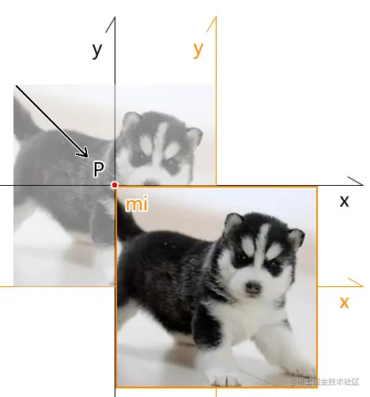
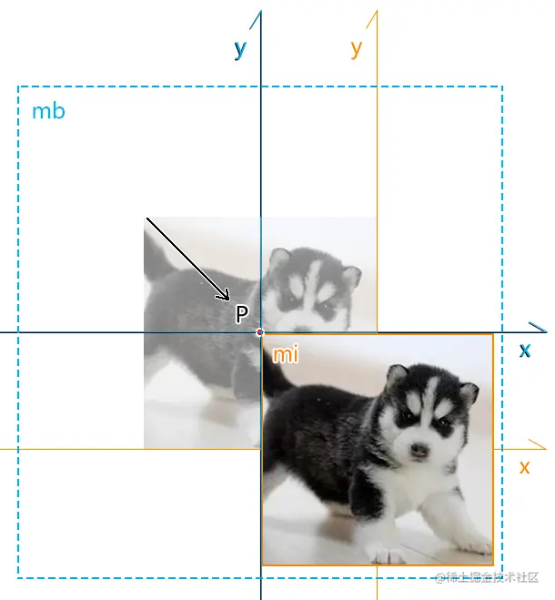
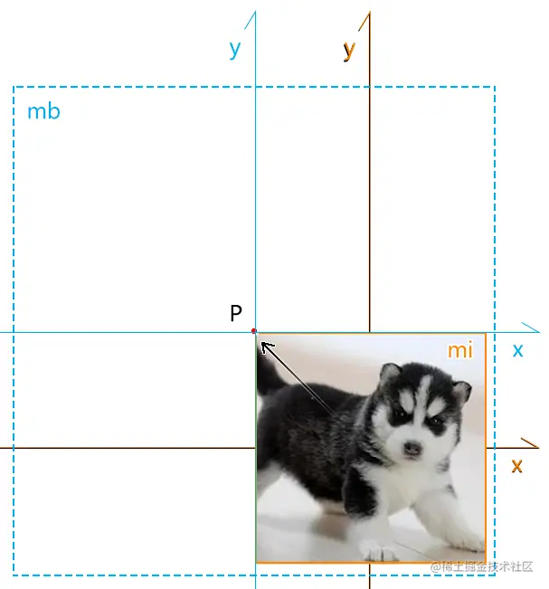
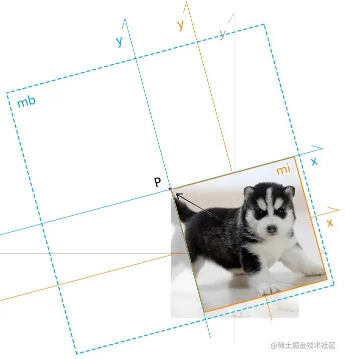
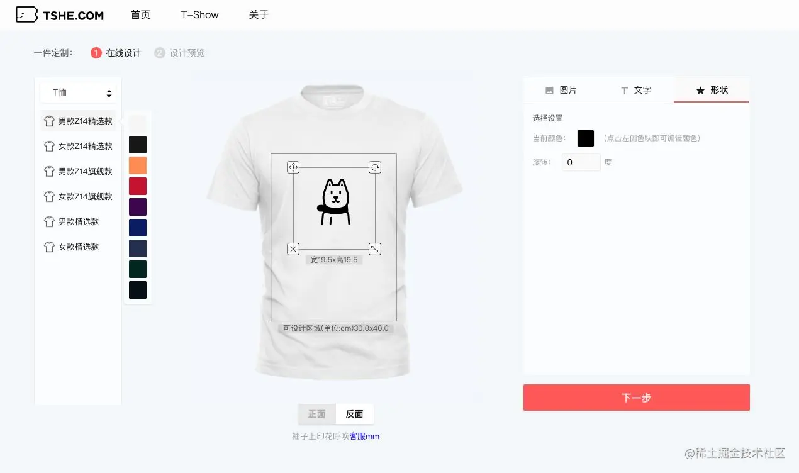
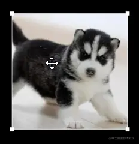
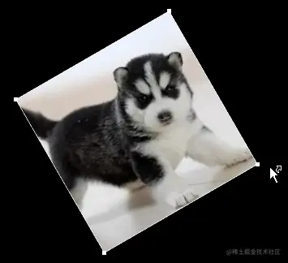
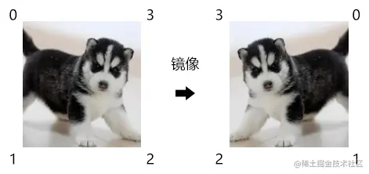

# WebGL 基点变换

---
源码：[github.com/buglas/webg…](https://link.juejin.cn/?target=https%3A%2F%2Fgithub.com%2Fbuglas%2Fwebgl-lesson "https://github.com/buglas/webgl-lesson")

如果大家学到现在，理解了我们以前所说的知识。那我们就可以做很多很多好玩的东西了，虽然我们还没有说到灯光。

以前大家在做项目的时候，经常会遇到基于某个基点对图形进行变换的问题。

接下来，咱们就借这个问题巩固一下咱们之前所学的矩阵变换。

### 1-基点变换

咱们先把思路跑通。

#### 1-1-基点变换的原理



已知：

-   图片img，img 在世界坐标系中

求：让img基于其左上角点P点进行旋转和缩放的方法

思路先行：

-   对于这种问题，千万不要把目光都放在左上角点上，这样虽然也可以达到目的，但会做得很累。
-   我们需要用矩阵的思想看问题，这样做起来，就会比较轻松。

解：

1.  把img装饭盒里，饭盒的本地矩阵是mi。
    
    当前mi和世界坐标系重合。
    



2.  让mi 的位置减去点P



 如果我们现在旋转mi的话，饭盒会基于mi的坐标原点旋转，这明显不是我们想要的。

 那我们位移了mi有什么意义呢？且往后看。

3.  把饭盒装冰箱里，冰箱的本地矩阵是mb。



 当前mb和世界坐标系重合。

4.  让mb 的位置加上点P



此时的img和最初始的img重合。

此时img的左上角点P和mb的坐标原点重合

此时我们旋转mb，冰箱会基于mb的坐标原点旋转，同时也带动了图片基于点P旋转。

5.计算模型矩阵，变换图片顶点的初始点位，从而得到图片顶点基于点P变换后的位置。

模型矩阵=mb\*mi

图片顶点基于点P变换后的位置=模型矩阵\*图片顶点的初始点位

效果如下：



注：

饭盒包含了图片的初始点位，可以理解为three.js中Object3D。

冰箱包含了饭盒，可以理解为three.js中的Group。

#### 1-2-基点变换的代码实现

1.先准备一张图片

```
import { createProgram } from '../jsm/Utils.js';
import { Matrix4, OrthographicCamera, Vector3, Vector2 } from 'https://unpkg.com/three/build/three.module.js';
import OrbitControls from './jsm/OrbitControls.js'
import Mat from './jsm/Mat.js'
import Geo from './jsm/Geo.js'
import Obj3D from './jsm/Obj3D.js'
import Scene from './jsm/Scene.js'

const canvas = document.getElementById('canvas');
canvas.width = window.innerWidth;
canvas.height = window.innerHeight;
const gl = canvas.getContext('webgl');
gl.clearColor(0.0, 0.0, 0.0, 1.0);

const halfH = 1
const ratio = canvas.width / canvas.height
const halfW = halfH * ratio
const [left, right, top, bottom, near, far] = [
    -halfW, halfW, halfH, -halfH, 1, 8
]
const eye = new Vector3(0, 0, 2)
const target = new Vector3(0, 0, 0)
const camera = new OrthographicCamera(
    left, right, top, bottom, near, far
)
camera.position.copy(eye)
camera.lookAt(target)
camera.updateMatrixWorld()
const pvMatrix = camera.projectionMatrix.clone().multiply(
    camera.matrixWorldInverse
)
const scence = new Scene({ gl })

/* 计算图片顶点 */
const [w, h] = [0.6, 0.6]
const [hw, hh] = [w / 2, h / 2]
const vertices = new Float32Array([
    -hw, hh,
    -hw, -hh,
    hw, hh,
    hw, -hh,
])

const image = new Image()
image.src = './images/erha.jpg'
let mat = null
image.onload = function () {
    const vs = document.getElementById('textureVertexShader').innerText
    const fs = document.getElementById('textureFragmentShader').innerText
    const program = createProgram(gl, vs, fs)
    mat = new Mat({
        program,
        data: {
            u_PvMatrix: {
                value: pvMatrix.elements,
                type: 'uniformMatrix4fv',
            },
            u_ModelMatrix: {
                value: new Matrix4().elements,
                type: 'uniformMatrix4fv',
            },
        },
        maps: {
            u_Sampler: {
                image,
            }
        },
        mode: 'TRIANGLE_STRIP'
    })
    const geo = new Geo({
        data: {
            a_Position: {
                array: vertices,
                size: 2
            },
            a_Pin: {
                array: new Float32Array([
                    0, 1,
                    0, 0,
                    1, 1,
                    1, 0,
                ]),
                size: 2
            }
        }
    })
    const obj = new Obj3D({ geo, mat })
    scence.add(obj)
    scence.draw()
}
```

2.声明饭盒和冰箱的本地矩阵，以及图片的变换基点

```
// 饭盒的本地矩阵
const mi = new Matrix4()
// 冰箱的本地矩阵
const mb = new Matrix4()
// 模型矩阵
const mm = new Matrix4()
// 基点
let orignInd = 0
```

上面的模型矩阵mm之后会在渲染时，由mb\*mi得到。

3.基于图片的变换基点布阵

```
setOrign(orignInd)
function setOrign(i) {
    const [x, y] = [vertices[i], vertices[i + 1]]
    mi.setPosition(-x, -y, 0)
    mb.setPosition(x, y, 0)
}
```

4.在渲染方法里变换冰箱后，乘以饭盒的本地矩阵，得到图片的模型矩阵

```
let ang = 0
function render() {
    ang += 0.02
    const s = (Math.sin(ang) + 1) / 2
    mm.copy(
        mb.clone()
        .multiply(
            new Matrix4().makeRotationZ(ang)
        )
        .scale(new Vector3(s, s, 1))
        .multiply(mi)
    )
    mat.setData('u_ModelMatrix', {
        value: mm.elements
    })
    scence.draw()
    requestAnimationFrame(render)
}
```

### 2-二次基点变换

接下来，我们再思考一个问题。

继我们上一次变换之后，若我们想再基于图片的其它角点进行变换，比如右下角，应该怎么办呢？

这个问题的解决思路并不唯一，咱先说一个最简单的思路：

1.每一次变换完成后，直接基于上一次的模型矩阵修改顶点的原始点位。

2.基于新的基点位置，重复第一次基点变换的步骤。

咱们用例子说一下其代码实现：

我想让上面的图片每旋转45°，改变一次变换基点。

具体代码如下：

```
function render() {
    ang += 0.005
    if (ang > Math.PI / 4) {
        ang = 0
        formatVertices()
        orignInd = (orignInd + 2) % 8
        setOrign(orignInd)
    }
    const s = (Math.sin(ang * 8 + Math.PI / 2) + 1) / 2
    mm.copy(
        mb.clone()
        .multiply(
            new Matrix4().makeRotationZ(ang)
        )
        .scale(new Vector3(s, s, 1))
        .multiply(mi)
    )
    mat.setData('u_ModelMatrix', {
        value: mm.elements
    })
    scence.draw()
    requestAnimationFrame(render)
}

function formatVertices() {
    for (let i = 0; i < vertices.length; i += 2) {
        const p = new Vector3(vertices[i], vertices[i + 1], 0)
        .applyMatrix4(mm)
        vertices[i] = p.x
        vertices[i + 1] = p.y
    }
    geo.setData('a_Position', {
        array: vertices
    })
}
```

上面的formatVertices() 方法便是基于模型矩阵格式化vertices点位的方法，修改完后，同步更新geo几何体里的顶点点位。

### 3-用鼠标变换图片

在一些可视化编辑器项目中，经常会遇到用鼠标变换图片的需求，就比如T恤的图案设计。



上面这个案例的具体业务逻辑，我就先不写了，时间有限，咱们先只讲核心，说一下如何用鼠标变换图片。

#### 3-1-功能描述

1.变换节点

变换节点就是图片的四个角点+描边。

变换节点没啥实际功能，就是整个视觉样式，让用户知道此图可变换。


2.位移

当鼠标在图片中的时候，按住鼠标可以拖拽图片。



3.缩放

当鼠标到图片节点的距离小于15像素时，开启鼠标对图片的缩放功能。

默认：居中+等比缩放

alt 键：以鼠标对面的点为基点进行缩放

shift 键：自由缩放


3.旋转

当鼠标到图片节点的距离小于40像素时，开启鼠标对图片的旋转功能。

默认：居中+按照特定弧度(15°)旋转

alt 键：以鼠标对面的点为基点进行旋转

shift 键：自由旋转



基本的变换功能就是这样，接下来咱们说一下具体的代码实现。

#### 3-2-前期准备-图片+外框

1.准备两套着色器，一套绘制点和线，一套着纹理。

```
<!-- 点和线 -->
<script id="solidVertexShader" type="x-shader/x-vertex">
    attribute vec4 a_Position;
    uniform mat4 u_PvMatrix;
    uniform mat4 u_ModelMatrix;
    void main(){
      gl_Position = u_PvMatrix*u_ModelMatrix*a_Position;
      gl_PointSize=10.0;
    }
</script>
<script id="solidFragmentShader" type="x-shader/x-fragment">
    precision mediump float;
    void main(){
      gl_FragColor=vec4(1.0,1.0,1.0,1.0);
    }
</script>
<!-- 着纹理 -->
<script id="textureVertexShader" type="x-shader/x-vertex">
    attribute vec4 a_Position;
    attribute vec2 a_Pin;
    uniform mat4 u_PvMatrix;
    uniform mat4 u_ModelMatrix;
    varying vec2 v_Pin;
    void main(){
      gl_Position = u_PvMatrix*u_ModelMatrix*a_Position;
      v_Pin=a_Pin;
    }
</script>
<script id="textureFragmentShader" type="x-shader/x-fragment">
    precision mediump float;
    uniform sampler2D u_Sampler;
    varying vec2 v_Pin;
    void main(){
      gl_FragColor=texture2D(u_Sampler,v_Pin);
    }
</script>
```

2.准备webgl上下文对象

```
import { createProgram } from '../jsm/Utils.js';
import { Matrix4, OrthographicCamera, Vector3, Vector2 } from 'https://unpkg.com/three/build/three.module.js';
import OrbitControls from './jsm/OrbitControls.js'
import Mat from './jsm/Mat.js'
import Geo from './jsm/Geo.js'
import Obj3D from './jsm/Obj3D.js'
import Scene from './jsm/Scene.js'
import Rect from './jsm/Rect.js'

const canvas = document.getElementById('canvas');
canvas.width = window.innerWidth;
canvas.height = window.innerHeight;
const gl = canvas.getContext('webgl');
gl.clearColor(0.0, 0.0, 0.0, 1.0);
```

3.通过正交相机获取投影视图矩阵

```
const halfH = 1
const ratio = canvas.width / canvas.height
const halfW = halfH * ratio
const [left, right, top, bottom, near, far] = [
    -halfW, halfW, halfH, -halfH, 1, 8
]
const eye = new Vector3(0, 0, 2)
const target = new Vector3(0, 0, 0)
const camera = new OrthographicCamera(
    left, right, top, bottom, near, far
)
camera.position.copy(eye)
camera.lookAt(target)
camera.updateMatrixWorld()
const pvMatrix = camera.projectionMatrix.clone().multiply(
    camera.matrixWorldInverse
)
```

4.通过图片尺寸，获取图片和图片外框的顶点

```
// 图片尺寸
const [w, h] = [0.6, 0.6]
const [hw, hh] = [w / 2, h / 2]
// 图片顶点
const vertices = new Float32Array([
    -hw, hh,
    -hw, -hh,
    hw, hh,
    hw, -hh,
])
// 图片外框顶点
let verticesOut = getVerticesOut()

/* 基于vertices获取verticesOut */
function getVerticesOut() {
    return new Float32Array([
        vertices[0], vertices[1],
        vertices[2], vertices[3],
        vertices[6], vertices[7],
        vertices[4], vertices[5],
    ])
}
```

注：

图片是用TRIANGLE\_STRIP三角带画的；

图片外框是用LINE\_LOOP 闭合线条和点POINTS 画的。

图片和图片外框的顶点排序是不同的。

5.绘制图片外框和图片

```
// 场景
const scence = new Scene({ gl })

// 图片外框-点和线
let matOut = null
let geoOut = null
{
    const vs = document.getElementById('solidVertexShader').innerText
    const fs = document.getElementById('solidFragmentShader').innerText
    const program = createProgram(gl, vs, fs)
    matOut = new Mat({
        program,
        data: {
            u_PvMatrix: {
                value: pvMatrix.elements,
                type: 'uniformMatrix4fv',
            },
            u_ModelMatrix: {
                value: new Matrix4().elements,
                type: 'uniformMatrix4fv',
            },
        },
        mode: ['LINE_LOOP', 'POINTS']
    })
    geoOut = new Geo({
        data: {
            a_Position: {
                array: verticesOut,
                size: 2
            },
        }
    })
    const obj = new Obj3D({ geo: geoOut, mat: matOut })
    scence.add(obj)
}

// 图片
const image = new Image()
image.src = './images/erha.jpg'
let mat = null
let geo = null
image.onload = function () {
    const vs = document.getElementById('textureVertexShader').innerText
    const fs = document.getElementById('textureFragmentShader').innerText
    const program = createProgram(gl, vs, fs)
    mat = new Mat({
        program,
        data: {
            u_PvMatrix: {
                value: pvMatrix.elements,
                type: 'uniformMatrix4fv',
            },
            u_ModelMatrix: {
                value: new Matrix4().elements,
                type: 'uniformMatrix4fv',
            },
        },
        maps: {
            u_Sampler: {
                image,
            }
        },
        mode: 'TRIANGLE_STRIP'
    })
    geo = new Geo({
        data: {
            a_Position: {
                array: vertices,
                size: 2
            },
            a_Pin: {
                array: new Float32Array([
                    0, 1,
                    0, 0,
                    1, 1,
                    1, 0,
                ]),
                size: 2
            }
        }
    })
    const obj = new Obj3D({ geo, mat })
    scence.unshift(obj)
    scence.draw()
}
```

scence.unshift(obj) 以前置的方式添加三维对象。

```
unshift(...objs) {
    const { children, gl } = this
    objs.forEach(obj => {
        children.unshift(obj)
        obj.parent=this
        obj.init(gl)
    })
}
```

我之所以这么做是为了将图片放在图框下面，也就是先渲染图片，再渲染图框。

效果如下：


接下来我们便可以在图片上添加鼠标交互事件了。

#### 3-3-拖拽图片

拖拽图片是比较简单的，所以咱们先从最简单的说起。

1.先声明一些必备变量

```
// 变换状态
let state = 'none'
// 变换数据是否发生改变
let change = false
// 变换状态与cursor状态的对应关系
const cursorMap = new Map([
    ['drag', 'move'],
    ['rotate', 'alias'],
    ['scale', 'pointer'],
    ['none', 'default'],
])

// 拖拽起始位与结束位(世界坐标系)
const dragStart = new Vector2()
const dragEnd = new Vector2()
// 位移量
let offset = new Vector2()
// 饭盒本地矩阵
const mi = new Matrix4()
// 冰箱本地矩阵
const mb = new Matrix4()
// 模型矩阵
const mm = new Matrix4()
```

2.监听canvas的鼠标按下事件

```
canvas.addEventListener('mousedown', event => {
    // 获取鼠标的世界坐标位
    const mp = worldPos(event)
    // 获取变换状态，如果鼠标在图像里，那么变换状态就是'drag'
    if (isInImg(mp)) {
        state = 'drag'
        dragStart.copy(mp)
    }
})
```

鼠标按下时，主要做了2件事情：

-   鼠标在canvas中的位置转世界位，以便于判断鼠标和图片顶点的关系。

```
const mp = worldPos(event)
```

```
function worldPos({ clientX, clientY }) {
    const [hw, hh] = [canvas.width / 2, canvas.height / 2]
    // 裁剪空间位
    const cp = new Vector3(
        (clientX - hw) / hw,
        -(clientY - hh) / hh,
        0
    )
    // 鼠标在世界坐标系中的位置
    const p = cp.applyMatrix4(
        pvMatrix.clone().invert()
    )
    return new Vector2(p.x, p.y)
}
```

回顾一下我们之前所学的矩阵知识：

```
裁剪空间位 = 投影视图矩阵 * 模型矩阵 * 初始顶点位
```

由上式可得：

```
初始顶点位=(投影视图矩阵*模型矩阵)的逆矩阵*裁剪空间位
```

因为图片顶点就是基于世界坐标系定位的，世界坐标系是单位矩阵，任何矩阵与单位矩阵相乘都不会发生改变，所以模型矩阵可以忽略。

最终，鼠标的世界点位就是这样的：

```
const p = cp.applyMatrix4(
    pvMatrix.clone().invert()
)
```

-   获取变换状态，如果鼠标在图像里，那么变换状态就是'drag'。

```
if (isInImg(mp)) {
    state = 'drag'
    dragStart.copy(mp)
}
```

isInImg(dragStart) 是判断鼠标是否在图像中的方法。

```
function isInImg(p) {
    return inTriangle(
        p,
        [
            { x: vertices[0], y: vertices[1] },
            { x: vertices[2], y: vertices[3] },
            { x: vertices[4], y: vertices[5] },
        ]
    ) || inTriangle(
        p,
        [
            { x: vertices[4], y: vertices[5] },
            { x: vertices[2], y: vertices[3] },
            { x: vertices[6], y: vertices[7] },
        ]
    )
}
```

inTriangle()：判断顶点是否在三角形中，返回布尔值。

因为图片由两个三角形组成，所以我做了两次判断。

只要点位在任意三角形中，就说明点位在图片中。

至于判断点位是否在三角形中的方法，我们之前说过。

```
function inTriangle(p0, triangle) {
  let bool = true;
  for (let i = 0; i < 3; i++) {
    const j = (i + 1) % 3;
    const [p1, p2] = [triangle[i], triangle[j]];
    if (cross([p0, p1, p2]) < 0) {
      bool = false;
      break
    }
  }
  return bool;
}
function cross([p0, p1, p2]) {
  const [ax, ay, bx, by] = [
    p1.x - p0.x,
    p1.y - p0.y,
    p2.x - p0.x,
    p2.y - p0.y,
  ];
  return ax * by - bx * ay;
}
```

3.监听canvas的鼠标移动事件

```
canvas.addEventListener('mousemove', event => {
    // 获取鼠标世界位
    const mp = worldPos(event)
    // 设置鼠标样式
    if (state === 'none') {
        let cursorState = 'none'
        if (isInImg(mp)) {
            cursorState = 'drag'
        }
        canvas.style.cursor = cursorMap.get(cursorState)
        return
    }
    // 变换图片
    dragEnd.copy(mp)
    change = true
    switch (state) {
        case 'drag':
            drag()
            break
    }
    //渲染
    render()
})
```

鼠标移动时，主要做了4件事情：

-   获取鼠标世界位，以便于判断鼠标和图片顶点的关系。
    
-   设置鼠标样式，此操作是在图片不处于任何变换状态时执行的。
    
-   变换图片
    
    -   drag()：通过拖拽结束位减拖拽起始位得到图片的偏移量。
    
    ```
    function drag() {
        offset.copy(
            dragEnd.clone().sub(dragStart)
        )
    }
    ```
    
-   渲染 render()
    

```
function render() {
    const { elements } = mm.copy(getModelMatrix())
    mat.setData('u_ModelMatrix', {
        value: elements
    })
    matOut.setData('u_ModelMatrix', {
        value: elements
    })
    scence.draw()
}
```

我们重点看一下计算模型矩阵的方法getModelMatrix()

```
function getModelMatrix() {
    // 位移矩阵
    const { x: px, y: py } = offset
    const moveMatrix = new Matrix4().set(
        1, 0, 0, px,
        0, 1, 0, py,
        0, 0, 1, 0,
        0, 0, 0, 1,
    )
    // 模型矩阵
    return mb.clone()
        .multiply(moveMatrix)
        .multiply(mi)
}
```

3.监听canvas的鼠标抬起事件

```
canvas.addEventListener('mouseup', () => {
    if (state !== 'none') {
        state = 'none'
        if (change) {
            change = false
            offset.set(0, 0)
            canvas.style.cursor = 'default'
            formatVertices()
        }
    }
})
```

鼠标抬起时，主要做了以下事情：

-   清理state 状态
-   清空图片的变换数据
-   恢复鼠标样式
-   格式化顶点数据，并更新几何体的顶点集合

```
function formatVertices() {
    for (let i = 0; i < vertices.length; i += 2) {
        const p = new Vector3(vertices[i], vertices[i + 1], 0)
        .applyMatrix4(mm)
        vertices[i] = p.x
        vertices[i + 1] = p.y
    }
    verticesOut = getVerticesOut()
    geo.setData('a_Position', {
        array: vertices
    })
    geoOut.setData('a_Position', {
        array: verticesOut
    })
}
```

#### 3-4-旋转图片

1.声明必备变量

```
// 变换基点
let orign = new Vector2()
// 拖拽起始位与结束位减变换基点位
const start2Orign = new Vector2()
const end2Orign = new Vector2()
// 旋转起始弧度
let startAng = 0
// 旋转量
let angle = 0
```

2.鼠标按下

```
canvas.addEventListener('mousedown', event => {
    // 获取鼠标拖拽的起始位dragStart，此位置为世界坐标位
    const mp = worldPos(event)
    // 获取变换状态，如果鼠标在图像里，那么变换状态就是'drag'
    if (isInImg(mp)) {
        state = 'drag'
        dragStart.copy(mp)
    } else {
        const node = selectNode(mp)
        if (node) {
            dragStart.copy(mp)
            state = node.state
            setOrign()
            start2Orign.subVectors(dragStart, orign)
            startAng = Math.atan2(start2Orign.y, start2Orign.x)
        }
    }
})
```

鼠标按下时，只要不是在图片里，就会做以下事情：

-   选择节点selectNode(dragStart)，返回节点索引和变换状态

```
function selectNode(m) {
    let node = null
    for (let i = 0; i < vertices.length; i += 2) {
        const v = new Vector2(vertices[i], vertices[i + 1])
        const len = m.clone().sub(v).length() * canvas.height / 2
        if (len < 40) {
            node = { index: i, state: 'rotate' }
            break
        }
    }
    return node
}
```

-   若选中节点，则更新变换状态、基点、拖拽起点相对于基点的位置、起始弧度。
    
    详细看一下设置基点的方法：
    

```
function setOrign() {
    const { x, y } = getCenter()
    orign.set(x, y)
    mi.makeTranslation(-x, -y, 0)
    mb.makeTranslation(x, y, 0)
}
function getCenter() {
      let [x1, y1] = [vertices[0], vertices[1]]
      let [x2, y2] = [vertices[6], vertices[7]]
      return new Vector2(
        x1 + (x2 - x1) / 2,
        y1 + (y2 - y1) / 2
      )
    }
```

3.鼠标移动

```
canvas.addEventListener('mousemove', event => {
    // 获取鼠标世界位
    const mp = worldPos(event)
    // 设置鼠标样式
    if (state === 'none') {
        let cursorState = 'none'
        if (isInImg(mp)) {
            cursorState = 'drag'
        } else {
            const node = selectNode(mp)
            cursorState = node ? node.state : 'none'
        }
        canvas.style.cursor = cursorMap.get(cursorState)
        return
    }
    // 变换图片
    dragEnd.copy(mp)
    end2Orign.subVectors(mp, orign)
    change = true
    switch (state) {
        case 'drag':
            drag()
            break
        case 'rotate':
            rotate()
            break
    }
    //渲染
    render()
})
```

-   rotate() 旋转方法

```
function rotate() {
    const endAng = Math.atan2(end2Orign.y, end2Orign.x)
    angle = endAng - startAng
}
```

-   render() 方法无需改变，只是其中获取模型矩阵getModelMatrix() 的方法里，需要把旋转量算进去。

```
function getModelMatrix() {
    // 位移矩阵
    const { x: px, y: py } = offset
    const moveMatrix = new Matrix4().set(
        1, 0, 0, px,
        0, 1, 0, py,
        0, 0, 1, 0,
        0, 0, 0, 1,
    )
    // 旋转矩阵
    const [s, c] = [Math.sin(angle), Math.cos(angle),]
    const rotateMatrix = new Matrix4().set(
        c, -s, 0, 0,
        s, c, 0, 0,
        0, 0, 1, 0,
        0, 0, 0, 1,
    )
    // 模型矩阵
    return mb.clone()
        .multiply(moveMatrix)
        .multiply(rotateMatrix)
        .multiply(mi)
}
```

3.鼠标抬起

```
canvas.addEventListener('mouseup', () => {
    if (state !== 'none') {
        state = 'none'
        if (change) {
            change = false
            offset.set(0, 0)
            angle = 0
            canvas.style.cursor = 'default'
            formatVertices()
        }
    }
})
```

图片旋转的整体逻辑就是这样，当前图片默认是基于图片中心自由旋转。

我们可以再为其做一下优化：按住alt键，基于鼠标对面的节点变换。

4.alt 键改变基点

```
// 当前按下的键
let keys = new Set()
// 当前节点索引
let nodeInd = 0
// 节点对面的点
const opposite = new Map([[0, 6], [2, 4], [6, 0], [4, 2]])

// 监听canvas的鼠标按下事件
canvas.addEventListener('mousedown', event => {
    // 获取鼠标拖拽的起始位dragStart，此位置为世界坐标位
    const mp = worldPos(event)
    // 获取变换状态，如果鼠标在图像里，那么变换状态就是'drag'
    if (isInImg(mp)) {
        state = 'drag'
        dragStart.copy(mp)
    } else {
        const node = selectNode(mp)
        if (node) {
            dragStart.copy(mp)
            state = node.state
            nodeInd = node.index
            setOrign()
            start2Orign.subVectors(dragStart, orign)
            startAng = Math.atan2(start2Orign.y, start2Orign.x)
        }
    }
})

window.addEventListener('keydown', ({ keyCode }) => {
    keys.add(keyCode)
    setOrign()
})
window.addEventListener('keyup', ({ keyCode }) => {
    keys.delete(keyCode)
    setOrign()
})

/* 设置基点 */
function setOrign() {
    const { x, y } = keys.has(18) ? getOppo() : getCenter()
    orign.set(x, y)
    mi.makeTranslation(-x, -y, 0)
    mb.makeTranslation(x, y, 0)
}

// 对面的点
function getOppo() {
    const i2 = opposite.get(nodeInd)
    return new Vector2(vertices[i2], vertices[i2 + 1])
}
// 中点
function getCenter() {
    let [x1, y1] = [vertices[0], vertices[1]]
    let [x2, y2] = [vertices[6], vertices[7]]
    return new Vector2(
        x1 + (x2 - x1) / 2,
        y1 + (y2 - y1) / 2
    )
}
```

5.默认按照特定弧度旋转。按住shift键时，再自由旋转。

```
// 每次旋转的弧度
let angSpace = Math.PI / 12
function rotate() {
    const endAng = Math.atan2(end2Orign.y, end2Orign.x)
    angle = endAng - startAng
    if (!keys.has(16)) {
        angle = Math.round(angle / angSpace) * angSpace
    }
}
```

#### 3-5-缩放图片

1.建立必备变量

```
// 缩放量
let zoom = new Vector2(1, 1)
```

2.鼠标移动

```
canvas.addEventListener('mousemove', event => {
    ……
    switch (state) {
            ……
            case 'scale':
                scale()
                break
    }
    render()
})

/* 缩放 */
function scale() {
    const sx = end2Orign.x / start2Orign.x
    const sy = end2Orign.y / start2Orign.y
    if (keys.has(16)) {
        //自由缩放
        zoom.set(sx, sy)
    } else {
        //等比缩放
        const ratio = end2Orign.length() / start2Orign.length()
        zoom.set(
            ratio * sx / Math.abs(sx),
            ratio * sy / Math.abs(sy),
        )
    }
}
```

3.选择节点

```
function selectNode(m) {
    let node = null
    for (let i = 0; i < vertices.length; i += 2) {
        const v = new Vector2(vertices[i], vertices[i + 1])
        const len = m.clone().sub(v).length() * canvas.height / 2
        if (len < 15) {
            node = { index: i, state: 'scale' }
            break
        } else if (len < 40) {
            node = { index: i, state: 'rotate' }
            break
        }
    }
    return node
}
```

4.鼠标抬起

```
canvas.addEventListener('mouseup', event => {
    ……
    zoom = new Vector2(1, 1)
    ……
})
```

5.模型矩阵

```
function getModelMatrix() {
    // 位移矩阵
    const { x: px, y: py } = offset
    const moveMatrix = new Matrix4().set(
        1, 0, 0, px,
        0, 1, 0, py,
        0, 0, 1, 0,
        0, 0, 0, 1,
    )
    // 旋转矩阵
    const [s, c] = [Math.sin(angle), Math.cos(angle),]
    const rotateMatrix = new Matrix4().set(
        c, -s, 0, 0,
        s, c, 0, 0,
        0, 0, 1, 0,
        0, 0, 0, 1,
    )
    // 缩放矩阵
    const { x: sx, y: sy } = zoom
    const scaleMatrix = new Matrix4().set(
        sx, 0, 0, 0,
        0, sy, 0, 0,
        0, 0, 1, 0,
        0, 0, 0, 1,
    )
    // 模型矩阵
    return mb.clone()
        .multiply(moveMatrix)
        .multiply(rotateMatrix)
        .multiply(scaleMatrix)
        .multiply(mi)
}
```

上面的位移、旋转、缩放矩阵，我是故意展开的，以方便大家理解矩阵变换的本质。

其实我们也可以使用Matrix4 对象内置的方法进行变换。

```
function getModelMatrix() {
    return mb.clone()
        .multiply(
            new Matrix4().makeTranslation(
                position.x, position.y, 0
            )
        )
        .multiply(
            new Matrix4().makeRotationZ(angle)
        )
        .scale(new Vector3(zoom.x, zoom.y, 1))
        .multiply(mi)
}
```

到目前为止，缩放的基本流程就搞定了。

然而，镜像缩放时，还会带来一个坑，此坑会影响图片的选择。

#### 3-6-镜像缩放时的图片选择

且看下图：



我们之前是通过下面的方法判断点位是否在三角形中的：

```
function inTriangle(p0, triangle) {
  let bool = true;
  for (let i = 0; i < 3; i++) {
    const j = (i + 1) % 3;
    const [p1, p2] = [triangle[i], triangle[j]];
    if (cross([p0, p1, p2]) < 0) {
      bool = false;
      break
    }
  }
  return bool;
}
function cross([p0, p1, p2]) {
  const [ax, ay, bx, by] = [
    p1.x - p0.x,
    p1.y - p0.y,
    p2.x - p0.x,
    p2.y - p0.y,
  ];
  return ax * by - bx * ay;
}
```

上面的 cross(\[p0, p1, p2\]) < 0 是针对逆时针绘图的情况来判断的。

若是顺时针绘图，点位在三角形中需要满足的条件就应该是cross(\[p0, p1, p2\]) > 0

因此我们需要判断一下，这个图片是逆时针画的，还是顺时针画的。

之前我们说过一个原理：叉乘是有方向的。

通过上面的原理可以知道：在二维多边形中，通过叉乘求出的多边形的面积是有正负之分的。

通过这个多边形的面积的正负，便可以判断图片是逆时针画的，还是顺时针画的。

对于多边形求面积的具体推导过程，我就不细说了，因为细说我至少得说一个小时。

大家先自己理解，要是理解不了，我再单独给大家引一章出来。

接下来咱们通过代码说一下其具体实现过程。

1.先封装一个按逆时针获取图片中两个三角形的方法，以便复用

```
function getTriangles() {
    return [
        [
            { x: vertices[0], y: vertices[1] },
            { x: vertices[2], y: vertices[3] },
            { x: vertices[4], y: vertices[5] },
        ],
        [
            { x: vertices[4], y: vertices[5] },
            { x: vertices[2], y: vertices[3] },
            { x: vertices[6], y: vertices[7] },
        ]
    ]
}
```

2.再封装一个获取面积的方法

```
function getArea() {
    const [t1, t2] = getTriangles()
    return cross(t1) + cross(t2)
}
```

上面所求的面积实际上是图片面积的两倍，不过这都无所谓，我只需要面积的正负。

3.声明面积变量

```
// 面积
let area = getArea()
```

4.在判断点位是否在三角形中的时候，乘上面积

```
function inTriangle(p0, triangle) {
    let bool = true;
    for (let i = 0; i < 3; i++) {
        const j = (i + 1) % 3;
        const [p1, p2] = [triangle[i], triangle[j]];
        if (area * cross([p0, p1, p2]) < 0) {
            bool = false;
            break
        }
    }
    return bool;
}
```

5.面积需要随顶点数据的格式化同步更新

```
function formatVertices() {
    for (let i = 0; i < vertices.length; i += 2) {
        const p = new Vector3(vertices[i], vertices[i + 1], 0)
        .applyMatrix4(mm)
        vertices[i] = p.x
        vertices[i + 1] = p.y
    }
    area = getArea()
    geo.setData('a_Position', {
        array: vertices
    })
    geoOut.setData('a_Position', {
        array: getVerticesOut()
    })
}
```

### 4-保留初始点位

我之前在变换图片时，其实还有一处瑕疵，那就是无法保留初始点位。

初始点位与浮点数进行多次运算，容易引起数据失真。

当然，若变换次数不多，肉眼是很难发现失真的。

对于上面的问题，我们是可以通过保留初始点位来解决的。

接下来咱们说一下其实现思路。

#### 4-1-实现思路

已知：图片img

求：基于图片的左上角点P变换图片，且保留图片初始点位的方法

解：

1.搭建矩阵

-   把图片装画框里，画框的本地矩阵是mh
-   把画框装饭盒里，饭盒的本地矩阵是mi
-   把饭盒装冰箱里，冰箱的本地矩阵是mb

2.设置变换基点：

-   mi-P
-   mb+P

3.变换冰箱的本地矩阵mb

4.在第二次变换时，将所有变换数据合入画框mh中

5.渲染时的模型矩阵：

```
mb*mi*mh
```

#### 4-2-代码实现

在之前代码的基础上进行修改。

1.声明必备数据

```
// 图片初始顶点
const verticesBasic = new Float32Array([
    -hw, hh,
    -hw, -hh,
    hw, hh,
    hw, -hh,
])
// 图片顶点的世界位
const vertices = Float32Array.from(verticesBasic)
// 画框本地矩阵
const mh = new Matrix4()
```

2.将图片和图片外框的顶点数据写死，之后在变换的时候无需修改初始点位，直接修改模型矩阵即可。

```
geoOut = new Geo({
    data: {
        a_Position: {
            array: new Float32Array([
                verticesBasic[0], verticesBasic[1],
                verticesBasic[2], verticesBasic[3],
                verticesBasic[6], verticesBasic[7],
                verticesBasic[4], verticesBasic[5],
            ]),
            size: 2
        },
    }
})
……
geo = new Geo({
    data: {
        a_Position: {
            array: verticesBasic,
            size: 2
        },
        a_Pin: {
            array: new Float32Array([0, 1,0, 0,1, 1,1, 0,]),
            size: 2
        }
    }
})
```

3.在格式化顶点数据的方法里，已经无需更新几何体的顶点数据，只需要获取图片顶点的世界位即可。

```
function formatVertices() {
    mh.copy(mm.clone().multiply(mh))
    for (let i = 0; i < verticesBasic.length; i += 2) {
        const p = new Vector3(verticesBasic[i], verticesBasic[i + 1], 0)
        .applyMatrix4(mh)
        vertices[i] = p.x
        vertices[i + 1] = p.y
    }
    area = getArea()
}
```

4.在渲染方法里计算模型矩阵的时候，再乘上画框的本地矩阵

```
function render() {
    mm.copy(getModelMatrix())
    const { elements } = mm.clone().multiply(mh)
    mat.setData('u_ModelMatrix', {
        value: elements
    })
    matOut.setData('u_ModelMatrix', {
        value: elements
    })
    scence.draw()
}
```

关于鼠标对图像的变换我们就说到这。

虽然我们在这里是拿二维图片举的例子，然而其实现思想都是按三维走的，就比如模型矩阵的运算。

通过上面的例子，大家可以知道修改模型的两种方式：

-   直接修改构成模型的初始点位
-   修改模型矩阵

当然，上面的操作最终都是在移动模型的初始点位，只是其应用场景会有所不同。

前者适合对模型的局部顶点进行修改，就比如对图片的某一个顶点进行拉扯。

后者适合对模型的所有顶点统一变换。

大家理解了这两种方式的差异，也就知道了在three.js 里什么时候要修改BufferGeometry对象里的顶点，什么时候修改Object3D对象的本地矩阵。
