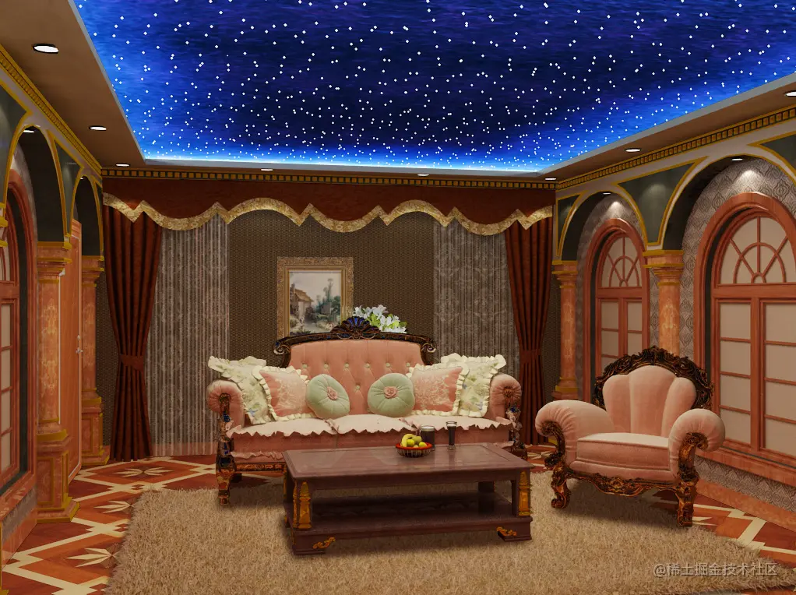
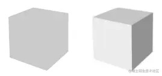
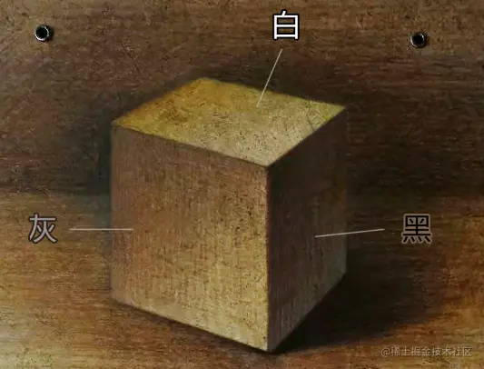
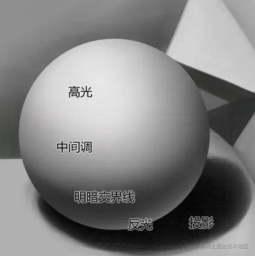
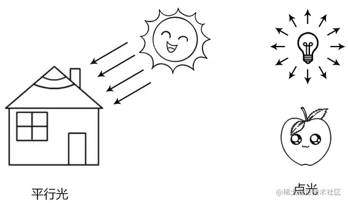
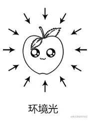
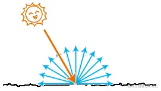
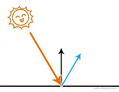

# 认识光

---
光是由光源发出的，光有方向、亮度和颜色。

我们可以想象手电筒打出的一道白色的光。

手电筒是光源，其亮度会受电池的影响，颜色为白色，方向可以由你来控制。

因为光的存在，我们可以看到世界的多姿多彩。

接下咱们就具体看一下光照会对现实世界中的物体产生哪些影响。

### 1-光照对物体的影响

现实世界中的物体被光线照射时，会吸收一部分光，反射一部分光。

当反射的光进入人的眼睛中时，人们便可以看到物体，并识别出它的颜色。

比如，蓝色的星空顶会反射蓝色的光，当蓝色的光进入人的眼睛中时，人们才能看到蓝色的星空顶。

光会对物体产生以下影响：

-   影响物体表面不同位置的明暗程度
-   影响物体的颜色
-   影响物体的投影

物体的明暗差异，可以让我们感觉这个物体是立体的。

比如下图中，左侧的立方体没有明暗差异，给人的感觉就是一个平面；右侧的立方体具有明暗差异，给人的感觉是立体的。

以前，我在学素描的时候，老师就在反复的强调“三大面”、“五调子”。

三大面、五调子就是在描述光对物体的明暗影响，这两个概念可以让我们画出的东西更有体感。

-   三大面：黑、白、灰三个面，描述的就是物体的明暗差异。

-   五调子：高光、中间调、明暗交界线、反光和投影。

物体的颜色会受光色的影响，这个我们之后会详说。

物体的影子就是光源看不见的地方，我们之后会通过算法来计算。

接下来，我们再认识一下光源。

### 2-光源

光源，就是光的源头。

基于光源发出的光线的方向，我们可以将光源分成两种：

-   平行光（directional light）：光线相互平行，射向同一方向。比如从窗外摄入房间的阳光就是平行的。
    
    注：虽让太阳的光也是向四周发射的，但太阳相对于房间而言太大，光线夹角可以忽略不计，所以就认为从窗外射入室内的阳光是平行的。
    
-   点光源（point light）：光线从一点向周围放射。比如房间里的的灯泡就是点光源。
    

若对光源的照射范围做限制，还可以衍生出一些更加具体的光源，比如筒灯、聚光灯等。

现实世界中还有一种间接光源，叫环境光（ambient light），它是经过物体反射后的光。

当光源射出的光线打到物体上时，物体反射的光便是我们识别物体的关键。

接下来，我们再认识一下物体反射的光。

### 3-反射光

反射光：当光源射出的光线打到物体上时，物体反射的光。

物体的反射光是有方向和颜色的，其方向和颜色会受入射光和物体表面的影响。

物体常见的的反射光：

-   漫反射( diffuse reflection)： 物体在接收到直接光源的入射光后，会将光线均匀的反射向四面八方，如下图：
    
    
    
    物体表面越粗糙，漫反射就越明显。
    
-   镜面反射(specular reflection)： 物体在接收到直接光源的入射光后，会将光线以与物体表面的法线对称的方向反射出去。
    

 物体表面越光滑，镜面反射就越明显。

-   环境反射（ enviroment ambient reflection）：物体对环境光的反射。

关于光的基本概念咱们就先说到这，接下来我们就具体的说一下如何为物体着色。
