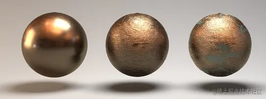
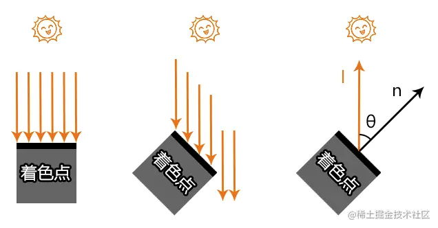
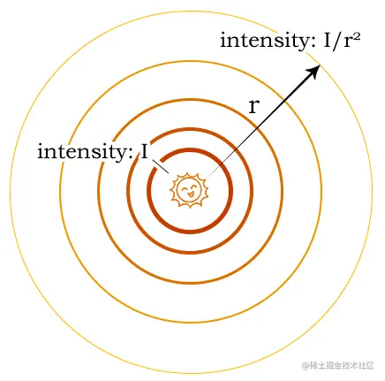
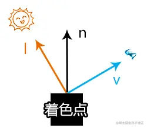
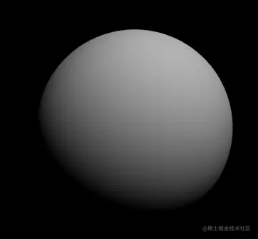
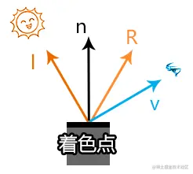
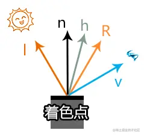
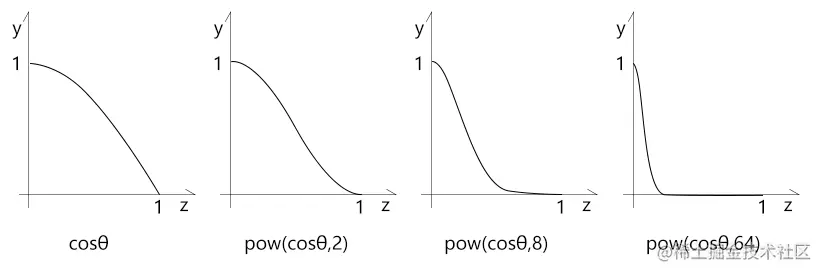
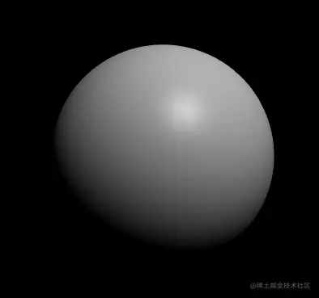
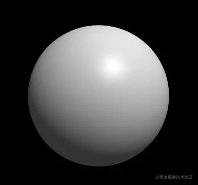

# WebGL 着色原理

---
源码：[github.com/buglas/webg…](https://link.juejin.cn/?target=https%3A%2F%2Fgithub.com%2Fbuglas%2Fwebgl-lesson "https://github.com/buglas/webgl-lesson")

通俗而言，着色(shading)是绘画时，用线条或色块表示物体明暗或颜色的方式。

-   线条着色


-   色块着色


在计算机图形学中，着色是对不同物体应用不同材质的过程。



我们要在计算机里为模型着色，是很难原封不动的还原现实的。

我们只能让模型更加接近现实。

让模型接近现实的着色方法是有很多种的。

接下来，我会跟大家说一个叫Blinn-Phong 着色方法。

Blinn-Phong 是一种反射模型，不具备严格的物理意义，它是对物理现象的模拟，所以我们不要基于现实情况太过较真。

我们先看一下要对一个物体进行着色需要考虑的条件。


-   着色点
    
    -   法线normal
    -   颜色diffuse coefficient
    -   光泽度 shininess
-   光源
    
    -   光源位置 position
    -   光源强度 intensity
-   着色点到光源的距离r
    
-   着色点到光源的方向l
    
-   着色点到视点的方向v
    

接下来，我们先考虑一下着色点的亮度和上面各种条件的关系。

### 1-光线与着色点法线的夹角

在同样的光源下，入射光线和着色点法线的夹角会影响着色点接收光线的数量。



在上图中，假如第一个着色点能接收6条光线，则当着色点旋转45°后，它就只能接收4条光线了。

因此，我们会用入射光线l 和着色点法线n的夹角的余弦值，来表示着色点的受光程度。

```
cosθ=l·n
```

解释一下上面的等式是怎么来的。

由点积公式得：

```
l·n=cosθ*|l|*|n|
```

所以：

```
cosθ=l·n/|l|*|n|
```

因为：l,n为单位向量

所以：

```
cosθ=l·n/1*1
cosθ=l·n
```

### 2-光线的衰减

光在传播的过程中会产生衰减。

着色点到光源的距离越远，着色点接收到的光能就越少。

现实世界中影响光线衰减的因素有很多，比如天气情况、空气质量等。

我们这里的图形学可以先不考虑太多，我们可以用一个简单的公式来模拟光线的衰减。



已知：

I是光源的强度

r 是着色点到光源的距离

求：着色点处的光线强度intensity

解：

```
intensity=I/r²
```

注：

有些光的光线衰减是可以被忽略的，比如从窗外打进房间里的阳光。

其原理就是，无论光线方向还是光线衰减，只要其在一定范围内变化极小，那就可以忽略，从而提高渲染速度。

接下来，我们把上面的已知条件和公式做一下梳理，求一下着色点的漫反射。

### 3-漫反射

#### 3-1-漫反射公式



漫反射的计算公式：

```
Ld=kd(I/r²)*max(0,n·l)
```

-   Ld-diffusely reflected light 漫反射
-   kd-diffuse coefficient 漫反射系数，即颜色
-   I/r²-着色点处的光线强度
-   max(0,n·l)-着色点接收到的光线数量

注：漫反射和视线v没有任何关系，这是因为漫反射是向四面八方反射的。

接下来，咱们利用这个公式为webgl的世界添加一片阳光。

#### 3-2-漫反射示例

已知：

-   球体
    
    -   漫反射系数 u\_Kd
-   球体被阳光照射
    
-   阳光的特性：
    
    -   平行光
    -   光线方向为 u\_LightDir
    -   光线强度为1，衰减忽略

求：球体的漫反射

解：

1.着色器

```
<script id="vs" type="x-shader/x-vertex">
    attribute vec4 a_Position;
    attribute vec3 a_Normal;
    uniform mat4 u_ModelMatrix;
    uniform mat4 u_PvMatrix;
    varying vec3 v_Normal;
    void main(){
      gl_Position = u_PvMatrix*u_ModelMatrix*a_Position;
      v_Normal=a_Normal;
    }
</script>
<script id="fs" type="x-shader/x-fragment">
    precision mediump float;
    uniform vec3 u_Kd;
    uniform vec3 u_LightDir;
    varying vec3 v_Normal;
    void main(){
      vec3 diffuse=u_Kd*max(0.0,dot(u_LightDir,v_Normal));
      gl_FragColor=vec4(diffuse,1.0);
    }
</script>
```

2.声明已知条件

```
//阳光的光线方向
const lightDir = new Vector3(0.5, 1, 1).normalize()
//漫反射系数-颜色
const u_Kd = [0.7, 0.7, 0.7]
// 球体
const sphere = new SphereGeometry(0.5, 6, 4)
// 顶点集合
const { array: vertices } = sphere.getAttribute('position')
// 法线集合
const { array: normals } = sphere.getAttribute('normal')
// 顶点索引集合
const { array: indexes } = sphere.index
```

球体是使用three.js 的SphereGeometry 对象建立的，我们可以直接从这里面提取球体的顶点集合、法线集合和顶点索引，然后为我所用。

之后我会再跟大家说一个用极坐标系来绘制球体的方法，咱们这里先讲灯光。

2.绘图

```
// 场景
const scene = new Scene({ gl })
// 注册程序对象
scene.registerProgram(
  'Blinn-Phong',
  {
    program: createProgram(
      gl,
      document.getElementById('vs').innerText,
      document.getElementById('fs').innerText
    ),
    attributeNames: ['a_Position', 'a_Normal'],
    uniformNames: [
      'u_PvMatrix', 'u_ModelMatrix', 'u_Kd', 'u_LightDir'
    ]
  }
)

const mat = new Mat({
  program: 'Blinn-Phong',
  data: {
    u_PvMatrix: {
      value: orbit.getPvMatrix().elements,
      type: 'uniformMatrix4fv',
    },
    u_ModelMatrix: {
      value: new Matrix4().elements,
      type: 'uniformMatrix4fv',
    },
    u_LightDir: {
      value: [...lightDir],
      type: 'uniform3fv',
    },
    u_Kd: {
      value: u_Kd,
      type: 'uniform3fv',
    },
  }
})
const geo = new Geo({
  data: {
    a_Position: {
      array: vertices,
      size: 3
    },
    a_Normal: {
      array: normals,
      size: 3
    },
  },
  index: {
    array: indexes
  }
})
const obj = new Obj3D({ geo, mat })
scene.add(obj)
scene.draw()
```

3.微调Scene对象中用顶点索引绘图的方法。

将之前的gl.UNSIGNED\_BYTE变成gl.UNSIGNED\_SHORT。

```
gl.drawElements(gl[mode],count, gl.UNSIGNED_SHORT,0)
```

解释一下这么做的原因。

我们之前用顶点索引绘图时，用的数据类型是gl.UNSIGNED\_BYTE，如：

```
gl.drawElements(gl.TRIANGLES,3,gl.UNSIGNED_BYTE,0)
```

此数据类型只能用Uint8Array对象建立顶点索引集合，如：

```
index: {
  array: new Uint8Array([……])
}
```

然而，Uint8Array 有个弊端，其数据的取值范围只能是\[0,255\]，这就导致了一个模型的顶点数量不能超过256。

因此，我们需要扩大顶点索引的取值范围，比如用Uint16Array 建立顶点索引。

Uint16Array数据的取值范围是\[0,65535 \]，这对于一般模型而言，已经够用了。

在three.js 里，其顶点索引用的就是Uint16Array 。

使用Uint16Array 后，drawElements() 方法里的数据类型就需要变成gl.UNSIGNED\_SHORT。

注：

当前我这个webgl 架子还可以再做深度封装的，比如像three.js 那样为其内置几种程序对象和几何体对象，需要的时候直接调用。

因为我当前把重点放在图形学，就不再做深度封装了，只要够用既可以。

虽然这个webgl 框架用起来要比three.js 麻烦很多，但至少要比原生手写便捷，而且也能辅助大家更好的理解底层原理。

效果如下：



当前的球体像一个石膏球，因为漫反射就是这样，其反射光射向四面八方，比较均匀，没有高光。

接下来咱们思考一个问题，我想把这个石膏球变成塑料球，应该怎么办呢？

这时候，我们就需要镜面反射了。

### 4-镜面反射

#### 4-1-镜面反射公式

塑料和石膏的差异在于其表面比较光滑，更加接近镜面，会有明显的高光存在。

我们通过镜面反射考虑一下，我们的眼睛什么时候可以看见物体的高光。



在上图中，方向R便是光线I 在物体表面的镜面反射方向，R和l 基于法线n 对称。

当视线v 接近R的时候，便可以看见高光。

因此，Phone 提出了通过∠<v,R> 的夹角来判断眼睛能否看见高光的方法。

然而，要基于光线l 和法线n 去求l 的反射向量R，是需要不小的计算量的。

所以，后来Blinn 就对Phone 的方案作出了改进，设计出了 更简便的 Blinn-Phone 材质。

接下来，咱就看一下Blinn-Phone 材质的设计思路。



上图中，向量h 是∠<v,v+l> 的角平分线。

通过观察，我们可以知道：

随视线的变换，∠<h,n> 和∠<v,R> 的大小是成正比的。

也就说，当视线v 越接近镜面反射R ，角平分线h就越接近法线n。

Blinn-Phone 计算镜面反射的公式如下：

```
h=(v+l)/|v+l|
Ls=ks*(I/r²)*pow(max(0,n·h),p)
```

-   h：∠<v,v+l> 的角平分线
-   |v+l|：(v+l) 的长度
-   Ls：镜面反射 specularly reflected light
-   ks：镜面反射系数 specularly coefficient
-   max(0,n·h)：cos∠<h,n>
-   pow(max(0,n·h),p)：cos∠<h,n>的p次方

解释一下cos∠<h,n>的p次方的意义。

若只用cos∠<h,n> 来计算高光，会得到较大的高光，而我们平时所见的高光一般都是比较小的。

因此，我们可以对cos∠<h,n>做一下幂运算。



#### 4-1-镜面反射示例

接下来，我们还是基于之前的那个球体来做一下镜面反射。

已知：

-   球体
    
    -   漫反射系数 u\_Kd
    -   镜面反射系数 u\_Ks
-   球体被阳光照射
    
-   阳光的特性：
    
    -   平行光
    -   光线方向为 u\_LightDir
    -   光线强度为 1，衰减忽略
-   视点位置：u\_Eye
    

求：球体的镜面反射

解：

1.声明已知条件。

```
// 阳光的光线方向
const LightDir = new Vector3(0.5, 1, 1).normalize()
// 漫反射系数-颜色
const u_Kd = [0.7, 0.7, 0.7]
// 镜面反射系数-颜色
const u_Ks = [0.3, 0.3, 0.3]
```

2.注册程序对象。

```
scene.registerProgram(
  'Blinn-Phong',
  {
    program: createProgram(
      gl,
      document.getElementById('vs').innerText,
      document.getElementById('fs').innerText
    ),
    attributeNames: ['a_Position', 'a_Normal'],
    uniformNames: [
      'u_PvMatrix', 'u_ModelMatrix', 'u_Kd', 'u_LightDir',
      'u_Ks', 'u_Eye'
    ]
  }
)
```

3.向材质中添加新增的uniform 变量。

```
const mat = new Mat({
  program: 'Blinn-Phong',
  data: {
    u_PvMatrix: {
      value: orbit.getPvMatrix().elements,
      type: 'uniformMatrix4fv',
    },
    u_ModelMatrix: {
      value: new Matrix4().elements,
      type: 'uniformMatrix4fv',
    },
    u_LightDir: {
      value: Object.values(LightDir),
      type: 'uniform3fv',
    },
    u_Kd: {
      value: u_Kd,
      type: 'uniform3fv',
    },
    u_Ks: {
      value: u_Ks,
      type: 'uniform3fv',
    },
    u_Eye: {
      value: Object.values(camera.position),
      type: 'uniform3fv',
    },
  },
  mode: 'TRIANGLES',
})
```

4.连续渲染时，更新视点

```
!(function render() {
  orbit.getPvMatrix()
  scene.setUniform('u_Eye', {
    value: Object.values(camera.position)
  })
  scene.draw()
  requestAnimationFrame(render)
})()
```

5.在着色器中计算镜面反射。

```
<script id="vs" type="x-shader/x-vertex">
    attribute vec4 a_Position;
    attribute vec3 a_Normal;
    uniform mat4 u_ModelMatrix;
    uniform mat4 u_PvMatrix;
    varying vec3 v_Normal;
    varying vec3 v_Position;
    void main(){
      gl_Position = u_PvMatrix*u_ModelMatrix*a_Position;
      v_Normal=a_Normal;
      v_Position=vec3(a_Position);
    }
</script>
<script id="fs" type="x-shader/x-fragment">
    precision mediump float;
    uniform vec3 u_Kd;
    uniform vec3 u_Ks;
    uniform vec3 u_LightDir;
    uniform vec3 u_Eye;
    varying vec3 v_Normal;
    varying vec3 v_Position;

    void main(){
      //眼睛看向当前着色点的视线
      vec3 eyeDir=normalize(u_Eye-v_Position);
      //视线与光线之和
      vec3 el=eyeDir+u_LightDir;
      //视线与光线的角平分线
      vec3 h=el/length(el);
      //漫反射
      vec3 diffuse=u_Kd*max(0.0,dot(v_Normal,u_LightDir));
      //镜面反射
      vec3 specular=u_Ks*pow(
        max(0.0,dot(v_Normal,h)),
        64.0
      );
      //Blinn-Phong反射
      vec3 l=diffuse+specular;
      gl_FragColor=vec4(l,1.0);
    }
</script>
```

效果如下:



### 5-环境反射

#### 5-1-环境反射的公式

```
La=ka*Ia
```

-   La：环境反射 reflected ambient light
-   ka：环境光系数 ambient coefficient
-   Ia：环境光强度 ambient intensity

#### 5-2-环境反射示例

已知：

-   球体
    
    -   漫反射系数 u\_Kd
    -   镜面反射系数 u\_Ks
-   球体被阳光照射
    
-   阳光的特性：
    
    -   平行光
    -   光线方向为 u\_LightDir
    -   光线强度为 1，衰减忽略
-   视点位置：camera.position
    
-   环境光系数：u\_Ka
    
-   环境光强度：1
    

求：球体的环境反射

解：

1.声明已知条件。

```
// 阳光的光线方向
const LightDir = new Vector3(0.5, 1, 1).normalize()
// 漫反射系数-颜色
const u_Kd = [0.7, 0.7, 0.7]
// 镜面反射系数-颜色
const u_Ks = [0.2, 0.2, 0.2]
// 环境光系数-颜色
const u_Ka = [0.2, 0.2, 0.2]
```

2.注册程序对象。

```
scene.registerProgram(
  'Blinn-Phong',
  {
    program: createProgram(
      gl,
      document.getElementById('vs').innerText,
      document.getElementById('fs').innerText
    ),
    attributeNames: ['a_Position', 'a_Normal'],
    uniformNames: [
      'u_PvMatrix', 'u_ModelMatrix', 'u_Kd', 'u_LightDir',
      'u_Ks', 'u_Eye', 'u_Ka'
    ]
  }
)
```

3.向材质中添加新增的uniform 变量。

```
const mat = new Mat({
  program: 'Blinn-Phong',
  data: {
    u_PvMatrix: {
      value: orbit.getPvMatrix().elements,
      type: 'uniformMatrix4fv',
    },
    u_ModelMatrix: {
      value: new Matrix4().elements,
      type: 'uniformMatrix4fv',
    },
    u_LightDir: {
      value: Object.values(LightDir),
      type: 'uniform3fv',
    },
    u_Kd: {
      value: u_Kd,
      type: 'uniform3fv',
    },
    u_Ks: {
      value: u_Ks,
      type: 'uniform3fv',
    },
    u_Ka: {
      value: u_Ka,
      type: 'uniform3fv',
    },
    u_Eye: {
      value: Object.values(camera.position),
      type: 'uniform3fv',
    },
  },
  mode: 'TRIANGLES',
})
```

5.在着色器中计算环境反射。

```
<script id="vs" type="x-shader/x-vertex">
    attribute vec4 a_Position;
    attribute vec3 a_Normal;
    uniform mat4 u_ModelMatrix;
    uniform mat4 u_PvMatrix;
    varying vec3 v_Normal;
    varying vec3 v_Position;
    void main(){
      gl_Position = u_PvMatrix*u_ModelMatrix*a_Position;
      v_Normal=a_Normal;
      v_Position=vec3(a_Position);
    }
</script>
<script id="fs" type="x-shader/x-fragment">
    precision mediump float;
    uniform vec3 u_Kd;
    uniform vec3 u_Ks;
    uniform vec3 u_Ka;
    uniform vec3 u_LightDir;
    uniform vec3 u_Eye;
    varying vec3 v_Normal;
    varying vec3 v_Position;

    void main(){
      //眼睛看向当前着色点的视线
      vec3 eyeDir=normalize(u_Eye-v_Position);
      //视线与光线之和
      vec3 el=eyeDir+u_LightDir;
      //视线与光线的角平分线
      vec3 h=el/length(el);
      //漫反射
      vec3 diffuse=u_Kd*max(0.0,dot(v_Normal,u_LightDir));
      //反射
      vec3 specular=u_Ks*pow(
        max(0.0,dot(v_Normal,h)),
        64.0
      );
      //Blinn-Phong反射
      vec3 l=diffuse+specular+u_Ka;
      gl_FragColor=vec4(l,1.0);
    }
</script>
```

效果如下:



### 6-Blinn-Phong 反射模型

我们之前将环境光Ambient、漫反射Diffuse 和高光Specular 加在一起的方法，就叫Blinn-Phong 反射模型，即：

```
L=La+Ld+Ls
L=ka*Ia+kd(I/r²)*max(0,n·l)+ks*(I/r²)*pow(max(0,n·h),p)
```

通过上面的示例，我们可以知道：

-   漫反射可以让物体具有体感；
-   镜面反射可以让物体在我们眼前一亮；
-   环境反射可以让物体看起来更加细腻。

现在大家应该对于着色有了一定的认知，接下来咱们再说一个之前跳过的知识点-着色频率。
