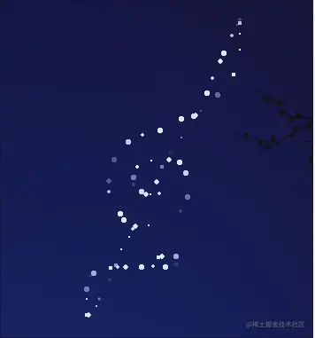
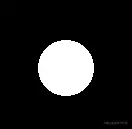
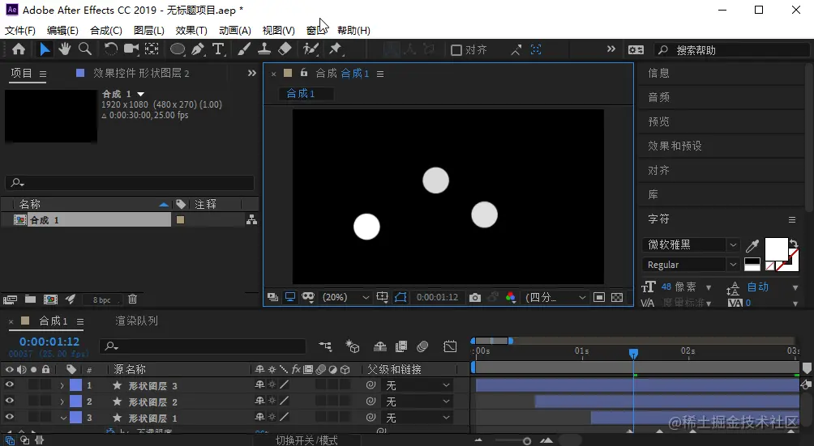

# WebGL 用鼠标绘制星空

---
源码：[github.com/buglas/webg…](https://link.juejin.cn/?target=https%3A%2F%2Fgithub.com%2Fbuglas%2Fwebgl-lesson "https://github.com/buglas/webgl-lesson")



### 1-用鼠标绘制圆形的顶点

星星的形状是圆形的，所以，我们需要绘制一个圆形的顶点。

```
<script id="fragmentShader" type="x-shader/x-fragment">
    precision mediump float;
    uniform vec4 u_FragColor;
    void main() {
        float dist = distance(gl_PointCoord, vec2(0.5, 0.5));
        if(dist < 0.5) {
            gl_FragColor = u_FragColor;
        } else {
            discard;
        }
    }
</script>
```

-   distance(p1,p2) 计算两个点位的距离
-   gl\_PointCoord 片元在一个点中的位置，此位置是被归一化的
-   discard 丢弃，即不会一个片元进行渲染

效果如下：



着色器语法参考地址：[www.khronos.org/registry/Op…](https://link.juejin.cn/?target=https%3A%2F%2Fwww.khronos.org%2Fregistry%2FOpenGL-Refpages%2Fgl4%2F "https://www.khronos.org/registry/OpenGL-Refpages/gl4/")

### 2-绘制随机透明度的星星

首先我们可以先给canvas 一个星空背景

```
#canvas {
    background: url("./images/sky.jpg");
    background-size: cover;
    background-position: right bottom;
}
```

刷底色的时候给一个透明的底色，这样才能看见canvas的css背景

```
gl.clearColor(0, 0, 0, 0);
```

接下来图形的透明度作为变量：

```
const arr = new Float32Array([0.87, 0.91, 1, a]);
gl.uniform4fv(u_FragColor, arr);
```

开启片元的颜色合成功能

```
gl.enable(gl.BLEND)
```

设置片元的合成方式

```
gl.blendFunc(gl.SRC_ALPHA, gl.ONE_MINUS_SRC_ALPHA)
```

### 3-制作闪烁的繁星

当星星会眨眼睛，会变得灵动而可爱，接下来我要让星星向你眨眼睛。

#### 3-1-建立补间动画的意识

在这里推荐大家玩一下AE，因为它可以让你对动画的运行原理和架构方式有一个具象的认知。

比如，我在AE里画一颗星星，加几个关键帧，让它眨一下眼睛。



在这里会涉及以下概念：

-   合成：多个时间轨的集合
-   时间轨：通过关键帧，对其中目标对象的状态进行插值计算
-   补间动画：通过两个关键帧，对一个对象在这两个关键帧之间的状态进行插值计算，从而实现这个对象在两个关键帧间的平滑过渡

#### 3-2-架构代码

1.建立合成对象

```
export default class Compose{
    constructor(){
        this.parent=null
        this.children=[]
    }
    add(obj){
        obj.parent=this
        this.children.push(obj)
    }
    update(t){
        this.children.forEach(ele=>{
            ele.update(t)
        })
    }
}
```

属性

-   parent 父对象，合成对象可以相互嵌套
-   children 子对象集合，其集合元素可以是时间轨，也可以是合成对象

方法：

-   add(obj) 添加子对象方法
-   update(t) 基于当前时间更新子对象状态的方法

2.建立时间轨

```
export default class Track{
    constructor(target){
        this.target=target
        this.parent=null
        this.start=0
        this.timeLen=5
        this.loop=false
        this.keyMap=new Map()
    }
    update(t){
        const {keyMap,timeLen,target,loop}=this
        let time=t-this.start
        if(loop){
            time=time%timeLen
        }
        for(const [key,fms] of keyMap.entries()){
            const last=fms.length-1
            if(time<fms[0][0]){
                target[key]=fms[0][1]
            }else if(time>fms[last][0]){
                target[key]=fms[last][1]
            }else{
                target[key]=getValBetweenFms(time,fms,last)
            }
        }
    }
}
```

属性

-   target 时间轨上的目标对象
-   parent 父对象，只能是合成对象
-   start 起始时间，即时间轨的建立时间
-   timeLen 时间轨总时长
-   loop 是否循环
-   keyMap 关键帧集合，结构如下：

```
[    [        '对象属性1',        [            [时间1,属性值], //关键帧
            [时间2,属性值], //关键帧
        ]
    ],
    [        '对象属性2',        [            [时间1,属性值], //关键帧
            [时间2,属性值], //关键帧
        ]
    ],
]
```

方法

-   update(t) 基于当前时间更新目标对象的状态。
    
    先计算本地时间，即世界时间相对于时间轨起始时间的的时间。
    
    若时间轨循环播放，则本地时间基于时间轨长度取余。
    
    遍历关键帧集合：
    
    -   若本地时间小于第一个关键帧的时间，目标对象的状态等于第一个关键帧的状态
    -   若本地时间大于最后一个关键帧的时间，目标对象的状态等于最后一个关键帧的状态
    -   否则，计算本地时间在左右两个关键帧之间对应的补间状态

3.获取两个关键帧之间补间状态的方法

```
function getValBetweenFms(time,fms,last){
    for(let i=0;i<last;i++){
        const fm1=fms[i]
        const fm2=fms[i+1]
        if(time>=fm1[0]&&time<=fm2[0]){
            const delta={
                x:fm2[0]-fm1[0],
                y:fm2[1]-fm1[1],
            }
            const k=delta.y/delta.x
            const b=fm1[1]-fm1[0]*k
            return k*time+b
        }
    }
}
```

-   getValBetweenFms(time,fms,last)
    
    -   time 本地时间
    -   fms 某个属性的关键帧集合
    -   last 最后一个关键帧的索引位置
    
    其实现思路如下：
    
    -   遍历所有关键帧
    -   判断当前时间在哪两个关键帧之间
    -   基于这两个关键帧的时间和状态，求点斜式
    -   基于点斜式求本地时间对应的状态

#### 3-3-使用合成对象和轨道对象制作补间动画

1.  建立动画相关的对象

```
const compose=new Compose()
const stars=[]
canvas.addEventListener('click',function(event){
    const {x,y}=getPosByMouse(event,canvas)
    const a=1
    const s=Math.random()*5+2
    const obj={x,y,s,a}
    stars.push(obj)

    const track=new Track(obj)
    track.start=new Date()
    track.keyMap=new Map([
        ['a',[
            [500,a],
            [1000,0],
            [1500,a],
        ]]
    ])
    track.timeLen=2000
    track.loop=true
    compose.add(track)
})
```

-   compose 合成对象的实例化
-   stars 存储顶店数据的集合
-   track 时间轨道对象的实例化

2.用请求动画帧驱动动画，连续更新数据，渲染视图。

```
!(function ani(){
    compose.update(new Date())
    render()
    requestAnimationFrame(ani)
})()
```

渲染方法如下：

```
function render(){
    gl.clear(gl.COLOR_BUFFER_BIT);
    stars.forEach(({x,y,s,a})=>{
        gl.vertexAttrib2f(a_Position,x,y);
        gl.vertexAttrib1f(a_PointSize,s);
        gl.uniform4fv(u_FragColor,new Float32Array([0.87,0.92,1,a]));
        gl.drawArrays(gl.POINTS, 0, 1);
    })
}
```

3.最后我们还可以配点应景的音乐，比如虫儿飞

```
#audio{
    position: absolute;
    right: 20px;
    bottom: 20px;
    opacity: 10%;
    transition: opacity 200ms;
    z-index: 20;
}
#audio:hover{
    opacity: 90%;
}
<audio id="audio" controls loop autoplay>
    <source src="./audio/cef.mp3" type="audio/mpeg">
</audio>
```
