# WebGL 着色频率

---
源码：[github.com/buglas/webg…](https://link.juejin.cn/?target=https%3A%2F%2Fgithub.com%2Fbuglas%2Fwebgl-lesson "https://github.com/buglas/webgl-lesson")

着色频率与法线是息息相关的，所以咱们得先从法线说起。

法线就是垂直于着色点的一个单位向量，如下图：

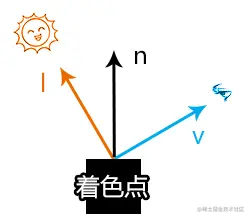

然而，我们在webgl 中建立的模型是用三角形拼起来的，而不是用着色点拼起来的，那么我们之前在片元着色器里计算的法线是怎么来的呢？

那是从three.js的SphereGeometry 对象里来的。

那SphereGeometry 对象是怎么算法线的呢？

我们不妨先看一下法线的分布效果。

### 1-法线

1.准备一份用于绘制法线的辅助线的着色器

```
<script id="vl" type="x-shader/x-vertex">
    attribute vec4 a_Position;
    uniform mat4 u_PvMatrix;
    void main(){
      gl_Position=u_PvMatrix*a_Position;
    }
</script>
<script id="fl" type="x-shader/x-fragment">
    void main(){
      gl_FragColor=vec4(1.0);
    }
</script>
```

2.建立一个获取法线辅助线的顶点数据的方法 (顶点集合,法线集合,长度)

```
function getNormalHelper(vertices, normals,length=0.2) {
  const normalVertices = []
  for (let i = 0; i < normals.length; i += 3) {
    // 模型的顶点点位
    const p1 = new Vector3(
      vertices[i], vertices[i + 1], vertices[i + 2]
    )
    // 将法线从模型顶点向外延伸
    const p2 = new Vector3(
      normals[i], normals[i + 1], normals[i + 2]
    )
      .setLength(length)
      .add(p1)
    normalVertices.push(...p1, ...p2)
  }
  return new Float32Array(normalVertices)
}
```

3.绘制法线辅助线

```
scene.registerProgram(
  'line',
  {
    program: createProgram(
      gl,
      document.getElementById('vl').innerText,
      document.getElementById('fl').innerText
    ),
    attributeNames: ['a_Position'],
    uniformNames: ['u_PvMatrix']
  }
)
const matN = new Mat({
  program: 'line',
  data: {
    u_PvMatrix: {
      value: orbit.getPvMatrix().elements,
      type: 'uniformMatrix4fv',
    },
  },
  mode: 'LINES',
})
const geoN = new Geo({
  data: {
    a_Position: {
      array: getNormalHelper(vertices, normals),
      size: 3
    },
  },
})
const objN = new Obj3D({ geo: geoN, mat: matN })
scene.add(objN)
```

渲染效果：

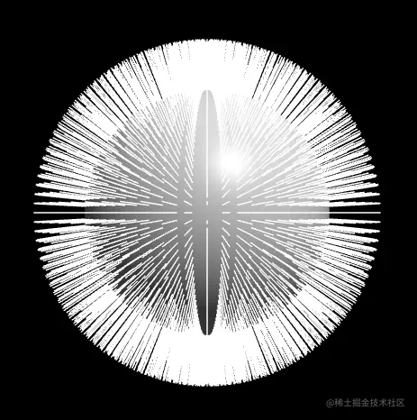

由此可见，three.js 里的这个SphereGeometry对象的法线是由球心向四周反射。

然而，模型的法线法线除了像上面这样分布，还有没有其它的分布方法呢？

这就涉及着色频率的问题，接下来咱们就通过着色频率说一下模型法线常见的设置方法。

### 2-认识着色频率

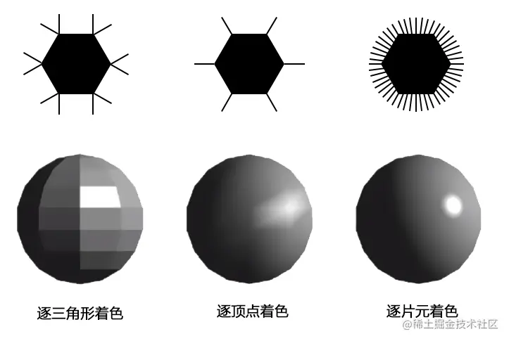

常见的着色频率有三种：

-   逐三角形着色(flat shading)：模型的每个面都拥有统一的法线，效果比较硬朗。
    
-   逐顶点着色(gouraud shading)：模型的每个顶点都拥有各自的法线。
    
    每三个点构成的三角形的内部的点的法线会通过三角形的插值算法计算出来。
    
    webgl 着色器已经通过varying 变量实现了此功能。
    
    效果比较平滑，但是三角形太大的话，高光就看不见了。
    
-   逐片元着色(phong shading)：模型的每个片元都拥有各自的法线，由phong 提出。
    

接下来，我们考虑一下要渲染一个光滑球体，用哪种着色频率合适。

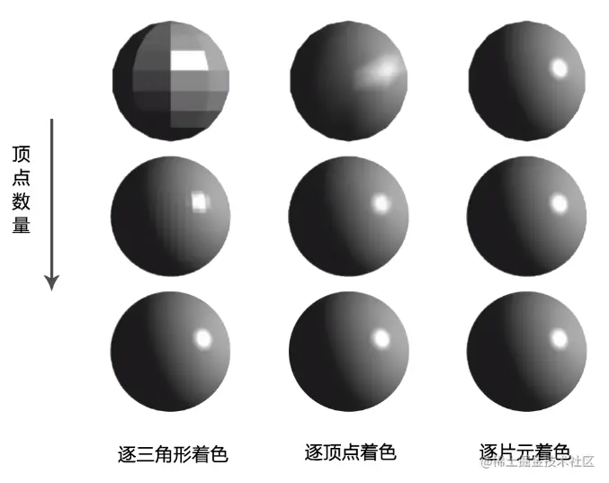

上图自上而下，球体顶点的数量是由少到多的。

由图可知：

-   当顶点数量很少时：
    
    -   逐三角形着色效果生硬，渲染速度最快。
    -   逐顶点着色效果较为平滑，会失去高光，渲染速度适中。
    -   逐片元着色效果最为平滑，渲染速度最慢。
-   当顶点数量适中时，若对效果要求不苛刻，适合用顶点着色。因为其具有平滑的效果和高光，渲染速度也适中。
    
-   当顶点达到一定的数量，三种着色频率的着色效果都是一样的，且逐片元着色频率的渲染速度不一定会比其他的两种着色频率慢。
    

接下来我们用代码写一下上面的着色频率。

为了让大家对着色频率有一个深刻的认知，我们先自己写个球体。

### 3-球体

对于球体的绘制原理，将其展开就很好理解了。

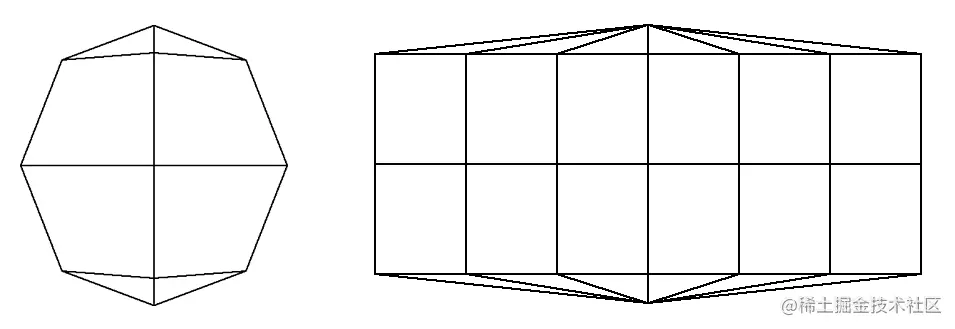

上图是一个4行6列的球体。

我们在绘制的时候，只要将其分成两部分考虑就可以了：

-   上下两行三角形
-   中间的矩阵

接下来建立一个Sphere对象。

-   属性：
    
    -   r：半径
    -   widthSegments：横向段数，最小3段
    -   heightSegments：纵向段数，最小3段
    -   vertices：顶点集合
    -   normals：法线集合
    -   indexes：顶点索引集合
    -   count：顶点数量
-   方法
    
    -   init() 基于球体的半径和分段，计算其用于顶点索引绘图的数据
    -   getTriangles() 基于顶点索引集合解析出相对应的顶点集合，可以用于独立三角形的绘制
    -   getVertice(ind) 基于某个顶点索引获取顶点

代码实现：

1.建立Sphere 球体对象

```
import {Vector3,Spherical} from 'https://unpkg.com/three/build/three.module.js';

/*
属性：
  r：半径
  widthSegments：横向段数，最小3端
  heightSegments：纵向段数，最小3端
  vertices：顶点集合
  normals：法线集合
  indexes：顶点索引集合
  count：顶点数量
*/
export default class Sphere{
  constructor(r=1, widthSegments=16, heightSegments=16){
    this.r=r
    this.widthSegments=widthSegments
    this.heightSegments=heightSegments
    this.vertices=[]
    this.normals=[]
    this.indexes = []
    this.count=0
    this.init()
  }
  init() {
    const { r, widthSegments, heightSegments } = this
    //顶点数量
    this.count = widthSegments * (heightSegments - 1) + 2
    // 球坐标系
    const spherical = new Spherical()
    // theta和phi方向的旋转弧度
    const thetaSize = Math.PI * 2 / widthSegments
    const phiSize = Math.PI / heightSegments

    // 顶点集合，先内置北极点
    const vertices = [0, r, 0]
    // 法线集合，先内置北极法线
    const normals = [0, 1, 0]
    // 顶点索引集合
    const indexes = []
    // 最后一个顶点索引
    const lastInd = this.count-1
    // 逐行列遍历
    for (let y = 0; y < heightSegments; y++) {
      // 球坐标垂直分量
      const phi = phiSize * y
      for (let x1 = 0; x1 < widthSegments; x1++) {
        // x1后的两列
        const x2 = x1 + 1
        const x3 = x2 % widthSegments + 1
        if (y) {
          // 计算顶点和法线
          spherical.set(r, phi, thetaSize * x1)
          const vertice = new Vector3().setFromSpherical(spherical)
          vertices.push(...vertice)
          normals.push(...vertice.normalize())
        } else {
          // 第一行的三角网
          indexes.push(0, x2, x3)
        }
        if (y < heightSegments - 2) {
          // 一个矩形格子的左上lt、右上rt、左下lb、右下rb点
          const lt = y * widthSegments + x2
          const rt = y * widthSegments + x3
          const lb = (y + 1) * widthSegments + x2
          const rb = (y + 1) * widthSegments + x3
          // 第一行和最后一行中间的三角网
          indexes.push(lb, rb, lt, lt, rb, rt)
          if (y === heightSegments - 3) {
            // 最后一行的三角网
            indexes.push(lastInd, rb, lb)
          }
        }
      }
    }
    // 南极顶点
    vertices.push(0, -r, 0)
    // 南极法线
    normals.push(0, -1, 0)

    this.vertices=new Float32Array(vertices)
    this.normals=new Float32Array(normals)
    this.indexes=new Uint16Array(indexes)
  }

  getTriangles() {
    const {indexes}=this
    // 顶点集合
    const vertices = []
    // 通过顶点索引遍历三角形
    for (let i = 0; i < indexes.length; i += 3) {
      // 三角形的三个顶点
      const p0 = this.getVertice(indexes[i])
      const p1 = this.getVertice(indexes[i + 1])
      const p2 = this.getVertice(indexes[i + 2])
      vertices.push(...p0, ...p1, ...p2)
    }
    return new Float32Array(vertices)
  }

  getVertice(ind) {
    const {vertices}=this
    const i = ind * 3
    return new Vector3(vertices[i], vertices[i + 1], vertices[i + 2])
  }
}
```

2.实例化Sphere 对象，将之前three.js 的SphereGeometry对象替换掉

```
import Sphere from './jsm/Sphere.js'
const sphere = new Sphere(0.5, 6, 4)
const { vertices, indexes,normals } = sphere
```

接下来，咱们就用不同的着色频率为这个球体着色。

### 4-Flat-逐三角形着色

逐三角形着色的法线是比较好算的，直接通过三角形两边的叉乘便可以得到。

1.建立一个专门用于计算着色频率的模块。

-   ShadingFrequency.js

```
import {Vector3} from 'https://unpkg.com/three/build/three.module.js';

// 逐三角形着色
function flatShading(vertices, indexes) {
  // flat 法线集合
  const normals = []
  // 通过顶点索引遍历三角形
  for (let i = 0; i < indexes.length; i += 3) {
    // 三角形的三个顶点
    const p0 = getVertice(vertices, indexes[i])
    const p1 = getVertice(vertices, indexes[i + 1])
    const p2 = getVertice(vertices, indexes[i + 2])
    // 三角面的法线
    const n = p2.clone().sub(p1)
      .cross(
        p0.clone().sub(p1)
      ).normalize()
    
    normals.push(...n, ...n, ...n)
  }
  return new Float32Array(normals)
}

// 获取顶点
function getVertice(vertices, ind) {
  const i = ind * 3
  return new Vector3(vertices[i], vertices[i + 1], vertices[i + 2])
}

export {
  flatShading,
}
```

2.在项目文件中调用上面逐三角形着色的方法。

```
import { flatShading } from './jsm/ShadingFrequency.js'

// 球体
const sphere = new Sphere(0.5, 12, 12)
// 用独立三角形绘制球体的顶点
const vertices = sphere.getTriangles()
// 逐三角形着色的法线
const normals = flatShading(sphere.vertices, sphere.indexes)
```

因为在逐三角形着色的模型中，每个顶点都有不同的法线，所以不需要再使用顶点索引绘图了，直接用独立三角形gl.TRIANGLES 绘图即可。

3.绘图

```
// 场景
const scene = new Scene({ gl })
// 注册程序对象
scene.registerProgram(
  'Blinn-Phong',
  {
    program: createProgram(
      gl,
      document.getElementById('vs').innerText,
      document.getElementById('fs').innerText
    ),
    attributeNames: ['a_Position', 'a_Normal'],
    uniformNames: [
      'u_PvMatrix', 'u_ModelMatrix', 'u_Kd', 'u_LightDir',
      'u_Ks', 'u_Eye', 'u_Ka'
    ]
  }
)
const mat = new Mat({
  program: 'Blinn-Phong',
  data: {
    u_PvMatrix: {
      value: orbit.getPvMatrix().elements,
      type: 'uniformMatrix4fv',
    },
    u_ModelMatrix: {
      value: new Matrix4().elements,
      type: 'uniformMatrix4fv',
    },
    u_LightDir: {
      value: Object.values(LightDir),
      type: 'uniform3fv',
    },
    u_Kd: {
      value: u_Kd,
      type: 'uniform3fv',
    },
    u_Ks: {
      value: u_Ks,
      type: 'uniform3fv',
    },
    u_Ka: {
      value: u_Ka,
      type: 'uniform3fv',
    },
    u_Eye: {
      value: Object.values(camera.position),
      type: 'uniform3fv',
    },
  },
  mode: 'TRIANGLES',
})
const geo = new Geo({
  data: {
    a_Position: {
      array: vertices,
      size: 3
    },
    a_Normal: {
      array: normals,
      size: 3
    },
  },
})
const obj = new Obj3D({ geo, mat })
scene.add(obj)

scene.registerProgram(
  'line',
  {
    program: createProgram(
      gl,
      document.getElementById('vl').innerText,
      document.getElementById('fl').innerText
    ),
    attributeNames: ['a_Position'],
    uniformNames: ['u_PvMatrix']
  }
)
const matN = new Mat({
  program: 'line',
  data: {
    u_PvMatrix: {
      value: orbit.getPvMatrix().elements,
      type: 'uniformMatrix4fv',
    },
  },
  mode: 'LINES',
})
const geoN = new Geo({
  data: {
    a_Position: {
      array: getNormalHelper(vertices, normals),
      size: 3
    },
  },
})
const objN = new Obj3D({ geo: geoN, mat: matN })
scene.add(objN)

scene.draw()
```

最终效果如下：

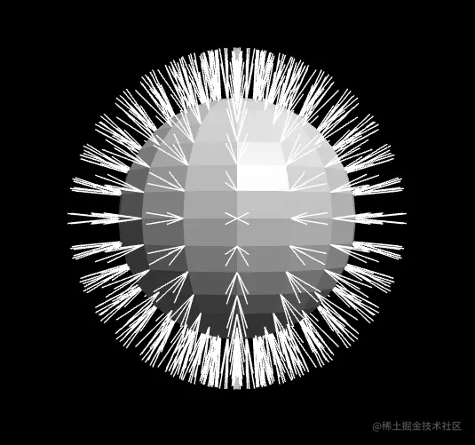

接下来，我们在考虑一下逐顶点着色的法线。

注：

我们在对使用模型矩阵变换模型的时候，需要将顶点的和法线的插值一起变换。

这是我们之前的顶点着色器：

```
<script id="vs" type="x-shader/x-vertex">
    attribute vec4 a_Position;
    attribute vec3 a_Normal;
    uniform mat4 u_PvMatrix;
    uniform mat4 u_ModelMatrix;
    varying vec3 v_Normal;
    varying vec3 v_Position;
    void main(){
      gl_Position = u_PvMatrix*u_ModelMatrix*a_Position;
      v_Normal=a_Normal;
      v_Position=vec3(a_Position);
    }
</script>
```

我们需要让上面的的v\_Normal和v\_Position也受模型矩阵u\_ModelMatrix的影响。

```
<script id="vs" type="x-shader/x-vertex">
    ……
    void main(){
      vec4 worldPos=u_ModelMatrix*a_Position;
      gl_Position = u_PvMatrix*worldPos;
      v_Normal=normalize(mat3(u_ModelMatrix)*a_Normal);
      v_Position=vec3(worldPos);
    }
</script>
```

-   u\_ModelMatrix\*a\_Position 是模型矩阵对顶点的变换
    
-   mat3(u\_ModelMatrix) 是为了提取模型矩阵的变换因子，也就是去掉位移数据
    
-   mat3(u\_ModelMatrix)\*a\_Normal 就是对法线的变换，变换之后，别忘了再用normalize 方法将其归一化
    
    注：此方法只适用于**等比变换**的模型矩阵，如果非等比变换，需使用法向量矩阵变换法线。因为时间原因，我这里先不对法向量矩阵做具体描述。大家若想学习法向量矩阵，可参考我写过的一篇文章：[juejin.cn/post/711395…](https://juejin.cn/post/7113952418613690382 "https://juejin.cn/post/7113952418613690382")
    

### 5-Gouraud-逐顶点着色

#### 5-1-算法原理

three.js 里SphereGeometry 对象的法线，就是用于逐顶点着色的。

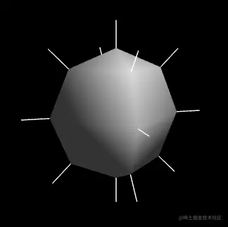

然而，如果一个模型不是球体，应该如何计算其逐顶点着色的法线呢？

我们可以这么算：求顶点相邻三角形法线的均值。

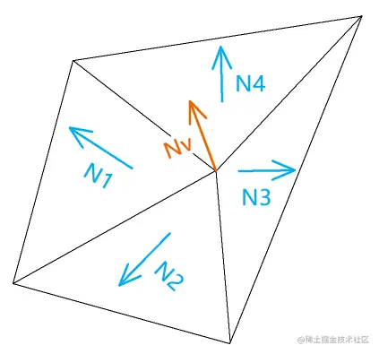

以上图中的顶点法线Nv 为例，其计算公式如下：

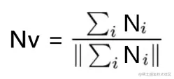

然而，为了追求更好的效果，我们还可以在求均值的时候，基于三角形的面积做一下加权处理。

#### 5-2-代码实现

1.在之前的ShadingFrequency.js 文件里添加一个gouraudShading() 方法，用于获取逐顶点着色的法线。

gouraudShading(vertices, indexes,type=1)

-   vertices 顶点集合
    
-   indexes 顶点索引集合
    
-   type 计算法线的方式
    
    -   0，相邻三角形的法线的平均值
    -   1，相邻的三角形法线基于面积的加权平均值，默认

```
function gouraudShading(vertices, indexes,type=1) {
  const normals = []
  for (let i = 0; i < vertices.length / 3; i++) {
    normals.push(...getGouraudNormal(i,vertices,indexes,type))
  }
  return new Float32Array(normals)
}
//基于顶点索引获取顶点的法线
function getGouraudNormal(ind, vertices, indexes, type) {
  // 法线
  const normal = new Vector3()
  if (type) {
    // 与顶点相邻三角形的数据集合
    const triangles = []
    // 与顶点相邻三角形的面积的总和
    let sumArea = 0
    // 寻找相邻三角形
    findTriangles(ind,vertices, indexes, n => {
      const area = n.length()
      sumArea += area
      triangles.push({n,area})
    })
    // 加权平均值
    triangles.forEach(({ n, area }) => {
      normal.add(
        n.setLength(area / sumArea)
      )
    })
  } else {
    // 与顶点相邻三角形的法线的总和
    findTriangles(ind,vertices, indexes, n => {
      normal.add(n.normalize())
    })
    
    
  }
  return normal.normalize()
}

// 寻找与顶点相邻的所有三角形
function findTriangles(ind,vertices, indexes,fn) {
  for (let i = 0; i < indexes.length; i += 3) {
    // 寻找共点三角形
    if (indexes.slice(i, i + 3).includes(ind)) {
      // 三角形的三个顶点
      const p0 = getVertice(vertices, indexes[i])
      const p1 = getVertice(vertices, indexes[i + 1])
      const p2 = getVertice(vertices, indexes[i + 2])
      // 三角面的法线
      const n = p2.clone().sub(p1)
        .cross(
          p0.clone().sub(p1)
      )
      fn(n)
    }
  }
} 
```

2.使用之前的球体测试一下

```
import { gouraudShading } from './jsm/ShadingFrequency.js'

const sphere = new Sphere(0.5, 12, 12)
const { vertices, indexes } = sphere
const normals = gouraudShading(vertices, indexes)
```

效果如下：

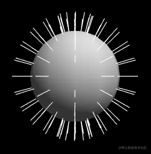

由上图可见，高光没了。

这就是逐顶点着色的弊端，只要面数不够，高光就没了。

若是用逐片元着色来绘图，这个问题就不会出现。

### 6-Phong-逐片元着色

我们之前逐顶点着色时，在片元着色器里计算的法线插值已经不一定是单位向量，而是长度小于等于1的向量。

比如下图中橙色法线之间的黑色向量，其长度已经小于了1，这就是逐顶点着色中高光消失的原因。

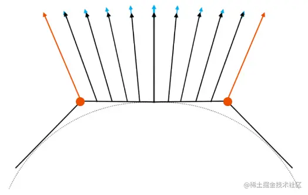

我们若想让高光出现，将黑色向量单位化即可，也就是让其长度再加上蓝色的那一段，如此着色的方法就叫逐片元着色。

接下里，我们可以直接基于逐顶点着色的方法改一下片元着色器即可。

```
<script id="fs" type="x-shader/x-fragment">
    precision mediump float;
    uniform vec3 u_Kd;
    uniform vec3 u_Ks;
    uniform vec3 u_Ka;
    uniform vec3 u_LightDir;
    uniform vec3 u_Eye;
    varying vec3 v_Normal;
    varying vec3 v_Position;

    void main(){
      //法线插值归一化
      vec3 normal=normalize(v_Normal);
      //眼睛看向当前着色点的视线
      vec3 eyeDir=normalize(u_Eye-v_Position);
      //视线与光线之和
      vec3 el=eyeDir+u_LightDir;
      //视线与光线的角平分线
      vec3 h=el/length(el);
      //漫反射
      vec3 diffuse=u_Kd*max(0.0,dot(normal,u_LightDir));
      //反射
      vec3 specular=u_Ks*pow(
        max(0.0,dot(normal,h)),
        64.0
      );
      //Blinn-Phong反射
      vec3 l=diffuse+specular+u_Ka;
      gl_FragColor=vec4(l,1.0);
    }
</script>
```

效果如下：

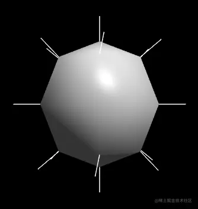

上面球体的宽、高段数是6和4，面数很低，但其表面效果依旧很细腻，这就是逐片元着色的优势。
