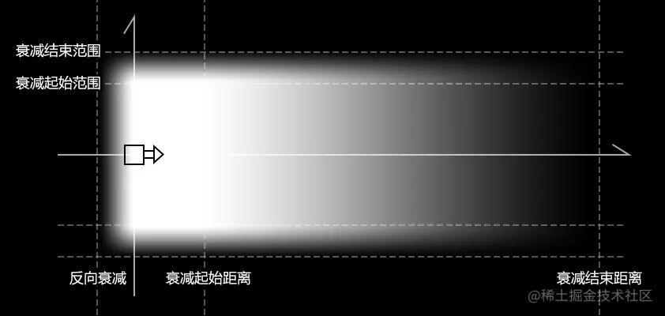
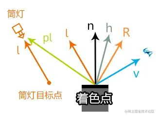
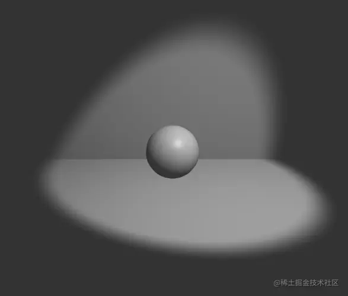

# WebGL 筒灯

---
源码：[github.com/buglas/webg…](https://link.juejin.cn/?target=https%3A%2F%2Fgithub.com%2Fbuglas%2Fwebgl-lesson "https://github.com/buglas/webgl-lesson")

### 1-筒灯概念

对平行光的照射范围做限制后，其灯光打出的效果便可以如下图一样：



筒灯的照射方式如下：



通过上面的两个图，我们可以知道，要把平行光限制成筒灯，需要以下已知条件：

-   筒灯位置 u\_LightPos
    
-   筒灯目标点 u\_LightTarget
    
-   光照强度 u\_Intensity
    
-   衰减距离
    
    -   衰减起始距离 u\_Dist1
    -   衰减结束距离 u\_Dist2
    -   反向衰减距离 u\_Dist3
-   衰减范围
    
    -   衰减起始范围 u\_R1
    -   衰减结束范围 u\_R2

### 2-代码实现

下图使我们将要实现的筒灯效果。



为了更好的观察灯光，我们需要先建立一块幕布。

1.幕布 Backdrop.js

```
/*
属性：
  w：宽
  h：高
  d：深
  vertices：顶点集合
  normals：法线集合
  indexes：顶点索引集合
  count：顶点数量
*/
export default class Backdrop{
  constructor(w,h,d){
    this.w=w
    this.h=h
    this.d=d
    this.vertices=new Float32Array()
    this.normals=new Float32Array()
    this.indexes = new Float32Array()
    this.count = 12
    this.init()
  }
  init() {
    const [x, y, z] = [this.w / 2, this.h, this.d]
    this.vertices = new Float32Array([
      -x, 0, 0,
      -x, 0, z,
      x, 0, 0,
      x, 0, z,
      -x, y, 0,
      -x, 0, 0,
      x, y, 0,
      x, 0, 0,
    ])
    this.normals = new Float32Array([
      0, 1, 0,
      0, 1, 0,
      0, 1, 0,
      0, 1, 0,
      0, 0, 1,
      0, 0, 1,
      0, 0, 1,
      0, 0, 1,
    ])

    this.indexes = new Uint16Array([
      0, 1, 2, 2, 1, 3,
      4, 5, 6, 6, 5, 7
    ])
  }
}
```

2.着色器

```
  <script id="vs" type="x-shader/x-vertex">
    attribute vec4 a_Position;
    attribute vec3 a_Normal;
    uniform mat4 u_ModelMatrix;
    uniform mat4 u_PvMatrix;
    varying vec3 v_Normal;
    varying vec3 v_Position;
    void main(){
      vec4 worldPos=u_ModelMatrix*a_Position;
      gl_Position = u_PvMatrix*worldPos;
      v_Normal=normalize(mat3(u_ModelMatrix)*a_Normal);
      v_Position=vec3(worldPos);
    }
  </script>
  <script id="fs" type="x-shader/x-fragment">
    precision mediump float;
    //漫反射系数
    uniform vec3 u_Kd;
    //镜面反射系数
    uniform vec3 u_Ks;
    //环境光反射系数
    uniform vec3 u_Ka;

    //视点
    uniform vec3 u_Eye;
    // 筒灯位置
    uniform vec3 u_LightPos;
    // 筒灯目标点 
    uniform vec3 u_LightTarget;
    //灯光强度
    uniform float u_Intensity;
    
    //衰减起始距离
    uniform float u_Dist1;
    //衰减结束距离
    uniform float u_Dist2;
    //反向衰减距离
    uniform float u_Dist3;
    
    //衰减起始范围
    uniform float u_R1;
    //衰减结束范围
    uniform float u_R2;
    
    //法线插值
    varying vec3 v_Normal;
    //点位插值
    varying vec3 v_Position;

    void main(){
      //光线方向
      vec3 lightDir=normalize(u_LightPos-u_LightTarget);
      //法线插值归一化
      vec3 normal=normalize(v_Normal);
      //眼睛看向当前着色点的视线
      vec3 eyeDir=normalize(u_Eye-v_Position);
      //视线与光线的角平分线
      vec3 h=normalize(eyeDir+lightDir);
      //漫反射
      vec3 diffuse=u_Kd*max(0.0,dot(normal,lightDir));
      //镜面反射
      vec3 specular=u_Ks*pow(
        max(0.0,dot(normal,h)),
        64.0
      );

      //着色点到光源的向量
      vec3 pl=u_LightPos-v_Position;
      //着色点到光线的距离
      float r=length(cross(pl,lightDir));
      //光线垂直方向的衰减
      float fallY=1.0-smoothstep(u_R1,u_R2,r);
      //当前着色点到筒灯光源平面的距离
      float dist=dot(pl,lightDir);
      //光线方向的衰减
      float fallX=1.0-smoothstep(u_Dist1,u_Dist2,dist);
      //反向衰减
      float fallB=smoothstep(u_Dist3,0.0,dist);

      //筒灯作用于当前着色点的亮度
      float intensity=u_Intensity*fallY*fallX*fallB;
      //着色点颜色
      vec3 color=intensity*(diffuse+specular)+u_Ka;
      gl_FragColor=vec4(color,1.0);
  </script>
```

2.导入相关组件

```
import { createProgram} from '/jsm/Utils.js';
import {
  Matrix4, PerspectiveCamera, Vector3
} from 'https://unpkg.com/three/build/three.module.js';
import OrbitControls from './jsm/OrbitControls.js'
import Mat from './lv/Mat.js'
import Geo from './lv/Geo.js'
import Obj3D from './lv/Obj3D.js'
import Scene from './lv/Scene.js'
import Sphere from './lv/Sphere.js'
import Backdrop from './lv/Backdrop.js'
import { gouraudShading } from './lv/ShadingFrequency.js'
```

3.建立webgl上下文对象

```
const canvas = document.getElementById('canvas');
canvas.width = window.innerWidth;
canvas.height = window.innerHeight;
let gl = canvas.getContext('webgl');
gl.clearColor(0.0, 0.0, 0.0, 1.0);
gl.enable(gl.DEPTH_TEST);
```

4.建立相机轨道

```
// 视点
const target = new Vector3()
const eye = new Vector3(0, 4, 10)
const [fov, aspect, near, far] = [
  45, canvas.width / canvas.height,
  1, 50
]
// 透视相机
const camera = new PerspectiveCamera(fov, aspect, near, far)
camera.position.copy(eye)
// 轨道控制器
const orbit = new OrbitControls({ camera, target, dom: canvas, })
```

5.实例化球体和幕布

```
/* 球体 */
const sphere = new Sphere(0.5, 18, 18)
const { vertices, indexes } = sphere
const normals = gouraudShading(vertices, indexes)
//球体模型矩阵
const sphereMatrix = new Matrix4().setPosition(0, sphere.r, 0)

/* 幕布 */
const backdrop = new Backdrop(20, 10, 10)
// 幕布模型矩阵
const backMatrix = new Matrix4().setPosition(0, 0, -1)
```

6.声明模型的颜色系数和灯光数据

```
// 漫反射系数-颜色
const u_Kd = [0.7, 0.7, 0.7]
// 镜面反射系数-颜色
const u_Ks = [0.2, 0.2, 0.2]
// 环境光系数-颜色
const u_Ka = [0.2, 0.2, 0.2]

// 筒灯位置
const u_LightPos = new Vector3(1.5, 3, 2)
// 筒灯目标点
const u_LightTarget = new Vector3()
// 光照强度
const u_Intensity = 1
// 衰减起始距离
const u_Dist1 = 0
// 衰减结束距离
const u_Dist2 = 10
// 反向衰减距离
const u_Dist3 = -1
// 衰减起始范围
const u_R1 = 2
// 衰减结束范围
const u_R2 = 2.5
```

7.基于上面的已知条件，建立三类uniform数据

```
// 灯光数据
const lightData = {
  u_LightPos: {
    value: [...u_LightPos],
    type: 'uniform3fv',
  },
  u_LightTarget: {
    value: [...u_LightTarget],
    type: 'uniform3fv',
  },
  u_Intensity: {
    value: 1,
    type: 'uniform1f',
  },
  u_R1: {
    value: u_R1,
    type: 'uniform1f',
  },
  u_R2: {
    value: u_R2,
    type: 'uniform1f',
  },
  u_Dist1: {
    value: u_Dist1,
    type: 'uniform1f',
  },
  u_Dist2: {
    value: u_Dist2,
    type: 'uniform1f',
  },
  u_Dist3: {
    value: u_Dist3,
    type: 'uniform1f',
  },
}
// 材质数据
const matData = {
  u_Kd: {
    value: u_Kd,
    type: 'uniform3fv',
  },
  u_Ks: {
    value: u_Ks,
    type: 'uniform3fv',
  },
  u_Ka: {
    value: u_Ka,
    type: 'uniform3fv',
  },
}
// 相机数据
const cameraData = {
  u_PvMatrix: {
    value: orbit.getPvMatrix().elements,
    type: 'uniformMatrix4fv',
  },
  u_Eye: {
    value: Object.values(camera.position),
    type: 'uniform3fv',
  },
}
```

8.绘图

```
// 场景
const scene = new Scene({ gl })
// 注册程序对象
scene.registerProgram(
  'Blinn-Phong',
  {
    program: createProgram(
      gl,
      document.getElementById('vs').innerText,
      document.getElementById('fs').innerText
    ),
    attributeNames: ['a_Position', 'a_Normal'],
    uniformNames: [
      'u_PvMatrix', 'u_ModelMatrix', 'u_Eye',
      'u_Kd', 'u_Ks', 'u_Ka',
      'u_LightPos', 'u_LightTarget', 'u_Intensity',
      'u_Dist1', 'u_Dist2', 'u_Dist3',
      'u_R1', 'u_R2',
    ]
  }
)
// 球体
const matSphere = new Mat({
  program: 'Blinn-Phong',
  data: {
    u_ModelMatrix: {
      value: sphereMatrix.elements,
      type: 'uniformMatrix4fv',
    },
    ...cameraData,
    ...lightData,
    ...matData
  },
  mode: 'TRIANGLES',
})
const geoSphere = new Geo({
  data: {
    a_Position: {
      array: vertices,
      size: 3
    },
    a_Normal: {
      array: normals,
      size: 3
    },
  },
  index: {
    array: indexes
  }
})
const objSphere = new Obj3D({ geo: geoSphere, mat: matSphere })
scene.add(objSphere)

// 幕布
const matBack = new Mat({
  program: 'Blinn-Phong',
  data: {
    u_ModelMatrix: {
      value: backMatrix.elements,
      type: 'uniformMatrix4fv',
    },
    ...cameraData,
    ...lightData,
    ...matData
  },
})
const geoBack = new Geo({
  data: {
    a_Position: {
      array: backdrop.vertices,
      size: 3
    },
    a_Normal: {
      array: backdrop.normals,
      size: 3
    },
  },
  index: {
    array: backdrop.indexes
  }
})
const objBack = new Obj3D({ mat: matBack, geo: geoBack })
scene.add(objBack)

!(function render() {
  orbit.getPvMatrix()
  scene.setUniform('u_Eye', {
    value: Object.values(camera.position)
  })
  scene.draw()
  requestAnimationFrame(render)
})()
```

9.相机轨道交互事件

```
/* 取消右击菜单的显示 */
canvas.addEventListener('contextmenu', event => {
  event.preventDefault()
})
/* 指针按下时，设置拖拽起始位，获取轨道控制器状态。 */
canvas.addEventListener('pointerdown', event => {
  orbit.pointerdown(event)
})
/* 指针移动时，若控制器处于平移状态，平移相机；若控制器处于旋转状态，旋转相机。 */
canvas.addEventListener('pointermove', event => {
  orbit.pointermove(event)
})
/* 指针抬起 */
canvas.addEventListener('pointerup', event => {
  orbit.pointerup(event)
})
/* 滚轮事件 */
canvas.addEventListener('wheel', event => {
  orbit.wheel(event)
})
```
