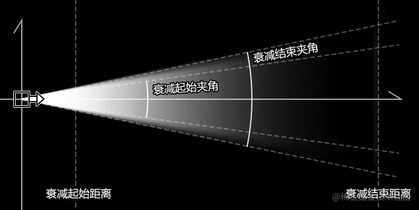
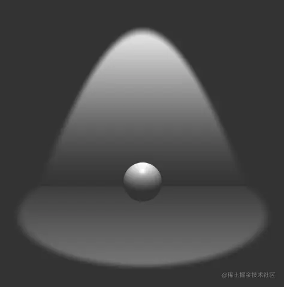

# WebGL 锥形灯

---
源码：[github.com/buglas/webg…](https://link.juejin.cn/?target=https%3A%2F%2Fgithub.com%2Fbuglas%2Fwebgl-lesson "https://github.com/buglas/webgl-lesson")

### 1-锥形灯概念

锥形灯可以理解为对点光源的限制，从侧面看，其打出的光线成锥形。



锥形灯的照射效果如下：



定义锥形灯的条件：

-   锥形灯位置 u\_LightPos
    
-   锥形灯目标点 u\_LightTarget
    
-   光照强度 u\_Intensity
    
-   衰减距离
    
    -   衰减起始距离 u\_Dist1
    -   衰减结束距离 u\_Dist2
-   衰减夹角
    
    -   衰减起始夹角 u\_Fov1
    -   衰减结束夹角 u\_Fov2

### 2-代码实现

我可以直接在之前筒灯的基础上做一下修改。

1.把之前的衰减范围变成衰减夹角

```
// 衰减起始范围
const u_Fov1 = 20 * Math.PI / 180
// 衰减结束范围
const u_Fov2 = u_Fov1 + 2 * Math.PI / 180
// 灯光数据
const lightData = {
  ……
  u_Fov1: {
    value: u_Fov1,
    type: 'uniform1f',
  },
  u_Fov2: {
    value: u_Fov2,
    type: 'uniform1f',
  },
  ……
}
```

2.在片元着色器中，根据衰减夹角计算灯光在光线垂直方向的衰减

```
//衰减范围
float r1=tan(u_Fov1)*dist;
float r2=tan(u_Fov2)*dist;
//着色点到光线的距离
float r=length(cross(pl,lightDir));
//光线垂直方向的衰减
float fallY=1.0-smoothstep(r1,r2,r);
//取消灯光背面的照明
float fallB=step(0.0,dist);
```

对于灯光的类型，咱们就先说这两个。

其实，灯光中是可以绘图的，只是这块知识有点复杂，因为时间原因，咱放课程最后面说。
