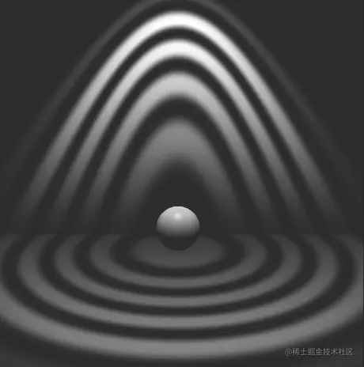
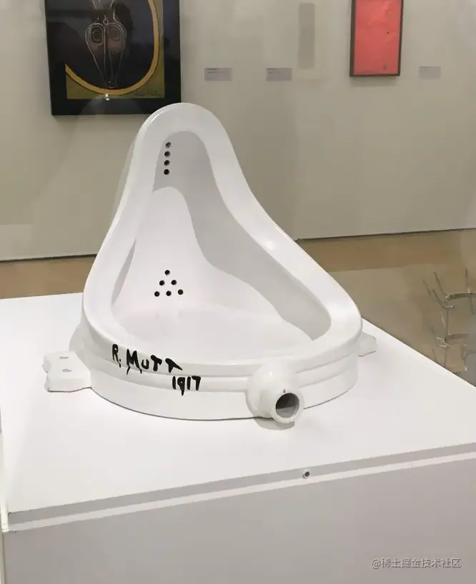

# WebGL 艺术灯-泉

---
源码：[github.com/buglas/webg…](https://link.juejin.cn/?target=https%3A%2F%2Fgithub.com%2Fbuglas%2Fwebgl-lesson "https://github.com/buglas/webgl-lesson")

我们可以基于着色点到光线的距离做一个正弦波衰减。



1.片元着色器中的算法如下：

```
//衰减范围
float r1=tan(u_Fov1)*dist;
float r2=tan(u_Fov2)*dist;
//着色点到光线的距离
float r=length(cross(pl,lightDir));
//光线垂直方向的衰减
float fallY=1.0-smoothstep(r1,r2,r);

//正弦波衰减弧度
float fallAng=smoothstep(0.0,r2,r)*40.0-u_Time/60.0;
//正弦波衰减
float fallSin=1.0-smoothstep(-0.3,1.0,sin(fallAng));

//取消灯光背面的照明
float fallB=step(0.0,dist);

//光源作用于当前着色点的亮度
float intensity=u_Intensity*fallX*fallY*fallSin*fallB;
//着色点颜色
vec3 color=intensity*(diffuse+specular)+u_Ka;
```

2.调整一下相机和灯光

```
//相机目标点
const target = new Vector3(0, 1.5, 0)
//相机视点
const eye = new Vector3(0, 4, 10)
……

// 锥形灯位置
const u_LightPos = new Vector3(0, 8, 1)
// 锥形灯目标点
const u_LightTarget = new Vector3()
// 光照强度
const u_Intensity = 15
// 衰减起始距离
const u_Dist1 = 0
// 衰减结束距离
const u_Dist2 = 8.5
// 衰减起始范围
const u_Fov1 = 25 * Math.PI / 180
// 衰减结束范围
const u_Fov2 = u_Fov1 + 10 * Math.PI / 180
……
```

我上面的例子的设计源自于达达主义。

达达主义者主张依靠直觉创造艺术， 杜尚的《泉》便是达达主义的代表作之一。

1917年，杜尚在商店买了个小便池，签了个自己的名字，就送展览馆去了，然后被理所当然的被拒收了。



《泉》的意义在于对艺术的思考：

究竟什么是艺术，或者说艺术的标准是什么？

如果小便池签个名就是艺术，那么还有什么不是艺术，或者说所有的一切皆是艺术。

在我自己看来，艺术只要不违背原则性问题，比如种族歧视、环境污染等，我们就不可以因为自己的不喜欢，否定别人心中的艺术。

在生活中，一切都可以成为艺术，艺术源自于我们的生活。
