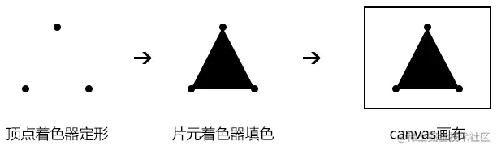
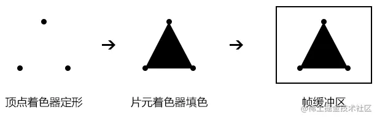
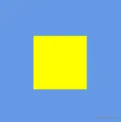
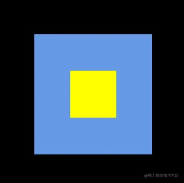
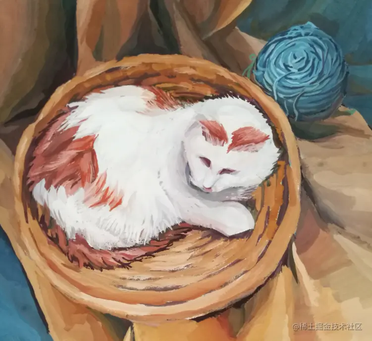
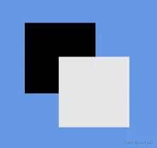
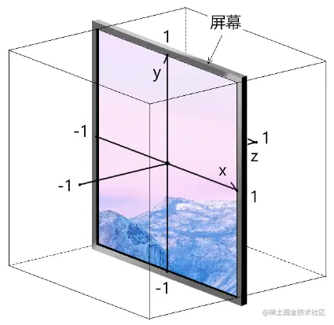
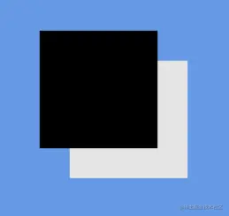
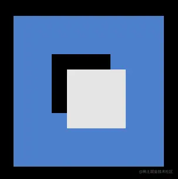
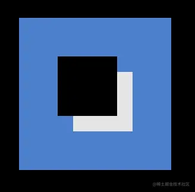

# WebGL 帧缓冲区

---
源码：[github.com/buglas/webg…](https://link.juejin.cn/?target=https%3A%2F%2Fgithub.com%2Fbuglas%2Fwebgl-lesson "https://github.com/buglas/webgl-lesson")

其实，我接下来想说投影的，然而投影的计算还需要帧缓冲区，所以咱们得先解释一下帧缓冲区的概念。

### 1-帧缓冲区的概念

webgl 绘图过程是：顶点着色器定形，片元着色器逐片元填颜色，然后绘制到canvas画布上。



其实，我们绘图的时候，也可以不把图形绘制到画布上，而是绘制到内存之中，这样我们可以在不显示图像的前提下，获取webgl 绘制的图像数据。

这块在内存中存储webgl 图像的区域，就叫帧缓冲区。



有了帧缓冲区的图像数据之后，我还不显示它，那帧缓冲区有啥用呢？

帧缓冲区的作用非常强大，可以对webgl 的渲染结果做后处理，比如为模型添加描边、光晕等；还可以基于光源生成深度贴图，计算投影……

对于帧缓冲区的基本概念和作用咱们就说到这，接下来咱们用代码敲一下。

### 2-帧缓冲区的代码实现

以前咱们入门webgl 的时候画过一个点，接下咱们把这个点画到帧缓冲区里去。

1.这是在canvas 画布中绘制一个点的方法。

```
  <script id="vs1" type="x-shader/x-vertex">
    void main(){
      //点位
      gl_Position=vec4(0,0,0,1);
      //尺寸
      gl_PointSize=100.0;
    }
  </script>
  <script id="fs1" type="x-shader/x-fragment">
    void main(){
      gl_FragColor=vec4(1,1,0,1);
    }
  </script>
  <script type="module">
    import { createProgram } from '/jsm/Utils.js';

    const canvas = document.getElementById('canvas');
    canvas.width = 512;
      canvas.height = 512;
    const gl = canvas.getContext('webgl');

    const vs1 = document.getElementById('vs1').innerText;
    const fs1 = document.getElementById('fs1').innerText;
    const program1 = createProgram(gl, vs1, fs1);
    gl.useProgram(program1)
    
    gl.clearColor(0.4, 0.6, 0.9, 1.0);
    gl.clear(gl.COLOR_BUFFER_BIT);
    gl.drawArrays(gl.POINTS, 0, 1);
  </script>
```

效果如下：



2.在绘制图形的时候做个拦截，把图形画到帧缓冲区里。

```
……
const vs1 = document.getElementById('vs1').innerText;
const fs1 = document.getElementById('fs1').innerText;
const program1 = createProgram(gl, vs1, fs1);
gl.useProgram(program1)

//纹理对象
gl.pixelStorei(gl.UNPACK_FLIP_Y_WEBGL, 1)
gl.activeTexture(gl.TEXTURE0)
let texture = gl.createTexture();
gl.bindTexture(gl.TEXTURE_2D, texture);
gl.texParameteri(
  gl.TEXTURE_2D,
  gl.TEXTURE_MIN_FILTER,
  gl.LINEAR
);
gl.texImage2D(
  gl.TEXTURE_2D, 0, gl.RGBA, 256, 256,
  0, gl.RGBA, gl.UNSIGNED_BYTE, null
);

//帧缓冲区
const framebuffer = gl.createFramebuffer();
gl.bindFramebuffer(gl.FRAMEBUFFER, framebuffer);
gl.framebufferTexture2D(
  gl.FRAMEBUFFER,
  gl.COLOR_ATTACHMENT0,
  gl.TEXTURE_2D,
  texture, 0
);

//设置渲染尺寸
gl.viewport(0, 0, 256, 256);

//绘图
gl.clearColor(0.2, 0.2, 0.4, 1.0);
gl.clear(gl.COLOR_BUFFER_BIT);
gl.drawArrays(gl.POINTS, 0, 1);
```

运行上面的代码，我们会发现浏览器在没有报错的前提下，成功绘制不出任何东西来了。

解释一下上面的代码。

上面的代码可以分两部分看，一部分是纹理对象，一部分是帧缓冲区。

1.纹理对象是用来装webgl 绘图结果的，我们可以将其理解为像素数据。

```
gl.pixelStorei(gl.UNPACK_FLIP_Y_WEBGL, 1)
gl.activeTexture(gl.TEXTURE0)
const texture = gl.createTexture();
gl.bindTexture(gl.TEXTURE_2D, texture);
gl.texParameteri(
  gl.TEXTURE_2D,
  gl.TEXTURE_MIN_FILTER,
  gl.LINEAR
);
gl.texImage2D(
  gl.TEXTURE_2D, 0, gl.RGBA, 256, 256,
  0, gl.RGBA, gl.UNSIGNED_BYTE, null
);
```

-   createTexture() 创建纹理对象
    
-   bindTexture(target, texture) 将纹理对象绑定到目标对象上，上面代码里的目标对象就是二维纹理对象gl.TEXTURE\_2D
    
-   texParameteri() 设置纹理参数
    
-   texImage2D(target, level, internalformat, width, height, border, format, type, ArrayBufferView? pixels) 设置纹理对象的图像源
    
    -   target 纹理目标
    -   level mipmap 图像级别
    -   internalformat 颜色格式
    -   width, height 纹理对象的尺寸
    -   border 边界宽度，必须为0
    -   format 颜色格式， WebGL 1 中必须和internalformat 一致
    -   type 纹理数据类型
    -   pixels 纹理的像素源

2.帧缓冲区可以理解为用来装纹理对象缓冲区。

```
const framebuffer = gl.createFramebuffer();
gl.bindFramebuffer(gl.FRAMEBUFFER, framebuffer);
gl.framebufferTexture2D(
  gl.FRAMEBUFFER,
  gl.COLOR_ATTACHMENT0,
  gl.TEXTURE_2D,
  texture, 0
);
```

-   createFramebuffer() 建立帧缓冲区
    
-   bindFramebuffer(target, framebuffer) 将帧缓冲区绑定到目标对象上。
    
    -   target 目标对象，用于收集渲染图像的时所需的颜色、透明度、深度和模具缓冲区数据
    -   framebuffer 帧缓冲区
-   framebufferTexture2D(target, attachment, textarget, texture, level) 将纹理对象添加到帧缓冲区中
    
    -   target 目标对象
        
    -   attachment 设置将纹理对象绑定到哪个缓冲区中
        
        -   gl.COLOR\_ATTACHMENT0 将纹理对象绑定到颜色缓冲区
        -   gl.DEPTH\_ATTACHMENT 将纹理对象绑定到深度缓冲区
        -   gl.STENCIL\_ATTACHMENT 将纹理对象绑定到模板缓冲区
    -   textarget 纹理的目标对象
        
    -   texture 纹理对象
        
    -   level mipmap 图像级别
        

3.渲染方法，把图形渲染进帧缓冲区的纹理对象里。

```
gl.clearColor(0.4, 0.6, 0.9, 1.0);
gl.clear(gl.COLOR_BUFFER_BIT);
gl.drawArrays(gl.POINTS, 0, 1);
```

4.图形在渲染的时候，会有一个VIEWPORT 尺寸，我们可以把这个尺寸理解为渲染尺寸，这个尺寸默认和canvas 画布一致。

我们可以用gl.getParameter(gl.VIEWPORT) 方法获取画布的像素尺寸。

我们也需要知道设置这个渲染尺寸的方法：

```
//设置渲染尺寸
gl.viewport(0, 0, 256, 256);

//绘图
gl.clearColor(0.4, 0.6, 0.9, 1.0);
gl.clear(gl.COLOR_BUFFER_BIT);
gl.drawArrays(gl.POINTS, 0, 1);
```

-   viewport(x,y,w,h)
    
    -   x,y 是VIEWPORT 的左下角点位置
    -   w,h 是VIEWPORT 的宽高

在帧缓冲区中，我们一般会把VIEWPORT 尺寸设置的和纹理对象一样大，这样我们最终渲染出的图像就是和纹理对象一样大的图像。

有了帧缓冲区之后，我们就可以把帧缓冲区中的纹理对象当成真的纹理对象来用，把它贴到模型上。

### 3-帧缓冲区的显示

接着上面的代码往后写。

1.写一套纹理着色器，用于显示帧缓冲区里的纹理对象。

```
<script id="vs2" type="x-shader/x-vertex">
  attribute vec4 a_Position;
  attribute vec2 a_Pin;
  varying vec2 v_Pin;
  void main(){
    gl_Position = a_Position;
    v_Pin=a_Pin;
  }
</script>
<script id="fs2" type="x-shader/x-fragment">
  precision mediump float;
  uniform sampler2D u_Sampler;
  varying vec2 v_Pin;
  void main(){
    gl_FragColor=texture2D(u_Sampler,v_Pin);
  }
</script>
```

2.帧缓冲区绘制完图像后，把帧缓冲区置空，否则下次绘图还是会画到帧缓冲区里，而不是画到canvas 画布里。

```
gl.bindFramebuffer(gl.FRAMEBUFFER, null);
```

3.将viewport 恢复到当前canvas 画布的尺寸。

```
gl.viewport(0, 0, canvas.width, canvas.height);
```

4.绘制一个矩形面，把帧缓冲区里的纹理对象贴上去。

```
const vs2 = document.getElementById('vs2').innerText;
const fs2 = document.getElementById('fs2').innerText;
const program2 = createProgram(gl, vs2, fs2);
gl.useProgram(program2)

const source = new Float32Array([
-0.5, 0.5, 0, 1,
-0.5, -0.5, 0, 0,
0.5, 0.5, 1, 1,
0.5, -0.5, 1, 0
])
const buffer = gl.createBuffer();
gl.bindBuffer(gl.ARRAY_BUFFER, buffer);
gl.bufferData(gl.ARRAY_BUFFER, source, gl.STATIC_DRAW);
const a_Position = gl.getAttribLocation(program2, 'a_Position');
gl.vertexAttribPointer(a_Position, 2, gl.FLOAT, false, 16, 0);
gl.enableVertexAttribArray(a_Position);
const a_Pin = gl.getAttribLocation(program2, 'a_Pin');
gl.vertexAttribPointer(a_Pin, 2, gl.FLOAT, false, 16, 8);
gl.enableVertexAttribArray(a_Pin);

gl.bindTexture(gl.TEXTURE_2D, texture)
const u_Sampler = gl.getUniformLocation(program2, 'u_Sampler')
gl.uniform1i(u_Sampler, 0)

gl.clearColor(0.0, 0.0, 0.0, 1.0);
gl.clear(gl.COLOR_BUFFER_BIT);
gl.drawArrays(gl.TRIANGLE_STRIP, 0, 4)
```

最终效果如下：



当我们把帧缓冲区里的纹理对象显示出来后，还需要考虑一个深度问题。

### 4-帧缓冲区里的深度测试

#### 4-1-深度测试的概念

在webgl中绘图的时候，若没有开启深度测试 gl.DEPTH\_TEST，那它就会像画水粉一样，一层层的往canvas 画布上覆盖颜色，它不会考虑图形在深度上的遮挡问题。



当开启了深度测试，离视点近的图形就会遮挡例视点远的图形。

当然，我这种对于深度测试的解释是有点笼统的，比如像下面的三个三角形，我们就没法判断谁远谁近了。


webgl的深度测试是先基于整个场景生成一张深度贴图，深度贴图里存储了离视点最近的片元的深度信息。

webgl 在逐片元着色时，会判断一下当前片元的的深度是否小于深度贴图里相应片元的深度，若是的话，那webgl就不会对当前片元进行渲染。

从而webgl就通过只绘制在深度上离视点最近的片元的方式，解决了图形遮挡问题。

在代码里给大家演示一下深度测试的原理。

#### 4-2-深度测试的代码实现

1.画两个不同深度的点。

```
<script id="vs1" type="x-shader/x-vertex">
    attribute vec4 a_Position;
    varying float v_Z;
    void main(){
      gl_Position=a_Position;
      gl_PointSize=200.0;
      v_Z=a_Position.z;
    }
</script>
<script id="fs1" type="x-shader/x-fragment">
    precision mediump float;
    varying float v_Z;
    void main(){
      gl_FragColor=vec4(vec3(v_Z),1);
    }
</script>
<script type="module">
  import { createProgram } from '/jsm/Utils.js';

  const canvas = document.getElementById('canvas');
  canvas.width = 512;
  canvas.height = 512;
  const gl = canvas.getContext('webgl');

  const vs1 = document.getElementById('vs1').innerText;
  const fs1 = document.getElementById('fs1').innerText;
  const program1 = createProgram(gl, vs1, fs1);
  gl.useProgram(program1)

  const source = new Float32Array([
    -0.1, 0.1, 0,
    0.1, -0.1, 0.9,
  ])
  const buffer = gl.createBuffer();
  gl.bindBuffer(gl.ARRAY_BUFFER, buffer);
  gl.bufferData(gl.ARRAY_BUFFER, source, gl.STATIC_DRAW);
  const a_Position = gl.getAttribLocation(program1, 'a_Position');
  gl.vertexAttribPointer(a_Position, 3, gl.FLOAT, false, 0, 0);
  gl.enableVertexAttribArray(a_Position);

  gl.clearColor(0.4, 0.6, 0.9, 1.0);
  gl.clear(gl.COLOR_BUFFER_BIT);
  gl.drawArrays(gl.POINTS, 0, 2);

</script>
```

其效果如下：



再附带上一张裁剪空间的示意图：



通过代码我们可以知道，在裁剪空间中，黑点的深度是0，白点深度是0.9，按理说是应该黑点遮挡白点的。

这就因为在没有开启深度测试的情况下，webgl 会像画油画一样，根据顶点数据的排序，一个个绘制。

```
const source = new Float32Array([
  //黑点
  -0.1, 0.1, 0,
  //白点
  0.1, -0.1, 0.9,
])
```

在上面的代码里，我们先写入了黑点，又写入了白点，所以webgl先画完了黑点后，又在黑点上面覆盖了一个白点。

注：上面的点位是裁剪空间中的点位，不要将其当成世界坐标系里的点位，裁剪空间和右手规则的世界坐标系的z轴是相反的。

2.为webgl 开启深度测试

```
gl.enable(gl.DEPTH_TEST);
```

效果如下：



这样webgl 就可以解决不同深度上得图形遮挡问题。

接下来，我们测一下在帧缓冲区里是否也可以用同样的方式解决图形遮挡问题。

```
<!-- 点 -->
<script id="vs1" type="x-shader/x-vertex">
  attribute vec4 a_Position;
  varying float v_Z;
  void main(){
    gl_Position=a_Position;
    gl_PointSize=200.0;
    v_Z=a_Position.z;
  }
</script>
<script id="fs1" type="x-shader/x-fragment">
  precision mediump float;
  varying float v_Z;
  void main(){
    gl_FragColor=vec4(vec3(v_Z),1);
  }
</script>
<!-- 纹理着色器 -->
<script id="vs2" type="x-shader/x-vertex">
  attribute vec4 a_Position;
  attribute vec2 a_Pin;
  varying vec2 v_Pin;
  void main(){
    gl_Position = a_Position;
    v_Pin=a_Pin;
  }
</script>
<script id="fs2" type="x-shader/x-fragment">
  precision mediump float;
  uniform sampler2D u_Sampler;
  varying vec2 v_Pin;
  void main(){
    gl_FragColor=texture2D(u_Sampler,v_Pin);
  }
</script>
<script type="module">
  import { createProgram } from '/jsm/Utils.js';

  const canvas = document.getElementById('canvas');
  canvas.width = 512;
  canvas.height = 512;
  const gl = canvas.getContext('webgl');

  let texture = null

  {
    const vs1 = document.getElementById('vs1').innerText;
    const fs1 = document.getElementById('fs1').innerText;
    const program1 = createProgram(gl, vs1, fs1);
    gl.useProgram(program1)
    gl.enable(gl.DEPTH_TEST);

    const source = new Float32Array([
      -0.1, 0.1, 0,
      0.1, -0.1, 0.9,
    ])
    const buffer = gl.createBuffer();
    gl.bindBuffer(gl.ARRAY_BUFFER, buffer);
    gl.bufferData(gl.ARRAY_BUFFER, source, gl.STATIC_DRAW);
    const a_Position = gl.getAttribLocation(program1, 'a_Position');
    gl.vertexAttribPointer(a_Position, 3, gl.FLOAT, false, 0, 0);
    gl.enableVertexAttribArray(a_Position);

    gl.pixelStorei(gl.UNPACK_FLIP_Y_WEBGL, 1)
    gl.activeTexture(gl.TEXTURE0)
    texture = gl.createTexture();
    gl.bindTexture(gl.TEXTURE_2D, texture);
    gl.texParameteri(
      gl.TEXTURE_2D,
      gl.TEXTURE_MIN_FILTER,
      gl.LINEAR
    );
    gl.texImage2D(
      gl.TEXTURE_2D, 0, gl.RGBA, 512, 512,
      0, gl.RGBA, gl.UNSIGNED_BYTE, null
    );

    const framebuffer = gl.createFramebuffer();
    gl.bindFramebuffer(gl.FRAMEBUFFER, framebuffer);
    gl.framebufferTexture2D(
      gl.FRAMEBUFFER,
      gl.COLOR_ATTACHMENT0,
      gl.TEXTURE_2D,
      texture, 0
    );

    gl.viewport(0, 0, 512, 512);
    gl.clearColor(0.3, 0.5, 0.8, 1.0);
    gl.clear(gl.COLOR_BUFFER_BIT);
    gl.drawArrays(gl.POINTS, 0, 2);

    gl.bindFramebuffer(gl.FRAMEBUFFER, null);
    gl.viewport(0, 0, canvas.width, canvas.height);
  }

  {
    const vs2 = document.getElementById('vs2').innerText;
    const fs2 = document.getElementById('fs2').innerText;
    const program2 = createProgram(gl, vs2, fs2);
    gl.useProgram(program2)

    const source = new Float32Array([
      -0.5, 0.5, 0, 1,
      -0.5, -0.5, 0, 0,
      0.5, 0.5, 1, 1,
      0.5, -0.5, 1, 0
    ])
    const buffer = gl.createBuffer();
    gl.bindBuffer(gl.ARRAY_BUFFER, buffer);
    gl.bufferData(gl.ARRAY_BUFFER, source, gl.STATIC_DRAW);
    const a_Position = gl.getAttribLocation(program2, 'a_Position');
    gl.vertexAttribPointer(a_Position, 2, gl.FLOAT, false, 16, 0);
    gl.enableVertexAttribArray(a_Position);
    const a_Pin = gl.getAttribLocation(program2, 'a_Pin');
    gl.vertexAttribPointer(a_Pin, 2, gl.FLOAT, false, 16, 8);
    gl.enableVertexAttribArray(a_Pin);

    gl.bindTexture(gl.TEXTURE_2D, texture)
    const u_Sampler = gl.getUniformLocation(program2, 'u_Sampler')
    gl.uniform1i(u_Sampler, 0)
    gl.clearColor(0.0, 0.0, 0.0, 1.0);
    gl.clear(gl.COLOR_BUFFER_BIT);
    gl.drawArrays(gl.TRIANGLE_STRIP, 0, 4)
  }

</script>
```

效果如下：



由此可见，我们在帧缓冲区中开启了帧缓冲区后，依旧无法实现不同深度的图形遮挡。

这是因为我们还需要为帧缓冲区绑定深度缓冲区。

#### 4-3-深度缓冲区

在帧缓冲区绘图之前，再建立一个渲染缓冲区，然后将其添加到帧缓冲区中。

渲染缓冲区可以用于存储深度缓冲区。

```
const depthbuffer = gl.createRenderbuffer();
gl.bindRenderbuffer(gl.RENDERBUFFER, depthbuffer);
gl.renderbufferStorage(
  gl.RENDERBUFFER, gl.DEPTH_COMPONENT16,
  512, 512
);
gl.framebufferRenderbuffer(
  gl.FRAMEBUFFER, gl.DEPTH_ATTACHMENT,
  gl.RENDERBUFFER, depthbuffer
);

gl.viewport(0, 0, 512, 512);
gl.clearColor(0.3, 0.5, 0.8, 1.0);
gl.clear(gl.COLOR_BUFFER_BIT);
gl.drawArrays(gl.POINTS, 0, 2);
```

-   createRenderbuffer() 建立渲染缓冲区，渲染缓冲区可以用于存储渲染数据
    
-   renderbufferStorage(target, internalFormat, width, height) 初始化渲染缓冲区
    
    -   target 渲染缓冲区的目标对象，只能是 gl.RENDERBUFFER
    -   internalFormat 数据格式，gl.DEPTH\_COMPONENT16便是针对深度数据的
    -   width, height 渲染缓冲区的宽、高
-   framebufferRenderbuffer(target, attachment, renderbuffertarget, renderbuffer) 向帧缓冲区中添加渲染缓冲区
    
    -   target 帧缓冲区的目标对象
        
    -   attachment 要为帧缓冲区绑定的缓冲区
        
        -   gl.DEPTH\_ATTACHMENT 深度缓冲区
        -   ……
    -   renderbuffertarget 渲染缓冲区的目标对象，只能是gl.RENDERBUFFER
        
    -   renderbuffer 渲染缓冲区
        

最终效果如下：



注：webgl 的有些API 读起来有些晦涩，这里面有些是webgl 的历史遗留问题。有些API，大家先知道其实现原理和功能即可，有些参数不必太过深究。
