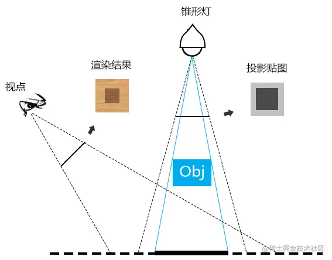
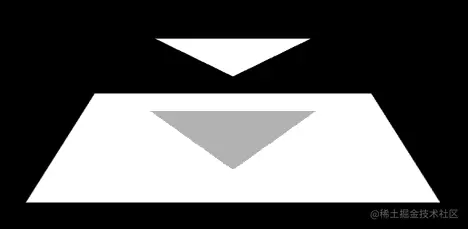
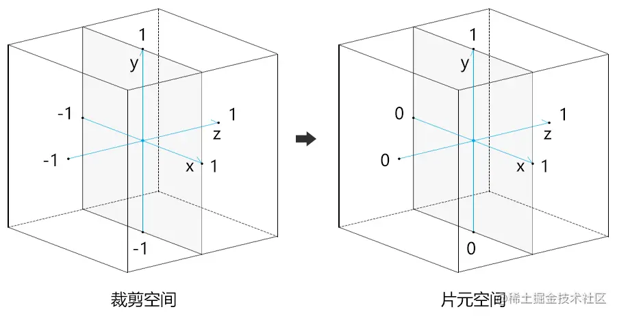
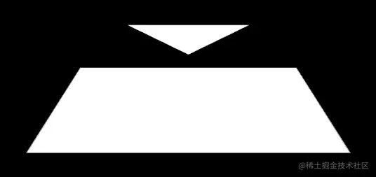
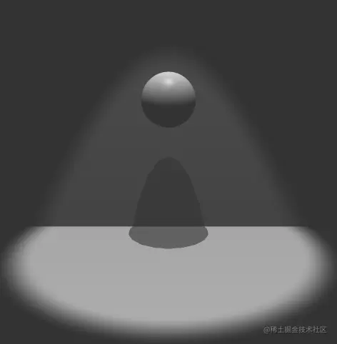

# WebGL 投影

---
源码：[github.com/buglas/webg…](https://link.juejin.cn/?target=https%3A%2F%2Fgithub.com%2Fbuglas%2Fwebgl-lesson "https://github.com/buglas/webgl-lesson")

当生活有了光的时候，也会有投影的存在。

投影可以更好的衬托光明，让生活变得立体，有节奏。

接下来，就让我们一起探索投影，发现未知。在光影沉浮之中，寻找生活的节奏感。

### 1-投影的概念

投影就是光源照射不到的地方。

我们可以把光源想象成视点，光源看不见它所照射的物体的影子。

在webgl里，要知道一个地方有没有投影，只要知道视点所看的地方有没有被光源看见到即可。



以上图的锥形灯为例，说一下如何判断一个地方有没有投影：

1.  把光源当成相机，渲染一张投影贴图塞进帧缓冲区里。投影贴图是存储图形到相机距离的图像。
2.  在实际相机中逐片元渲染时，对比当前片元与投影贴图中相应位置的片元的深度大小。若当前片元的深度小于投影贴图中相应片元的深度，就说明当前片元在投影中。

看了上面的步骤，大家可能会有很多的疑问：

-   投影贴图怎么做？
-   如何把图形到光源的深度数据存入投影贴图中？
-   如何找到渲染时，当前片元在投影贴图中所对应的片元？
-   ……

接下来，咱们带着疑问，看一下其代码实现过程。

### 2-投影的代码实现

在下面的代码里，我要通过锥形灯给一个三角形添加投影。

为了直击重点，我们先不考虑三角形对光的反射，我们只关注三角形的投影。

其效果如下：



#### 2-1-在帧缓冲区中绘制投影贴图

1.在帧缓冲区绘制投影贴图的着色器

```
<script id="vs1" type="x-shader/x-vertex">
  attribute vec4 a_Position;
  uniform mat4 u_PvMatrix;
  uniform mat4 u_ModelMatrix;
  void main(){
    gl_Position=u_PvMatrix*u_ModelMatrix*a_Position;
  }
</script>
<script id="fs1" type="x-shader/x-fragment">
  precision mediump float;
  void main(){
    gl_FragColor=vec4(gl_FragCoord.z,0.0,0.0,0.0);
  }
</script>
```

在顶点着色器里，u\_PvMatrix 是基于把锥形灯当成相机后，获取的投影视图矩阵。

在片元着色器里，gl\_FragCoord.z 是片元的深度信息，这个信息被写进了gl\_FragColor 片元颜色里。

gl\_FragCoord 对应的是片元坐标的意思，我们需要知道片元坐标和裁剪坐标的映射关系。

我之前说过，裁剪空间在x,y,z 方向的边界都是(-1,1)，这三个方向的边界映射到片元坐标后就是(0,1)，如下图所示：



2.在js 中准备相机、灯光和模型数据

```
import { createProgram } from '/jsm/Utils.js';
import {
  Matrix4, PerspectiveCamera, Vector3,
} from '/three/build/three.module.js';

const canvas = document.getElementById('canvas');
const ratio = window.innerWidth / window.innerHeight
canvas.width = window.innerWidth
canvas.height = window.innerHeight
const gl = canvas.getContext('webgl');

// 灯光
const light = new PerspectiveCamera(70, ratio, 0.1, 10.0)
light.position.set(0, 0.3, 0)
light.lookAt(0, 0, 0)
light.updateMatrixWorld(true)
const pvMatrixLight = light.projectionMatrix.clone()
.multiply(light.matrixWorldInverse)

// 相机
const camera = new PerspectiveCamera(45, ratio, 0.1, 10.0)
camera.position.set(0, 0.3, 0.9)
camera.lookAt(0, 0.0, 0.0)
camera.updateMatrixWorld(true)
const pvMatrix = camera.projectionMatrix.clone()
.multiply(camera.matrixWorldInverse)

// 三角形数据
const triangleVertice = new Float32Array([
  -0.1, 0.1, -0.1,
  0.1, 0.1, -0.1,
  0.0, 0.1, 0.1
])
// 地面数据
const floorVertice = new Float32Array([
  -0.2, 0, 0.2,
  0.2, 0, 0.2,
  -0.2, 0, -0.2,
  0.2, 0, -0.2,
])
```

3.在帧缓冲区中绘图

```
// 纹理尺寸
const width = 1024, height = 1024
// 纹理对象
let texture = null

/* 帧缓冲区内绘图 */
{
  // 程序对象
  const program = createProgram(
    gl,
    document.getElementById('vs1').innerText,
    document.getElementById('fs1').innerText
  )
  gl.useProgram(program)
  gl.enable(gl.DEPTH_TEST)

  // 纹理对象
  gl.pixelStorei(gl.UNPACK_FLIP_Y_WEBGL, 1)
  gl.activeTexture(gl.TEXTURE0)
  texture = gl.createTexture()
  gl.bindTexture(gl.TEXTURE_2D, texture)
  gl.texParameteri(
    gl.TEXTURE_2D,
    gl.TEXTURE_MIN_FILTER,
    gl.LINEAR
  );
  gl.texImage2D(
    gl.TEXTURE_2D, 0, gl.RGBA,
    width, height,
    0, gl.RGBA, gl.UNSIGNED_BYTE, null
  );

  // 帧缓冲区
  const framebuffer = gl.createFramebuffer();
  gl.bindFramebuffer(gl.FRAMEBUFFER, framebuffer);
  gl.framebufferTexture2D(
    gl.FRAMEBUFFER,
    gl.COLOR_ATTACHMENT0,
    gl.TEXTURE_2D,
    texture, 0
  );
  
  // 渲染缓冲区，存储深度数据
  const depthbuffer = gl.createRenderbuffer();
  gl.bindRenderbuffer(gl.RENDERBUFFER, depthbuffer);
  gl.renderbufferStorage(
    gl.RENDERBUFFER, gl.DEPTH_COMPONENT16,
    width, height
  );
  gl.framebufferRenderbuffer(
    gl.FRAMEBUFFER, gl.DEPTH_ATTACHMENT,
    gl.RENDERBUFFER, depthbuffer
  );

  // 视口尺寸
  gl.viewport(0, 0, width, height);

  // 清理画布
  gl.clearColor(0, 0, 0, 1.0);
  gl.clear(gl.COLOR_BUFFER_BIT);

  // 灯光的投影视图矩阵
  const u_PvMatrixLight = gl.getUniformLocation(program, 'u_PvMatrix');
  gl.uniformMatrix4fv(u_PvMatrixLight, false, pvMatrixLight.elements);

  // 三角形的模型矩阵
  const u_ModelMatrix = gl.getUniformLocation(program, 'u_ModelMatrix');
  gl.uniformMatrix4fv(u_ModelMatrix, false, new Matrix4().elements);

  // 绘制三角形
  drawObj(program, triangleVertice, 3)

  // 绘制平面
  drawObj(program, floorVertice, 4)

  //还原
  gl.bindBuffer(gl.ARRAY_BUFFER, null);
  gl.bindFramebuffer(gl.FRAMEBUFFER, null);
  gl.viewport(0, 0, canvas.width, canvas.height);
}

//绘制图形
function drawObj(program, vertice, count) {
  const verticesBuffer = gl.createBuffer();
  gl.bindBuffer(gl.ARRAY_BUFFER, verticesBuffer);
  gl.bufferData(gl.ARRAY_BUFFER, vertice, gl.STATIC_DRAW);
  const attribute = gl.getAttribLocation(program, 'a_Position');
  gl.vertexAttribPointer(attribute, 3, gl.FLOAT, false, 0, 0);
  gl.enableVertexAttribArray(attribute);
  gl.drawArrays(gl.TRIANGLE_STRIP, 0, count);
}
```

在帧缓冲区中绘图的原理，我们已经说过，这里就不再过多解释。

#### 2-2-在canvas 画布上绘图

1.着色器

```
<script id="vs2" type="x-shader/x-vertex">
  attribute vec4 a_Position;
  uniform mat4 u_PvMatrix;
  uniform mat4 u_ModelMatrix;
  
  uniform mat4 u_PvMatrixLight;
  varying vec4 v_ClipPosLight;
  void main(){
    vec4 worldPos=u_ModelMatrix*a_Position;
    gl_Position=u_PvMatrix*worldPos;
    v_ClipPosLight=u_PvMatrixLight*worldPos;
  }
</script>
<script id="fs2" type="x-shader/x-fragment">
  precision mediump float;
  uniform sampler2D u_ShadowMap;
  varying vec4 v_ClipPosLight;
  bool isInShadow(){
    vec3 fragPos=(v_ClipPosLight.xyz/v_ClipPosLight.w)/2.0 + 0.5;
    vec4 shadowFrag = texture2D(u_ShadowMap, fragPos.xy);
    return fragPos.z>shadowFrag.r+1.0/256.0;
  }
  void main(){
    float darkness=isInShadow()?0.7:1.0;
    gl_FragColor=vec4(vec3(darkness),1.0);
  }
</script>
```

在顶点着色器中，用到了两种点位，两种投影视图矩阵。

-   a\_Position 当前模型的顶点点位。
-   u\_ModelMatrix 当前模型的模型矩阵。
-   u\_PvMatrix 相机的投影视图矩阵。
-   u\_PvMatrixLight 灯光的投影视图矩阵。
-   v\_ClipPosLight 以锥形灯为相机时，顶点在裁剪空间里的位置。

在片元着色器里，isInShadow() 即使判断当前片元是否在投影里的方法。

fragPos就是当前片元在灯光相机里的片元位。

fragPos的x,y 值就是当前片元在投影贴图里的x,y位置。

基于fragPos的x,y 值，就可以找到投影贴图里的相应片元，即shadowFrag。

因为shadowFrag的r 值里面存储了离光源最近的片元的深度，所以将其和fragPos.z 做大小判断，就可以知道当前片元是否在投影中了。

按理说，我用fragPos.z>shadowFrag.r 便可以判断两个深度值的大小。

但是，我还让shadowFrag.r 加上了1.0/256.0，这是为了解决数据的精度问题。

fragPos.z 属于float 浮点数，其精度是mediump 中等精度，其范围(-pow(2,14),pow(2,14))

shadowFrag.r 属于像素数据，其精度只有1/pow(2,8)，即1/256=0.00390625

低精度的数据在存储时，会发生数据丢失。

举个例子：

```
gl_FragColor.r=1.0/256.0-0.0000000001;
float z=1.0/256.0;
if(z==gl_FragColor.r){
  //绿色
  gl_FragColor=vec4(0.0,1.0,0.0,1.0); 
}else if(z>gl_FragColor.r){
  //红色
  gl_FragColor=vec4(1.0,0.0,0.0,1.0);
}
```

按理说，z肯定是要比gl\_FragColor.r 大的。

但是，因为精度问题，gl\_FragColor.r 依旧等于1.0/256.0

所以，最终gl\_FragColor是绿色。

这也就导致了，本应该显示出来的投影不会显示。

所以，我又为gl\_FragColor.r 加上了一个精度。

2.在canvas画布上绘图

```
{
  // 程序对象
  const program = createProgram(
    gl,
    document.getElementById('vs2').innerText,
    document.getElementById('fs2').innerText
  );
  gl.useProgram(program)
  gl.enable(gl.DEPTH_TEST);

  // 清理画布
  gl.clearColor(0, 0, 0, 1.0);
  gl.clear(gl.COLOR_BUFFER_BIT);

  // 纹理
  gl.bindTexture(gl.TEXTURE_2D, texture)
  const u_Sampler = gl.getUniformLocation(program, 'u_ShadowMap')
  gl.uniform1i(u_Sampler, 0)

  //相机的投影视图矩阵
  const u_PvMatrix = gl.getUniformLocation(program, 'u_PvMatrix');
  gl.uniformMatrix4fv(u_PvMatrix, false, pvMatrix.elements);

  //灯光的投影视图矩阵
  const u_PvMatrixLight = gl.getUniformLocation(program, 'u_PvMatrixLight');
  gl.uniformMatrix4fv(u_PvMatrixLight, false, pvMatrixLight.elements);

  // 三角形的模型矩阵
  const u_ModelMatrix = gl.getUniformLocation(program, 'u_ModelMatrix');
  gl.uniformMatrix4fv(u_ModelMatrix, false, new Matrix4().elements);

  // 绘制三角形
  drawObj(program, triangleVertice, 3)

  // 绘制平面
  drawObj(program, floorVertice, 4)
}
```

上面的绘图逻辑咱们之前都说过，所以就不再赘述了。

### 3-提高深度数据的精度

当着色点间的深度差异较小，在gl\_FragColor的1/256的精度下，可能就难以其深度差异。

比如，我把之前的光源高度调高，阴影就会消失。

```
light.position.set(0, 2, 0)
```

效果如下：



对于这种问题，我们可以通过把深度数据存储到gl\_FragColor 的所有分量里，从而提高深度数据的存储精度。

#### 3-1-算法

1/256的精度不太直观，我拿1/10的精度举例子。

已知：

-   深度n=0.1234
-   四维向量v(r,g,b,a)
-   向量v 中每个分量的精度都是1/10

求：

-   在不丢失数据的前提下，将实数n 存入向量v 的方法
-   从向量v 中读取完整数据的方法

思路：

根据已知条件可知，向量v中的每个分量只能存储小数点后的一位数，即0.0到0.9。

若我们给v.x一个0.11的数字，那么向量v 会将0.11 解析为小数点后的一位数。

至于解析方式是四舍五入、还是银行家舍入，那都不重要，我们只需要知道向量v中的每个分量只能存储小数点后的一位数即可。

根据目测，我们可以知道，将实数n 小数点后的1,2,3,4 分别存入向量v 即可，因此v=(0.1,0.2,0.3,0.4)

解：

```
a=(pow(10,0), pow(10,1), pow(10,2), pow(10,3))
a=(1,10,100,1000)

b=n*a
b=(0.1234, 1.234, 12.34, 123.4)

c=fract(b)
c=(0.1234, 0.234, 0.34, 0.4)

d=(1/10, 1/10, 1/10, 0)

e=(c.gba,0)*d
e=(0.0234, 0.034, 0.04,0)

v=c-e
v=(0.1,0.2,0.3,0.4)
```

上面的运算过程，就是在不丢失数据的前提下，将实数n 存入向量v 的方法。

接下来，我们再从向量v 中提取完整数据。

```
a=(1/pow(10,0), 1/pow(10,1), 1/pow(10,2), 1/pow(10,3))
a=(1,1/10,1/100,1/1000)

n=v·a
n=0.1+0.02+0.003+0.0004
n=0.1234
```

这就是把一个实数存入特定精度的向量，并取出的方法。

当向量v 中每个分量的精度不是1/10，而是256 的时候，我只要将10 替换成256 即可。

#### 3-2-代码

1.在帧缓冲区绘制投影贴图时，把深度存入gl\_FragColor 的所有分量里。

```
<script id="fs1" type="x-shader/x-fragment">
  precision mediump float;
  void main(){
    const vec4 bitShift = vec4(
      1.0, 
      256.0, 
      256.0 * 256.0, 
      256.0 * 256.0 * 256.0
    );
    const vec4 bitMask = vec4(vec3(1.0/256.0), 0.0);
    vec4 depth = fract(gl_FragCoord.z * bitShift);
    depth -= depth.gbaa * bitMask;
    gl_FragColor=depth;
  }
</script>    
```

2.在canvas 画布上绘图时，从投影贴图中提取投影数据。

```
<script id="fs2" type="x-shader/x-fragment">
  precision mediump float;
  uniform sampler2D u_ShadowMap;
  varying vec4 v_ClipPosLight;
  bool isInShadow(){
    vec3 fragPos=(v_ClipPosLight.xyz/v_ClipPosLight.w)/2.0 + 0.5;
    vec4 shadowFrag = texture2D(u_ShadowMap, fragPos.xy);
    const vec4 bitShift = vec4(
      1.0, 
      1.0/256.0, 
      1.0/(256.0*256.0), 
      1.0/(256.0*256.0*256.0)
    );
    float depth = dot(shadowFrag, bitShift);
    return fragPos.z>depth+1.0/(256.0*4.0);
  }
  void main(){
    float darkness=isInShadow()?0.7:1.0;
    gl_FragColor=vec4(vec3(darkness),1.0);
  }
</script>
```

这样就可以正常绘制出投影：


帧缓冲区以及帧缓冲区在投影中的应用咱们就说到这，接下来咱们封装个帧缓冲区出来。

### 4-帧缓冲区的封装

帧缓冲区和我们之前建立的Scene 场景对象是差不多的。只是在其基础上，我们要额外告诉webgl，在绘图的时候，不要再画到canvas 画布上了，而是要画到帧缓冲区里。

所以，我们可以建立一个Frame 对象，继承自Scene对象，然后再为其新增帧缓冲区相关的方法。

#### 4-1-完善Scene 对象

1.先给Scene 对象添加两个属性：

-   backgroundColor 背景色
-   depthTest 是否开启深度测试

```
const defAttr = () => ({
  ……
  backgroundColor: [0, 0, 0, 1],
  depthTest:true
})
```

之前我们是把这两个属性写在Scene外面的，但有了帧缓冲区后，这就不合适了。比如，帧缓冲区和Scene 对象可能有两种不一样的背景色。

2.在绘图方法中，更新背景色和深度测试。

```
draw() {
  const { gl, children2Draw, programs,backgroundColor,depthTest } = this
  gl.clearColor(...backgroundColor)
  depthTest ? gl.enable(gl.DEPTH_TEST) : gl.disable(gl.DEPTH_TEST)
    ……
}
```

#### 4-2-建立Frame 对象

Frame.js 代码如下：

```
import Scene from './Scene.js'

const defAttr = () => ({
  texture: null,
  framebuffer: null,
  depthbuffer: null,
  width: 1024,
  height: 1024,
})
export default class Frame extends Scene{
  constructor(attr) {
    super(Object.assign(defAttr(),attr))
    this.init()
  }
  // 初始化帧缓冲区
  init() {
    const { gl } = this
    this.texture = gl.createTexture()
    this.framebuffer = gl.createFramebuffer();
    this.depthbuffer = gl.createRenderbuffer();
  }
  // 更新化帧缓冲区
  update() {
    const { gl, width, height } = this
    // 纹理对象
    gl.pixelStorei(gl.UNPACK_FLIP_Y_WEBGL, 1)
    gl.activeTexture(gl.TEXTURE0)
    gl.bindTexture(gl.TEXTURE_2D, this.texture)
    gl.texParameteri(
      gl.TEXTURE_2D,
      gl.TEXTURE_MIN_FILTER,
      gl.LINEAR
    );
    gl.texImage2D(
      gl.TEXTURE_2D, 0, gl.RGBA,
      width, height,
      0, gl.RGBA, gl.UNSIGNED_BYTE, null
    );

    // 帧缓冲区
    gl.bindFramebuffer(gl.FRAMEBUFFER, this.framebuffer);
    gl.framebufferTexture2D(
      gl.FRAMEBUFFER,
      gl.COLOR_ATTACHMENT0,
      gl.TEXTURE_2D,
      this.texture, 0
    );

    // 渲染缓冲区，存储深度数据
    gl.bindRenderbuffer(gl.RENDERBUFFER, this.depthbuffer);
    gl.renderbufferStorage(
      gl.RENDERBUFFER, gl.DEPTH_COMPONENT16,
      width, height
    );
    gl.framebufferRenderbuffer(
      gl.FRAMEBUFFER, gl.DEPTH_ATTACHMENT,
      gl.RENDERBUFFER, this.depthbuffer
    );
    
    // 视口尺寸
    gl.viewport(0, 0, width, height);
  }
  
  //清理缓冲区，重置视口
  reset() {
    const { gl } = this
    const { canvas: { width,height}}=gl
    gl.bindFramebuffer(gl.FRAMEBUFFER, null)
    gl.bindRenderbuffer(gl.RENDERBUFFER, null)
    gl.bindTexture(gl.TEXTURE_2D, null)
    gl.viewport(0, 0, width, height);
  }
  
  draw() {
    this.update()
    super.draw()
    this.reset() 
  }
}
```

属性：

-   texture 纹理对象
-   framebuffer 帧缓冲区
-   depthbuffer 深度缓冲区
-   width 纹理对象的宽度
-   height 纹理对象的高度

方法：

-   init() 初始化
-   update() 绑定帧缓冲区
-   reset() 清理缓冲区，重置视口
-   draw() 绘图方法

Frame对象执行了draw() 方法后，便可以将渲染结果存储到texture 对象里。

之后在canvas 画布中绘图的时候，需要texture 交给Scene场景中三维物体的Mat对象，如下：

```
const mat=new Mat({
  program: 'Blinn-Phong',
  data:{……},
  maps:{
    u_ShadowMap: {
      texture: frame.texture
    }
  }
})
```

以前我们在maps 中是通过image 图像源建立的texture 纹理对象，而现在texture 纹理对象已经有了，所需要对之前的Mat 材质对象也做下调整。

#### 4-3-调整Mat 对象

1.在init() 初始化方法中，若map贴图没有texture 纹理对象，再去建立纹理对象。

```
init(gl){
  Object.values(this.maps).forEach((map, ind) => {
    if (!map.texture) {
      map.texture = gl.createTexture()
    }
    this.updateMap(gl,map,ind)
  })
}
```

2.在updateMap() 方法中，若image 图像源存在，再执行图像源的设置方法。

```
updateMap(gl, map, ind) {
  ……
  image&&gl.texImage2D(
    gl.TEXTURE_2D,
    0,
    format,
    format,
    gl.UNSIGNED_BYTE,
    image
  )
  ……
}
```

完成了帧缓冲区的封装，接下来将其实例化，测试一下。

#### 4-4-实例化帧缓冲区对象

我们可以在之前锥形灯的基础上，为小球添加一个投影，效果如下：



1.着色器

```
<!-- 在帧缓冲区绘制投影贴图 -->
<script id="vShadow" type="x-shader/x-vertex">
  attribute vec4 a_Position;
  uniform mat4 u_PvMatrix;
  uniform mat4 u_ModelMatrix;
  void main(){
    gl_Position=u_PvMatrix*u_ModelMatrix*a_Position;
  }
</script>
<script id="fShadow" type="x-shader/x-fragment">
  precision mediump float;
  void main(){
    const vec4 bitShift = vec4(
      1.0, 
      256.0, 
      256.0 * 256.0, 
      256.0 * 256.0 * 256.0
    );
    const vec4 bitMask = vec4(vec3(1.0/256.0), 0.0);
    vec4 depth = fract(gl_FragCoord.z * bitShift);
    depth -= depth.gbaa * bitMask;
    gl_FragColor=depth;
  }
</script>

<!-- Blinn-Phong -->
<script id="vs" type="x-shader/x-vertex">
  ……
  uniform mat4 u_PvMatrixLight;
  varying vec4 v_ClipPosLight;
  void main(){
    ……
    v_ClipPosLight=u_PvMatrixLight*worldPos;
  }
</script>
<script id="fs" type="x-shader/x-fragment">
  ……   
  //投影贴图
  uniform sampler2D u_ShadowMap;
  //当前着色点在灯光里的裁剪坐标
  varying vec4 v_ClipPosLight;
  
  //当前着色点是否在投影中
  bool isInShadow(){
    vec3 fragPos=(v_ClipPosLight.xyz/v_ClipPosLight.w)/2.0 + 0.5;
    vec4 shadowFrag = texture2D(u_ShadowMap, fragPos.xy);
    const vec4 bitShift = vec4(
      1.0, 
      1.0/256.0, 
      1.0/(256.0*256.0), 
      1.0/(256.0*256.0*256.0)
    );
    float depth = dot(shadowFrag, bitShift);
    return fragPos.z>depth+1.0/(256.0*4.0);
  }

  void main(){
    ……
    //投影
    float darkness=isInShadow()?0.4:1.0;
    //着色点颜色
    vec3 color=intensity*darkness*(diffuse+specular)+u_Ka;
    
    gl_FragColor=vec4(color,1.0);
  }
</script>
```

2.引入缓冲区对象

```
import Frame from './lv/Frame.js'
```

3.建立webgl上下文对象

```
const canvas = document.getElementById('canvas');
canvas.width = window.innerWidth;
canvas.height = window.innerHeight;
let gl = canvas.getContext('webgl');
//gl.clearColor(0.0, 0.0, 0.0, 1.0);
//gl.enable(gl.DEPTH_TEST);
```

4.建立相机和相机轨道

```
// 目标点
const target = new Vector3(0,1.5,0)
//视点
const eye = new Vector3(0, 4, 10)
const [fov, aspect, near, far] = [
  45, canvas.width / canvas.height,
  1, 50
]
// 透视相机
const camera = new PerspectiveCamera(fov, aspect, near, far)
camera.position.copy(eye)
// 轨道控制器
const orbit = new OrbitControls({ camera, target, dom: canvas, })
```

5.实例化球体和幕布

```
/* 球体 */
const sphere = new Sphere(0.5, 18, 18)
const { vertices, indexes,normals } = sphere
//球体模型矩阵
const sphereMatrix = new Matrix4().setPosition(0, sphere.r, 0)

/* 幕布 */
const backdrop = new Backdrop(20, 10, 10)
// 幕布模型矩阵
const backMatrix = new Matrix4().setPosition(0, 0, -1)
```

6.用透视相机建立灯光对象，并从中获取透视视图矩阵，存入灯光数据中。

```
const light = new PerspectiveCamera(70, ratio, 0.5, 8)
light.position.copy(u_LightPos)
light.lookAt(u_LightTarget)
light.updateMatrixWorld(true)
const pvMatrixLight = light.projectionMatrix.clone()
.multiply(light.matrixWorldInverse)

// 灯光数据
const lightData = {
  ……
  u_PvMatrixLight: {
    value: pvMatrixLight.elements,
    type: 'uniformMatrix4fv',
  },
}
```

7.实例化帧缓冲区对象

```
// 帧缓冲区
const frame = new Frame({ gl })
frame.registerProgram(
  'shadow',
  {
    program: createProgram(
      gl,
      document.getElementById('vShadow').innerText,
      document.getElementById('fShadow').innerText
    ),
    attributeNames: ['a_Position'],
    uniformNames: ['u_PvMatrix', 'u_ModelMatrix']
  }
)
```

8.实例化场景对象

```
// 场景
const scene = new Scene({ gl })
// 注册程序对象
scene.registerProgram(
  'Blinn-Phong',
  {
    ……
    uniformNames: [
      ……
      'u_PvMatrixLight', 'u_ShadowMap'
    ]
  }
)
```

9.建立球体和幕布所对应的Geo和Mat

```
// 球体
const matSphere = new Mat({
  program: 'Blinn-Phong',
  data: {
    u_ModelMatrix: {
      value: sphereMatrix.elements,
      type: 'uniformMatrix4fv',
    },
    ...cameraData,
    ...lightData,
    ...matData
  },
})
const geoSphere = new Geo({
  data: {
    a_Position: {
      array: vertices,
      size: 3
    },
    a_Normal: {
      array: normals,
      size: 3
    },
  },
  index: {
    array: indexes
  }
})

// 幕布
const matBack = new Mat({
  program: 'Blinn-Phong',
  data: {
    u_ModelMatrix: {
      value: backMatrix.elements,
      type: 'uniformMatrix4fv',
    },
    ...cameraData,
    ...lightData,
    ...matData
  },
})
const geoBack = new Geo({
  data: {
    a_Position: {
      array: backdrop.vertices,
      size: 3
    },
    a_Normal: {
      array: backdrop.normals,
      size: 3
    },
  },
  index: {
    array: backdrop.indexes
  }
})
```

10.基于球体和幕布所对应的Geo和Mat，在帧缓冲区中绘制投影贴图。

```
// 在帧缓冲区中绘图
frame.add(
  new Obj3D({
    geo: new Geo({
      data: {
        a_Position: geoSphere.data.a_Position,
      },
      index: geoSphere.index
    }),
    mat: new Mat({
      program: 'shadow',
      data: {
        u_ModelMatrix: matSphere.data.u_ModelMatrix,
        u_PvMatrix: matSphere.data.u_PvMatrixLight,
      },
    })
  }),
  new Obj3D({
    geo: new Geo({
      data: {
        a_Position: geoBack.data.a_Position,
      },
      index: geoBack.index
    }),
    mat: new Mat({
      program: 'shadow',
      data: {
        u_ModelMatrix: matBack.data.u_ModelMatrix,
        u_PvMatrix: matBack.data.u_PvMatrixLight,
      },
    })
  })
)
frame.draw()
```

11.将帧缓冲区里的纹理对象交给球体和幕布的材质对象，用于渲染投影。

```
const maps = {
  u_ShadowMap: {
    texture: frame.texture
  }
}
matSphere.maps = maps
matBack.maps = maps
```

12.在canvas 画布中绘图。

```
const objSphere = new Obj3D({ geo: geoSphere, mat: matSphere })
scene.add(objSphere)
const objBack = new Obj3D({ mat: matBack, geo: geoBack })
scene.add(objBack)

!(function render() {
  orbit.getPvMatrix()
  scene.setUniform('u_Eye', {
    value: Object.values(camera.position)
  })
  scene.draw()
  requestAnimationFrame(render)
})()
```

13.我们也可以为小球添加一个弹跳动画，测试一下异步渲染。

```
!(function render(time = 0) {
  const y = Math.sin(time / 200) * 2 + 2 + sphere.r
  sphereMatrix.elements[13] = y
  frame.draw()
  orbit.getPvMatrix()
  scene.setUniform('u_Eye', {
    value: Object.values(camera.position)
  })
  scene.draw()
  requestAnimationFrame(render)
})()
```

关于投影和帧缓冲区的用法，我们就先说到这。

对于投影的模糊，以及帧缓冲区的其它玩法，等我们走完了整个课程，再做深度剖析。

到目前为止，我们都是用纯色定义的模型的反射系数。

在实际项目中，纹理是不可或缺的，因此我们还需要说一下纹理映射。
