# WebGL 等距圆柱投影贴图绘制地球

---
源码：[github.com/buglas/webg…](https://link.juejin.cn/?target=https%3A%2F%2Fgithub.com%2Fbuglas%2Fwebgl-lesson "https://github.com/buglas/webgl-lesson")

### 1-概念

之前我们画过一个球体：

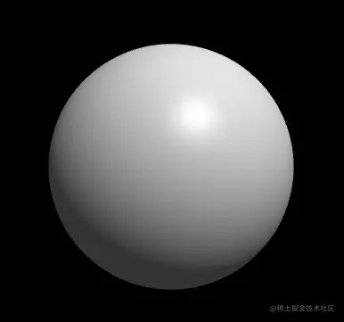

然后我还从基维百科上找了一张地球的等距圆柱投影贴图：

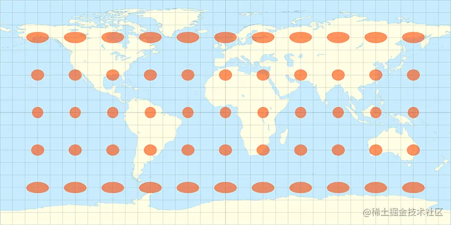

接下来我便可以利用等距投影规则把上面的贴图贴到球体上：

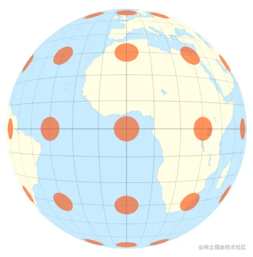

实现上面这个效果的关键就是纹理映射，我所使用的纹理映射方法就是等距圆柱投影。

等距的意思就是上面的贴图里，每个格子的宽(纬线)、高(经线)尺寸都是相等的。

圆柱投影的意思是，用圆柱包裹球体，圆柱的面与球体相切。在球体中心放一个点光源，点光源会把球体投射到圆柱上，从而得到球体的圆柱投影。

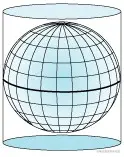

等距圆柱投影贴图也可以理解为球体展开后的样子。

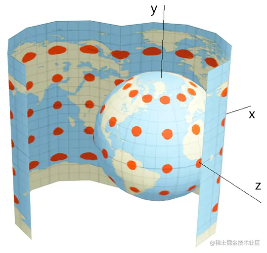

等距圆柱投影除了可以画地球，它在VR 中也得到了广泛的应用。

现在市面上的720°全景相机拍摄出的全景图片，一般都是等距圆柱投影图片。

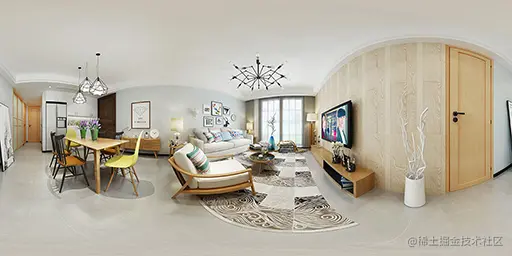

等距圆柱投影的计算挺简单的，咱们之前说球坐标系的时候就已经为其打好了基础。

### 2-地理坐标系

地理坐标系(Geographic coordinate system) 就是一种球坐标系(Spherical coordinate system)。

地理坐标系和three.js 里的Spherical 球坐标系差不多，只是在θ和φ的定义上略有差异。

Spherical 球坐标系里的方位角θ和极角φ的定义规则：

-   θ 起始于z轴的正半轴，逆时针旋转，旋转量越大θ 值越大，0 ≤ θ < 2π
-   φ 起始于y轴的正半轴，向下旋转，旋转量越大φ 值越大，0 ≤ φ < π

下图是地理坐标系：

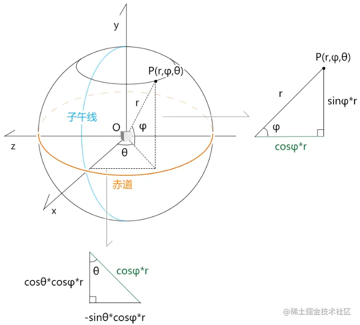

-   θ 对应经度，起始于x轴的正半轴，即本初子午线的位置，θ=0
    
    -   从0° 逆时针旋转，旋转量越大θ 值越大，旋转到180°结束，是为东经，0 ≤ θ < π
    -   从0° 顺时针旋转，旋转量越大θ 值越小，旋转到-180°结束，是为西经，0 ≤ θ < -π
-   φ 对应维度，起始于赤道，φ=0
    
    -   从0° 向上旋转，旋转量越大φ 值越大，旋转到90°结束，是为北纬，0 ≤ φ < π/2
    -   从0° 向下旋转，旋转量越大φ 值越小，旋转到-90°结束，是为南纬，0 ≤ φ < -π/2

对于已知一点的经纬度，求此点的三维直角坐标位的方法，上图已经详细画出。

### 3-经纬度与等距圆柱投影贴图的线性映射

通过上面经纬度的定义规则，我们可以知道：

-   经度和U值相映射
-   维度和V值相映射

其具体的映射映射方式如下图所示：

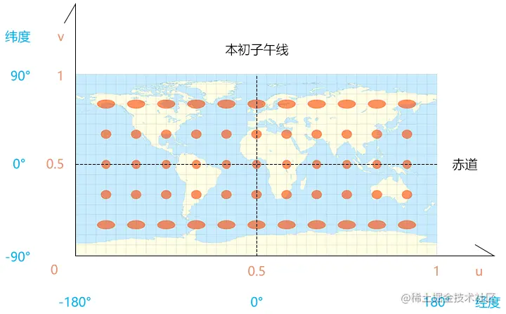

-   经度\[-π,π\] 映射u\[0,1\]
-   维度\[-π/2,π/2\] 映射v\[0,1\]

### 4-绘制地球

1.建立一个地理坐标系Geography对象，方便把经纬度转三维直角坐标。

```
import {Vector3} from 'https://unpkg.com/three/build/three.module.js';

/*
属性：
  r：半径
  longitude：经度(弧度)
  latitude：纬度(弧度)
  position：三维坐标位

构造参数：
  r,longitude,latitude 
  或者
  position
*/
export default class Geography{
  constructor(r=1,longitude=0, latitude=0){
    this.r=r
    this.longitude=longitude
    this.latitude = latitude
    this.position=new Vector3()
    this.updatePos()
  }
  //克隆
  clone() {
    const { r, longitude, latitude } = this
    return new Geography(r, longitude, latitude)
  }
  //设置半径，更新三维直角坐标位
  setR(r) {
    this.r = r
    this.updatePos()
    return this
  }
  //根据经纬度更新三维直角坐标位
  updatePos() {
    const { r,longitude,latitude } = this
    const len = Math.cos(latitude) * r
    this.position.set(
      Math.cos(longitude)*len,
      Math.sin(latitude)*r,
      -Math.sin(longitude)*len
    )
  }
}
```

2.建模

之前我们画过一个球体Sphere.js，只不过这个球体的南极和北极共用一个顶点，不适合做柱状投影贴图。

接下来，咱们在其基础上再改装一个球体Earth出来，这个Earth对象是按照矩形网格建模的，如下图所示：

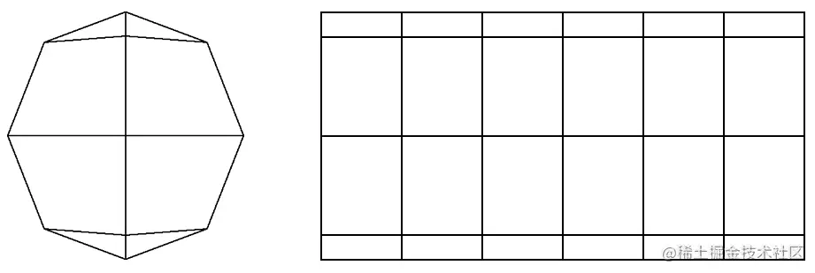

当前这个Earth对象是直接按照矩形网格建模的。

```
import Geography from './Geography.js'

/*
属性：
  r：半径
  widthSegments：横向段数，最小3端
  heightSegments：纵向段数，最小2端
  vertices：顶点集合
  normals：法线集合
  indexes：顶点索引集合
  uv：uv坐标
  count：顶点数量
*/
export default class Earth{
  constructor(r=1, widthSegments=3, heightSegments=2){
    this.r=r
    this.widthSegments=widthSegments
    this.heightSegments=heightSegments
    this.vertices=[]
    this.normals=[]
    this.indexes = []
    this.uv=[]
    this.count=0
    this.init()
  }
  init() {
    const {r,widthSegments, heightSegments } = this
    //网格线的数量
    const [width,height]=[widthSegments+1,heightSegments +1]
    //顶点数量
    this.count = width*height
    // theta和phi方向的旋转弧度
    const thetaSize = Math.PI * 2 / widthSegments
    const phiSize = Math.PI / heightSegments

    // 顶点集合
    const vertices = []
    // 法线集合
    const normals = []
    // 顶点索引集合
    const indexes = []
    //uv 坐标集合
    const uv=[]
    // 逐行列遍历
    for (let y = 0; y < height; y++) {
      // 维度 
      const phi = Math.PI/2-phiSize * y
      for (let x = 0; x < width; x++) {
        //经度，-Math.PI是为了让0°经线经过x轴的正半轴
        const theta = thetaSize * x-Math.PI
        // 计算顶点和法线
        const vertice = new Geography(r,theta,phi).position
        vertices.push(...vertice)
        normals.push(...vertice.normalize())
        const [u, v] = [
          x / widthSegments,
          1-y/heightSegments
        ]
        uv.push(u, v)
        // 顶点索引
        if (y && x) {
          // 一个矩形格子的左上lt、右上rt、左下lb、右下rb点
          const lt = (y-1) * width + (x-1)
          const rt = (y-1) * width + x
          const lb = y * width + (x-1)
          const rb = y * width + x
          indexes.push(lb, rb, lt, lt, rb, rt)
        }
      }
    }
    this.vertices=new Float32Array(vertices)
    this.normals=new Float32Array(normals)
    this.uv=new Float32Array(uv)
    this.indexes=new Uint16Array(indexes)
  }
}
```

3.着色器

```
<script id="vs" type="x-shader/x-vertex">
  attribute vec4 a_Position;
  attribute vec2 a_Pin;
  uniform mat4 u_PvMatrix;
  uniform mat4 u_ModelMatrix;
  varying vec2 v_Pin;
  void main(){
    gl_Position=u_PvMatrix*u_ModelMatrix*a_Position;
    v_Pin=a_Pin;
  }
</script>
<script id="fs" type="x-shader/x-fragment">
  precision mediump float;
  uniform sampler2D u_Sampler;
  varying vec2 v_Pin;
  void main(){
    gl_FragColor=texture2D(u_Sampler,v_Pin);
  }
</script>
```

3.贴图

```
import { createProgram, } from "/jsm/Utils.js";
import {
  Matrix4, PerspectiveCamera, Vector3
} from 'https://unpkg.com/three/build/three.module.js';
import OrbitControls from './lv/OrbitControls.js'
import Mat from './lv/Mat.js'
import Geo from './lv/Geo.js'
import Obj3D from './lv/Obj3D.js'
import Scene from './lv/Scene.js'
import Earth from './lv/Earth.js'

const canvas = document.getElementById('canvas');
canvas.width = window.innerWidth
canvas.height = window.innerHeight
const gl = canvas.getContext('webgl');

// 球体
const earth = new Earth(0.5, 64, 32)

// 目标点
const target = new Vector3()
//视点
const eye = new Vector3(2, 0, 0)
const [fov, aspect, near, far] = [
  45, canvas.width / canvas.height,
  0.1, 5
]
// 透视相机
const camera = new PerspectiveCamera(fov, aspect, near, far)
camera.position.copy(eye)
// 轨道控制器
const orbit = new OrbitControls({ camera, target, dom: canvas, })

// 场景
const scene = new Scene({ gl })
//注册程序对象
scene.registerProgram(
  'map',
  {
    program: createProgram(
      gl,
      document.getElementById('vs').innerText,
      document.getElementById('fs').innerText,
    ),
    attributeNames: ['a_Position', 'a_Pin'],
    uniformNames: ['u_PvMatrix', 'u_ModelMatrix','u_Sampler']
  }
)

//地球
const matEarth = new Mat({
  program: 'map',
  data: {
    u_PvMatrix: {
      value: orbit.getPvMatrix().elements,
      type: 'uniformMatrix4fv',
    },
    u_ModelMatrix: {
      value: new Matrix4().elements,
      type: 'uniformMatrix4fv',
    },
  },
})
const geoEarth = new Geo({
  data: {
    a_Position: {
      array: earth.vertices,
      size: 3
    },
    a_Pin: {
      array: earth.uv,
      size: 2
    }
  },
  index: {
    array: earth.indexes
  }
})

//加载图片
const image = new Image()
image.src = './images/earth.jpg'
image.onload = function () {
  matEarth.maps.u_Sampler = { image }
  scene.add(new Obj3D({
    geo: geoEarth,
    mat: matEarth
  }))
  render()
}

// 连续渲染
function render(time = 0) {
  orbit.getPvMatrix()
  scene.draw()
  requestAnimationFrame(render)
}

/* 取消右击菜单的显示 */
canvas.addEventListener('contextmenu', event => {
  event.preventDefault()
})
/* 指针按下时，设置拖拽起始位，获取轨道控制器状态。 */
canvas.addEventListener('pointerdown', event => {
  orbit.pointerdown(event)
})
/* 指针移动时，若控制器处于平移状态，平移相机；若控制器处于旋转状态，旋转相机。 */
canvas.addEventListener('pointermove', event => {
  orbit.pointermove(event)
})
/* 指针抬起 */
canvas.addEventListener('pointerup', event => {
  orbit.pointerup(event)
})
/* 滚轮事件 */
canvas.addEventListener('wheel', event => {
  orbit.wheel(event)
})
```

效果如下：


到现在，大家应该对等距圆柱投影有了一个整体的认知。

接下我们就可以再做一下扩展，根据经纬度，为某个地点做标记。

### 5-标记点

我在百度地图里拿到了天安门的经纬度(116.404,39.915)，其意思就是东经116.404°, 北纬39.915°

我们使用Geography 对象便可以将经纬度转三维直角坐标位，然后再根据这个三维直角坐标位做个标记即可。

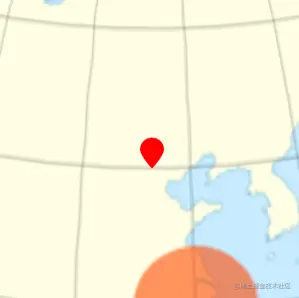

标记点的制作思路有两种：

-   用之类的HTML标签实现。
    
    -   优点：制作便捷，尤其是要为其添加文字的时候。
    -   缺点：要将标记点在webgl 裁剪空间坐标位转换到css 坐标位。需要额外考虑标记点与模型的遮挡问题。
-   在webgl 中实现。
    
    -   优点：标记点操作方便，模型遮挡实现便捷。
    -   缺点：若标记点中存在文字，需做额外考量。

对于文字标记的显示问题，我们这里先不说，后面会单独详解。

接下来，我们先用webgl 在地图上显示一个不带文字的标记点。

1.建立一个矩形面对象，方便之后把标记点作为贴图贴上去。

```
import {Vector2} from 'https://unpkg.com/three/build/three.module.js';

/*
属性：
  size:尺寸
  orign:基点，百分比，默认左下角
  vertices：顶点集合
  normals：法线集合
  indexes：顶点索引集合
  uv：uv坐标
*/
export default class Rect{
  constructor(w=1, h=1,x=0,y=0){
    this.size=new Vector2(w,h)
    this.orign=new Vector2(x,y)
    this.vertices=[]
    this.normals=[]
    this.indexes = []
    this.uv=[]
    this.update()
  }
  update() {
    const { size, orign } = this
    const l=-orign.x*size.x
    const b =-orign.y * size.y
    const r=size.x+l
    const t=size.y+b
    
    this.vertices = new Float32Array([
      l, t, 0,
      l, b, 0,
      r, t, 0,
      r, b, 0,
    ])
    this.normals = new Float32Array([
      0,0,1,
      0,0,1,
      0,0,1,
      0,0,1,
    ])
    this.uv = new Float32Array([
      0, 1,
      0, 0,
      1, 1,
      1, 0
    ])
    this.indexes = new Uint16Array([
      0, 1, 2,
      2,1,3
    ])
  }
}
```

接下来，基于之前圆柱投影文件略作调整。

2.实例化Rect 对象

```
import Rect from './lv/Rect.js'
……
gl.enable(gl.BLEND);
gl.blendFunc(gl.SRC_ALPHA, gl.ONE_MINUS_SRC_ALPHA);
……
// 矩形面
const rect = new Rect(0.02, 0.02, 0.5, 0)
```

3.基于天安门经纬度，建立Geography 对象。

```
const rad = Math.PI / 180
const geography = new Geography(
  earth.r,
  116.404 * rad,
  39.915 * rad
)
```

4.让相机的视点直视天门。

```
const eye = geography.clone()
      .setR(earth.r + 1)
      .position
```

5.基于标记点的三维直角坐标位构建一个模型矩阵

```
const modelMatrix = new Matrix4()
    .setPosition(geography.position)
```

6.建立标记点的Mat和Geo 对象

```
const matMark = new Mat({
  program: 'map',
  data: {
    u_PvMatrix: {
      value: orbit.getPvMatrix().elements,
      type: 'uniformMatrix4fv',
    },
    u_ModelMatrix: {
      value: modelMatrix.elements,
      type: 'uniformMatrix4fv',
    },
  },
})
const geoMark = new Geo({
  data: {
    a_Position: {
      array: rect.vertices,
      size: 3
    },
    a_Pin: {
      array: rect.uv,
      size: 2
    }
  },
  index: {
    array: rect.indexes
  }
})
```

7.当所有贴图都加载成功后，将贴图传给相应的Mat 对象。然后建立地球和标记点所对应的Obj3D对象，将其添加到Scene 场景中，进行渲染。

```
//加载图形
const imgPromises = ['earth.jpg', 'mark.png'].map(name => {
  const img = new Image()
  img.src = `./images/${name}`
  return imgPromise(img)
})
Promise.all(imgPromises).then((imgs) => {
  matEarth.maps.u_Sampler = { image: imgs[0] }
  matMark.maps.u_Sampler = {
    image: imgs[1],
    format: gl.RGBA
  }
  scene.add(new Obj3D({
    geo: geoEarth,
    mat: matEarth
  }))
  scene.add(new Obj3D({
    geo: geoMark,
    mat: matMark
  }))
  render()
})

// 连续渲染
function render(time = 0) {
  orbit.getPvMatrix()
  scene.draw()
  requestAnimationFrame(render)
}
```

8.让标记点贴合到地球表面

```
const modelMatrix = new Matrix4()
      .setPosition(geography.position)
      .multiply(
        new Matrix4().lookAt(
          geography.position,
          target,
          new Vector3(0, 1, 0)
        )
      )
```

最终效果如下：

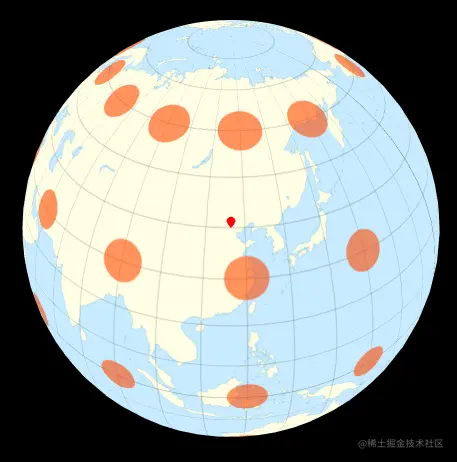

在实际项目中，围绕地球，是可以做很多东西。

比如在球体上绘制柱状图，表示不同地区的经济增长情况；

在两个地点之间绘制3D路径，以表示两地之间存在的联系；

对于这些效果，我们就先不做扩展了，等结课了再跟大家慢慢说。

接下来，我在把相机塞进地球里，做一个VR的效果。
