# WebGL 宽度线的绘制与贴图

---
源码：[github.com/buglas/webg…](https://link.juejin.cn/?target=https%3A%2F%2Fgithub.com%2Fbuglas%2Fwebgl-lesson "https://github.com/buglas/webgl-lesson")

按理来说，线条是一条没有宽度的线，它是显示不出来的。

然而，在实际生活中，我们也会将一些类似线条、有一定宽度的东西理解为线条，比如针线、耳机线、交通路线等。

我们在显示这样的线的时候，是需要用有宽度的线来显示的。

之前在说WebGL图形的时候说过，WebGL有LINES、LINE\_STRIP、LINE\_LOOP 三种画线的方法。

不过，三种方法只能绘制一个像素宽的线，我要想画的是下图中粗点的公路。


这条公路的绘制要分两部分考虑：

-   宽度线
-   纹理映射

### 1-认识宽度线

当线有了宽度之后，它就不仅仅是有了宽度那么简单，因为这本质上是一个由线转面，提升了一个维度的问题。这会延伸出许多除宽度之外的其它特性。

对于有宽度的线，canvas 2d 就做得很好，所以咱们先通过canvas 2d 认识一下有宽度的线的特性：

-   lineWidth 定义描边的宽度，它是从路径的中心开始绘制的，内外各占宽度的一半。

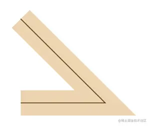

-   lineCap 线条端点样式

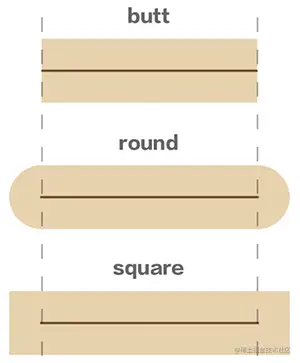

-   lineJoin 拐角类型

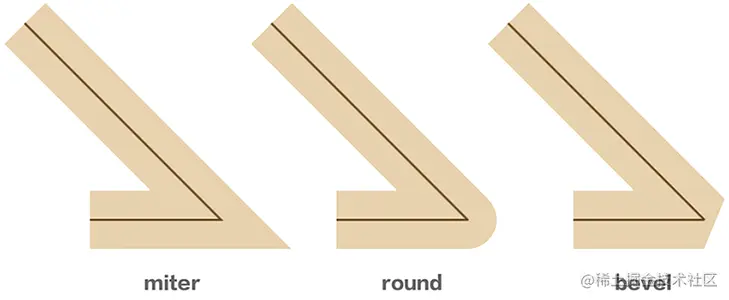

-   miterLimit 限制尖角
    
    当lineJoin 为miter 时，若拐角过小，拐角的厚度就会过大。
    

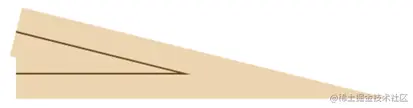

 miterLimit=1 后，可避免此问题

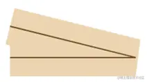

-   setLineDash(segments) 虚线
    
    ctx.setLineDash(\[ 60, 90 \])
    

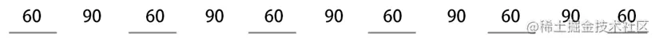

 ctx.setLineDash(\[ 60, 90, 120 \])

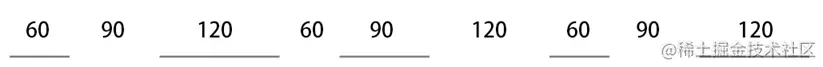

-   lineDashOffset 虚线偏移
    
    ctx.lineDashOffset=0
    

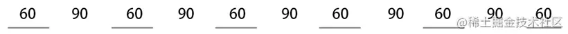

 ctx.lineDashOffset=-60


### 2-宽度线的绘制思路

-     
    着色器绘图：先用WebGL 原生方法绘制单像素的线，然后利用帧缓冲区为其描边。
    
    
    
    -   优点：简单快速，可以画出拐角和端点都为round 类型的线
    -   缺点：难以控制其端点和拐角样式，无法做纹理映射，无法深度测试
-   顶点建模，基于线条路径，向其内外两侧挤压线条。
    
    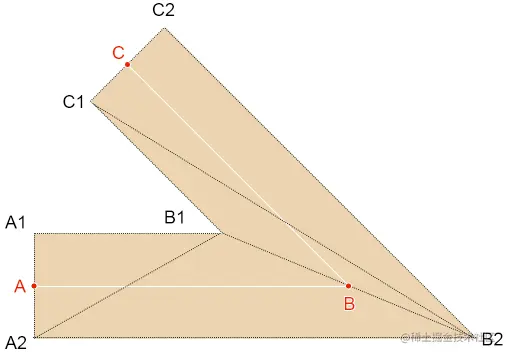
    
    -   优点：可控性强，可满足各种线条特性，可做纹理映射，支持深度测试
    -   缺点：顶点点位的计算量有点大。

因为我们要为宽度线贴图，所以我就用顶点建模的方式绘制有宽度的线了。

我们先用最简单的方式画一条宽度线：像canvas 2d那样，以lineCap为butt，lineJoin 为miter的方式绘制。

### 3-宽度线的挤压原理

宽度线中相邻的两条线段存在两种关系：

-   相交
    
    
    
-   平行
    
    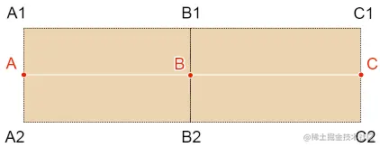
    

挤压顶点的方式有两种：

-   垂直挤压，对应线条端点或相邻线段平行时的点。
-   非垂直挤压，对应相邻线段不平行时的点，即相交线段的拐点。

### 4-垂直挤压点

以下图为例：


已知：

-   点A、点B
-   线条宽度为lineWidth
-   A1、A2是自点A 沿AB方向垂直挤压出的点

求：A1、A2

解：

计算线条宽度的一半h：

```
h=lineWidth/2
```

由点A、点B计算向量AB：

```
AB(x,y)=B-A
```

将向量AB逆时针旋转90°，设置长度为h，得点A1：

```
A1=h*(-y,x)/|(-y,x)|
```

将向量AB顺时针旋转90°，设置长度为h，得点A2：

```
A2=h*(y,-x)/|(y,-x)|
```

挤压端点C 后的点C1、C2 亦是同理。

至于挤压中间点B 后的B1、B2，若点B相邻的线段平行，其计算方法亦是同理。

AB是否平行于BC的判断方法：

```
(Math.atan2(AB.y,AB.x)-Math.atan2(BC.y,BC.x))%Math.PI
```

### 4-计算拐点

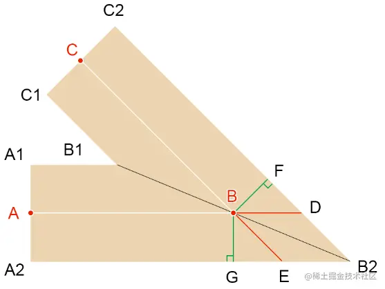

已知：

-   点A、点B、点C
-   线条宽度为lineWidth
-   AB、BC 不平行

求：拐点B1、B2

思路：

求拐点的本质，就是求两条直线的的交点。

求直线交点的方法有很多，高中数学有一个用直线一般式求交点的方法，我们也可以用向量推导。

解：

由已知条件可知：

```
BD∥EB2
BE∥DB2
|BF|=|BG|
```

所以：

BEB2D 是等边平行四边形。

计算向量BD的单位向量d：

```
d=AB/|AB| 
```

计算向量BE的单位向量e：

```
e=CB/|CB|
```

由等边平行四边形定理，可求得BB2 的单位向量b：

```
b=(d+e)/|d+e|
```

接下来，只要求得BB2的长度，便可知道点B2。

由向量的点积公式可知：

```
cos∠B2BG=(BG·b)/(|BG|*|b|)
```

因为：

b是单位向量

所以：

```
cos∠B2BG=(BG·b)/|BG|
```

由余弦公式可知：

```
cos∠B2BG=|BG|/|BB2|
|BB2|=|BG|/cos∠B2BG
```

所以：

```
BB2=b*|BB2|
```

所以：

```
B2=BB2+B
```

知道了B2后，B1也就好求了：

```
B1=-BB2+B
```

这便是用向量推导拐点的方法。

对于用直线的一般式求交点的方法，我就不细说了，大家可以参考一下我的[相关文章](https://link.juejin.cn/?target=http%3A%2F%2Fyxyy.name%2Fblog%2Fmd.html%3FossName%3D162765212208629481006223312756.md%26title%3D%25E6%25BC%25AB%25E8%25B0%2588%25E7%259B%25B4%25E7%25BA%25BF%25E4%25B9%258B%25E7%2582%25B9%25E6%2596%259C%25E5%25BC%258F%25E5%2592%258C%25E4%25B8%2580%25E8%2588%25AC%25E5%25BC%258F "http://yxyy.name/blog/md.html?ossName=162765212208629481006223312756.md&title=%E6%BC%AB%E8%B0%88%E7%9B%B4%E7%BA%BF%E4%B9%8B%E7%82%B9%E6%96%9C%E5%BC%8F%E5%92%8C%E4%B8%80%E8%88%AC%E5%BC%8F")。

接下来咱们说一下代码实现。

### 5-绘制宽度线

1.建立一个BoldLine 对象

```
import {Vector2} from 'https://unpkg.com/three/build/three.module.js';

/*
属性：
  points:线条节点,二维，[Vector2,Vector2,……]
  lineWidth：线宽
  vertices：顶点集合
  normals：法线集合
  indexes：顶点索引集合
  uv：uv坐标集合
*/
export default class BoldLine{
  constructor(points=[],lineWidth=1){
    this.points=points
    this.lineWidth=lineWidth
    this.vertices=null
    this.normals=null
    this.indexes = null
    this.uv = null
    this.init()
  }
  init() {
    const { points,lineWidth:h } = this
    const len = points.length
    if (len < 2) { return }
    
    // 挤压线条，获取顶点
    const extrudePoints=this.extrude()
    
    // 顶点集合
    const vertices = []
    // 顶点索引
    const indexes = []
    
    // 以线段挤压出的四边形为单位，构建顶点集合、顶点索引
    const len1 = points.length - 1
    for (let i = 0; i < len1; i++) {
      //四边形的4个顶点
      const pi=i * 2
      const [A1, A2, B1, B2] = [
        extrudePoints[pi],
        extrudePoints[pi+1],
        extrudePoints[pi+2],
        extrudePoints[pi+3],
      ]
      vertices.push(
        ...A1, ...A2, ...B1, ...B2
      )
      // 顶点索引
      const A1i = i * 4
      const A2i = A1i+1
      const B1i = A1i+2
      const B2i = A1i + 3
      indexes.push(
        A1i,A2i,B1i,
        B1i,A2i,B2i
      )
    }
    
    this.vertices=new Float32Array(vertices)
    this.indexes=new Uint16Array(indexes)
  }

  // 挤压线条
  extrude() {
    const { points } = this
    //线宽的一半
    const h = this.lineWidth / 2
    //顶点集合，挤压起始点置入其中
    const extrudePoints = [
      ...this.verticalPoint(points[0],points[1],h)
    ]
    // 挤压线条内部点，置入extrudePoints
    const len1=points.length-1
    const len2=len1-1
    for (let i = 0; i < len2; i++){
      // 三个点,两条线
      const A=points[i]
      const B=points[i+1]
      const C = points[i + 2]
      // 两条线是否相交
      if (this.intersect(A,B,C)) {
        extrudePoints.push(...this.interPoint(A, B, C, h))
      } else {
        extrudePoints.push(...this.verticalPoint(B, C, h))
      }
    }
    // 挤压最后一个点
    extrudePoints.push(...this.verticalPoint(
      points[len2], points[len1], h, points[len1]
    ))
    return extrudePoints
  }

  // 判断两条直线是否相交
  intersect(A,B,C) {
    const angAB=B.clone().sub(A).angle ()
    const angBC = C.clone().sub(B).angle ()
    return !!(angAB-angBC)%Math.PI
  }
  //垂直挤压点
  verticalPoint(A,B,h,M=A) {
    const {x,y} = B.clone().sub(A)
    return [
      new Vector2(-y, x).setLength(h).add(M),
      new Vector2(y,-x).setLength(h).add(M)
    ]
  }
  // 拐点
  interPoint(A, B, C, h) {
    const d=B.clone().sub(A).normalize()
    const e = B.clone().sub(C).normalize()
    const b = d.clone().add(e).normalize()
    const BG = new Vector2(d.y, -d.x).setLength(h)
    const BGLen=BG.length()
    const cos = BG.clone().dot(b) / BGLen
    const BB2 = b.setLength(BGLen / cos)
    const BB1 = BB2.clone().negate()
    return [
      BB1.add(B),
      BB2.add(B)
    ]
  }
}
```

2.绘制宽度线

```
<canvas id="canvas"></canvas>
<script id="vs" type="x-shader/x-vertex">
    attribute vec4 a_Position;
    void main(){
      gl_Position = a_Position;
    }
</script>
<script id="fs" type="x-shader/x-fragment">
    precision mediump float;
    void main(){
      gl_FragColor=vec4(1.0);
    }
</script>
<script type="module">
  import { createProgram, imgPromise } from './lv/Utils.js';
  import { Matrix4, PerspectiveCamera, Vector3, Vector2 } from 'https://unpkg.com/three/build/three.module.js';
  import OrbitControls from './jsm/OrbitControls.js'
  import Mat from './lv/Mat.js'
  import Geo from './lv/Geo.js'
  import Obj3D from './lv/Obj3D.js'
  import Scene from './lv/Scene.js'
  import BoldLine from './lv/BoldLine.js'

  const canvas = document.getElementById('canvas');
  canvas.width = 900;
  canvas.height = 900;
  let gl = canvas.getContext('webgl');

  // 场景
  const scene = new Scene({ gl })
  // 注册程序对象
  scene.registerProgram(
    'line',
    {
      program: createProgram(
        gl,
        document.getElementById('vs').innerText,
        document.getElementById('fs').innerText
      ),
      attributeNames: ['a_Position'],
    }
  )
  const mat = new Mat({
    program: 'line',
    mode: 'TRIANGLES'
  })

  const line = new BoldLine([
    new Vector2(-0.7, 0),
    new Vector2(-0.4, 0),
    new Vector2(-0.4, 0.4),
    new Vector2(0.3, 0.4),
    new Vector2(-0.3, -0.4),
    new Vector2(0.4, -0.4),
    new Vector2(0.4, 0),
    new Vector2(0.7, 0.4),
  ], 0.2)

  const geo = new Geo({
    data: {
      a_Position: {
        array: line.vertices,
        size: 2
      },
    },
    index: {
      array: line.indexes
    }
  })
  scene.add(new Obj3D({ geo, mat }))
  scene.draw()
</script>    
```

效果如下：

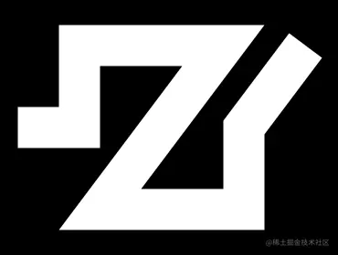

### 6-宽度线贴图思路


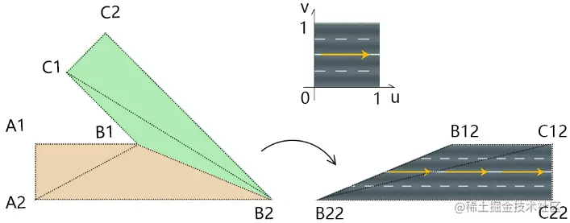

1.以线段挤出的四边形为单位进行贴图。

2.贴图的时候，为了方便做纹理映射，可以先让每一个四边形躺平，再做纹理映射。

3.为了避免贴图拉伸，可基于线宽，设置贴图在u向的reapeat 系数。

举个例子。

已知：

-   贴图是一个正方形图片。
-   线宽为h

求：则点B1、B2、C1、C2所对应的uv坐标

解：

```
B1:(B12.x/h,1)
B2:(B22.x/h,0)
C1:(C12.x/h,1)
C2:(C22.x/h,0)
```

### 7-宽度线贴图代码

1.在BoldLine.js 中计算uv坐标。

```
init() {
  const { points,lineWidth:h } = this
  const len = points.length
  if (len < 2) { return }

  // 挤压线条，获取顶点
  const extrudePoints=this.extrude()

  // 顶点集合
  const vertices = []
  // 顶点索引
  const indexes = []
  // uv 坐标
  const uv=[]

  // 以线段挤压成的四边形为单位，构建顶点集合、顶点索引、uv
  const len1 = points.length - 1
  for (let i = 0; i < len1; i++) {
    //四边形的4个顶点
    const pi=i * 2
    const [A1, A2, B1, B2] = [
      extrudePoints[pi],
      extrudePoints[pi+1],
      extrudePoints[pi+2],
      extrudePoints[pi+3],
    ]
    vertices.push(
      ...A1, ...A2, ...B1, ...B2
    )
    // 顶点索引
    const A1i = i * 4
    const A2i = A1i+1
    const B1i = A1i+2
    const B2i = A1i + 3
    indexes.push(
      A1i,A2i,B1i,
      B1i,A2i,B2i
    )
    //逆向旋转四边形
    const ang = B1.clone().sub(A1).angle()
    const O = new Vector2()
    const [lb, rt, rb] = [
      A2.clone().sub(A1).rotateAround(O,ang),
      B1.clone().sub(A1).rotateAround(O,ang),
      B2.clone().sub(A1).rotateAround(O,ang),
    ]
    uv.push(
      0, 1,        //A1
      lb.x / h, 0, //A2
      rt.x / h, 1, //B1
      rb.x / h, 0, //B2
    )
  }

  this.vertices = new Float32Array(vertices)
  this.uv=new Float32Array(uv)
  this.indexes=new Uint16Array(indexes)
}
```

2.绘制宽度线

```
<canvas id="canvas"></canvas>
<script id="vs" type="x-shader/x-vertex">
    attribute vec4 a_Position;
    attribute vec2 a_Pin;
    varying vec2 v_Pin;
    void main(){
      gl_Position = a_Position;
      v_Pin=a_Pin;
      gl_PointSize=10.0;
    }
</script>
<script id="fs" type="x-shader/x-fragment">
    precision mediump float;
    uniform sampler2D u_Sampler;
    varying vec2 v_Pin;
    void main(){
      gl_FragColor=texture2D(u_Sampler,v_Pin);
    }
</script>
<script type="module">
  import { createProgram, imgPromise } from './lv/Utils.js';
  import { Matrix4, PerspectiveCamera, Vector3, Vector2 } from 'https://unpkg.com/three/build/three.module.js';
  import OrbitControls from './jsm/OrbitControls.js'
  import Mat from './lv/Mat.js'
  import Geo from './lv/Geo.js'
  import Obj3D from './lv/Obj3D.js'
  import Scene from './lv/Scene.js'
  import BoldLine from './lv/BoldLine.js'

  const canvas = document.getElementById('canvas');
  canvas.width = 900;
  canvas.height = 900;
  let gl = canvas.getContext('webgl');

  // 场景
  const scene = new Scene({ gl })
  // 注册程序对象
  scene.registerProgram(
    'line',
    {
      program: createProgram(
        gl,
        document.getElementById('vs').innerText,
        document.getElementById('fs').innerText
      ),
      attributeNames: ['a_Position', 'a_Pin'],
      uniformNames: ['u_Sampler']
    }
  )
  const mat = new Mat({
    program: 'line',
    mode: 'TRIANGLES'
  })

  const line = new BoldLine([
    new Vector2(-0.7, 0),
    new Vector2(-0.4, 0),
    new Vector2(-0.4, 0.4),
    new Vector2(0.3, 0.4),
    new Vector2(-0.3, -0.4),
    new Vector2(0.4, -0.4),
    new Vector2(0.4, 0),
    new Vector2(0.7, 0.4),
  ], 0.2)

  const geo = new Geo({
    data: {
      a_Position: {
        array: line.vertices,
        size: 2
      },
      a_Pin: {
        array: line.uv,
        size: 2
      }
    },
    index: {
      array: line.indexes
    }
  })
  scene.add(new Obj3D({ geo, mat }))

  const image = new Image()
  image.src = `./images/road.jpg`
  image.onload = function () {
    mat.setMap('u_Sampler', {
      image
    })
    scene.draw()
  }
</script>
```

3.对Mat.js 对象里的updateMap() 方法稍作调整，判断一下要更新的贴图里有没有纹理对象texture，若没有，就新建一个。

```
updateMap(gl, map, ind) {
  const {
    format = gl.RGB,
    image,
    wrapS,
    wrapT,
    magFilter,
    minFilter,
    texture
  } = map
  if (!texture) {
    map.texture = gl.createTexture()
  }
  gl.pixelStorei(gl.UNPACK_FLIP_Y_WEBGL, 1)
  gl.activeTexture(gl[`TEXTURE${ind}`])
  gl.bindTexture(gl.TEXTURE_2D, map.texture)
  ……
}
```

效果如下：

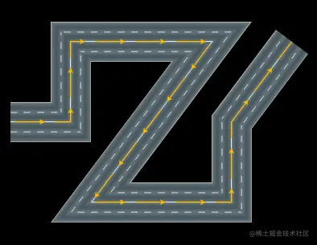
