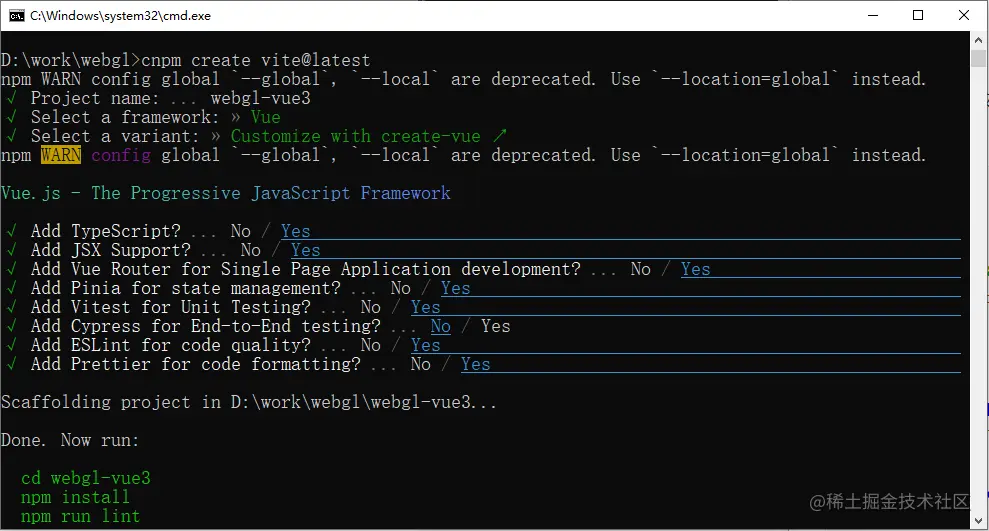
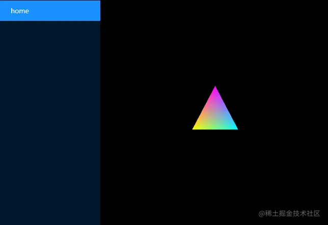

# 用vue3运行webgl

---
源码：[github.com/buglas/webg…](https://link.juejin.cn/?target=https%3A%2F%2Fgithub.com%2Fbuglas%2Fwebgl-lesson "https://github.com/buglas/webgl-lesson")

## 前言

我当前的WebGl案例因为各种原因，没有使用任何前端框架，直接干写的。

这也就导致了着色器写起来没有提示。

前几天我看见到一个朋友用vue3写webgl，挺好的。

所以就托他帮我写了这么一篇文章，他让我随意发，在此深表感谢。

## 一、环境准备

-   安装[nodejs](https://link.juejin.cn/?target=https%3A%2F%2Fblog-st.oss-cn-beijing.aliyuncs.com%2Fundefined "https://blog-st.oss-cn-beijing.aliyuncs.com/undefined")
-   安装[vscode](https://link.juejin.cn/?target=https%3A%2F%2Fblog-st.oss-cn-beijing.aliyuncs.com%2Fundefined "https://blog-st.oss-cn-beijing.aliyuncs.com/undefined")

## 二、vscode 插件安装

```
Vue Volar extension Pack（支持vue项目的扩展包)

EditorConfig（在不同的编辑器和IDE之间保持编码风格和样式规范的工具）

WebGL GLSL Editor（WebGL GLSL着色器的语言支持）
```

## 三、项目初始化

1.  执行 npm create vite@latest
    
    注：若你的电脑是window，建议使用cmd终端安装，而不是Powershell；若运行卡顿，请使用cnpm
    
2.  依次执行
    
    -   输入项目名称
    -   选择框架 Vue
    -   Customize with create-vue
    -   余下选项 除cypress(我在这里安装总是会卡住) 全部选YES



3.  运行项目

```
 cd webgl-vue3
 npm install
 npm run lint
 npm run dev
```

4.  添加必要配置文件

-   .editorconfig （配置EditorConfig）

```
root = true
# 匹配全部文件
[*]
charset = utf-8
# 缩进方式-配置此处就不用配置prettier了
indent_style = tab
tab_width = 4
# 每行多少个字符开始折行-配置此处就不用配置prettier了
max_line_length=120
end_of_line = lf
# 在文件结尾插入新行
insert_final_newline = true
# 删除一行中的前后空格
trim_trailing_whitespace = true
```

-   .prettierrc.json （代码格式化工具配置）

```
{
    "singleQuote": true, // 使用单引号
    "semi": false, // 不使用分号
    "htmlWhitespaceSensitivity": "ignore" // 指定 HTML 元素是在「内容内换行」还是在「属性与右尖括号内换行」
}
```

-   env.d.ts（声明一下.vue、.vert、.frag 文件，否则 TS 编译器不认识）

```
/// <reference types="vite/client" />
declare module '*.vue' {
    import type { DefineComponent } from 'vue'
    const componnet: DefineComponent<{}, {}, any>
    export default componnet
}

declare module '*.vert' {
    const value: string
    export default value
}
declare module '*.frag' {
    const value: string
    export default value
}
```

5.  package.json 下添加 "type": "module"

## 四、安装插件

-   ant-design-vue (UI库)
    
-   vite-plugin-glsl（导入GLSL着色器文件的插件， 并在vite.config.ts中配置）
    
    ```
    import { fileURLToPath, URL } from 'node:url'
    
    import { defineConfig } from 'vite'
    import vue from '@vitejs/plugin-vue'
    import vueJsx from '@vitejs/plugin-vue-jsx'
    import glsl from 'vite-plugin-glsl'
    
    // https://vitejs.dev/config/
    export default defineConfig({
        plugins: [
            vue({
                reactivityTransform: true,
            }),
            vueJsx(),
            glsl({
                include: [
                    // Glob pattern, or array of glob patterns to import
                    '**/*.glsl',
                    '**/*.wgsl',
                    '**/*.vert',
                    '**/*.frag',
                    '**/*.vs',
                    '**/*.fs',
                ],
                exclude: undefined, // Glob pattern, or array of glob patterns to ignore
                warnDuplicatedImports: true, // Warn if the same chunk was imported multiple times
                defaultExtension: 'glsl', // Shader suffix when no extension is specified
                compress: false, // Compress output shader code
                root: '/',
            }),
        ],
        resolve: {
            alias: {
                '@': fileURLToPath(new URL('./src', import.meta.url)),
            },
        },
    })
    ```
    

## 五、添加路由、菜单

1.  注册 Antd

-   ./src/main.ts

```
import { createApp } from 'vue'
import { createPinia } from 'pinia'

import App from './App.vue'
import router from './router'

import Antd from 'ant-design-vue'
import 'ant-design-vue/dist/antd.css'

const app = createApp(App)
app.use(createPinia()).use(router).use(Antd).mount('#app')
```

2.  封装菜单

-   ./src/components/MenuItem.vue

```
<template>
    <template v-for="route in routes">
        <a-sub-menu v-if="isMenu(route)" :key="genkey(route.path)">
            <template #title>
                <span :title="route.name">{{ route.name }}</span>
            </template>
            <!-- 递归调用自己 -->
            <MenuItem v-if="hasChildren(route.children)" :routes="route.children" :prefix="genkey(route.path)" />
        </a-sub-menu>
        <template v-else>
            <RouterLink :to="genkey(route.path)" :key="genkey(route.path)" :title="route.name">
                <a-menu-item :key="genkey(route.path)">
                    {{ route.name }}
                </a-menu-item>
            </RouterLink>
        </template>
    </template>
</template>

<script setup lang="ts">
import type { MenuType } from '@/router/index'
import { RouterLink } from 'vue-router'
import { toRefs, withDefaults, unref } from 'vue'

type PropsType = {
    routes?: MenuType[]
    prefix?: string
}
const props = withDefaults(defineProps<PropsType>(), {
    routes: () => [],
    prefix: '',
})
const { routes, prefix } = toRefs(props)

function genkey(path: string): string {
    if (unref(prefix) === '') return path
    return [unref(prefix), path].join('/')
}
function isMenu(route: MenuType): boolean {
    return Array.isArray(route.children)
}
function hasChildren(children?: MenuType[]): boolean {
    return Array.isArray(children) && children.length > 0
}
</script>
```

-   ./src/components/MenuList.vue

```
<template>
    <a-menu v-model:selectedKeys="selectedKeys" v-model:openKeys="openKeys" theme="dark" mode="inline">
        <MenuItem :routes="routes" prefix="" />
    </a-menu>
</template>

<script setup lang="ts">
import { ref, watch, onMounted } from 'vue'
import { routes } from '@/router/index'
import MenuItem from './MenuItem.vue'
import { useRoute } from 'vue-router'
const route = useRoute()
const selectedKeys = ref<string[]>([])
const openKeys = ref<string[]>([])
function setMenuCurrent() {
    const { matched } = route
    openKeys.value = matched.slice(0, matched.length - 1).map((i) => i.path)
    selectedKeys.value = [route.path]
}
onMounted(() => setMenuCurrent())
watch(() => route.path, setMenuCurrent)
</script>
```

3.  修改页面布局

-   ./src/App.vue

```
<template>
    <a-layout style="min-height: 100vh">
        <a-layout-sider class="AppSider">
            <MenuList />
        </a-layout-sider>
        <a-layout>
            <a-layout-content class="AppContainer">
                <RouterView :key="$route.path" />
            </a-layout-content>
        </a-layout>
    </a-layout>
</template>

<script lang="ts" setup>
import { RouterView } from 'vue-router'
import MenuList from '@/components/MenuList.vue'
</script>
<style>
.AppContainer {
    background-color: #000;
    color: #fff;
}
</style>
```

4.  修改路由

-   ./src/router/index.ts

```
import { createRouter, createWebHistory } from 'vue-router'
import type { AsyncComponentLoader, Component } from 'vue'
export interface MenuType {
    path: string
    name?: string
    component: AsyncComponentLoader<Component>
    children?: MenuType[]
}
export const routes: MenuType[] = [
    {
        path: '/',
        name: 'home',
        component: () => import('@/views/HomeView.vue'),
    },
]

const router = createRouter({
    history: createWebHistory(import.meta.env.BASE_URL),
    routes: routes,
})

export default router
```

5.  修改页面

-   ./src/views/shader.frag

```
// 片元着色器
precision mediump float;
varying vec4 v_Color;
void main(){
    gl_FragColor = v_Color;
}
```

-   ./src/views/shader.vert
    
    ```
    // 顶点着色器
    attribute vec4 a_Position;
    attribute vec4 a_Color;
    varying vec4 v_Color;
    void main(){
        gl_Position = a_Position;
        gl_PointSize = 10.0;
        v_Color = a_Color;
    }
    ```
    
-   ./src/views/HomeView.vue
    
    ```
    <template>
        <canvas ref="canvasRef" />
    </template>
    
    <script setup lang="ts">
    import { ref, onMounted } from 'vue'
    import vertShaderSource from './shader.vert'
    import fragShaderSource from './shader.frag'
    
    const canvasRef = ref<HTMLCanvasElement | null>(null)
    
    let canvas: HTMLCanvasElement
    let gl: WebGLRenderingContext
    let program: WebGLProgram
    
    //7个一组，前3个为顶点坐标，后4个为颜色坐标
    // prettier-ignore
    let sources = new Float32Array([
         0,    0.2, 0,     1, 0, 1, 1,
        -0.2, -0.2, 0,     1, 1, 0, 1,
         0.2, -0.2, 0,     0, 1, 1, 1
    ])
    
    const elementBytes = Float32Array.BYTES_PER_ELEMENT
    const vertSize = 3
    const colorSize = 4
    const categorySize = vertSize + colorSize
    const vertIndex = 0 // 顶点索引
    const colorIndex = vertSize * elementBytes // 颜色索引
    const sourceSize = sources.length / categorySize // 共有多少个顶点
    
    // 创建shader
    function createShader(gl: WebGLRenderingContext, type: number, source: string): WebGLShader {
        const shader = gl.createShader(type)
        if (!shader) throw new Error('shader 创建失败')
        gl.shaderSource(shader, source)
        gl.compileShader(shader)
        return shader
    }
    // 创建proram
    function createProgram(gl: WebGLRenderingContext, vexShaderSource: string, fragShaderSource: string): WebGLProgram {
        const program = gl.createProgram()
        if (!program) throw new Error('program创建错误')
        const vexShader = createShader(gl, gl.VERTEX_SHADER, vexShaderSource)
        const fragShader = createShader(gl, gl.FRAGMENT_SHADER, fragShaderSource)
        gl.attachShader(program, vexShader)
        gl.attachShader(program, fragShader)
        gl.linkProgram(program)
        gl.useProgram(program)
        return program
    }
    // 渲染
    function render(): void {
        gl = canvas.getContext('webgl') as WebGLRenderingContext
        program = createProgram(gl, vertShaderSource, fragShaderSource)
        gl.clearColor(0, 0, 0, 1)
    
        gl.clear(gl.COLOR_BUFFER_BIT)
        const buffer = gl.createBuffer()
        gl.bindBuffer(gl.ARRAY_BUFFER, buffer)
        gl.bufferData(gl.ARRAY_BUFFER, new Float32Array(sources), gl.STATIC_DRAW)
    
        const a_Position = gl.getAttribLocation(program, 'a_Position')
        gl.vertexAttribPointer(a_Position, vertSize, gl.FLOAT, false, categorySize * elementBytes, vertIndex)
        gl.enableVertexAttribArray(a_Position)
    
        const a_Color = gl.getAttribLocation(program, 'a_Color')
        gl.vertexAttribPointer(a_Color, colorSize, gl.FLOAT, false, categorySize * elementBytes, colorIndex)
        gl.enableVertexAttribArray(a_Color)
    
        gl.drawArrays(gl.TRIANGLES, 0, sourceSize)
    }
    
    function init(): void {
        canvas = canvasRef.value as HTMLCanvasElement
        onWindowResize()
        render()
    }
    
    function onWindowResize() {
        const container = document.querySelector('.AppContainer') as HTMLElement
        const { width, height } = container.getBoundingClientRect()
        canvas.width = width
        canvas.height = height - 20
    }
    
    onMounted(init)
    </script>
    ```
    

最终效果如下：


